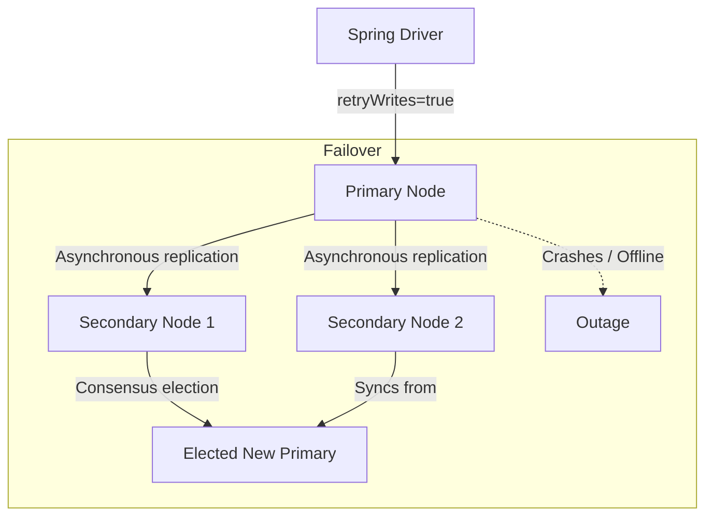

# Module 10: Reliability and High Availability

Welcome class. Today we analyze clustering, failovers, and write consistency models using **Spring Data MongoDB Reliability Configurations (CS-530)**.

To build fault-tolerant databases, systems must handle hardware crashes and maintain replication consistency. Today we study replica sets, read/write concerns, elections, rollback files, and driver connection pool retry mechanics.

---

## 1. Academic Lecture: Reliability & High Availability

### Basic Level: Replica Sets & High Availability
MongoDB achieves high availability using Replica Sets. A replica set is a cluster of database instances consisting of:
*   **One Primary Node**: Receives all write operations.
*   **Secondary Nodes**: Replicate the primary's oplog (operations log) asynchronously.
If the primary node goes offline, the remaining secondaries run a consensus election and nominate a new primary. During this election (usually taking under 3 seconds), the cluster rejects writes.

### Intermediate Level: Read and Write Concerns
We tune transactional consistency across nodes using configuration settings:
*   **Write Concern (`w`)**: Specifies how many nodes must acknowledge a write before returning success:
    *   `w: 1`: Primary acknowledges only. Faster writes, but data can be lost if primary crashes before secondaries replicate.
    *   `w: majority`: Confirmed by a majority of replica set nodes (e.g., 2 out of 3). Protects against data loss during failovers.
    *   `j: true`: Ensures the operation is written to the disk journal file before acknowledging.
*   **Read Concern**: Specifies the isolation level of read operations:
    *   `local`: Returns the node's current local state.
    *   `majority`: Returns data acknowledged by a majority of nodes, preventing dirty reads (reading data that gets rolled back during a primary election).

### Advanced Level: Rollback Mechanics, Retryable Drivers, and Elections
*   **Elections and Heartbeats**: Cluster nodes ping each other every 2 seconds. If the primary fails to respond within the election timeout (default 10 seconds), secondaries start an election.
*   **Rollback Files**: If a primary acknowledges a write under `w:1` and crashes, a secondary will be elected. When the old primary rejoins as a secondary, it detects that its oplog has diverged. MongoDB writes these un-replicated documents to a `.rollback` BSON file, undoing them to match the new primary.
*   **Retryable Writes & Reads**: By default, modern Spring connection URIs should enable `retryWrites=true` and `retryReads=true`. If the driver encounters a network hiccup or temporary node outage during a write, the driver automatically retries the operation once, preventing application downtime.



---

## 2. Theory vs. Production Trade-offs

| Write Concern | Read Concern | Write Latency | Durability Level | Rollover Risk |
| :--- | :--- | :--- | :--- | :--- |
| **`w: 1`** | `local` | Very Low | Low | High (Dirty writes rolled back) |
| **`w: majority`** | `majority` | Moderate | Very High | Zero |
| **`w: majority, j:true`** | `linearizable` | High (Disk sync) | Maximum | Zero |

---

## 3. How to Use: Configuring Robust Driver Parameters in Spring Boot

Below we show an unsafe database configuration (anti-pattern) followed by a production-grade resilience setup.

### A. Unsafe Connection Parameters (Anti-Pattern)
*Avoid omitting write concern constraints in business critical applications:*

```yaml
# DANGER: w=1 allows data loss. If primary goes offline, transactions 
# that were confirmed to the user are permanently lost without notice.
spring:
  data:
    mongodb:
      uri: mongodb://127.0.0.1:27017/shop?retryWrites=false
```

### B. High-Reliability Cluster Configuration (Production Pattern)
Here is the configuration registering a custom `MongoDatabaseFactory` that overrides default write concerns and read concerns.

```yaml
spring:
  data:
    mongodb:
      # Production configuration enforces replica sets and retries
      uri: mongodb://db0.example.com:27017,db1.example.com:27017,db2.example.com:27017/shop?replicaSet=rs0&retryWrites=true&retryReads=true
```

```java
package com.masterclass.mongodb.config;

import com.mongodb.ReadConcern;
import com.mongodb.WriteConcern;
import com.mongodb.client.MongoClient;
import com.mongodb.client.MongoDatabase;
import org.springframework.context.annotation.Bean;
import org.springframework.context.annotation.Configuration;
import org.springframework.data.mongodb.MongoDatabaseFactory;
import org.springframework.data.mongodb.core.SimpleMongoClientDatabaseFactory;
import org.springframework.data.mongodb.core.MongoTemplate;

@Configuration
public class ReliabilityMongoConfig {

    private final MongoClient mongoClient;

    public ReliabilityMongoConfig(MongoClient mongoClient) {
        this.mongoClient = mongoClient;
    }

    @Bean
    public MongoDatabaseFactory mongoDatabaseFactory() {
        // Points to our database name and binds our configured mongo client
        return new SimpleMongoClientDatabaseFactory(mongoClient, "shop") {
            @Override
            public MongoDatabase getMongoDatabase() {
                // Force majority write concern and majority read concern on every connection
                return super.getMongoDatabase()
                        .withWriteConcern(WriteConcern.MAJORITY.withJournal(true))
                        .withReadConcern(ReadConcern.MAJORITY);
            }
        };
    }

    @Bean
    public MongoTemplate mongoTemplate(MongoDatabaseFactory factory) {
        return new MongoTemplate(factory);
    }
}
```

### Line-by-Line Code Explanation:
1.  `SimpleMongoClientDatabaseFactory`: Creates the factory mapping Spring connections to our MongoClient.
2.  `super.getMongoDatabase().withWriteConcern(...)`: Overrides database connection parameters, forcing the driver to wait for a majority of replica set nodes to write the BSON payload to their journals before returning.
3.  `withReadConcern(ReadConcern.MAJORITY)`: Protects the application from dirty reads, returning data that has been replicated to a majority of nodes.

---

## 4. Common Errors & Pitfalls

### Pitfall 1: Write Concern Timeout Crashes (`wtimeout`)
*   **Why it fails**: When using `w: majority`, if one of the secondary database nodes goes offline, write operations still succeed because a majority (2 out of 3) is still active. However, if *two* secondaries fail, the write hangs indefinitely. If we do not specify a timeout (`wtimeout`), application threads block forever, exhausting thread pools.
*   **Mitigation**: Always specify a write concern timeout (e.g., `wtimeout = 5000` ms) in connection strings or configuration properties.

---

## 5. Socratic Review Questions

### Question 1
What is a MongoDB rollback file? When is it generated, and where can it be found on the file system?

#### Answer
A rollback file is a `.rollback` BSON file written to the database data directory (`dbpath/rollback/`). It is generated when an offline primary node, which accepted writes under a local concern like `w: 1`, joins the cluster. Since the cluster elected a new primary, the rejoined node must drop any local writes that occurred after the split, writing them to a rollback file.

---

## 6. Hands-on Challenge: Write Concern Configuration Verification

### The Challenge
In this challenge, you will implement a utility class that checks the WriteConcern settings of a MongoTemplate instance.
Your task:
1. Complete `ReliabilityVerifier.java`.
2. Extract the WriteConcern from the MongoTemplate's DB factory.
3. Verify if journal sync is enabled.

Complete the implementation stub:

```java
package com.masterclass.mongodb.challenge;

import org.springframework.data.mongodb.core.MongoTemplate;
import com.mongodb.WriteConcern;

public class ReliabilityVerifier {

    public static boolean isJournalingEnabled(MongoTemplate mongoTemplate) {
        WriteConcern wc = mongoTemplate.getDb().getWriteConcern();
        // TODO: Return true if the write concern is not null and has journaling enabled
        return wc != null && wc.getJournal() != null && wc.getJournal();
    }
}
```

### Verification Test
Verify your code with this JUnit 5 test class:

```java
package com.masterclass.mongodb.challenge;

import org.junit.jupiter.api.Test;
import org.springframework.data.mongodb.core.MongoTemplate;
import com.mongodb.WriteConcern;
import org.mockito.Mockito;
import com.mongodb.client.MongoDatabase;
import static org.junit.jupiter.api.Assertions.*;

class ReliabilityVerifierTest {

    @Test
    void testJournalingVerification() {
        MongoTemplate mockTemplate = Mockito.mock(MongoTemplate.class);
        MongoDatabase mockDb = Mockito.mock(MongoDatabase.class);
        
        Mockito.when(mockTemplate.getDb()).thenReturn(mockDb);
        Mockito.when(mockDb.getWriteConcern()).thenReturn(WriteConcern.MAJORITY.withJournal(true));

        assertTrue(ReliabilityVerifier.isJournalingEnabled(mockTemplate));
    }
}
```
