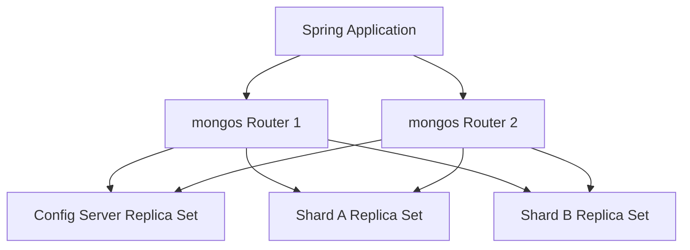

# Module 11: Sharding and Scalability

Welcome class. Today we analyze distributed horizontal clustering using **Spring Data MongoDB Sharding Architectures (CS-530)**.

To scale write volumes beyond the hardware capacity of a single machine, we must partition collection structures across compute nodes. Today we study routers (`mongos`), configuration servers, range-based vs hash-based keys, and query path optimizations.

---

## 1. Academic Lecture: Sharding & Scalability

### Basic Level: Scale Up vs. Scale Out
As database demand grows, scaling can be achieved in two ways:
1.  **Vertical Scaling (Scale Up)**: Adding more CPU, RAM, or disk space to a single server. This has a physical limit and high cost.
2.  **Horizontal Scaling (Scale Out / Sharding)**: Dividing data across multiple physical machines (shards). Each shard operates as a replica set, storing a subset of the database's collections.

### Intermediate Level: Sharded Cluster Architecture
A sharded MongoDB cluster consists of three core components:
*   **Shards**: Database nodes storing partitioned collection subsets.
*   **Query Routers (`mongos`)**: Lightweight client proxy interfaces. Applications connect directly to `mongos` instead of the shards. `mongos` intercepts queries, consults the config server, routes operations to the target shards, aggregates outputs, and returns the result to the application.
*   **Config Servers**: Replica sets storing the cluster's metadata, routing tables, and partition maps.



### Advanced Level: Partition Keys, Balancing, and Scatter-Gather Queries
*   **Sharding Strategies**:
    *   **Range-Based Sharding**: Partitions data based on ranges of the shard key. Keeps documents with close keys on the same shard, optimizing range queries. However, it can cause write hotspots if the shard key is monotonically increasing (like timestamp or auto-incrementing IDs).
    *   **Hash-Based Sharding**: Calculates a MD5 hash of the shard key, distributing keys uniformly across shards. Excellent for write scalability, but range queries require checking every shard.
*   **Balancer Thread**: A background process running on the config server that monitors shard size imbalances and migrates data blocks (chunks) across shards.
*   **Scatter-Gather Queries**: If a query does not include the shard key in its filter, `mongos` must send the query to every shard in the cluster. This is called a scatter-gather query. It increases latency and wastes CPU. Queries should include the shard key to target specific shards.

---

## 2. Theory vs. Production Trade-offs

| Sharding Strategy | Write Scalability | Range Query Performance | Hotspot Protection | Routing Plan |
| :--- | :--- | :--- | :--- | :--- |
| **Range Sharding** | Moderate | Very High (On single shard) | Low | Targeted (via Shard Key) |
| **Hashed Sharding** | Extremely High | Low (Scatter-gather) | High | Targeted / Scatter-Gather |
| **Zone/Tag Sharding** | High | High | High | Geo-Targeted |

---

## 3. How to Use: Defining Shard Keys and Query Targeting

Below we show an un-targeted scatter-gather query service (anti-pattern) followed by a production-grade shard-key targeted search.

### A. The Scatter-Gather Query (Anti-Pattern)
*Avoid queries that exclude shard keys on large clusters:*

```java
// DANGER: If the collection is sharded by "tenant_id", querying by "userId" alone
// forces the mongos router to broadcast the query to every shard.
// Under load, this degrades performance and increases latency.
public User findUserUnsafe(String userId) {
    Query query = Query.query(Criteria.where("userId").is(userId));
    return mongoTemplate.findOne(query, User.class);
}
```

### B. Shard-Key Targeted Query (Production Pattern)
Here is the implementation of a sharded collection model and targeted querying.

```java
package com.masterclass.mongodb.domain;

import org.springframework.data.annotation.Id;
import org.springframework.data.mongodb.core.mapping.Document;
import org.springframework.data.mongodb.core.mapping.Field;

@Document(collection = "tenant_logs")
public class TenantLog {

    @Id
    private String id;

    // The chosen shard key: tenant_id (Hashed Sharding configured in DB)
    @Field("tenant_id")
    private String tenantId;

    private String message;
    private String level;

    public TenantLog() {}
    public TenantLog(String id, String tenantId, String message, String level) {
        this.id = id;
        this.tenantId = tenantId;
        this.message = message;
        this.level = level;
    }

    public String getId() { return id; }
    public String getTenantId() { return tenantId; }
    public String getMessage() { return message; }
    public String getLevel() { return level; }
}
```

```java
package com.masterclass.mongodb.service;

import com.masterclass.mongodb.domain.TenantLog;
import org.springframework.data.mongodb.core.MongoTemplate;
import org.springframework.data.mongodb.core.query.Criteria;
import org.springframework.data.mongodb.core.query.Query;
import org.springframework.stereotype.Service;
import java.util.List;

@Service
public class ShardedLogService {

    private final MongoTemplate mongoTemplate;

    public ShardedLogService(MongoTemplate mongoTemplate) {
        this.mongoTemplate = mongoTemplate;
    }

    /**
     * Retrieves logs for a specific tenant.
     * Including "tenant_id" allows the mongos router to target the specific shard
     * storing that tenant's logs, avoiding a scatter-gather query.
     */
    public List<TenantLog> findTenantLogsTargeted(String tenantId, String logLevel) {
        Query query = new Query();
        query.addCriteria(Criteria.where("tenant_id").is(tenantId)
                                  .and("level").is(logLevel));
        
        return mongoTemplate.find(query, TenantLog.class);
    }
}
```

### Line-by-Line Code Explanation:
1.  `TenantLog`: Defines the sharded entity. `tenant_id` is selected as the shard key due to its high cardinality.
2.  `Criteria.where("tenant_id").is(tenantId)`: The shard key filter is placed directly in the query criteria, allowing the `mongos` router to target the query to the correct shard.

---

## 4. Common Errors & Pitfalls

### Pitfall 1: Selecting Monotonically Increasing Keys (e.g., ObjectId, Timestamps) for Range Sharding
*   **Why it fails**: If you use a timestamp shard key with Range Sharding, every new document will have a timestamp greater than existing records. This means all writes are directed to the final range block on the single primary write shard, creating a write hotspot.
*   **Mitigation**: Use Hashed Sharding for monotonically increasing keys or select a compound shard key (e.g., `{ tenantId: 1, createdAt: 1 }`).

---

## 5. Socratic Review Questions

### Question 1
Explain the concept of a scatter-gather query and why it impacts database performance.

#### Answer
A scatter-gather query occurs when a query filter does not include the cluster's shard key. Because the `mongos` router cannot determine which shard holds the matching documents, it must broadcast the query to every shard. This increases resource consumption across the cluster and increases response latency, as the router must wait for the slowest shard to respond.

---

## 6. Hands-on Challenge: Shard Key Query Targeter

### The Challenge
In this challenge, you will implement a validator that checks whether a query includes the target shard key.
Your task:
1. Complete `ShardQueryValidator.java`.
2. Verify if the provided `Query` contains a filter condition matching the `shardKey`.

Complete the implementation stub:

```java
package com.masterclass.mongodb.challenge;

import org.springframework.data.mongodb.core.query.Query;

public class ShardQueryValidator {

    public static boolean isQueryTargeted(Query query, String shardKey) {
        // TODO: Return true if the query object contains a filter for the shardKey
        return query.getQueryObject().containsKey(shardKey);
    }
}
```

### Verification Test
Verify your code with this JUnit 5 test class:

```java
package com.masterclass.mongodb.challenge;

import org.junit.jupiter.api.Test;
import org.springframework.data.mongodb.core.query.Criteria;
import org.springframework.data.mongodb.core.query.Query;
import static org.junit.jupiter.api.Assertions.*;

class ShardQueryValidatorTest {

    @Test
    void testIsQueryTargeted() {
        Query targeted = Query.query(Criteria.where("tenant_id").is("T-001"));
        Query untargeted = Query.query(Criteria.where("level").is("ERROR"));

        assertTrue(ShardQueryValidator.isQueryTargeted(targeted, "tenant_id"));
        assertFalse(ShardQueryValidator.isQueryTargeted(untargeted, "tenant_id"));
    }
}
```
