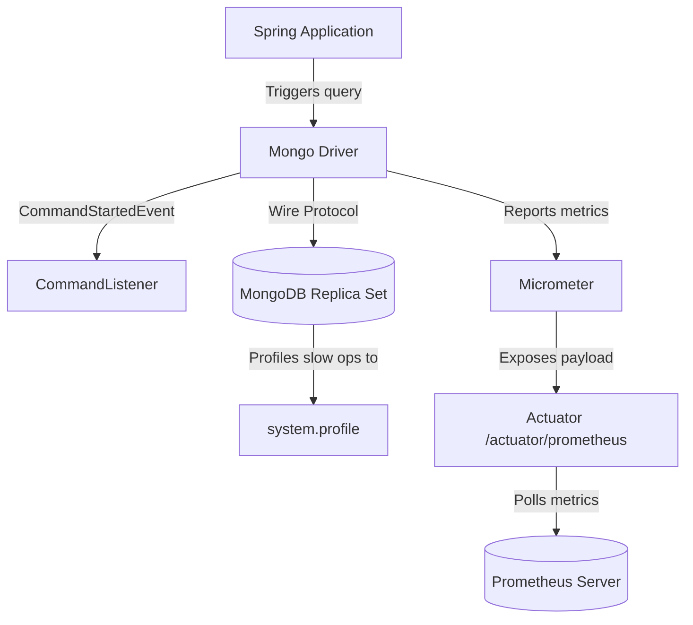

# Module 13: Observability and Operations

Welcome class. Today we study telemetry, diagnostics, and profiling using **Spring Data MongoDB Observability Features (CS-530)**.

To keep database clusters healthy, engineers must trace queries, monitor drivers, and track connection counts. Today we study Spring Boot Actuator, Micrometer metrics, slow query logs, and command monitoring listeners.

---

## 1. Academic Lecture: Observability & Diagnostics

### Basic Level: Telemetry & Monitoring
Observability refers to measuring the internal state of a system (like MongoDB and the JVM container) using its external outputs:
1.  **Logs**: Printing system actions (e.g., connection events or query failures).
2.  **Metrics**: Numeric properties tracked over time (e.g., active connection counts, average query execution times, or memory usage).

### Intermediate Level: Actuator & Micrometer
Spring Boot integrates metrics collection using:
*   **Spring Boot Actuator**: Exposes HTTP endpoints (e.g., `/actuator/metrics` or `/actuator/health`) revealing application internals.
*   **Micrometer**: A telemetry routing layer that collects metrics from the MongoDB driver and translates them for visualization systems like Prometheus.
*   **Mongo Metrics Registry**: Automatically tracks connection pool sizes, active requests, and socket wait times.

### Advanced Level: Command Monitoring, Profiling, and WiredTiger Cache Diagnostics
*   **Command Listeners**: We register `CommandListener` beans with our MongoClient configuration. The driver intercepts every command sent to MongoDB, logging exact JSON payloads and timing executions down to the millisecond.
*   **Database Profiler**: MongoDB has a built-in profiler that logs slow operations to a capped `system.profile` collection. We tune database slow logs by adjusting `slowms` (operations taking longer than this threshold, e.g., 100ms, are logged) and `profile` level (0 = off, 1 = slow ops, 2 = all ops).
*   **WiredTiger Diagnostics**: Under heavy load, we check database statistics (`dbStats`, `serverStatus`) to identify **WiredTiger cache saturation** (dirty data ratio exceeding 20%, or read ticket exhaustion), which stalls writes.



---

## 2. Theory vs. Production Trade-offs

| Diagnostics Tool | Resource Overhead | Metrics Granularity | Integration Location | Use Case |
| :--- | :--- | :--- | :--- | :--- |
| **Command Listeners** | Low-Moderate | Extremely High | JVM (Client Driver) | Logging query structures and latencies in test envs. |
| **Micrometer/Prometheus**| Very Low | Aggregated averages | JVM (Client Driver) | Real-time production alerts. |
| **Database Profiler** | Moderate (Level 1) | High | MongoDB Cluster | Identifying slow queries on database server. |

---

## 3. How to Use: Configuring Telemetry and Command Listeners

Below we show an un-monitored MongoClient configuration (anti-pattern) followed by a production-ready setup logging command metrics.

### A. Un-monitored Config (Anti-Pattern)
*Avoid executing production queries without driver-level metric tracking:*

```java
// DANGER: Without monitoring, there is no visibility into how long queries 
// spend inside the driver queues or what query structures are actually sent to the cluster.
@Configuration
public class SimpleMongoConfig {
    @Bean
    public MongoClient mongoClient() {
        return MongoClients.create("mongodb://localhost:27017/prod");
    }
}
```

### B. Production-Grade Command Monitoring Configuration (Production Pattern)
Here is the configuration registering a `CommandListener` to track query executions.

```java
package com.masterclass.mongodb.config;

import com.mongodb.MongoClientSettings;
import com.mongodb.client.MongoClient;
import com.mongodb.client.MongoClients;
import com.mongodb.event.CommandFailedEvent;
import com.mongodb.event.CommandListener;
import com.mongodb.event.CommandStartedEvent;
import com.mongodb.event.CommandSucceededEvent;
import org.slf4j.Logger;
import org.slf4j.LoggerFactory;
import org.springframework.context.annotation.Bean;
import org.springframework.context.annotation.Configuration;

@Configuration
public class ObservabilityMongoConfig {

    private static final Logger log = LoggerFactory.getLogger(ObservabilityMongoConfig.class);

    @Bean
    public MongoClient mongoClient() {
        MongoClientSettings settings = MongoClientSettings.builder()
                // Register a custom command listener to intercept operations
                .addCommandListener(new MongoCommandMetricsListener())
                .build();
        return MongoClients.create(settings);
    }

    public static class MongoCommandMetricsListener implements CommandListener {

        @Override
        public void commandStarted(CommandStartedEvent event) {
            log.debug("MongoDB Command Started: {} - Database: {}", 
                    event.getCommandName(), event.getDatabaseName());
        }

        @Override
        public void commandSucceeded(CommandSucceededEvent event) {
            log.info("MongoDB Command Succeeded: {} in {} ns", 
                    event.getCommandName(), event.getElapsedTimeNanos());
        }

        @Override
        public void commandFailed(CommandFailedEvent event) {
            log.error("MongoDB Command Failed: {} - Error: {}", 
                    event.getCommandName(), event.getThrowable().getMessage());
        }
    }
}
```

### Line-by-Line Code Explanation:
1.  `addCommandListener(...)`: Registers our custom class to intercept driver-level query lifecycles.
2.  `commandStarted`: Executes before a BSON payload is sent over the network, printing the command type (e.g., `find`, `update`).
3.  `event.getElapsedTimeNanos()`: Returns the round-trip latency of the command in nanoseconds, providing precise performance metrics.

---

## 4. Common Errors & Pitfalls

### Pitfall 1: Leaving Database Profiler Level at 2 (Log All Operations) in Production
*   **Why it fails**: Setting the MongoDB database profiler level to 2 forces the cluster to log every single read and write query to the `system.profile` collection. This introduces disk write contention and degrades database throughput.
*   **Mitigation**: Set the profiler level to 1 (log slow operations only) and configure `slowms` to target query outliers (e.g., operations taking longer than 100ms).

---

## 5. Socratic Review Questions

### Question 1
Explain how MongoDB Command Listeners assist in identifying N+1 query problems in Spring Data.

#### Answer
N+1 query problems occur when an application makes one query to fetch parent records, followed by N separate database calls to load child documents. A Command Listener logs every command execution. If loading a single page triggers dozens of consecutive `find` command logs, it indicates an N+1 problem, which can be resolved by using aggregates or projection lookups.

---

## 6. Hands-on Challenge: Command Telemetry Listener

### The Challenge
In this challenge, you will implement a CommandListener that keeps track of the total number of failed commands.
Your task:
1. Complete `FailedCommandCounter.java`.
2. Increment a counter inside the `commandFailed` event hook.

Complete the implementation stub:

```java
package com.masterclass.mongodb.challenge;

import com.mongodb.event.CommandFailedEvent;
import com.mongodb.event.CommandListener;
import java.util.concurrent.atomic.AtomicLong;

public class FailedCommandCounter implements CommandListener {

    private final AtomicLong failureCount = new AtomicLong(0);

    @Override
    public void commandFailed(CommandFailedEvent event) {
        // TODO: Increment the failureCount by one
        failureCount.incrementAndGet();
    }

    public long getFailureCount() {
        return failureCount.get();
    }
}
```

### Verification Test
Verify your code with this JUnit 5 test class:

```java
package com.masterclass.mongodb.challenge;

import org.junit.jupiter.api.Test;
import com.mongodb.event.CommandFailedEvent;
import com.mongodb.event.CommandStartedEvent;
import org.mockito.Mockito;
import static org.junit.jupiter.api.Assertions.*;

class FailedCommandCounterTest {

    @Test
    void testFailureCounting() {
        var counter = new FailedCommandCounter();
        var mockFailedEvent = Mockito.mock(CommandFailedEvent.class);
        
        counter.commandFailed(mockFailedEvent);
        assertEquals(1, counter.getFailureCount());
    }
}
```
