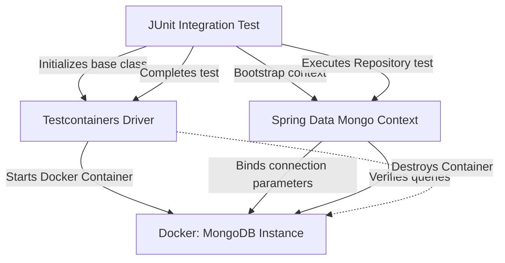

# Module 14: Testing Strategies

Welcome class. Today we analyze automated integration testing strategies using **Spring Data MongoDB Testing (CS-530)**.

To verify database integration without using shared staging environments, tests must execute against isolated, realistic instances. Today we study `@DataMongoTest` boundaries, embedded databases, and Testcontainers configurations.

---

## 1. Academic Lecture: Testing Integration

### Basic Level: Test Isolation Levels
Testing data access code requires isolation to prevent state leakage between tests.
1.  **Unit Tests**: Mocking database repository interfaces using libraries like Mockito. Fast, but does not verify actual BSON mapping queries or index compatibility.
2.  **Integration Tests**: Running code against a real database instance to verify query criteria execution, converter functions, and schema validations.

### Intermediate Level: `@DataMongoTest` & Testcontainers
Spring Boot offers specialized testing tools:
*   `@DataMongoTest`: Disables full autoconfiguration, scanning only Spring Data Mongo repositories, template classes, and converters. This speeds up test bootstrap times.
*   **Embedded MongoDB**: Libraries that download and run a local MongoDB binary in memory. *DANGER*: These libraries are deprecated, do not support modern MongoDB features (like transactions or change streams), and often fail on non-Linux architectures.
*   **Testcontainers**: The industry standard. Uses Docker to launch a real, isolated MongoDB container during test execution, closing it when the suite finishes.

### Advanced Level: Testcontainers Lifecycle Optimization
*   **Container Reuse**: Launching a Docker container for every test class is slow. We optimize execution using the **Singleton Container Pattern**. We configure a base class that launches a single container instance, sharing it across all test classes using JVM shutdown hooks.
*   **Replica Set Containers**: To test transactions, multi-document locking, or change streams, we configure Testcontainers to launch a replica set container (`mongodb/mongodb-community-server` or similar) rather than a standalone instance.



---

## 2. Theory vs. Production Trade-offs

| Testing Approach | Boot Time | Compatibility | Replica Set Support | Resource Usage |
| :--- | :--- | :--- | :--- | :--- |
| **Mockito Mocking** | Extremely Fast | N/A (Does not query DB) | No | Very Low |
| **Embedded In-Memory DB** | Fast | Low (No advanced support) | No | Low |
| **Testcontainers Docker** | Slow (First start) | 100% Match with Prod | Yes | Moderate-High (Docker daemon) |

---

## 3. How to Use: Configuring Testcontainers and Integration Tests

Below we show an un-isolated testing anti-pattern followed by a production-grade Testcontainers integration test suite.

### A. The Shared-Database Test (Anti-Pattern)
*Avoid running integration tests against shared local or staging databases:*

```java
// DANGER: Connecting tests to a local shared database ("shop_test") can cause data collisions.
// If one test deletes records while another expects them, the test suite becomes flaky.
@SpringBootTest
public class UnsafeIntegrationTest {
    @Autowired private ProductRepository repo;
    
    @Test
    public void testProductCount() {
        // Shared state causes flakiness
        assertEquals(5, repo.count()); 
    }
}
```

### B. Production-Grade Testcontainers Suite (Production Pattern)
Here is the clean implementation using Testcontainers to run tests against an isolated Docker container.

```java
package com.masterclass.mongodb.test;

import org.springframework.boot.test.context.SpringBootTest;
import org.springframework.test.context.DynamicPropertyRegistry;
import org.springframework.test.context.DynamicPropertySource;
import org.testcontainers.containers.MongoDBContainer;
import org.testcontainers.utility.DockerImageName;

@SpringBootTest
public abstract class BaseMongoContainerTest {

    // Singleton Container instance shared across all test files
    static final MongoDBContainer mongoDBContainer;

    static {
        mongoDBContainer = new MongoDBContainer(DockerImageName.parse("mongo:6.0.5"));
        mongoDBContainer.start();
    }

    /**
     * Dynamically overrides Spring Boot properties with the container's random port.
     */
    @DynamicPropertySource
    static void setMongoProperties(DynamicPropertyRegistry registry) {
        registry.add("spring.data.mongodb.uri", mongoDBContainer::getReplicaSetUrl);
    }
}
```

```java
package com.masterclass.mongodb.test;

import com.masterclass.mongodb.domain.Product;
import org.junit.jupiter.api.BeforeEach;
import org.junit.jupiter.api.Test;
import org.springframework.beans.factory.annotation.Autowired;
import org.springframework.data.mongodb.core.MongoTemplate;
import static org.junit.jupiter.api.Assertions.*;

class ProductRepositoryTest extends BaseMongoContainerTest {

    @Autowired
    private MongoTemplate mongoTemplate;

    @BeforeEach
    void setUp() {
        mongoTemplate.dropCollection(Product.class);
    }

    @Test
    void testProductPersistence() {
        Product product = new Product("p-01", "Developer Keyboard", 12);
        mongoTemplate.save(product);

        Product saved = mongoTemplate.findById("p-01", Product.class);
        assertNotNull(saved);
        assertEquals("Developer Keyboard", saved.getName());
        assertEquals(12, saved.getStock());
    }
}
```

### Line-by-Line Code Explanation:
1.  `static final MongoDBContainer`: Launches the container inside a static block, ensuring it runs once per test suite execution.
2.  `@DynamicPropertySource`: Overrides database settings at runtime, mapping `spring.data.mongodb.uri` to the container's dynamically generated connection string.
3.  `mongoTemplate.dropCollection(...)`: Clears the collection before each test to guarantee test isolation.

---

## 4. Common Errors & Pitfalls

### Pitfall 1: Re-initializing Containers per Test Class (Extreme Test Latency)
*   **Why it fails**: Declaring `@Container` on instance variables without the static keyword causes Docker to download, start, and stop containers for every single test file. This can add minutes to build pipelines.
*   **Mitigation**: Use the singleton pattern base class shown above or the `@Container` annotation on a static class property.

---

## 5. Socratic Review Questions

### Question 1
Explain the purpose of the `@DynamicPropertySource` annotation in Spring Boot integration tests using Testcontainers.

#### Answer
`@DynamicPropertySource` allows tests to override configuration settings dynamically. When Testcontainers launches a Docker container, it binds the database port to a random free port on the host to avoid port conflicts. `@DynamicPropertySource` fetches this dynamic port and updates the connection URI property before the Spring application context starts.

---

## 6. Hands-on Challenge: Dynamic Test Database Cleaner

### The Challenge
In this challenge, you will implement a setup cleaner that drops all custom user collections before a test executes.
Your task:
1. Complete `DatabaseCleaner.java`.
2. Exclude system databases like `admin`, `config`, and `local` from deletion.

Complete the implementation stub:

```java
package com.masterclass.mongodb.challenge;

import org.springframework.data.mongodb.core.MongoTemplate;

public class DatabaseCleaner {

    public static void cleanCollections(MongoTemplate mongoTemplate) {
        for (String colName : mongoTemplate.getCollectionNames()) {
            // TODO: Drop the collection if it is not a system collection starting with "system." or "admin"
            if (!colName.startsWith("system.")) {
                mongoTemplate.dropCollection(colName);
            }
        }
    }
}
```

### Verification Test
Verify your code with this JUnit 5 test class:

```java
package com.masterclass.mongodb.challenge;

import org.junit.jupiter.api.Test;
import org.springframework.data.mongodb.core.MongoTemplate;
import org.mockito.Mockito;
import java.util.Set;
import static org.mockito.Mockito.*;

class DatabaseCleanerTest {

    @Test
    void testCleanCollections() {
        MongoTemplate mockTemplate = mock(MongoTemplate.class);
        when(mockTemplate.getCollectionNames()).thenReturn(Set.of("products", "system.profile"));

        DatabaseCleaner.cleanCollections(mockTemplate);

        verify(mockTemplate, times(1)).dropCollection("products");
        verify(mockTemplate, never()).dropCollection("system.profile");
    }
}
```
