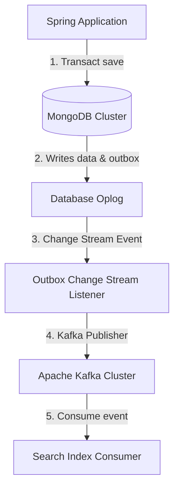

# Module 15: Advanced Production Patterns

Welcome class. Today we analyze advanced design configurations using **Spring Data MongoDB Production Patterns (CS-530)**.

To support complex business requirements, databases must implement multi-tenancy and Change Data Capture (CDC) streams. Today we study database-per-tenant isolation, custom client routing, change stream listeners, and Kafka event publishing.

---

## 1. Academic Lecture: Advanced Architecture Patterns

### Basic Level: Multi-Tenancy Concepts
Multi-tenancy allows a single application deployment to serve multiple clients (tenants) while keeping their data isolated:
1.  **Database-per-Tenant**: Each tenant has a dedicated database. Provides strong isolation but higher resource consumption.
2.  **Shared-Database, Shared-Collection**: Tenants share collections, distinguished by a `tenantId` field. Low cost, but requires strict validation to prevent cross-tenant data leaks.

### Intermediate Level: Multi-Tenancy Routing in Spring
Spring Data supports dynamic database selection through:
*   **AbstractRoutingMongoConfiguration**: An extension point to dynamically select target databases on a thread-local basis.
*   **ThreadLocal Context Holder**: Stores the active tenant's context (populated from request headers, JWT tokens, etc.) to route queries dynamically.

### Advanced Level: Change Data Capture (CDC) with Apache Kafka
*   **What is CDC?**: Change Data Capture captures database updates in real time and publishes them to downstream systems (like search indexes or cache structures).
*   **MongoDB Change Streams**: Exposes real-time collection changes (inserts, updates, deletes) without polling.
*   **Kafka Outbox Integration**: Instead of sending events directly, applications write events to an `outbox` collection inside the same transaction as the business operation. A background thread tails the `outbox` change stream and publishes events to Apache Kafka. This guarantees **At-Least-Once Delivery** and prevents dual-write failures (where the database update succeeds but the message queue write fails).



---

## 2. Theory vs. Production Trade-offs

| Multi-Tenancy Strategy | Isolation Strength | System Overhead | Code Complexity | Setup Cost |
| :--- | :--- | :--- | :--- | :--- |
| **Shared Database (Field)** | Low | Low | Moderate | Low |
| **Database per Tenant** | High | High (Multiple connection pools) | High | Moderate-High |
| **Cluster per Tenant** | Maximum | Extremely High | Low | Very High |

---

## 3. How to Use: Dynamic Multi-Tenancy Routing

Below we show a static single-tenant database configuration (anti-pattern) followed by a production-ready multi-tenant dynamic configuration routing layout.

### A. Static Single-Tenant Configuration (Anti-Pattern)
*Avoid hardcoding database names in multi-tenant environments:*

```java
// DANGER: Using a single static database name prevents customer data separation,
// forcing you to spin up separate server instances for every new tenant.
@Configuration
public class StaticMongoConfig {
    @Bean
    public MongoTemplate mongoTemplate() {
        return new MongoTemplate(MongoClients.create(), "company_db");
    }
}
```

### B. Production-Grade Multi-Tenant Routing (Production Pattern)
Here is the implementation of thread-local tenant context routing.

```java
package com.masterclass.mongodb.context;

public class TenantContext {
    private static final ThreadLocal<String> CONTEXT = new ThreadLocal<>();

    public static void setTenantId(String tenantId) {
        CONTEXT.set(tenantId);
    }

    public static String getTenantId() {
        return CONTEXT.get();
    }

    public static void clear() {
        CONTEXT.remove();
    }
}
```

```java
package com.masterclass.mongodb.config;

import com.masterclass.mongodb.context.TenantContext;
import com.mongodb.client.MongoClient;
import com.mongodb.client.MongoDatabase;
import org.springframework.context.annotation.Bean;
import org.springframework.context.annotation.Configuration;
import org.springframework.data.mongodb.MongoDatabaseFactory;
import org.springframework.data.mongodb.core.SimpleMongoClientDatabaseFactory;
import org.springframework.data.mongodb.core.MongoTemplate;

@Configuration
public class MultiTenantMongoConfig {

    private final MongoClient mongoClient;

    public MultiTenantMongoConfig(MongoClient mongoClient) {
        this.mongoClient = mongoClient;
    }

    @Bean
    public MongoDatabaseFactory mongoDatabaseFactory() {
        return new SimpleMongoClientDatabaseFactory(mongoClient, "default_db") {
            @Override
            public MongoDatabase getMongoDatabase() {
                // Dynamically fetch the tenant ID from the thread context
                String tenantId = TenantContext.getTenantId();
                String targetDatabase = (tenantId != null) ? tenantId : "default_db";
                return mongoClient.getDatabase(targetDatabase);
            }
        };
    }

    @Bean
    public MongoTemplate mongoTemplate(MongoDatabaseFactory factory) {
        return new MongoTemplate(factory);
    }
}
```

### Line-by-Line Code Explanation:
1.  `TenantContext`: A thread-local container that holds the active tenant's identifier during the request lifecycle.
2.  `SimpleMongoClientDatabaseFactory`: We override the factory method to inspect the `TenantContext` on every database call, routing operations to the tenant's dedicated database dynamically.

---

## 4. Common Errors & Pitfalls

### Pitfall 1: Leakage of Thread-Local State between HTTP Requests
*   **Why it fails**: Thread pools in web servers (like Tomcat) reuse worker threads. If a request sets a tenant ID in `TenantContext` but does not clear it when finished, subsequent requests assigned to that thread will inherit the previous tenant's context, leaking data.
*   **Mitigation**: Always clear the context in a servlet filter or interceptor `finally` block: `TenantContext.clear()`.

---

## 5. Socratic Review Questions

### Question 1
Explain the transactional outbox pattern and why it is used instead of dual-writing to the database and a message broker.

#### Answer
Dual-writing occurs when an application attempts to write to the database and publish a message to a broker (like Kafka) sequentially. If the message broker write fails after the database transaction commits, the system is left in an inconsistent state. The outbox pattern resolves this by saving the event inside the database within the same atomic transaction. A background change stream listener then reads the event and publishes it to the broker, ensuring at-least-once delivery.

---

## 6. Hands-on Challenge: Dynamic Tenant Context Interceptor

### The Challenge
In this challenge, you will implement an execution interceptor that extracts a tenant ID header and sets it in the thread context.
Your task:
1. Complete `TenantInterceptor.java`.
2. Extract the `"X-TenantID"` header and store it in `TenantContext`.

Complete the implementation stub:

```java
package com.masterclass.mongodb.challenge;

import com.masterclass.mongodb.context.TenantContext;

public class TenantInterceptor {

    public boolean preHandle(String tenantHeader) {
        if (tenantHeader != null && !tenantHeader.isBlank()) {
            // TODO: Store the header value inside the TenantContext
            TenantContext.setTenantId(tenantHeader);
            return true;
        }
        return false;
    }
}
```

### Verification Test
Verify your code with this JUnit 5 test class:

```java
package com.masterclass.mongodb.challenge;

import com.masterclass.mongodb.context.TenantContext;
import org.junit.jupiter.api.AfterEach;
import org.junit.jupiter.api.Test;
import static org.junit.jupiter.api.Assertions.*;

class TenantInterceptorTest {

    @AfterEach
    void tearDown() {
        TenantContext.clear();
    }

    @Test
    void testTenantRoutingPreHandle() {
        var interceptor = new TenantInterceptor();
        boolean processed = interceptor.preHandle("tenant-abc");

        assertTrue(processed);
        assertEquals("tenant-abc", TenantContext.getTenantId());
    }
}
```
