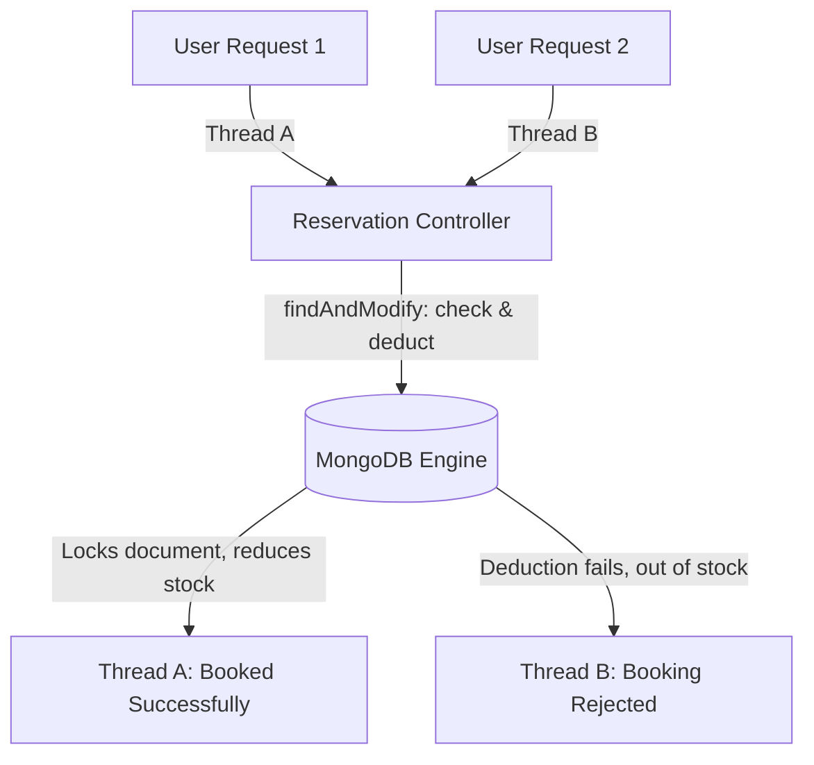

# Module 16: Real Production Architectures

Welcome class. Today we analyze case studies and system topologies using **Spring Data MongoDB Production Architectures (CS-530)**.

To prepare applications for heavy loads, design patterns must be tailored to their domain requirements. Today we study high-throughput catalogs, real-time notification logs, auditing pipelines, and race-free reservation engines.

---

## 1. Academic Lecture: Domain System Patterns

### Basic Level: Architectural Design Patterns
When building enterprise systems, document modeling decisions impact database scaling limits:
1.  **Catalog Outliers**: Storing all catalog attributes in a single document can hit BSON size limits for complex items.
2.  **Concurrency Conflicts**: Highly active booking systems suffer from race conditions when allocating shared resources.

### Intermediate Level: Collection Design Templates
We organize collections into architectural archetypes based on write/read frequency:
*   **High-Throughput Catalogs**: Use the **Subset Pattern** (storing key search attributes in primary collections, and lazy-loading details from target collections).
*   **Notification Engine Logs**: Optimized logs that use TTL indexes to clean up expired events automatically.
*   **Audit Capped Tracks**: Using **Capped Collections** (fixed-size, circular database tables that overwrite old logs when they reach size thresholds).

### Advanced Level: Race-Free Reservation Engines
*   **Atomic Updates (`findAndModify`)**: Booking platforms require allocating limited seats without double-booking. Standard read-then-write updates are prone to race conditions under concurrent requests.
*   **Atomic Array Updates**: We solve this by executing atomic queries using Spring's `findAndModify` operator. The query filters for the target record and checks status in a single database operation, ensuring that only one thread can acquire the reservation lock.



---

## 2. Theory vs. Production Trade-offs

| Domain Scenario | Concurrency Control | Collection Configuration | Document Design Pattern | Peak Latency |
| :--- | :--- | :--- | :--- | :--- |
| **Product Catalog** | Optimistic / None | Standard Collections | Subset Pattern | Very Low |
| **Activity Feed** | None | Capped Collection | Bucket Pattern | Low |
| **Ticket Reservation**| Atomic `findAndModify` | Standard Collections | Document Locking | Moderate (DB lock wait) |

---

## 3. How to Use: Implementing a Race-Free Reservation Engine

Below we show an unsafe booking implementation (anti-pattern) followed by a production-ready, race-free reservation engine using `findAndModify`.

### A. The Race-Prone Booking Loop (Anti-Pattern)
*Avoid read-then-write loops for shared resources:*

```java
// DANGER: If two threads load the room availability simultaneously, both see
// room is available (isBooked = false). Both proceed to book, double-booking the room.
public void bookRoomUnsafe(String roomId) {
    Room room = mongoTemplate.findById(roomId, Room.class);
    if (!room.isBooked()) {
        room.setBooked(true);
        mongoTemplate.save(room);
    }
}
```

### B. Production-Grade Atomic Booking (Production Pattern)
Here is the atomic reservation service implementation.

```java
package com.masterclass.mongodb.domain;

import org.springframework.data.annotation.Id;
import org.springframework.data.mongodb.core.mapping.Document;

@Document(collection = "hotel_rooms")
public class HotelRoom {
    @Id
    private String id;
    private String roomNumber;
    private boolean reserved;
    private String reservedBy;

    public HotelRoom() {}
    public HotelRoom(String id, String roomNumber, boolean reserved) {
        this.id = id;
        this.roomNumber = roomNumber;
        this.reserved = reserved;
    }

    public String getId() { return id; }
    public String getRoomNumber() { return roomNumber; }
    public boolean isReserved() { return reserved; }
    public String getReservedBy() { return reservedBy; }
}
```

```java
package com.masterclass.mongodb.service;

import com.masterclass.mongodb.domain.HotelRoom;
import org.springframework.data.mongodb.core.MongoTemplate;
import org.springframework.data.mongodb.core.FindAndModifyOptions;
import org.springframework.data.mongodb.core.query.Criteria;
import org.springframework.data.mongodb.core.query.Query;
import org.springframework.data.mongodb.core.query.Update;
import org.springframework.stereotype.Service;

@Service
public class ReservationService {

    private final MongoTemplate mongoTemplate;

    public ReservationService(MongoTemplate mongoTemplate) {
        this.mongoTemplate = mongoTemplate;
    }

    /**
     * Attempts to book a room atomically.
     * Guarantees that only one concurrent caller can reserve the room.
     */
    public HotelRoom reserveRoomAtomic(String roomId, String userId) {
        Query query = new Query();
        query.addCriteria(Criteria.where("_id").is(roomId)
                                  .and("reserved").is(false)); // Only match unreserved rooms

        Update update = new Update()
                .set("reserved", true)
                .set("reservedBy", userId);

        // findAndModify performs the query and update atomically on the database node
        return mongoTemplate.findAndModify(
                query, 
                update, 
                FindAndModifyOptions.options().returnNew(true), // Return the updated document
                HotelRoom.class
        );
    }
}
```

### Line-by-Line Code Explanation:
1.  `Criteria.where("_id").is(roomId).and("reserved").is(false)`: The query filters for rooms matching the ID that are not yet reserved.
2.  `mongoTemplate.findAndModify(...)`: Combines query execution, lock acquisition, and updating into a single atomic operation. If a room has already been booked, the query returns null, preventing double-booking.

---

## 4. Common Errors & Pitfalls

### Pitfall 1: Forgetting to Check for Null on findAndModify Output
*   **Why it fails**: If the query in `findAndModify` does not match (e.g., the room is already reserved), the method returns `null`. If the calling code does not handle this null return, it can trigger `NullPointerExceptions` during execution.
*   **Mitigation**: Always verify that the output of `findAndModify` is not null before proceeding.

---

## 5. Socratic Review Questions

### Question 1
Explain why using transaction boundaries (`@Transactional`) is sometimes less efficient than atomic operations like `findAndModify` for simple bookings.

#### Answer
`@Transactional` relies on database transaction sessions, which acquire and hold write locks on documents for the duration of the transaction. This introduces connection overhead and can lead to locking bottlenecks under high concurrency. In contrast, `findAndModify` is a single atomic command executed on a single document, which is faster and releases locks immediately.

---

## 6. Hands-on Challenge: Atomic Increment Engine

### The Challenge
In this challenge, you will implement an atomic counter increment service.
Your task:
1. Complete `AtomicCounterService.java`.
2. Increment the field `counterValue` by a given step.
3. Return the updated counter value.

Complete the implementation stub:

```java
package com.masterclass.mongodb.challenge;

import org.springframework.data.mongodb.core.MongoTemplate;
import org.springframework.data.mongodb.core.query.Criteria;
import org.springframework.data.mongodb.core.query.Query;
import org.springframework.data.mongodb.core.query.Update;
import org.springframework.data.mongodb.core.FindAndModifyOptions;

public class AtomicCounterService {

    private final MongoTemplate mongoTemplate;

    public AtomicCounterService(MongoTemplate mongoTemplate) {
        this.mongoTemplate = mongoTemplate;
    }

    public Integer incrementCounter(String counterId, int step) {
        Query query = Query.query(Criteria.where("_id").is(counterId));
        // TODO: Increment the field "counterValue" by the value of step and return the updated value
        Update update = new Update().inc("counterValue", step);
        
        var result = mongoTemplate.findAndModify(
            query,
            update,
            FindAndModifyOptions.options().returnNew(true).upsert(true),
            org.bson.Document.class
        );
        return (result != null) ? result.getInteger("counterValue") : 0;
    }
}
```

### Verification Test
Verify your code with this JUnit 5 test class:

```java
package com.masterclass.mongodb.challenge;

import org.junit.jupiter.api.Test;
import org.springframework.data.mongodb.core.MongoTemplate;
import org.mockito.Mockito;
import org.bson.Document;
import org.springframework.data.mongodb.core.FindAndModifyOptions;
import org.springframework.data.mongodb.core.query.Query;
import org.springframework.data.mongodb.core.query.Update;
import static org.junit.jupiter.api.Assertions.*;
import static org.mockito.ArgumentMatchers.any;
import static org.mockito.ArgumentMatchers.eq;

class AtomicCounterServiceTest {

    @Test
    void testCounterIncrement() {
        MongoTemplate mockTemplate = Mockito.mock(MongoTemplate.class);
        var doc = new Document("counterValue", 5);
        
        Mockito.when(mockTemplate.findAndModify(any(Query.class), any(Update.class), any(FindAndModifyOptions.class), eq(Document.class)))
               .thenReturn(doc);

        var service = new AtomicCounterService(mockTemplate);
        Integer val = service.incrementCounter("c-01", 5);

        assertEquals(5, val);
    }
}
```
