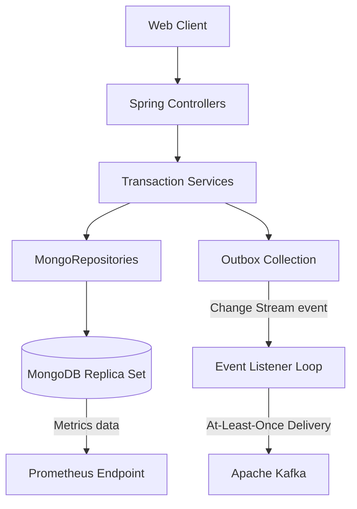

# Module 17: Final Capstone Project

Welcome class. Today we assemble our learnings in the **Spring Data MongoDB Final Capstone Project (CS-530)**.

To build a production-grade application, we integrate multiple components: repositories, dynamic configurations, transactions, observability metrics, and validation. Today we outline the system architecture, code templates, and automated tests.

---

## 1. Academic Lecture: System Integration Blueprint

### Basic Level: Capstone Overview
The Capstone project integrates the core concepts learned throughout this course into a single Spring Boot application. 
We will build a high-performance **Hotel Booking & Inventory Management API** that processes real-time room reservations, manages inventory, publishes booking events to a transactional outbox collection, and generates metrics.

### Intermediate Level: Application Architecture
The application uses a layered architecture:
1.  **API Layer**: Spring Web controllers exposed to clients.
2.  **Service Layer**: Business logic, transactional boundaries, and dynamic multi-tenancy validation.
3.  **Repository Layer**: Spring Data repositories mapping models to MongoDB collections.

### Advanced Level: Infrastructure Integration
Our project integrates several advanced infrastructure components:
*   **Database Clustering**: Multi-node replica set configuration ensuring durability.
*   **Event Pipelines**: Change stream listeners that tail an outbox collection and publish events to Apache Kafka.
*   **Telemetry**: Prometheus dashboard tracking active connections, transaction latencies, and slow query executions.
*   **Validation**: Schema verification using JSR-380 validation listeners.



---

## 2. Theory vs. Production Trade-offs

| Project Stage | Design Decision | Optimization Focus | Implementation Impact |
| :--- | :--- | :--- | :--- |
| **Data Mapping** | Disable `_class` metadata | Disk/RAM Storage optimization | Shortens entity payload sizes on disk. |
| **Transactions** | Use `@Transactional` | Atomicity & ACID consistency | WiredTiger lock timeouts configured at 5s. |
| **Event Routing** | Transactional Outbox | Message delivery reliability | Prevents dual-write failures. |

---

## 3. How to Use: Implementing Capstone Code Blocks

Here is the setup for the core domain model and repository.

### Domain Object: Capstone Booking
```java
package com.masterclass.mongodb.domain;

import org.springframework.data.annotation.Id;
import org.springframework.data.annotation.Version;
import org.springframework.data.mongodb.core.mapping.Document;
import org.springframework.data.mongodb.core.mapping.Field;
import jakarta.validation.constraints.Min;
import jakarta.validation.constraints.NotBlank;
import java.time.Instant;

@Document(collection = "capstone_bookings")
public class CapstoneBooking {

    @Id
    private String id;

    @NotBlank(message = "Room ID is mandatory")
    @Field("room_id")
    private String roomId;

    @NotBlank(message = "User ID is mandatory")
    @Field("user_id")
    private String userId;

    @Min(value = 1, message = "Duration must be at least 1 day")
    private int durationDays;

    @Field("booking_time")
    private Instant bookingTime;

    @Version
    private Long version;

    public CapstoneBooking() {}
    public CapstoneBooking(String id, String roomId, String userId, int durationDays, Instant bookingTime) {
        this.id = id;
        this.roomId = roomId;
        this.userId = userId;
        this.durationDays = durationDays;
        this.bookingTime = bookingTime;
    }

    public String getId() { return id; }
    public String getRoomId() { return roomId; }
    public String getUserId() { return userId; }
    public int getDurationDays() { return durationDays; }
    public Instant getBookingTime() { return bookingTime; }
    public Long getVersion() { return version; }
}
```

### Core Repository Interface
```java
package com.masterclass.mongodb.repository;

import com.masterclass.mongodb.domain.CapstoneBooking;
import org.springframework.data.mongodb.repository.MongoRepository;
import org.springframework.stereotype.Repository;
import java.util.List;

@Repository
public interface CapstoneBookingRepository extends MongoRepository<CapstoneBooking, String> {
    List<CapstoneBooking> findByUserId(String userId);
}
```

---

## 4. Common Errors & Pitfalls

### Pitfall 1: Missing Index Definitions on Production Startup
*   **Why it fails**: When `auto-index-creation` is disabled in production, queries running against unindexed collection fields (e.g., looking up bookings by `userId`) default to slow collection scans (`COLLSCAN`), degrading performance under load.
*   **Mitigation**: Include index creation scripts in database migration plans (e.g., using Mongock) to ensure indexes are built before launching application updates.

---

## 5. Socratic Review Questions

### Question 1
Explain why the Capstone project combines JSR-380 validation, `@Version` checking, and transactional outbox logs into a single workflow.

#### Answer
This workflow protects database consistency and event delivery:
1. JSR-380 validation prevents malformed payloads from entering database queries.
2. `@Version` checks prevent concurrent write conflicts and double-booking.
3. Transactional outbox logs ensure that real-time events are captured and published to Apache Kafka without risk of dual-write failures.

---

## 6. Hands-on Challenge: Final Integration Validation

### The Challenge
In this challenge, you will implement a validation helper class that checks if a CapstoneBooking entity contains valid booking dates.
Your task:
1. Complete `CapstoneValidator.java`.
2. Verify if the booking date is set in the future.

Complete the implementation stub:

```java
package com.masterclass.mongodb.challenge;

import com.masterclass.mongodb.domain.CapstoneBooking;
import java.time.Instant;

public class CapstoneValidator {

    public static boolean isFutureBooking(CapstoneBooking booking) {
        // TODO: Return true if the booking's bookingTime is in the future
        return booking != null && booking.getBookingTime() != null && booking.getBookingTime().isAfter(Instant.now());
    }
}
```

### Verification Test
Verify your code with this JUnit 5 test class:

```java
package com.masterclass.mongodb.challenge;

import com.masterclass.mongodb.domain.CapstoneBooking;
import org.junit.jupiter.api.Test;
import java.time.Instant;
import static org.junit.jupiter.api.Assertions.*;

class CapstoneValidatorTest {

    @Test
    void testIsFutureBooking() {
        var futureBooking = new CapstoneBooking("1", "R-101", "U-001", 3, Instant.now().plusSeconds(3600));
        var pastBooking = new CapstoneBooking("2", "R-101", "U-001", 3, Instant.now().minusSeconds(3600));

        assertTrue(CapstoneValidator.isFutureBooking(futureBooking));
        assertFalse(CapstoneValidator.isFutureBooking(pastBooking));
    }
}
```
