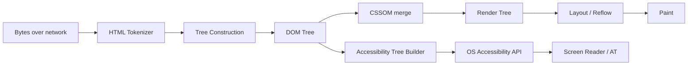
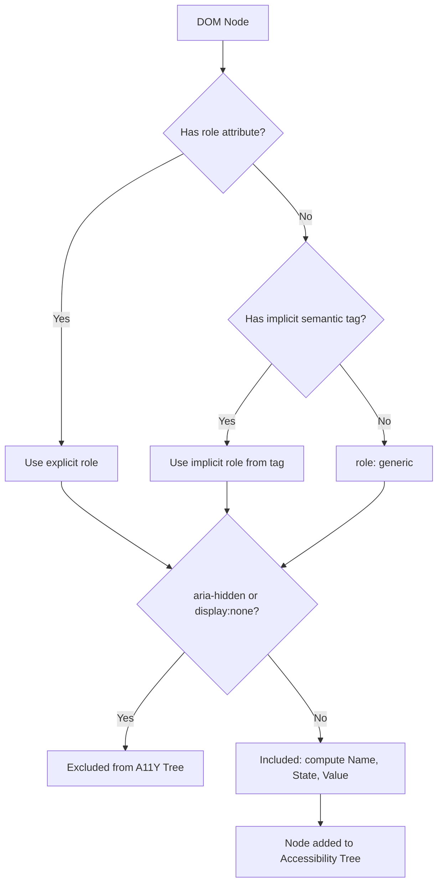

# Chapter 01: Semantic HTML, Accessibility (A11Y) & Basic Browser Rendering

**Prerequisites:** None · **Difficulty:** Level A (JS / Browser)

> 🔗 **Where you are:** This is the entry point of the course — no prior chapters required. Chapters 2–5 go *underneath* the browser (the JS engine, memory, async runtime), then Chapters 6 onward build *upward* into TypeScript, React, and Next.js — all resting on the DOM/A11Y mental model you establish here. If you also want the CSS/layout side of the browser (styling was deliberately deferred here to keep this chapter focused on structure/semantics), [Chapter 21](../phase-5-styling-testing-quality/chapter-21-css-styling-architecture.md) can be read any time after this one.

---

## 1. Learning Objectives

By the end of this chapter, you will be able to:

- **Identify** semantic HTML landmarks and explain why each exists over a generic `<div>`.
- **Explain** how the browser converts an HTML document into the DOM and, in parallel, the Accessibility (A11Y) Tree.
- **Construct** a keyboard-navigable, screen-reader-compatible UI shell using only semantic markup and ARIA attributes.
- **Evaluate** a component for accessibility violations using the same mental model a screen reader uses.
- **Design** a reusable, accessible focus-trap primitive suitable for production modal dialogs.

---

## 2. Motivation

In 2023, over 96% of the top one million home pages had detectable WCAG failures (WebAIM Million report). This is not a niche concern — inaccessible interfaces are a **legal liability** (ADA lawsuits in the US rose over 12% year over year), a **business cost** (roughly 15% of the world's population lives with some form of disability — that is addressable market you are silently excluding), and an **engineering debt trap**: retrofitting accessibility into a `<div>`-soup codebase after the fact costs 5–10x more than building it in from the start, because focus order, semantics, and ARIA relationships are structural, not cosmetic.

There is also a purely technical reason interns must learn this first: **semantic HTML is the foundation the rest of the rendering pipeline is built on.** Before you can reason about the Virtual DOM, Fiber, or hydration, you need a correct mental model of what the *real* DOM is and how the browser derives a second, parallel tree — the Accessibility Tree — from it.

---

## 3. Core Theory

### 3.1 Semantic HTML vs. Generic Containers

`<div>` and `<span>` carry **zero semantic meaning** — they tell the browser "a box exists here," nothing more. Semantic elements each carry an implicit **ARIA role**, baked in by the HTML specification:

| Element | Implicit Role | Purpose |
|---|---|---|
| `<header>` | `banner` (when top-level) | Introductory content / branding |
| `<nav>` | `navigation` | Primary or secondary navigation blocks |
| `<main>` | `main` | The document's dominant content (one per page) |
| `<article>` | `article` | Self-contained, independently distributable content |
| `<section>` | `region` (with accessible name) | Thematic grouping of content |
| `<aside>` | `complementary` | Content tangentially related to main content |
| `<footer>` | `contentinfo` (when top-level) | Closing metadata (copyright, links) |

Using these correctly means assistive technology (AT) users get **free navigation**: screen reader users can jump directly to "main," "navigation," or "banner" landmarks without linearly reading the page.

### 3.2 The Accessibility Tree

The browser does not hand the DOM directly to assistive technology. Instead, during rendering, it builds a **parallel, pruned tree** called the Accessibility Tree:

- Every DOM node is inspected for its **computed role** (explicit `role="..."` attribute, or implicit role from tag semantics).
- Nodes that are `display: none`, `visibility: hidden`, `aria-hidden="true"`, or otherwise not "accessibility relevant" (e.g., a `<script>` tag) are **excluded**.
- Remaining nodes are annotated with **name, role, state, and value** (the "NRSV" accessibility contract) — e.g., a button node might resolve to `{ role: "button", name: "Submit form", state: { disabled: false } }`.

Operating systems then expose this tree through platform APIs — **UI Automation (UIA)** on Windows, **NSAccessibility** on macOS, **AT-SPI/ATK** on Linux — which is what screen readers like NVDA, JAWS, and VoiceOver actually query. Your HTML is two steps removed from what a blind user experiences; both steps must be correct.

### 3.3 ARIA: A Last Resort, Not a First Choice

The first rule of ARIA (per the W3C ARIA Authoring Practices) is: **"No ARIA is better than bad ARIA."** If a native HTML element already gives you the semantics, state, and keyboard behavior you need, use it. Reach for ARIA roles/states/properties only to fill gaps native HTML can't cover (custom widgets like comboboxes, tab panels, live regions).

---

## 4. Visual Diagrams

### 4.1 Browser Parsing Pipeline (Critical Rendering Path, entry point)



### 4.2 DOM Node → Accessibility Node Resolution



---

## 5. Step-by-Step Walkthrough: Building an Accessible Modal Focus Trap

1. **User triggers open** — clicking a "Share" button calls `openModal()`.
2. **Store the trigger element** — save `document.activeElement` before moving focus, so it can be restored later.
3. **Move focus into the modal** — call `.focus()` on the modal's first focusable element (or a `tabIndex={-1}` heading, per WAI-ARIA Dialog pattern) synchronously after mount.
4. **Trap Tab/Shift+Tab** — listen for `keydown`, intercept `Tab`; if focus is about to leave the modal's first/last focusable child, wrap it around.
5. **Announce to AT** — modal root has `role="dialog"` + `aria-modal="true"` + `aria-labelledby` pointing at the heading id, so screen readers announce "dialog, Share document."
6. **Escape closes** — listen for `Escape` keydown to close and…
7. **Restore focus** — return focus to the element saved in step 2. Skipping this step is the #1 accessibility regression in production modals.

---

## 6. Internal Implementation

Browsers compute the Accessibility Tree **lazily and incrementally** — it is not rebuilt from scratch on every DOM mutation. Chromium's `AXObjectCache` listens to the same mutation signals the renderer uses for layout invalidation, and marks only the affected subtree "dirty," recomputing names/roles/states on the next accessibility tree serialization pass. This is why excessive `aria-live` announcements or rapid DOM churn under an accessible tree can cause AT lag — you're triggering repeated dirty-tree recomputation on the same code path that costs layout thrashing for visual rendering.

Screen readers don't parse HTML at all — they are separate OS-level processes that subscribe to the accessibility API and receive **events** (`focus-changed`, `live-region-changed`, `value-changed`) alongside the static tree. This is why `aria-live="polite"` works even when no focus change occurs: it's a distinct event channel, not a DOM diff.

---

## 7. Code Examples

### 7.1 Minimal Example — Semantic Landmarks

```html
<body>
  <header><h1>ScribeCollab</h1></header>
  <nav aria-label="Primary">
    <ul><li><a href="/docs">Documents</a></li></ul>
  </nav>
  <main>
    <h2>Untitled Document</h2>
    <p>Start typing…</p>
  </main>
  <footer>© 2026 ScribeCollab</footer>
</body>
```

### 7.2 Practical Example — Accessible Button vs. Clickable Div

```html
<!-- Native element gives you role, keyboard handling, and focus for free -->
<button type="button" onclick="shareDoc()">Share</button>
```

### 7.3 Production-Ready — Reusable Focus Trap (TypeScript + React)

```tsx
// useFocusTrap.ts — production pattern used across ScribeCollab modals
import { useEffect, useRef } from "react";

const FOCUSABLE_SELECTOR =
  'a[href], button:not([disabled]), textarea, input, select, [tabindex]:not([tabindex="-1"])';

export function useFocusTrap(active: boolean) {
  const containerRef = useRef<HTMLDivElement>(null);
  const previouslyFocused = useRef<HTMLElement | null>(null);

  useEffect(() => {
    if (!active || !containerRef.current) return;

    previouslyFocused.current = document.activeElement as HTMLElement;
    const container = containerRef.current;
    const focusables = container.querySelectorAll<HTMLElement>(FOCUSABLE_SELECTOR);
    focusables[0]?.focus();

    function handleKeyDown(e: KeyboardEvent) {
      if (e.key === "Escape") {
        previouslyFocused.current?.focus();
        return;
      }
      if (e.key !== "Tab") return;

      const first = focusables[0];
      const last = focusables[focusables.length - 1];

      if (e.shiftKey && document.activeElement === first) {
        e.preventDefault();
        last?.focus();
      } else if (!e.shiftKey && document.activeElement === last) {
        e.preventDefault();
        first?.focus();
      }
    }

    document.addEventListener("keydown", handleKeyDown);
    return () => {
      document.removeEventListener("keydown", handleKeyDown);
      previouslyFocused.current?.focus(); // restore focus on unmount
    };
  }, [active]);

  return containerRef;
}
```

### 7.4 Anti-Pattern → Corrected

```html
<!-- ❌ ANTI-PATTERN: div soup, no keyboard access, no AT semantics -->
<div class="btn" onclick="shareDoc()">Share</div>
```

```html
<!-- ✅ CORRECTED: native button restores keyboard, focus, and role for free -->
<button type="button" class="btn" onclick="shareDoc()">Share</button>
```

### 7.5 Additional Example — Accessible Form Validation with `aria-describedby`

```html
<form novalidate>
  <fieldset>
    <legend>Share Document</legend>
    <label for="email">Collaborator email</label>
    <input
      id="email"
      type="email"
      required
      aria-describedby="email-error"
      aria-invalid="true"
    />
    <p id="email-error" role="alert">Enter a valid email address.</p>
  </fieldset>
</form>
```

`aria-describedby` links the input to its error message so screen readers announce the error immediately after the field's label — without it, an AT user hears only "Collaborator email, edit text, invalid" with no explanation of *why*. `<fieldset>`/`<legend>` group related controls under a single accessible name, which is why this pattern outperforms a plain `<div>` wrapper with a floating heading.

---

## 8. Common Mistakes

| Level | Mistake |
|---|---|
| **Junior** | Using `<div onClick>` instead of `<button>`, losing keyboard operability and the implicit `button` role entirely. |
| **Mid-Level** | Adding `role="dialog"` to a modal but forgetting `aria-modal="true"` and focus management — screen reader users can still tab into background content. |
| **Senior/Production** | Shipping a design system where color contrast passes automated linting (axe-core) but fails real WCAG AA contrast ratios (4.5:1) under dark mode theme tokens — automated tools catch ~30-50% of real issues; manual AT testing is still required. |

---

## 9. Performance Analysis

- **A11Y Tree construction cost:** O(n) relative to DOM node count for the initial build; incremental updates are O(k) where k is the size of the dirtied subtree, not the whole tree.
- **Reflow cost of semantic vs. non-semantic markup:** identical — semantics do not add layout cost. The *only* overhead is CPU time to compute additional ARIA property strings, which is negligible (sub-millisecond) even on large trees.
- **Frame budget risk:** rapid `aria-live` region updates (e.g., streaming collaborative cursor positions into a live region) can flood the AT event channel, causing announcement queue backpressure. Debounce live-region text updates to ~150–300ms.

---

## 10. Security Inventory

- **ARIA role spoofing:** malicious or careless use of `role="button"` on a link that actually navigates can be used in phishing UI patterns to mislead both sighted and AT users about an element's true behavior. Never lie about role vs. actual behavior.
- **`innerHTML` in semantic containers:** injecting unsanitized user Markdown into a `<main>` or `<article>` node via `innerHTML` is a direct XSS vector — sanitize with a library like DOMPurify before insertion, regardless of how "safe" the semantic wrapper looks.
- **Hidden clickjacking targets:** `aria-hidden="true"` on a visually-present interactive element makes it invisible to AT while still clickable by sighted mouse users — a pattern sometimes abused to hide malicious controls from accessibility audits. Any `aria-hidden` element must also be `pointer-events: none` / non-interactive.

---

## 11. Technology Comparisons

| Approach | Manual ARIA | Headless UI Libraries (Radix, React Aria, Headless UI) |
|---|---|---|
| **Control over markup** | Full | Full (unstyled primitives) |
| **Keyboard interaction correctness** | You must implement and test every pattern (APG spec) | Implements WAI-ARIA Authoring Practices out of the box |
| **Maintenance cost** | High — accessibility regressions are easy to introduce silently | Low — battle-tested against screen readers |
| **Bundle size** | Zero extra | Small (a few KB per primitive) |
| **Recommended for** | Learning fundamentals, simple static content | Production interactive widgets (modals, comboboxes, menus) |

---

## 12. Engineering Decisions

Should ScribeCollab hand-roll every ARIA pattern, or adopt a headless library? **Decision: use Radix Primitives for interactive widgets (modals, dropdowns, tabs) once we reach later component-composition chapters, but require every intern to hand-build a focus trap first (this chapter).** Rationale: understanding the underlying mechanics is non-negotiable for debugging production AT bugs, but re-implementing WAI-ARIA APG patterns for every widget in a growing codebase is not a good use of senior engineering time — it's solved problem space with security/edge-case coverage that took years to mature in these libraries.

---

## 13. Exercises

**Easy (comprehension):** List the implicit ARIA role for `<nav>`, `<aside>`, and `<button>`. Explain why `<div role="button">` is a worse choice than `<button>` even when both report the same role.

**Medium (implementation):** Build a semantic page shell for a document editor: header with branding, a `<nav>` sidebar of document links, `<main>` for the editor, and a live region (`aria-live="polite"`) that announces "Saved" 2 seconds after the last keystroke.

**Hard (architectural evaluation):** Your team ships a custom dropdown built entirely from `<div>` elements with mouse-only interaction and no ARIA. Write an evaluation memo (200-400 words) covering: (1) every WCAG failure category this triggers, (2) the retrofit cost vs. rebuilding with a native `<select>` or Radix `DropdownMenu`, and (3) a migration plan that doesn't break existing visual design.

---

## 14. Capstone Integration Step

**ScribeCollab — Step 1:** Set up the semantic shell of the workspace editor: `<header>` for the top toolbar, `<nav>` for the document tree sidebar, `<main>` for the Markdown editor pane, and `<aside>` for the collaborator presence panel. Implement the `useFocusTrap` hook above and wire it into the (currently static) "Share Document" modal placeholder. Verify with a screen reader (NVDA or VoiceOver) that: the page landmarks are announced correctly, Tab cannot escape an open modal, and Escape restores focus to the triggering button.

---

## 🔜 Bridge to Chapter 2

You now have a correct mental model of the DOM and the Accessibility Tree the browser builds from it. But *how* does the browser execute the JavaScript that manipulates that DOM — how does a click handler actually run, and why can a function "remember" data after it returns? Chapter 2 goes one layer deeper into the JavaScript engine's execution model. You'll need it to explain, not just use, the `useFocusTrap` hook you just built — its behavior is entirely a function of closures and execution contexts, which is exactly what's next.

---

## 15. Supplementary Topics & Core Lecture Knowledge

The following topics from the course syllabus represent incremental lecture knowledge integrated into this chapter's systems scope:

| Line | Curriculum Topic | Technical Knowledge & Systems Context |
|---|---|---|
| 21 | **Manipulating the DOM - Not With React!** | Provides concrete context and implementation strategies for Manipulating the DOM - Not With React!, ensuring proper syntax alignment and optimal performance in React applications. |
