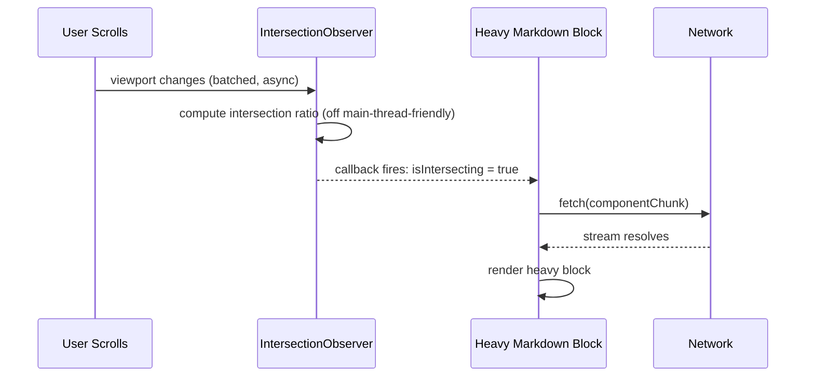
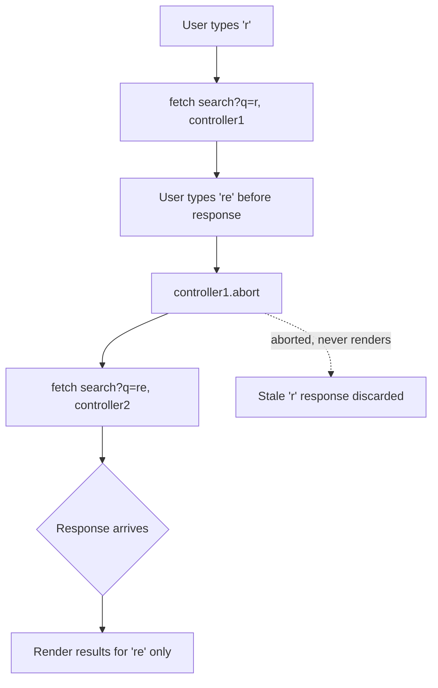

# Chapter 02: Browser Web APIs, DOM Orchestration & Web I/O

**Prerequisites:** Chapter 4 · **Difficulty:** Level C (JS / Browser)

> 🔗 **Continuing from Chapter 4:** You now know *when* queued callbacks run. This chapter covers the actual browser subsystems — DOM observers, storage, and networking — that enqueue those callbacks in the first place, completing Phase 1's JS/browser fundamentals.

---

## 1. Learning Objectives

- **Select and mutate** DOM nodes safely and efficiently using modern query APIs.
- **Apply** the three major Observer APIs (Mutation, Resize, Intersection) to solve real UI performance problems.
- **Compare** synchronous Web Storage against asynchronous, transactional client persistence.
- **Implement** cancelable, stream-aware HTTP requests using `fetch` and `AbortController`.
- **Design** a lazy-loading and offline-resilient data layer for a production feature.

---

## 2. Motivation

Interns often learn `fetch()` and `localStorage` in isolation, without understanding their failure modes at scale: unbounded storage causing `QuotaExceededError`, uncanceled fetches causing race conditions and memory leaks, or naive scroll-based lazy loading causing layout thrashing. This chapter treats the browser as the **operating system it actually is** — with scheduling, storage, and I/O primitives that have real capacity limits, real performance costs, and real security boundaries. Every "list virtualization," "offline-first," or "infinite scroll" feature you'll ever ship is built from the primitives in this chapter.

---

## 3. Core Theory

### 3.1 DOM Selection & Mutation

`document.querySelector`/`querySelectorAll` provide CSS-selector-based access; direct node references (`.firstChild`, `.nextElementSibling`) avoid re-parsing selector strings in hot loops. Mutating text safely means preferring `.textContent` (escapes content, no HTML parsing) over `.innerHTML` (parses as HTML — an XSS vector for untrusted content, see Security Inventory).

### 3.2 Observer APIs

| Observer | Watches | Typical Use |
|---|---|---|
| **MutationObserver** | DOM tree/attribute/text changes | Detecting third-party script DOM injection, reacting to CMS-injected content |
| **ResizeObserver** | Element box dimension changes | Responsive components that must react to container size independent of viewport |
| **IntersectionObserver** | Element visibility relative to viewport/ancestor | Lazy-loading, infinite scroll, view-based analytics |

All three are **asynchronous and batched** — callbacks fire on a microtask-adjacent schedule *after* layout, not synchronously on every micro-change, which is precisely why they're far cheaper than polling `getBoundingClientRect()` in a scroll handler.

### 3.3 Web Storage

- **`localStorage`**: synchronous, ~5-10MB limit (browser-dependent), persists until explicitly cleared, blocks the main thread on read/write (small but nonzero cost), string-only values.
- **`sessionStorage`**: same API, scoped to a single tab/session.
- Both are **synchronous by spec** — this is a real performance hazard for large payloads, motivating **IndexedDB** (introduced in the state-management chapters) for anything beyond small key-value settings.

### 3.4 The Fetch API & Streams

`fetch()` returns a `Promise<Response>` resolving as soon as headers arrive — the **body** is a `ReadableStream` you consume separately (`.json()`, `.text()`, or manual `.getReader()` for chunked processing). `AbortController` provides a standard cancellation signal threaded through `fetch`, and increasingly through custom async APIs — the *only* standards-based way to cancel an in-flight request.

---

## 4. Visual Diagrams

### 4.1 IntersectionObserver-Driven Lazy Load



### 4.2 Fetch + AbortController Race Cancellation



---

## 5. Step-by-Step Walkthrough: Cancel-Safe Search-as-You-Type

1. User types a character; the input handler debounces (Chapter 2/4 patterns).
2. Before issuing a new request, check for a previous in-flight `AbortController` and call `.abort()` on it — this immediately rejects the previous `fetch()` promise with an `AbortError`.
3. Create a fresh `AbortController`, store its `signal` for the next potential cancellation, and issue `fetch(url, { signal })`.
4. On resolution, check `if (!signal.aborted)` before committing results to state — belt-and-braces against any race the abort itself didn't catch.
5. On unmount (a `useEffect` cleanup in the hooks chapter), abort any still-pending controller to prevent a "set state on unmounted component" warning and wasted network usage.

---

## 6. Internal Implementation

`IntersectionObserver` doesn't compute intersection by polling — Chromium computes it as part of the **compositor's** post-layout step, using the same geometry data already produced during the paint pipeline, and delivers a batch of `IntersectionObserverEntry` records asynchronously as a low-priority task. This is why it's dramatically cheaper than a `scroll` event listener calling `getBoundingClientRect()`: the latter *forces synchronous layout* (a "layout thrash") on every single scroll tick if you read geometry after having written to the DOM in the same frame, while the Observer APIs are explicitly designed to never force synchronous layout — they only report results the browser was computing anyway.

`fetch`'s streaming body is backed by the browser's network stack directly — chunks arrive as TCP/HTTP2 frames are decoded, **before** the full response finishes downloading, which is what makes `ReadableStream` processing (e.g., progressively parsing NDJSON or Server-Sent Events) genuinely lower-latency than waiting for `.json()` to resolve on a large payload.

---

## 7. Code Examples

### 7.1 Minimal Example — IntersectionObserver

```js
const observer = new IntersectionObserver((entries) => {
  entries.forEach((entry) => {
    if (entry.isIntersecting) console.log("visible:", entry.target);
  });
});
observer.observe(document.querySelector("#lazy-block"));
```

### 7.2 Practical Example — AbortController Cancel-on-Retype

```js
let controller = null;

async function search(query) {
  controller?.abort();
  controller = new AbortController();
  try {
    const res = await fetch(`/api/search?q=${encodeURIComponent(query)}`, {
      signal: controller.signal,
    });
    return await res.json();
  } catch (err) {
    if (err.name === "AbortError") return null; // expected, not an error
    throw err;
  }
}
```

### 7.3 Production-Ready — Lazy-Loaded Markdown Block with Offline Fallback (TypeScript)

```tsx
// LazyMarkdownBlock.tsx
import { useEffect, useRef, useState } from "react";

interface Props {
  blockId: string;
  fetchBlock: (id: string, signal: AbortSignal) => Promise<string>;
}

export function LazyMarkdownBlock({ blockId, fetchBlock }: Props) {
  const ref = useRef<HTMLDivElement>(null);
  const [content, setContent] = useState<string | null>(null);

  useEffect(() => {
    if (!ref.current) return;
    const controller = new AbortController();

    const observer = new IntersectionObserver(
      async ([entry]) => {
        if (!entry.isIntersecting || content) return;
        try {
          const html = await fetchBlock(blockId, controller.signal);
          if (!controller.signal.aborted) setContent(html);
        } catch {
          // fall back to cached offline copy
          const cached = localStorage.getItem(`block:${blockId}`);
          if (cached) setContent(cached);
        }
      },
      { rootMargin: "200px" } // preload slightly before entering viewport
    );

    observer.observe(ref.current);
    return () => {
      observer.disconnect();
      controller.abort();
    };
  }, [blockId, content, fetchBlock]);

  return <div ref={ref}>{content ?? "Loading…"}</div>;
}
```

### 7.4 Anti-Pattern → Corrected

```js
// ❌ ANTI-PATTERN: scroll-based lazy loading forces synchronous layout
// (getBoundingClientRect) on every scroll tick — a classic layout thrash.
window.addEventListener("scroll", () => {
  document.querySelectorAll(".lazy").forEach((el) => {
    const rect = el.getBoundingClientRect(); // forces layout, every scroll event!
    if (rect.top < window.innerHeight) loadContent(el);
  });
});
```

```js
// ✅ CORRECTED: IntersectionObserver batches this off the scroll hot path
// entirely, using layout data the compositor already computed.
const observer = new IntersectionObserver((entries) => {
  entries.forEach((entry) => entry.isIntersecting && loadContent(entry.target));
});
document.querySelectorAll(".lazy").forEach((el) => observer.observe(el));
```

### 7.5 Additional Example — `ResizeObserver` for a Responsive Editor Toolbar

```js
const toolbar = document.querySelector("#toolbar");
const resizeObserver = new ResizeObserver((entries) => {
  for (const entry of entries) {
    const collapsed = entry.contentRect.width < 480;
    toolbar.classList.toggle("toolbar--collapsed", collapsed);
  }
});
resizeObserver.observe(toolbar);
```

Unlike a `window.resize` listener (which only fires on *viewport* changes), `ResizeObserver` fires whenever the *observed element's own box* changes size — for example, when a sidebar is toggled and the editor pane resizes without the browser window changing at all. This makes it the correct tool for container-based responsive design (expanded further in [Chapter 21](../phase-5-styling-testing-quality/chapter-21-css-styling-architecture.md)), independent of this chapter's IntersectionObserver, which tracks visibility, not size.

---

## 8. Common Mistakes

| Level | Mistake |
|---|---|
| **Junior** | Using `.innerHTML` to insert user-generated Markdown-rendered HTML without sanitization, opening a direct XSS hole. |
| **Mid-Level** | Forgetting to call `.abort()` on a previous in-flight `fetch` before issuing a new one in a search-as-you-type feature, causing stale responses to overwrite fresh ones (race condition). |
| **Senior/Production** | Storing large, frequently-updated collaborative document state in `localStorage` synchronously on every keystroke, blocking the main thread and hitting quota limits — should use IndexedDB with batched/throttled writes instead. |

---

## 9. Performance Analysis

- **`querySelectorAll` over large trees:** O(n) relative to DOM size per call — cache references rather than re-querying in loops or frequent handlers.
- **`localStorage` read/write:** synchronous and O(size of value) per call, executed on the main thread — a multi-MB write can cause a visible frame drop; IndexedDB operations are asynchronous and don't block rendering.
- **IntersectionObserver vs. scroll+`getBoundingClientRect`:** the Observer approach avoids forced synchronous layout entirely, converting an O(visible elements × scroll events) hot path into an O(entries that actually crossed the threshold) batched callback.
- **Streamed fetch parsing:** allows processing to begin before the full payload downloads, reducing perceived latency for large responses (e.g., streaming a large shared document) proportionally to how early in the stream useful data appears.

---

## 10. Security Inventory

- **XSS via `innerHTML`:** any user-controlled content rendered via `innerHTML` (including rendered Markdown-to-HTML output) must be sanitized (e.g., DOMPurify) — never trust that "it's just Markdown" makes it safe, since Markdown renderers can emit raw HTML passthrough.
- **Storage is not a security boundary:** `localStorage`/`sessionStorage`/IndexedDB are all readable by any script running on the same origin, including any injected via XSS. Never store raw auth tokens or secrets client-side without understanding this is equivalent to storing them in plaintext accessible to any script on the page.
- **Uncontrolled `fetch` targets:** constructing fetch URLs by concatenating unsanitized user input can enable SSRF-adjacent issues or open redirect abuse if the endpoint proxies the URL server-side; always validate/allowlist destinations.
- **AbortController is not a security control:** aborting a client-side fetch does not guarantee the server stops processing the associated work — server-side idempotency and authorization checks must not assume client cancellation reflects server state.

---

## 11. Technology Comparisons

| Storage/IO Mechanism | localStorage | IndexedDB | Fetch + Cache API |
|---|---|---|---|
| **Sync/Async** | Synchronous | Asynchronous | Asynchronous |
| **Capacity** | ~5-10MB | Hundreds of MB+ (quota-managed) | Governed by Cache Storage quota |
| **Data types** | Strings only | Structured clone (objects, blobs, files) | Full `Response` objects |
| **Transactions** | None | Yes (ACID-like transactions) | None natively |
| **Best for** | Small settings/flags | Offline document/app state (ScribeCollab's sync layer) | Caching network responses for offline-first apps |

---

## 12. Engineering Decisions

ScribeCollab's offline sync layer needs transactional, high-capacity, structured storage — **decision: IndexedDB is the source of truth for offline document state**, with `localStorage` reserved only for small UI preference flags (theme, sidebar collapsed state) where synchronous, low-latency reads at app boot outweigh IndexedDB's async overhead for trivial data. Lazy-loading of heavy render blocks uses IntersectionObserver over scroll-based approaches without exception, given the demonstrated layout-thrash cost difference.

---

## 13. Exercises

**Easy:** Explain why `element.innerHTML = userInput` is dangerous but `element.textContent = userInput` is not, in terms of what each setter actually does with the string.

**Medium:** Implement a `useAbortableFetch(url)` custom hook (conceptually, ahead of the hooks chapter) that cancels the previous request whenever `url` changes and on unmount, returning `{ data, error, loading }`.

**Hard:** ScribeCollab needs to lazy-load 200 collaborator avatar images in a long contributor list without causing layout shift or excessive network requests on fast scrolling. Design a solution combining IntersectionObserver's `rootMargin`, image dimension reservation (to prevent CLS), and request cancellation for images scrolled past before they finish loading. Justify each design choice.

---

## 14. Capstone Integration Step

**ScribeCollab — Step 5:** Wire the `LazyMarkdownBlock` component (7.3) into the document preview pane so heavy embedded content (diagrams, large code blocks) loads only as it enters the viewport. Implement the offline backup path using `localStorage` for small metadata plus an `AbortController`-guarded save request, explicitly noting in code comments that this is a placeholder — later chapters will migrate the durable store to IndexedDB once Zustand and structured sync are introduced.

---

## 🔜 Bridge to Phase 2 (Chapter 6)

Phase 1 is complete: you can now reason about the DOM, the accessibility tree, the engine's execution model, memory, and the async runtime — the baseline the rest of this course assumes without re-explaining. Phase 2 shifts focus from *runtime behavior* to *compile-time safety*: Chapter 6 introduces TypeScript and the build tooling used for every remaining chapter, since from here on all code examples are written in strictly-typed TypeScript.
