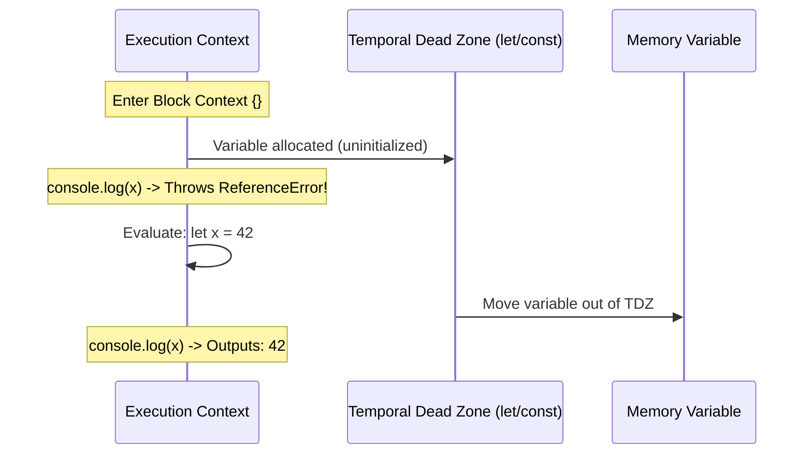
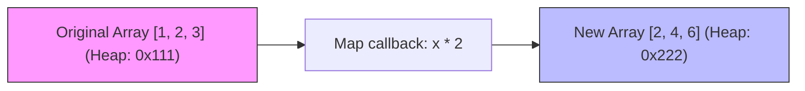

# Chapter 05: JavaScript Runtime — Scaffolding & Syntax Foundations

**Prerequisites:** None · **Difficulty:** Level A (JS / Browser)

> 🔗 **Welcome to the JavaScript Runtime Phase:** In Phase 1 and 2, we examined browser documents and style layouts. Now, we step into the engine of our web applications: JavaScript. In this chapter, we start at the absolute foundation, setting up our local environment from scratch and examining the syntax rules and memory systems of JavaScript. This chapter establishes the baseline knowledge necessary to understand V8 execution contexts and event loops in the chapters that follow.

---

## 1. Learning Objectives

- **Set up** a local Node.js environment and initialize a JavaScript workspace using package configurations.
- **Differentiate** block scopes (`let`, `const`) from function scopes (`var`) through hoisting traces.
- **Analyze** memory allocations of primitive values (Stack) vs. reference structures (Heap) to prevent unintended side-effects.
- **Trace** array methods (`.map()`, `.filter()`, `.reduce()`) to apply data immutability patterns.
- **Diagnose** mutations and reference leaks in nested objects using deep copy models.
- **Construct** a JavaScript CLI application running on V8 and execute it step-by-step.

---

## 2. Motivation

In my thirty years of software engineering, I have seen developers waste days debugging state mutations in frameworks like React because they did not understand how JavaScript objects are referenced in memory. They write `const newObj = oldObj` and wonder why their React component fails to detect state updates. 

Every framework is built on JavaScript's rules. If you do not have mechanical sympathy for how V8 compiles variables and references, your applications will suffer from leaks, memory inflation, and silent bugs. This chapter builds the foundations of environment tooling and syntax execution so you can write predictable code.

---

## 3. Core Theory

### 3.1 JavaScript Environments: Scaffolding a Local Runtime
JavaScript was designed as a browser language, but through **Node.js**, we run it directly on host machines via Google's V8 engine.
*   **Package Initialization:** A project is defined by a `package.json` file, which records configurations and dependencies.
*   **Execution Runtime:** When we execute `node script.js`, Node loads the script into V8, which parses the source code into an Abstract Syntax Tree (AST), compiles it via the Ignition interpreter, and optimizes hot spots using the TurboFan compiler.

### 3.2 Scoping & Declarations: Let, Const, and Var
JavaScript manages variable storage based on the declaration keyword:
1.  **Block Scope (`let` / `const`):** Scoped strictly to the enclosing curly braces `{}`. They are allocated when the block is entered but cannot be accessed until their declaration line is evaluated. This period is the **Temporal Dead Zone (TDZ)**.
2.  **Function Scope (`var`):** Scoped to the parent function. Var declarations are **hoisted** to the top of the function context and initialized to `undefined`. This allows them to be accessed before declaration, causing silent bugs.

### 3.3 Memory Models: Stack vs. Heap Allocation
The V8 engine divides RAM into two structures:
*   **The Stack:** Fast, contiguous, fixed-size frames. It stores primitive values (`string`, `number`, `boolean`, `undefined`, `null`, `symbol`, `bigint`) and reference pointers.
*   **The Heap:** Large, dynamic, unstructured memory pool. It stores reference values (Objects, Arrays, Functions). Stack variables point to locations on the heap.

```
         V8 RUNTIME MEMORY STATE
  CALL STACK (LIFO Frames)            MEMORY HEAP (Reference Pool)
+-------------------------+          +-----------------------------+
| executionContext()      |          |                             |
|   primitiveAge: 30      |          |   {                         |
|   userPointer: 0x2A4F --+--------->|     name: "Alice",          |
+-------------------------+          |     permissions: ["edit"]   |
| globalContext()         |          |   }  (Address: 0x2A4F)      |
+-------------------------+          +-----------------------------+
```

---

## 4. Visual Diagrams

### 4.1 Block Scoping & Temporal Dead Zone


### 4.2 Array Immutability Flow (.map)


---

## 5. Step-by-Step Walkthrough: Reference Mutation Bug

Let’s walk through what happens in memory when an object is mutated by reference:

```javascript
// Step 1: Allocates object on Heap (0x999). Pushes 'userA' pointer to Stack.
let userA = { name: "John", role: "Viewer" };

// Step 2: Pushes 'userB' pointer to Stack, copying 'userA' pointer. No new Heap allocation!
let userB = userA;

// Step 3: Modifies property on Heap (0x999).
userB.role = "Admin";

// Step 4: Accessing userA.role resolves to Heap (0x999) which is now "Admin".
console.log(userA.role); // "Admin"
```

1.  **Line 1:** V8 creates an object on the heap at location `0x999` with properties `{ name: "John", role: "Viewer" }`. The variable `userA` is placed on the current execution stack frame holding value `0x999`.
2.  **Line 2:** Variable `userB` is placed on the stack. V8 copies the pointer `0x999` from `userA` directly into `userB`. Both reference variables point to the same memory segment.
3.  **Line 3:** The parser evaluates `userB.role = "Admin"`. It dereferences `userB` to heap location `0x999` and updates the value of the `role` property.
4.  **Line 4:** The parser evaluates `userA.role`. It dereferences `userA` to heap location `0x999` and reads the updated value, resulting in `"Admin"`.

---

## 6. Internal Implementation: V8 Variable Allocation

Under the hood, when V8 compiles a script, it uses the **Parser** to create scope structures. Variables declared with `var` are associated with the enclosing **FunctionScope**, while variables declared with `let`/`const` are associated with the **DeclarationScope** (block scopes).

During execution, V8 creates an **Activation Object** (or Context Object) on the heap for execution frames that hold variables accessed by closures. If variables are strictly local and not captured by inner functions, they are kept on V8’s fast stack frames to allow instant deallocation upon function return.

---

## 7. Code Examples

### 7.1 Minimal Environment Setup
Initialize a clean project environment:
```bash
# Create and navigate to sandbox
mkdir js-basics-sandbox
cd js-basics-sandbox

# Initialize package configuration
npm init -y
```

### 7.2 Practical Example: Primitive vs. Reference Allocations
Create a script named `primitives.js`:
```javascript
// primitives.js

// 1. Primitive copy behavior
let originalScore = 100;
let clonedScore = originalScore;
clonedScore = 200;

console.log("Original Score:", originalScore); // 100
console.log("Cloned Score:", clonedScore);     // 200

// 2. Reference copy behavior
let doc1 = { title: "Document A" };
let doc2 = doc1;
doc2.title = "Document B";

console.log("Doc 1 Title:", doc1.title); // "Document B" (Side-effect!)
console.log("Doc 2 Title:", doc2.title); // "Document B"
```
Run the script using Node.js:
```bash
node primitives.js
```

### 7.3 Production-Ready Pattern: Immutability via Pure Functions
Use functional programming patterns to update arrays and objects without side-effects:
```javascript
// immutability.js

const originalUsers = [
    { id: 1, name: "Alice", role: "Viewer" },
    { id: 2, name: "Bob", role: "Editor" }
];

// Immutably promote user role using map and object spread syntax
function promoteUser(users, userId) {
    return users.map(user => {
        if (user.id === userId) {
            // Returns a new object (new Heap allocation), copying old properties
            return { ...user, role: "Admin" };
        }
        // Returns original reference if unchanged
        return user;
    });
}

const updatedUsers = promoteUser(originalUsers, 1);

console.log("Original Users:", originalUsers[0].role); // "Viewer" (Preserved!)
console.log("Updated Users:", updatedUsers[0].role);   // "Admin" (Successfully updated!)
```
Run the code:
```bash
node immutability.js
```

### 7.4 Incorrect Anti-Pattern vs. Corrected Implementation

#### Incorrect: Mutating Original Array Parameters Directly
```javascript
// anti-pattern.js
function removeViewerRole(userList) {
    // Mutates parameter references directly
    for (let i = 0; i < userList.length; i++) {
        if (userList[i].role === "Viewer") {
            userList.splice(i, 1);
            i--;
        }
    }
    return userList;
}
```

#### Corrected: Return a New Filtered Array Immutably
```javascript
// corrected.js
function removeViewerRole(userList) {
    // Returns a brand new array on the Heap, preserving the original array
    return userList.filter(user => user.role !== "Viewer");
}
```

### 7.5 Additional Example: Deep Cloning Nested Objects
Standard spread syntax `{ ...obj }` creates a shallow copy. Nested objects are still copied by pointer reference. Here is how to create a deep copy safely:
```javascript
// deep-clone.js
const originalDocument = {
    id: "doc-1",
    meta: {
        author: "Alice",
        tags: ["markdown"]
    }
};

// Shallow copy copy check
const shallowCopy = { ...originalDocument };
shallowCopy.meta.tags.push("sync");
console.log("Shallow Copy Mutation Leak:", originalDocument.meta.tags); // Includes "sync"!

// Safe Deep Copy using structuredClone API (Node 17+)
const deepCopy = structuredClone(originalDocument);
deepCopy.meta.tags.push("secure");
console.log("Deep Copy Isolated Tags:", originalDocument.meta.tags); // Preserved, no "secure"
console.log("Deep Copy Changed Tags:", deepCopy.meta.tags);           // Contains "secure"
```
Run this to verify clone isolation:
```bash
node deep-clone.js
```

---

## 8. Common Mistakes

### Junior Developer: Confusing Let/Var Hoisting
Accessing a hoisted variable before declaration can result in unexpected `undefined` states instead of throwing runtime errors.
```javascript
console.log(myVar); // logs: undefined (due to var hoisting)
var myVar = 10;
```

### Mid-Level Developer: Unintended Mutations during Array Updates
Using mutating operations like `.push()`, `.sort()`, or `.reverse()` directly on shared state parameters, causing unexpected side effects.
```javascript
const numbers = [3, 1, 2];
const sorted = numbers.sort(); // Mutates 'numbers' array as well!
```

### Senior Developer: Memory Leaks via Closed References
Retaining large objects in closure scopes when returning inner functions, preventing the garbage collector from reclaiming memory.
```javascript
function loadLargeDataset() {
    const hugeBuffer = new Array(1000000).fill("data");
    return function getMetadata() {
        // Keeps hugeBuffer alive in memory even if it's never used here!
        return { loaded: true };
    };
}
```

---

## 9. Performance Analysis

### 9.1 Memory Allocation Overhead
*   **Primitives:** Allocation and deallocation are O(1) operations, executed instantly as stack frames push and pop.
*   **Objects & Arrays:** Allocated on the Heap. Creating many temporary objects pressure the Garbage Collector (GC), leading to frame drops during execution cycles.

### 9.2 Operations Complexity Table
| Operation | Mutating / Pure | Time Complexity | Heap Allocation Cost |
|---|---|---|---|
| `array.push()` | Mutating | O(1) | None (unless array resizes) |
| `[...array, item]` | Pure | O(N) | O(N) memory allocation |
| `array.map()` | Pure | O(N) | O(N) memory allocation |
| `structuredClone(obj)` | Pure | O(N) recursive | O(N) memory allocation |

---

## 10. Security Inventory

- **Dynamic Property Injection (Prototype Pollution):** Blindly merging user input objects into target structures can mutate `Object.prototype`, injecting malicious parameters into all objects. Always sanitize key targets before assignment.
- **Variable Leakage to Global Scope:** Omitting declaration keywords (`let`, `const`, `var`) automatically attaches variables to the global scope (`global` in Node, `window` in browser). Always use strict mode to prevent variable leakage.

```javascript
"use strict";
function initialize() {
    leakedVar = 42; // Throws ReferenceError under strict mode, prevents global leak
}
```

---

## 11. Technology Comparisons

### Comparing Variable Declaration Scopes
| Metric | `var` | `let` | `const` |
|---|---|---|---|
| **Scope Boundary** | Function Scope | Block Scope | Block Scope |
| **Hoisted to Context** | Yes (initialized to `undefined`) | Yes (enters TDZ) | Yes (enters TDZ) |
| **Reassignable** | Yes | Yes | No |
| **Redeclarable** | Yes | No | No |

---

## 12. Engineering Decisions

### When to mutate vs. when to copy?
*   **Choose Copying (Immutability):** In application state engines (like React or Zustand). Immutability makes updates predictable and allows quick reference comparisons (`prevObj !== newObj`) instead of deep diffing.
*   **Choose Mutation:** In performance-critical hot paths (like gaming loops, raw parser streams, or handling massive collections) where memory allocations and garbage collection would trigger performance bottlenecks.

---

## 13. Exercises

### Easy
Create a JavaScript file, declare a function containing a nested block context, declare a `const` variable inside the block, and verify that accessing it outside the block throws a reference error.

### Medium
Implement a function `immutablePush(arr, item)` that returns a new array containing the new item appended to the end, ensuring the original source array is not mutated.

### Hard
Write a custom shallow equality function `isShallowEqual(objA, objB)` that returns true if both arguments are objects with identical key-value structures, comparing primitives by value and nested reference references by address pointer.

---

## 14. Capstone Integration Step

In the *ScribeCollab* workspace application, we must record user settings immutably.
Initialize your workspace directory and create the core configuration tracker inside `config-manager.js`:

```javascript
// config-manager.js
"use strict";

const initialConfig = {
    theme: "dark",
    editor: {
        fontSize: 14,
        wordWrap: true
    }
};

// Immutably updates config parameters
function updateEditorConfig(currentConfig, key, value) {
    return {
        ...currentConfig,
        editor: {
            ...currentConfig.editor,
            [key]: value
        }
    };
}

const activeConfig = updateEditorConfig(initialConfig, "fontSize", 16);
console.log("Initial font size preserved:", initialConfig.editor.fontSize); // 14
console.log("Active configuration font updated:", activeConfig.editor.fontSize); // 16
```

---

## 15. Supplementary Topics & Core Lecture Knowledge

### V8 Engine Bytecode & JIT Compilation
When V8 runs your JavaScript, it doesn't compile it to machine code all at once. First, the Ignition interpreter produces bytecode. While the bytecode is running, V8 collects profiling data. If a function is run often, it is passed to TurboFan, which compiles it to machine code. If a type changes during execution, the machine code is deoptimized back to bytecode. This profiling dependency is why keeping shapes consistent is crucial for optimization.
