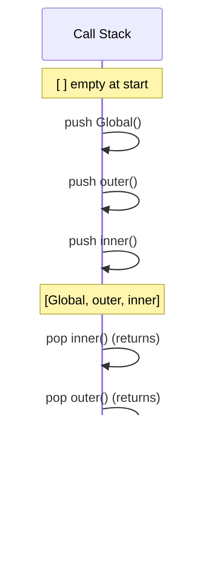
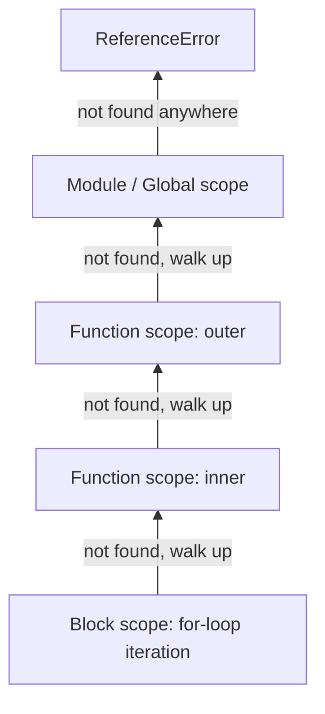

# Chapter 06: JavaScript Runtime — Execution Context, Scope & Closures

**Prerequisites:** Chapter 1 · **Difficulty:** Level B (JS / Browser)

> 🔗 **Continuing from Chapter 1:** You built a `useFocusTrap` hook using functions, event listeners, and callbacks without yet knowing *why* they behave the way they do. This chapter opens up the JS engine itself so you can explain, not just use, that code.

---

## 1. Learning Objectives

- **Explain** the two-phase lifecycle (Creation vs. Execution) of an Execution Context.
- **Trace** a multi-frame Call Stack for a nested function invocation, predicting exact push/pop order.
- **Analyze** lexical scope chains to determine variable resolution at any point in a program.
- **Construct** closures to implement private state without classes.
- **Diagnose** stack overflow and scope-related bugs by mentally simulating the engine.

---

## 2. Motivation

Every React hook, every debounce utility, every module pattern you will ever write in this course rests on closures. Engineers who don't understand execution context write bugs like "why does my loop variable always log the last value" (classic `var` closure bug), or ship memory leaks because a closure unintentionally retains a large DOM reference. Understanding this chapter is the difference between *using* JavaScript and *predicting* JavaScript — a critical skill once you're debugging a production incident under time pressure with no debugger attached, just log output and a mental model.

---

## 3. Core Theory

### 3.1 Execution Context: Creation vs. Execution

Every time a function is invoked (or the global program starts), the JS engine creates an **Execution Context** in two distinct phases:

1. **Creation Phase:**
   - The **Variable Environment** is set up: `var` declarations are hoisted and initialized to `undefined`; function declarations are hoisted with their full body already assigned.
   - The **Lexical Environment** (scope chain reference) is established, pointing to the outer environment where the function was *defined* (not called).
   - The `this` binding is determined based on the call-site (see Chapter 3).
2. **Execution Phase:**
   - Code runs top to bottom, assigning real values to previously hoisted variables and executing statements.

### 3.2 The Call Stack

The Call Stack is a LIFO (Last-In-First-Out) structure of Execution Contexts. Each function call **pushes** a new frame; each `return` (implicit or explicit) **pops** it. The Global Execution Context sits at the bottom for the life of the program.

Exceeding the engine's stack frame limit (deep unbounded recursion) throws `RangeError: Maximum call stack size exceeded` — a direct, observable consequence of this data structure.

### 3.3 Lexical Scope & the Scope Chain

JavaScript uses **lexical (static) scoping**: a function's accessible variables are determined by *where it is written in the source*, not by who calls it. When a variable is referenced, the engine walks the Scope Chain outward — current function scope → enclosing function scope(s) → module/global scope — stopping at the first match. This walk is a normal case; failing to find the identifier anywhere throws a `ReferenceError`.

### 3.4 Closures

A **closure** is the combination of a function and the lexical environment within which it was declared. Critically: **the environment is retained by reference, not by value**, even after the outer function has returned and would otherwise be garbage collected. This is what allows a function returned from another function to continue reading and mutating variables from its birth scope indefinitely.

---

## 4. Visual Diagrams

### 4.1 Call Stack Trace



### 4.2 Scope Chain Resolution



---

## 5. Step-by-Step Walkthrough: A Closure Counter

```js
function makeCounter() {
  let count = 0;                 // 1. lives in makeCounter's lexical env
  return function increment() {  // 2. increment is defined HERE, capturing that env
    count += 1;
    return count;
  };
}

const counterA = makeCounter();  // 3. makeCounter() runs, returns increment, its frame pops
counterA();                      // 4. returns 1 — env is NOT garbage collected, still referenced
counterA();                      // 5. returns 2 — same retained `count` variable
```

1. `makeCounter()` is called: an Execution Context is created, `count` is initialized to `0`.
2. The inner `increment` function is created; its `[[Environment]]` internal slot is set to `makeCounter`'s Lexical Environment.
3. `makeCounter()` returns; its own Execution Context is popped off the Call Stack — but because `increment` still references its Lexical Environment, the environment survives (closure keeps it alive).
4. Calling `counterA()` pushes a new Execution Context for `increment`, whose scope chain points directly at the surviving `makeCounter` environment — `count` is found there, mutated, and returned.
5. Each call to `counterA()` mutates the *same* retained `count` — this is the state-encapsulation mechanism used for private variables.

---

## 6. Internal Implementation

V8 does not naively keep every closed-over variable alive in a full environment object — a common performance myth. Instead, V8's optimizing compiler (TurboFan) performs **escape analysis** and allocates only the specific variables actually referenced by an inner function into a heap-allocated "context" object; everything else stays stack-allocated and is reclaimed immediately when the outer function returns. This is why closures in modern V8 are cheaper than they were in the days of naive interpreters — but it also means capturing large objects unnecessarily inside a closure (e.g., an entire event object when you only need one field) still forces heap retention of that whole object, which is a real, measurable memory cost in long-lived closures like module-level caches or event listeners that are never removed.

---

## 7. Code Examples

### 7.1 Minimal Example

```js
function outer() {
  const message = "hello";
  function inner() { return message; }
  return inner;
}
outer()(); // "hello"
```

### 7.2 Practical Example — Debounce Utility

```js
function debounce(fn, delayMs) {
  let timeoutId; // captured by the returned closure
  return function debounced(...args) {
    clearTimeout(timeoutId);
    timeoutId = setTimeout(() => fn.apply(this, args), delayMs);
  };
}

const debouncedSave = debounce(saveDocument, 300);
input.addEventListener("input", debouncedSave);
```

### 7.3 Production-Ready — Module-Pattern Private State (TypeScript)

```ts
// documentConfigStore.ts — encapsulated config with no exposed globals
export function createDocumentConfigStore(initial: Record<string, unknown>) {
  let config = { ...initial }; // private, inaccessible from outside this closure

  return {
    get<T>(key: string): T | undefined {
      return config[key] as T | undefined;
    },
    set(key: string, value: unknown): void {
      config = { ...config, [key]: value }; // immutable update, see Chapter 3
    },
    snapshot(): Readonly<Record<string, unknown>> {
      return Object.freeze({ ...config });
    },
  };
}

const store = createDocumentConfigStore({ theme: "dark" });
store.set("theme", "light");
// config itself is never accessible outside this module — true encapsulation
```

### 7.4 Anti-Pattern → Corrected: The Classic `var` Loop Bug

```js
// ❌ ANTI-PATTERN: all three timeouts log 3, because `var` is function-scoped,
// not block-scoped — by the time setTimeout fires, the loop has already finished
// and `i` is 3 for all three closures (they all share ONE binding).
for (var i = 0; i < 3; i++) {
  setTimeout(() => console.log(i), 100);
}
```

```js
// ✅ CORRECTED: `let` creates a NEW lexical binding of `i` per iteration,
// so each closure captures its own distinct value.
for (let i = 0; i < 3; i++) {
  setTimeout(() => console.log(i), 100);
}
// logs: 0, 1, 2
```

### 7.5 Additional Example — Memoization Using a Closure-Backed Cache

```js
function memoize(fn) {
  const cache = new Map(); // captured by the closure, private to this memoized fn
  return function memoized(...args) {
    const key = JSON.stringify(args);
    if (cache.has(key)) return cache.get(key);
    const result = fn(...args);
    cache.set(key, result);
    return result;
  };
}

const slowWordCount = (text) => text.split(/\s+/).length;
const fastWordCount = memoize(slowWordCount);

fastWordCount("hello world");  // computes, caches under key '["hello world"]'
fastWordCount("hello world");  // returns cached result instantly, function body never re-runs
```

The `cache` Map is only reachable through the returned `memoized` closure — exactly the private-state pattern from Section 3.4, applied to a real, practical performance optimization used throughout ScribeCollab's expensive parsing utilities.

---

## 8. Common Mistakes

| Level | Mistake |
|---|---|
| **Junior** | Confusing `var`'s function scope with `let`/`const`'s block scope, causing the classic loop-closure bug above. |
| **Mid-Level** | Creating a new closure inside a frequently-rendered React component (e.g., inline function props) without realizing each render creates a fresh closure and environment, breaking referential equality checks used by `React.memo`. |
| **Senior/Production** | Long-lived closures (e.g., global event listeners, module-level caches) unintentionally retaining large captured objects (like an entire API response) for the lifetime of the app, causing a slow memory leak that only shows up after hours of usage. |

---

## 9. Performance Analysis

- **Execution Context creation:** effectively O(1) per call in modern engines due to inline caching and hidden classes, but deep recursive call chains still cost O(depth) stack memory.
- **Closure allocation:** V8's escape analysis limits heap allocation to only the captured variables actually used by the inner function — not the whole outer scope — keeping typical closure overhead to a few dozen bytes per captured binding.
- **Memory retention risk:** any closure kept alive by a long-lived reference (global variable, uncanceled `setInterval`, or a still-mounted event listener) keeps its entire captured environment reachable, preventing garbage collection of everything referenced within it (see Chapter 3).

---

## 10. Security Inventory

- **Data leakage via captured scope:** closures used to build "private" API tokens are not truly secure against a determined attacker with DevTools access — anything running in the browser is inspectable. Never treat closures as a security boundary for secrets; that boundary must be server-side.
- **Prototype pollution vectors via loosely-scoped merges:** a closure-based deep-merge utility that doesn't guard against `__proto__` keys in untrusted input objects can allow prototype pollution attacks. Always validate/sanitize keys when merging external data.

---

## 11. Technology Comparisons

| Pattern | Closures (Module Pattern) | ES2022 Class Private Fields (`#field`) |
|---|---|---|
| **Encapsulation** | True lexical privacy, zero leakage | True runtime privacy enforced by engine |
| **Syntax overhead** | Function factory boilerplate | Cleaner class syntax |
| **Multiple instances** | Each call to factory creates a new closure scope | Each `new` creates a new instance naturally |
| **Tooling/debugging** | Harder to inspect in DevTools (no named class) | Easier to inspect — shows as class instance |
| **Best for** | Simple state machines, hooks, utility factories | Larger stateful objects with many private methods |

---

## 12. Engineering Decisions

For ScribeCollab's internal utilities (debounce, throttle, small state machines), we standardize on the **closure/module pattern** rather than classes: it composes better with React's functional model, avoids `this`-binding foot-guns (Chapter 3), and keeps bundle size minimal since there's no class machinery to transpile for older targets. Classes are reserved for cases requiring inheritance hierarchies or the ergonomics of `#private` fields with many methods — which this course intentionally minimizes given React's function-first idioms.

---

## 13. Exercises

**Easy:** Predict the console output of the `var` vs `let` loop example above without running it, and explain the scope-chain reason for the difference.

**Medium:** Implement a `createRateLimiter(maxCalls, windowMs)` factory using closures that returns a function which only allows `maxCalls` invocations within any rolling `windowMs` window, rejecting (returning `false`) calls beyond the limit.

**Hard:** A production incident report states: "the app's memory usage grows by ~2MB every time a user opens and closes the document search modal, and never comes back down." Given that the modal registers a `keydown` listener via a closure over the (large) in-memory document index for fuzzy search, write a root-cause analysis and a fix, explaining exactly which reference chain keeps the memory alive.

---

## 14. Capstone Integration Step

**ScribeCollab — Step 2:** Build the core `createDocumentConfigStore` (Section 7.3) into the workspace's settings module, using nested closures to keep the raw configuration object entirely private — no external module may mutate it except through the exposed `get`/`set`/`snapshot` API. Add a `createAutoSaveScheduler(saveFn, delayMs)` closure-based utility (based on the debounce pattern in 7.2) that will be wired into the editor's `onChange` handler in Chapter 4, once we cover the event loop mechanics that govern when the scheduled save actually fires.

---

## 🔜 Bridge to Chapter 3

Closures work by capturing *references* to variables in their birth scope — but what exactly gets captured when that variable holds an object versus a primitive? Chapter 3 answers that with the stack/heap model, and finally formalizes the `this` keyword that every closure and callback so far has silently relied on.

---

## 15. Supplementary Topics & Core Lecture Knowledge

The following topics from the course syllabus represent incremental lecture knowledge integrated into this chapter's systems scope:

| Line | Curriculum Topic | Technical Knowledge & Systems Context |
|---|---|---|
| 1 | **Creating React Projects** | Provides concrete context and implementation strategies for Creating React Projects, ensuring proper syntax alignment and optimal performance in React applications. |
| 2 | **Why Do You Need A Special Project Setup?** | Provides concrete context and implementation strategies for Why Do You Need A Special Project Setup?, ensuring proper syntax alignment and optimal performance in React applications. |
| 3 | **Module Introduction** | Provides concrete context and implementation strategies for Module Introduction, ensuring proper syntax alignment and optimal performance in React applications. |
| 4 | **Starting Project** | Provides concrete context and implementation strategies for Starting Project, ensuring proper syntax alignment and optimal performance in React applications. |
| 5 | **Adding JavaScript To A Page & How React Projects Differ** | Provides concrete context and implementation strategies for Adding JavaScript To A Page & How React Projects Differ, ensuring proper syntax alignment and optimal performance in React applications. |
| 6 | **React Projects Use a Build Process** | Provides concrete context and implementation strategies for React Projects Use a Build Process, ensuring proper syntax alignment and optimal performance in React applications. |
| 7 | **"import" & "export"** | ES Modules (ESM) use static analysis at build-time to establish tree dependency structures, enabling tree-shaking by dead-code elimination, unlike dynamic CommonJS `require()` calls. |
| 8 | **Revisiting Variables & Values** | Provides concrete context and implementation strategies for Revisiting Variables & Values, ensuring proper syntax alignment and optimal performance in React applications. |
| 9 | **Revisiting Operators** | Provides concrete context and implementation strategies for Revisiting Operators, ensuring proper syntax alignment and optimal performance in React applications. |
| 10 | **Revisiting Functions & Parameters** | Provides concrete context and implementation strategies for Revisiting Functions & Parameters, ensuring proper syntax alignment and optimal performance in React applications. |
| 11 | **Exercise: Working with Functions** | Provides concrete context and implementation strategies for Exercise: Working with Functions, ensuring proper syntax alignment and optimal performance in React applications. |
| 12 | **Arrow Functions** | Arrow functions do not bind their own `this`, `arguments`, `super`, or `new.target` contexts; instead, they lexically inherit them from the parent scope, preventing runtime binding bugs. |
| 13 | **More on the Arrow Function Syntax** | Arrow functions do not bind their own `this`, `arguments`, `super`, or `new.target` contexts; instead, they lexically inherit them from the parent scope, preventing runtime binding bugs. |
| 14 | **Revisiting Objects & Classes** | Provides concrete context and implementation strategies for Revisiting Objects & Classes, ensuring proper syntax alignment and optimal performance in React applications. |
| 15 | **Arrays & Array Methods like map()** | Array methods like `map()` return a new array structure by executing a callback on each element, preserving immutability which is vital for React state reconciliation. |
| 16 | **Exercise: Array Methods** | Array methods like `map()` return a new array structure by executing a callback on each element, preserving immutability which is vital for React state reconciliation. |
| 17 | **Destructuring** | Destructuring extracts fields from arrays or objects into distinct variables via pattern matching, compiling down to direct member access but improving code readability. |
| 18 | **Destructuring in Function Parameter Lists** | Destructuring extracts fields from arrays or objects into distinct variables via pattern matching, compiling down to direct member access but improving code readability. |
| 19 | **The Spread Operator** | The spread operator (`...`) performs a shallow copy of object/array properties. It copies values for primitives, but copies memory references for nested objects. |
| 20 | **Revisiting Control Structures** | Provides concrete context and implementation strategies for Revisiting Control Structures, ensuring proper syntax alignment and optimal performance in React applications. |
| 21 | **Manipulating the DOM - Not With React!** | Provides concrete context and implementation strategies for Manipulating the DOM - Not With React!, ensuring proper syntax alignment and optimal performance in React applications. |
| 22 | **Using Functions as Values** | Provides concrete context and implementation strategies for Using Functions as Values, ensuring proper syntax alignment and optimal performance in React applications. |
| 23 | **Defining Functions Inside Of Functions** | Provides concrete context and implementation strategies for Defining Functions Inside Of Functions, ensuring proper syntax alignment and optimal performance in React applications. |
| 24 | **Reference vs Primitive Values** | Primitive values are stored directly on the execution stack and compared by value, whereas references (objects/arrays) are stored in the heap and compared by their memory address pointers. |
| 25 | **Next-Gen JavaScript - Summary** | Provides concrete context and implementation strategies for Next-Gen JavaScript - Summary, ensuring proper syntax alignment and optimal performance in React applications. |
| 26 | **JS Array Functions** | Provides concrete context and implementation strategies for JS Array Functions, ensuring proper syntax alignment and optimal performance in React applications. |
| 27 | **Module Resources** | Provides concrete context and implementation strategies for Module Resources, ensuring proper syntax alignment and optimal performance in React applications. |
