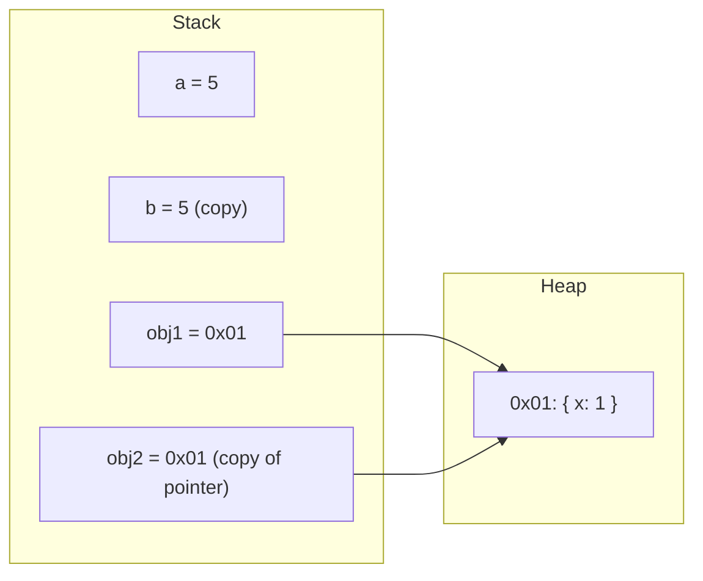
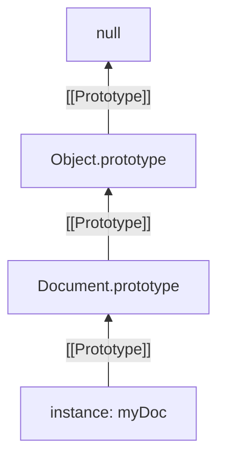
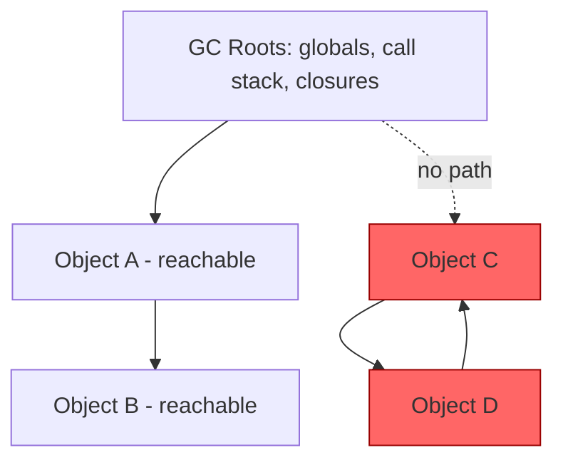

# Chapter 07: The JavaScript Memory Model & Object References

**Prerequisites:** Chapter 2 · **Difficulty:** Level B (JS / Browser)

> 🔗 **Continuing from Chapter 2:** Closures capture *bindings*, not values — but Chapter 2 deliberately deferred the question of what happens when the captured binding holds an object. This chapter answers that with the stack/heap model, and finally formalizes the `this` keyword that every closure and callback so far has silently relied on.

---

## 1. Learning Objectives

- **Differentiate** stack-allocated primitive values from heap-allocated reference values.
- **Predict** the outcome of assignment, mutation, and comparison operations across both value categories.
- **Explain** garbage collection reachability and the generational mark-and-sweep strategy used by V8.
- **Trace** prototype chain lookups for property/method resolution.
- **Diagnose** and correct incorrect `this` bindings across all four binding rules.

---

## 2. Motivation

"Why did mutating my copy also change the original?" is one of the most common bug reports from engineers who don't yet have an accurate mental model of JavaScript's memory model. In React specifically, this misunderstanding causes state mutations that silently break re-rendering (since React relies on reference-equality checks to detect changes) and immutability bugs that corrupt shared application state. Getting this right is not academic — it is the direct mechanical foundation for how `useState`, `useMemo`, and `React.memo` decide whether to re-render.

---

## 3. Core Theory

### 3.1 Stack vs. Heap

- **Primitives** (`string`, `number`, `boolean`, `null`, `undefined`, `symbol`, `bigint`) are stored **directly** in the variable's stack slot (or inline in an object/array's storage). They are **immutable** — any "modification" actually produces a brand-new value.
- **Reference types** (`object`, `array`, `function`) are allocated on the **heap**. The variable itself stores only a **pointer/reference** to that heap location, not the data itself.

### 3.2 Assignment Semantics

```js
let a = 5;
let b = a;    // b gets a COPY of the value 5
b = 10;       // a is still 5 — independent values

const obj1 = { x: 1 };
const obj2 = obj1;  // obj2 gets a COPY of the REFERENCE (pointer), not the object
obj2.x = 99;
console.log(obj1.x); // 99 — both variables point at the same heap object
```

This is the single most important behavioral rule in the language: **assignment always copies the value in the variable's slot** — for primitives that's the actual data; for objects, that's the pointer.

### 3.3 Garbage Collection

V8 uses a **generational** collector:

- **Young Generation (Scavenger):** small, fast collector for short-lived objects (most objects die young — the "generational hypothesis"). Uses a semi-space copying algorithm.
- **Old Generation (Mark-Sweep-Compact):** objects that survive multiple young-gen collections are "promoted" here. Uses a **reachability** algorithm: starting from GC "roots" (global object, active call stack variables, closures), the collector marks every object transitively reachable; anything unmarked is garbage and reclaimed.

**Reachability**, not reference *counting*, is the model — this is why circular references (`a.friend = b; b.friend = a;`) are still collectible once nothing external reaches either object, unlike naive reference-counting GCs which would leak them.

### 3.4 The Prototype Chain

Every JS object has an internal `[[Prototype]]` slot (accessible via `Object.getPrototypeOf()` or the legacy `__proto__` accessor). Property/method lookup that fails on the object itself walks up this chain until it finds a match or reaches `null`. `Object.create(proto)` lets you construct this chain explicitly; `class` syntax is sugar over the same mechanism, wiring a constructor function's `.prototype` object into each instance's `[[Prototype]]`.

**Method delegation in practice:** this is exactly how array methods work. `[1, 2, 3].map(...)` does not copy a `map` function onto every array instance — each array's `[[Prototype]]` points to the single shared `Array.prototype` object, which owns one `map` implementation. Property lookup walks the chain, finds `map` there, and invokes it with the array as `this`. This is also why monkey-patching `Array.prototype` makes a new method appear on *every* array in the running program instantly — they all delegate to the same shared object rather than owning their own copy.

### 3.5 Explicit context binding (this keyword)

Every JS object has an internal `[[Prototype]]` slot. `this` binding is resolved in precedence order:

1. **`new` binding:** `new Foo()` — `this` is the newly created object.
2. **Explicit binding:** `.call()`, `.apply()`, `.bind()` — `this` is whatever you pass in.
3. **Implicit binding:** `obj.method()` — `this` is `obj` (the object left of the dot at call time).
4. **Default binding:** a bare function call — `this` is `undefined` in strict mode (or the global object in sloppy mode).
5. **Arrow functions ignore all of the above** — they have no own `this`; they lexically inherit `this` from their enclosing scope at definition time, exactly like closures inherit variables.

**A concrete failure mode — losing `this` in event listeners:**

```js
class SaveButton {
  constructor(label) { this.label = label; }
  handleClick() { console.log(`Saving: ${this.label}`); } // relies on `this`
}

const btn = new SaveButton("My Document");
element.addEventListener("click", btn.handleClick);
// ❌ Passing the method itself detaches it from `btn`. When the browser
// later invokes it, it does so as a bare callback — implicit binding
// resolves `this` to the DOM element that fired the event, not `btn`.
// this.label is now undefined (or throws in strict class bodies).
```

```js
// ✅ Fix 1 — bind explicitly at registration time:
element.addEventListener("click", btn.handleClick.bind(btn));

// ✅ Fix 2 (preferred) — declare the method as an arrow-function class
// field, which lexically captures `this` at CONSTRUCTION time, so it
// stays bound to the instance no matter how it is later invoked:
class SaveButton {
  constructor(label) { this.label = label; }
  handleClick = () => console.log(`Saving: ${this.label}`);
}
```

This is precisely the mechanism referenced in this chapter's Security Inventory below: an unbound method passed as a callback silently rebinds `this` to whatever calls it, which is a genuine bug source whenever that method's logic depends on `this` for identity or permission checks.

---

## 4. Visual Diagrams

### 4.1 Stack vs. Heap Layout



### 4.2 Prototype Chain Lookup



### 4.3 GC Reachability


*Objects C and D reference each other but are unreachable from any GC root — they are collected despite the circular reference.*

---

## 5. Step-by-Step Walkthrough: `this` Resolution Trace

```js
const doc = {
  title: "Spec",
  print() { console.log(this.title); }
};

const printFn = doc.print;
printFn();          // Step A
doc.print();        // Step B
printFn.call(doc);  // Step C
const bound = printFn.bind(doc);
bound();            // Step D
```

- **Step A:** `printFn()` is a bare call — default binding applies. `this` is `undefined` (strict mode) → `this.title` throws `TypeError`.
- **Step B:** `doc.print()` — implicit binding; `this` is `doc` at call time because the function is invoked *as a property of* `doc`. Logs `"Spec"`.
- **Step C:** `.call(doc)` — explicit binding overrides everything; `this` is forced to `doc`. Logs `"Spec"`.
- **Step D:** `.bind(doc)` permanently locks `this` to `doc` for all future invocations of `bound`, regardless of how `bound` is later called. Logs `"Spec"`.

---

## 6. Internal Implementation

V8 does not store object properties in a generic hash map by default — it uses **Hidden Classes (Maps)** and **inline caching**. When you create objects with the same shape (same properties added in the same order), V8 assigns them the same hidden class, allowing property access to be compiled down to a fixed memory offset lookup instead of a dictionary lookup — dramatically faster. This is a direct, practical reason to **initialize all object properties in the constructor/factory in a consistent order** rather than adding properties dynamically later — doing so forces "hidden class transitions" that degrade this optimization and can measurably slow down hot code paths operating over large collections of similarly-shaped objects (e.g., thousands of document nodes in ScribeCollab's editor tree).

---

## 7. Code Examples

### 7.1 Minimal Example — Value vs. Reference

```js
function mutate(arr) { arr.push(4); }
const list = [1, 2, 3];
mutate(list);
console.log(list); // [1, 2, 3, 4] — same heap array, mutated in place
```

### 7.2 Practical Example — Immutable Update Pattern

```js
function addTag(doc, tag) {
  // ✅ returns a NEW object; original `doc` reference is untouched
  return { ...doc, tags: [...doc.tags, tag] };
}
```

### 7.3 Production-Ready — Deep, Structural-Sharing Clone for Nested Document Patches

```ts
type DocNode = { id: string; children?: DocNode[]; text?: string };

// Structural sharing: only clones the path from root to the changed node,
// leaving all sibling subtrees referentially identical (critical for
// React.memo / selector-based re-render skipping downstream).
function patchNode(root: DocNode, targetId: string, patch: Partial<DocNode>): DocNode {
  if (root.id === targetId) {
    return { ...root, ...patch };
  }
  if (!root.children) return root;

  let didChange = false;
  const newChildren = root.children.map((child) => {
    const updated = patchNode(child, targetId, patch);
    if (updated !== child) didChange = true;
    return updated;
  });

  return didChange ? { ...root, children: newChildren } : root;
}
```

### 7.4 Anti-Pattern → Corrected

```js
// ❌ ANTI-PATTERN: mutating nested state directly — React won't detect
// this as a change because the top-level object reference is unchanged.
function toggleDone(state, id) {
  const item = state.items.find((i) => i.id === id);
  item.done = !item.done; // mutates in place!
  return state; // same reference — React.memo / useMemo will skip re-render
}
```

```js
// ✅ CORRECTED: produces new references at every level that changed.
function toggleDone(state, id) {
  return {
    ...state,
    items: state.items.map((i) =>
      i.id === id ? { ...i, done: !i.done } : i
    ),
  };
}
```

### 7.5 Additional Example — `WeakMap` for Private Metadata Without Memory Leaks

```js
const nodeMetadata = new WeakMap(); // keys are held WEAKLY — no leak risk

function attachRenderStats(domNode, stats) {
  nodeMetadata.set(domNode, stats);
}

function getRenderStats(domNode) {
  return nodeMetadata.get(domNode);
}

// When `domNode` is removed from the DOM and has no other references,
// the garbage collector can reclaim it AND its metadata entry together —
// a regular Map would keep `domNode` alive forever as a key, leaking memory.
```

This directly extends Section 3.3's reachability model: a `WeakMap`'s keys do not count as strong references for garbage collection purposes, making it the correct tool whenever you need to associate extra data with an object (like a DOM node or a document instance) without accidentally preventing that object from ever being collected.

---

## 8. Common Mistakes

| Level | Mistake |
|---|---|
| **Junior** | Assuming `const obj = {...}` makes the object immutable — `const` only prevents *reassigning the variable*, not mutating the object it points to. |
| **Mid-Level** | Losing `this` by destructuring a method off an object (`const { print } = doc`) and calling it standalone, hitting default binding instead of implicit binding. |
| **Senior/Production** | Passing large objects through many layers of spread-based "immutable updates" (`{...a, ...b, ...c}`) in a hot path, unaware of the O(n) copy cost per spread — causing measurable frame drops in large document trees without structural sharing (see 7.3). |

---

## 9. Performance Analysis

- **Primitive copy:** O(1), fixed-size stack copy.
- **Object reference copy:** O(1) — only the pointer is copied, regardless of object size.
- **Naive deep clone (`JSON.parse(JSON.stringify(x))`):** O(n) in total node count, plus loses functions, `undefined`, `Date`, and `Map`/`Set` fidelity — avoid in production.
- **Structural-sharing patch (7.3):** O(depth) rather than O(n) for the whole tree, since only the path to the modified node is copied — critical for large nested documents like ScribeCollab's Markdown AST.
- **GC pause cost:** young-generation scavenges are sub-millisecond typically; old-generation mark-sweep-compact passes can cause noticeable (multi-millisecond to tens of milliseconds) main-thread pauses under heavy object churn — a direct motivation for structural sharing to minimize garbage generation.

---

## 10. Security Inventory

- **Prototype pollution:** merging untrusted JSON into an object without guarding `__proto__`, `constructor`, or `prototype` keys can let an attacker inject properties onto `Object.prototype` itself, affecting the entire application. Always use `Object.create(null)` or a validated allowlist when deep-merging external data.
- **Shared mutable reference leaks:** returning an internal reference type directly from an API (instead of a frozen copy) allows external callers to mutate "private" internal state. Use `Object.freeze()` at module boundaries for read-only exposed data.
- **`this` hijacking in callback registration:** passing an unbound method as an event handler or callback (`element.addEventListener('click', obj.handler)`) silently loses the intended `this`, which can cause security-relevant logic (like a permission check keyed on `this.currentUser`) to fail open or throw unexpectedly. Always bind or use arrow functions for such handlers.

---

## 11. Technology Comparisons

| Approach | Manual Spread/Object.freeze | Immutable Libraries (Immer, Immutable.js) |
|---|---|---|
| **Mental model** | Explicit, matches raw JS semantics | Draft-based ("mutate a draft, get an immutable result") |
| **Boilerplate for deep updates** | High — nested spreads get unreadable fast | Low — Immer's `produce()` reads like normal mutation |
| **Performance for large trees** | Manual structural sharing required (7.3) | Built-in structural sharing via internal diffing |
| **Bundle size cost** | None (native JS) | Immer ~3KB gzip; Immutable.js larger with its own data structures |
| **Best for** | Small/medium state shapes | Deeply nested state (e.g., ScribeCollab's document tree in Zustand) |

---

## 12. Engineering Decisions

For ScribeCollab's document tree, deeply nested patches are frequent (every keystroke can touch a node several levels deep). **Decision: use Immer inside the Zustand store (state-management chapter)** rather than hand-rolled structural sharing in application code, because it eliminates an entire class of "forgot to spread a level" bugs while preserving the same referential-equality benefits — but every intern must understand and be able to hand-implement the pattern in 7.3 first, because Immer's guarantees only make sense once you understand what it's automating.

---

## 13. Exercises

**Easy:** Given `const a = { count: 1 }; const b = a; b.count = 2;`, what is `a.count`? Explain using the stack/heap model.

**Medium:** Implement `shallowEqual(objA, objB)` from scratch (no libraries) that returns `true` only if both objects have the same keys and each corresponding value is reference-or-primitive equal — the same check React.memo performs internally.

**Hard:** Your team reports that a document with 10,000 nested nodes causes visible input lag when editing a single deeply-nested text node, using a naive `JSON.parse(JSON.stringify(doc))` clone-and-patch approach on every keystroke. Write an analysis of the time complexity of the current approach, propose the structural-sharing fix (referencing 7.3), and estimate the complexity improvement in Big-O terms.

---

## 14. Capstone Integration Step

**ScribeCollab — Step 3:** Replace any naive full-document cloning in the workspace's patch pipeline with the structural-sharing `patchNode` function from Section 7.3. Add unit tests asserting that unrelated sibling subtrees retain **referential identity** (`===`) after a patch — this referential-identity guarantee is what will allow `React.memo`-wrapped node components (Chapter 9) to skip re-rendering untouched parts of the document tree.

---

## 🔜 Bridge to Chapter 4

You now know that a closure can retain a heap-allocated object indefinitely as long as something reachable still points to it. Chapter 4 shows you *where* those long-lived references usually come from in real applications: callbacks registered with `setTimeout`, event listeners, and Promises — i.e., the asynchronous runtime. Understanding reachability here is what lets you correctly reason about memory leaks in async code next.
