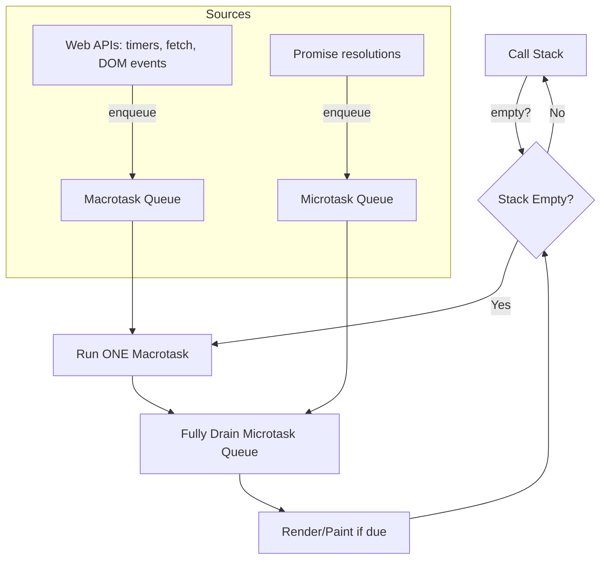
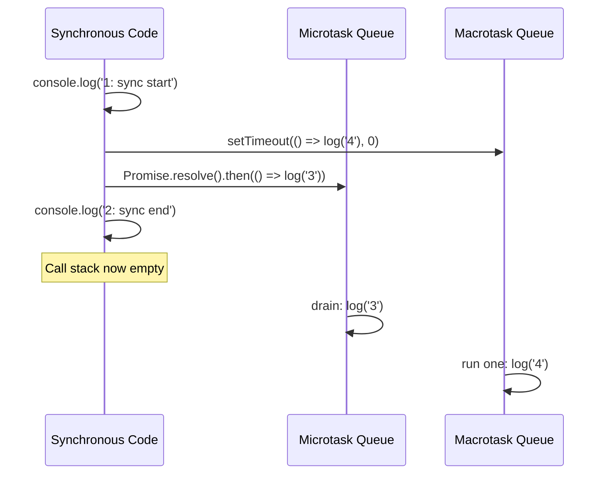

# Chapter 08: JavaScript Asynchronous Runtime & The Event Loop

**Prerequisites:** Chapter 3 · **Difficulty:** Level C (JS / Browser)

> 🔗 **Continuing from Chapter 3:** Every `setTimeout` callback and `.then()` handler is a closure (Chapter 2) capturing references to heap objects (Chapter 3). This chapter explains the scheduling system — the event loop — that decides *when* those captured closures actually run.

---

## 1. Learning Objectives

- **Explain** why JavaScript's execution engine is single-threaded and how asynchrony is achieved without multithreading the language itself.
- **Differentiate** the Macrotask Queue from the Microtask Queue and their distinct priority rules.
- **Trace**, instruction by instruction, an Event Loop pass involving mixed `setTimeout`, `Promise`, and synchronous code.
- **Predict** console output ordering for arbitrarily nested async code.
- **Design** a scheduling strategy that keeps a hot UI thread responsive under background I/O load.

---

## 2. Motivation

"Why did my `Promise.then()` run before my `setTimeout(fn, 0)`?" is one of the most-asked JavaScript interview questions for a reason: it exposes whether an engineer actually understands the runtime or has only memorized async/await syntax. In production, misunderstanding the event loop causes real incidents: UI freezes from long synchronous blocks starving the render pipeline, race conditions from assuming promise resolution order that doesn't hold, and "my `useEffect` cleanup ran in the wrong order" bugs in React applications. This is foundational systems knowledge that determines whether you can reason about *any* asynchronous code — not just Promises, but sockets, timers, and streams.

---

## 3. Core Theory

### 3.1 The Single-Thread Constraint

The JavaScript **execution engine** (V8's main thread) runs one instruction stream at a time — there is exactly one Call Stack. This is a deliberate design choice: it avoids the entire class of race-condition/lock bugs inherent to shared-memory multithreading, at the cost of requiring a cooperative scheduling model for anything that takes time (network I/O, timers, file access).

### 3.2 Where Asynchrony Actually Lives

JavaScript itself has no built-in concept of "wait." Instead, the **host environment** (the browser, via the Web APIs the spec doesn't own — or Node.js, via libuv) provides background threads that perform the actual waiting: DNS resolution, socket I/O, timer countdowns. When that background work finishes, the environment doesn't run your callback immediately — it **enqueues** it onto one of two queues for the Event Loop to pick up when the main thread is free.

### 3.3 Macrotask Queue vs. Microtask Queue

| Queue | Contains | Priority |
|---|---|---|
| **Macrotask Queue** | `setTimeout`, `setInterval` callbacks, I/O callbacks, UI rendering steps, `MessageChannel` | Lower — one task processed per Event Loop tick |
| **Microtask Queue** | `Promise.then/catch/finally` callbacks, `async/await` resumptions, `queueMicrotask()`, `MutationObserver` | Higher — **fully drained** before the next macrotask or render |

### 3.4 The Event Loop Algorithm (per tick)

1. Check if the Call Stack is empty.
2. If empty: execute **one** macrotask from the queue (if any).
3. After that macrotask completes, **fully drain the entire Microtask Queue** — including any new microtasks scheduled by previous microtasks (this is why an infinite chain of `.then()` calls can starve macrotasks entirely).
4. If it's time to paint a frame (browser context), perform rendering steps.
5. Return to step 1.

This ordering is exactly why microtasks always run "sooner" than macrotasks scheduled around the same time, regardless of `setTimeout(..., 0)`.

---

## 4. Visual Diagrams

### 4.1 Event Loop Structure



### 4.2 Execution Order Trace


Output order: `1: sync start`, `2: sync end`, `3`, `4` — synchronous code always finishes first, then ALL microtasks, then macrotasks one at a time.

---

## 5. Step-by-Step Walkthrough

```js
console.log("A");

setTimeout(() => console.log("B"), 0);

Promise.resolve()
  .then(() => console.log("C"))
  .then(() => console.log("D"));

console.log("E");
```

1. `console.log("A")` runs synchronously on the Call Stack → prints `A`.
2. `setTimeout` hands its callback to the Web API timer thread; after ~0ms it's enqueued onto the **Macrotask Queue**. The engine does not wait — it moves on immediately.
3. `Promise.resolve()` is already resolved; `.then(() => log("C"))` schedules its callback onto the **Microtask Queue** immediately.
4. `console.log("E")` runs synchronously → prints `E`.
5. The synchronous script finishes; the Call Stack is now empty.
6. The Event Loop drains the Microtask Queue: runs `log("C")` → prints `C`; this schedules the next `.then(() => log("D"))` onto the microtask queue (since chaining creates new microtasks) → runs immediately since we keep draining → prints `D`.
7. Microtask Queue is now empty. The Event Loop picks **one** macrotask: the `setTimeout` callback → prints `B`.

**Final output: `A`, `E`, `C`, `D`, `B`.**

---

## 6. Internal Implementation

Browsers implement the Event Loop as specified by the **HTML Living Standard** (not the ECMAScript spec — the language spec only defines the Microtask/Job Queue; the browser layers macrotasks and rendering on top). Chromium's implementation ties rendering steps directly into this loop: after each macrotask, if the frame deadline (typically targeting 60fps, ~16.6ms per frame) has arrived, the browser performs `requestAnimationFrame` callbacks, style/layout recalculation, and paint — all *before* returning to pick up the next macrotask. This is precisely why a long synchronous macrotask (e.g., a 200ms `for` loop) blocks not just other JS, but also blocks the browser from painting anything, producing the classic "frozen UI" symptom, and why React's Concurrent Mode exists — to break long render work into chunks that yield back to this loop between units, allowing painting and input handling to interleave.

---

## 7. Code Examples

### 7.1 Minimal Example

```js
console.log(1);
setTimeout(() => console.log(2));
Promise.resolve().then(() => console.log(3));
console.log(4);
// Output: 1, 4, 3, 2
```

### 7.2 Practical Example — Cancelable Debounced Save Using Macrotasks

```js
function createAutoSave(saveFn, delayMs) {
  let timerId = null;
  return {
    schedule(payload) {
      if (timerId) clearTimeout(timerId);
      timerId = setTimeout(() => saveFn(payload), delayMs); // macrotask, yields to UI
    },
    cancel() {
      if (timerId) clearTimeout(timerId);
    },
  };
}
```

### 7.3 Production-Ready — Yielding Large Synchronous Work Back to the Event Loop

```ts
// Splits a large synchronous workload into chunks, yielding control back to
// the event loop between chunks so input and rendering aren't starved.
async function processInChunks<T>(
  items: T[],
  handler: (item: T) => void,
  chunkSize = 200
): Promise<void> {
  for (let i = 0; i < items.length; i += chunkSize) {
    const chunk = items.slice(i, i + chunkSize);
    chunk.forEach(handler);

    // Yield to the macrotask queue so the browser can paint / handle input
    await new Promise((resolve) => setTimeout(resolve, 0));
  }
}

// Usage: re-indexing 50,000 document search tokens without freezing the UI
await processInChunks(searchTokens, indexToken, 500);
```

### 7.4 Anti-Pattern → Corrected

```js
// ❌ ANTI-PATTERN: assumes setTimeout(fn, 0) runs "immediately" and before
// promise-based logic — this ordering assumption is WRONG and leads to
// race conditions when mixed with microtask-based state updates.
let ready = false;
setTimeout(() => { ready = true; }, 0);
Promise.resolve().then(() => {
  console.log("ready is:", ready); // prints "ready is: false" — surprising to many!
});
```

```js
// ✅ CORRECTED: make the dependency explicit instead of relying on
// implicit queue-ordering assumptions.
function whenReady() {
  return new Promise((resolve) => setTimeout(resolve, 0));
}
async function run() {
  await whenReady();
  console.log("ready is: true, guaranteed by explicit await");
}
```

### 7.5 Additional Example — Tracing `async`/`await` Back to Microtasks

```js
async function loadDoc(id) {
  console.log("A");
  const doc = await fetchDoc(id); // suspends here; resumption is a MICROTASK
  console.log("B", doc.title);
  return doc;
}

console.log("start");
loadDoc("doc-1");
console.log("end");
// Output order: start, A, end, B <title>
```

`await` is syntactic sugar over `.then()` — everything after the `await` is effectively wrapped in a microtask callback registered on `fetchDoc`'s promise, which is why `"end"` (synchronous code after the call) logs *before* `"B"`, even though `loadDoc` was called first. This is the exact same microtask-queue mechanism from Section 3.3, just written without visible `.then()` chains.

---

## 8. Common Mistakes

| Level | Mistake |
|---|---|
| **Junior** | Assuming `setTimeout(fn, 0)` executes synchronously or "right away" — it always yields at least one full event loop tick, and runs *after* all pending microtasks. |
| **Mid-Level** | Creating an infinite or very long microtask chain (e.g., recursive `.then()` without ever yielding to a macrotask) that starves the browser's rendering step entirely, freezing the UI despite "using Promises." |
| **Senior/Production** | Racing multiple `fetch()` calls without `AbortController` cancellation (Chapter 5), causing a stale, slower response to resolve *after* a newer one and incorrectly overwrite fresher UI state — a classic distributed-async race condition. |

---

## 9. Performance Analysis

- **Macrotask scheduling overhead:** `setTimeout` has a browser-enforced minimum delay (commonly 4ms after nesting depth 5+), meaning tight polling loops via `setTimeout(fn, 0)` are throttled — use `requestAnimationFrame` or `MessageChannel` for tighter timing needs.
- **Microtask starvation risk:** each microtask that schedules another microtask keeps the loop in the "drain" phase (see 4.1), which is O(number of chained microtasks) before any rendering or macrotask can proceed — an unbounded or accidentally recursive `.then()` chain can visibly freeze a page despite technically being "asynchronous" code.
- **Chunking trade-off (7.3):** yielding via `setTimeout(resolve, 0)` between chunks costs a minimum ~4ms delay per chunk boundary — tune `chunkSize` to balance total processing time against UI responsiveness; too small a chunk size adds excessive yield overhead, too large reintroduces jank.

---

## 10. Security Inventory

- **Timing side-channels:** precise `setTimeout`/`performance.now()` based timing can, in rare cases, be used to infer cross-origin information (timing attacks) — browsers mitigate this by reducing timer precision, but application code should never rely on sub-millisecond timing for security-relevant logic.
- **Unbounded background retries:** a `setInterval`-based polling/retry loop without exponential backoff or cancellation, left running after a component unmounts or a user logs out, is both a resource-exhaustion risk and can continue sending authenticated requests using stale credentials — always clear timers in cleanup paths (Chapter 9).
- **Race-condition data corruption:** unguarded concurrent async writes (two `fetch` PATCH requests to the same document racing) can silently corrupt collaborative state if the server doesn't enforce request ordering or optimistic concurrency tokens — the event loop model makes this possible on the client; the fix must exist on both client (cancellation) and server (versioning).

---

## 11. Technology Comparisons

| Mechanism | `setTimeout`/Macrotasks | Promises/Microtasks | Web Workers (true parallelism) |
|---|---|---|---|
| **Execution thread** | Main thread, deferred | Main thread, deferred but higher priority | Separate OS thread |
| **Blocks rendering if abused** | Yes, if callback is long | Yes — worse, since queue must fully drain before render | No — isolated thread |
| **Use case** | Timers, deferred UI updates, yielding chunks | Async I/O results, chaining dependent async steps | CPU-heavy work (Chapter 5): parsing, diffing, indexing |
| **Ordering guarantees** | One per tick, FIFO | Fully drained per tick, FIFO | None relative to main thread — must message-pass |

---

## 12. Engineering Decisions

ScribeCollab's live-save scheduler must never block keystroke rendering. **Decision: implement the auto-save scheduler as a macrotask-based debounce (7.2)** rather than a microtask-chained approach, specifically because macrotasks naturally yield to the browser's render step between executions, while a long microtask chain would not. For the heavier document re-indexing work needed for full-text search, we escalate further in Chapter 5 to an actual Web Worker, since even chunked macrotask yielding (7.3) still competes with the main thread for CPU time — true parallelism is needed once payload size crosses a few thousand nodes.

---

## 13. Exercises

**Easy:** Given `console.log('a'); setTimeout(() => console.log('b')); Promise.resolve().then(() => console.log('c')); console.log('d');` — write the exact output order and justify each position using the event loop model.

**Medium:** Implement `throttleWithTrailingCall(fn, intervalMs)` using `setTimeout` such that `fn` is invoked immediately on the first call, ignores calls during the interval, but guarantees one trailing invocation with the *last* received arguments if any calls occurred during the throttled window.

**Hard:** ScribeCollab reports intermittent UI freezes of ~300-500ms whenever a user pastes a very large Markdown document (50,000+ lines) that must be tokenized and rendered. Diagnose why this freezes the UI despite the paste handler being wrapped in an `async` function, and propose a fix using the chunking pattern from Section 7.3, including how you'd measure success using the Performance panel.

---

## 14. Capstone Integration Step

**ScribeCollab — Step 4:** Implement the live-saver queuing scheduler using the macrotask-based `createAutoSave` pattern (7.2), wiring it to the editor's keystroke handler built in Chapter 2. Add the `processInChunks` utility (7.3) to the document paste-import pipeline so pasting large Markdown documents tokenizes in yield-friendly chunks instead of freezing the editor. Verify in Chrome DevTools' Performance panel that no single task exceeds ~50ms during a large paste.

---

## 🔜 Bridge to Chapter 5

The event loop explains *when* a callback runs, but not *where* the underlying asynchronous work comes from — timers, network requests, and DOM mutations are all produced by browser Web APIs sitting outside the JS engine. Chapter 5 catalogs those APIs directly: DOM observers, storage, and the Fetch/Streams pipeline that feed the very macrotask and microtask queues you just learned to trace, closing out Phase 1's runtime fundamentals.
