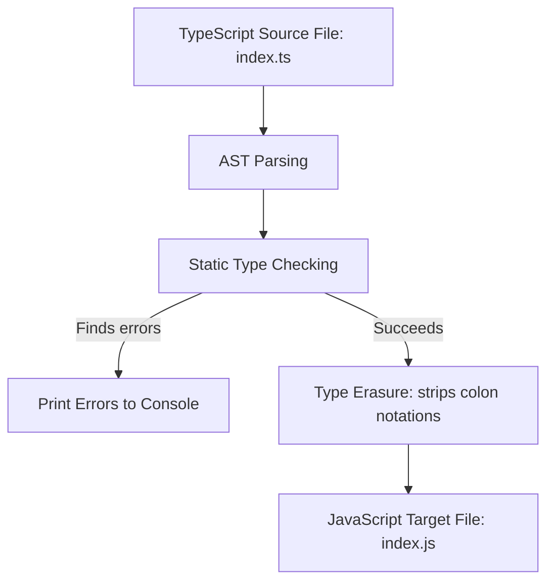

# Chapter 09: TypeScript — Environment Scaffolding & Compiler Architecture

**Prerequisites:** Phase 3 Complete · **Difficulty:** Level A (TS)

> 🔗 **Welcome to the TypeScript Phase:** In Phase 3, we examined V8's execution heap contexts and runtime async event loop schedules. In this chapter, we add type safety to our development workflow. We will scaffold a TypeScript configuration from scratch, set up build targets, configure the compiler, and verify the compiled output. This setup is the foundation for all the type checks and runtime validations we will write in the chapters that follow.

---

## 1. Learning Objectives

- **Scaffold** a TypeScript configuration sandbox using project package environments.
- **Configure** compiler rules in `tsconfig.json`, including strict checks, output targets, and folder mapping settings.
- **Execute** compilation tasks directly using the `tsc` compiler CLI.
- **Explain** type erasure and verify the output JavaScript files.
- **Integrate** automated build execution scripts inside package workflows.

---

## 2. Motivation

In production codebases, static type safety is your first line of defense. Without a compiler configuration, a team of engineers will introduce type typos that crash applications at runtime. 

To use TypeScript effectively, you must understand how to configure its compiler (`tsconfig.json`) and how to compile and run your code. This chapter shows you how to set up your build pipeline and understand how TypeScript transforms your code.

---

## 3. Core Theory

### 3.1 The TypeScript Build Lifecycle
Unlike languages that compile to binary executable files, TypeScript is a transpiled language. It compiles TypeScript (`.ts`) files into JavaScript (`.js`) files.

```
       TYPESCRIPT COMPILATION LIFECYCLE
+------------------+                   +--------------------+
|  Source File     |                   |  Type Checker      |
|  (UserProps.ts)  | ──► [ AST Check ] ├──► (Emits Errors)  |
+------------------+                   +---------┬----------+
                                                 │
                                                 ▼ (Strips all types)
                                       +--------------------+
                                       |  JS Emitter        |
                                       |  (UserProps.js)    |
                                       +--------------------+
```

The compilation lifecycle includes:
1.  **Parsing:** `tsc` reads source code files and builds an Abstract Syntax Tree (AST).
2.  **Type Checking:** The compiler checks the AST against defined type rules. If it finds type mismatches, it outputs errors to the console, but still emits JS output unless configured otherwise.
3.  **Transpilation (Emit):** The compiler strips all type annotations, interface declarations, and generic signatures, emitting clean JavaScript code.

### 3.2 Strict Compiler Directives
Our compilation pipeline enforces code quality using these key flags in `tsconfig.json`:
*   `strict: true`: Enables strict type checking rules.
*   `noImplicitAny: true`: Throws error on expressions and declarations with an implied `any` type.
*   `strictNullChecks: true`: Ensures that `null` and `undefined` are handled explicitly, preventing runtime null reference errors.

---

## 4. Visual Diagrams

### 4.1 Transpilation & Type Erasure Pipeline


---

## 5. Step-by-Step Walkthrough: Scaffolding from Scratch

Let’s walk through setting up a strict TypeScript compilation workspace:

1.  **Initialize Directory:** Create a sandbox directory and initialize a package.
    ```bash
    mkdir ts-scaffold-sandbox
    cd ts-scaffold-sandbox
    pnpm init
    ```
2.  **Install TypeScript:** Install TypeScript as a development dependency.
    ```bash
    pnpm add -D typescript @types/node
    ```
3.  **Initialize Configuration:** Generate the default `tsconfig.json` template.
    ```bash
    pnpm tsc --init
    ```
4.  **Edit tsconfig.json:** Configure strict rules and map source and build folders.
    ```json
    {
      "compilerOptions": {
        "target": "ES2022",
        "module": "NodeNext",
        "moduleResolution": "NodeNext",
        "rootDir": "./src",
        "outDir": "./dist",
        "strict": true,
        "noImplicitAny": true,
        "strictNullChecks": true,
        "skipLibCheck": true,
        "forceConsistentCasingInFileNames": true
      },
      "include": ["src/**/*"]
    }
    ```
5.  **Create Source Folder:** Create a `src/` directory and add `index.ts`.
    ```bash
    mkdir src
    ```

---

## 6. Internal Implementation: Emitting Type Symbols

Under the hood, when `tsc` runs, it does not use a virtual machine to execute code. It behaves as a source-to-source compiler. During type checking, it builds a **Symbol Table** mapping all identifiers to their type definitions. 

Once the type checker resolves all symbols without errors, the **Emitter** walks the AST and writes out JavaScript files. During this phase, TypeScript removes all type information, meaning that **types do not exist at runtime**.

---

## 7. Code Examples

### 7.1 Script Setup
Configure package scripts inside `package.json` to automate builds:
```json
{
  "name": "ts-scaffold-sandbox",
  "version": "1.0.0",
  "scripts": {
    "build": "tsc",
    "start": "node dist/index.js",
    "dev": "tsc --watch"
  }
}
```

### 7.2 Practical Example: Type Safety in Action
Create a source file `src/index.ts`:
```typescript
// src/index.ts

interface User {
    id: number;
    email: string;
    role: "admin" | "user";
}

function sendWelcomeEmail(user: User) {
    console.log(`Sending email to ${user.email} (Role: ${user.role})`);
}

const activeUser: User = {
    id: 101,
    email: "alice@collab.io",
    role: "admin"
};

sendWelcomeEmail(activeUser);
```
Run the build script:
```bash
pnpm run build
```
This compiles the code and creates `dist/index.js`. Run the compiled JavaScript:
```bash
pnpm run start
```

### 7.3 Production-Ready Pattern: Handling External API Payloads
Since TypeScript types do not exist at runtime, we must validate dynamic external data (such as API payloads) before using it.
```typescript
// src/api-validator.ts

// 1. Compile-time type contract
interface DocumentPayload {
    title: string;
    content: string;
    version: number;
}

// 2. Runtime validation guard
function isValidPayload(data: any): data is DocumentPayload {
    return (
        data &&
        typeof data.title === "string" &&
        typeof data.content === "string" &&
        typeof data.version === "number"
    );
}

function handleIncomingData(rawJson: string) {
    const parsedData = JSON.parse(rawJson);

    if (isValidPayload(parsedData)) {
        // Compiler guarantees parsedData fits the DocumentPayload shape within this block
        console.log(`Loading document: ${parsedData.title} (v${parsedData.version})`);
    } else {
        console.error("Validation failed: Payload structure mismatch.");
    }
}

// Test cases
handleIncomingData('{"title": "Intro to V8", "content": "JS is fast.", "version": 1}');
```
Compile and run the code:
```bash
pnpm run build
node dist/api-validator.js
```

### 7.4 Incorrect Anti-Pattern vs. Corrected Implementation

#### Incorrect: Using Any to Avoid Compiler Checks
```typescript
// src/anti-pattern.ts
function deleteUser(payload: any) {
    // any disables type checks, leaving the code vulnerable to runtime crashes
    console.log(`Deleting ID: ${payload.id.toLowerCase()}`);
}
```

#### Corrected: Enforce Strong Type Checks and Safe Access
```typescript
// src/corrected.ts
interface DeleteUserPayload {
    id: string;
}

function deleteUser(payload: DeleteUserPayload) {
    console.log(`Deleting ID: ${payload.id.toLowerCase()}`);
}
```

### 7.5 Additional Example: Dynamic Compiler Watch Setup
To automate compilation during development, configure the watcher:
```bash
# Starts the watcher, compiling files automatically as they are saved
pnpm run dev
```

---

## 8. Common Mistakes

### Junior Developer: Forgetting outDir or rootDir Mapping
Writing source files in root directories without folder mapping config leads to a cluttered repository where source files and compiled build files are mixed together.

### Mid-Level Developer: Using 'as' Assertions to Bypass Errors
Using type assertions (like `as string`) to force the compiler to accept a type without validating the value at runtime, leading to silent failures.
```typescript
const apiData = {} as User; // Forces compiler to accept empty object as User type!
```

### Senior Developer: Loose Compiler Checks
Disabling strict checks (such as `strictNullChecks: false`) to avoid resolving type compatibility warnings, leaving the codebase vulnerable to runtime crashes.

---

## 9. Performance Analysis

### 9.1 Build Overhead
TypeScript type checks add processing overhead to your build step. Larger applications can see slower compile times, but this does not affect the execution performance of the compiled JavaScript.

### 9.2 Build Optimization Table
| Strategy | Command | Impact | Build Speed |
|---|---|---|---|
| Full Compile | `tsc` | Re-compiles all source files | Slow |
| Watch Mode | `tsc --watch` | Re-compiles only changed files | Fast |
| Incremental Build | `tsc --incremental` | Caches compile steps locally | Extremely Fast |

---

## 10. Security Inventory

- **Bypassing Compile Checks with Any:** Using `any` type annotations bypasses type checks, leaving the application vulnerable to runtime type errors. Always use strict types or the `unknown` type when handling untrusted data.
- **Compiler Options Shielding:** Keep `skipLibCheck` enabled to speed up builds, but ensure that `tsconfig.json` preserves strict assertions on local modules.

---

## 11. Technology Comparisons

### Comparing Package Managers
| Metric | `npm` | `pnpm` | `yarn (classic)` |
|---|---|---|---|
| **Storage Model** | Duplicate dependencies | Global content-addressable store | Duplicate dependencies |
| **Install Speed** | Slow | Extremely Fast | Fast |
| **Workspace Support**| Good | Excellent (native monorepo) | Limited |

---

## 12. Engineering Decisions

### Should we run tsc in production environments?
*   **Compile locally / in CI:** Always run compile checks locally and in your CI/CD pipelines to verify code correctness before deployment.
*   **Run raw JS in production:** Do not ship TypeScript files to production. Ship only the compiled, minified JavaScript files to the production environment.

---

## 13. Exercises

### Easy
Initialize a TS configuration in a new directory, configure `strict: true`, create a file that attempts to assign `null` to a `string` variable, and verify that the compiler blocks the build.

### Medium
Create a function `parseScore(input: unknown): number` that verifies if the input is a valid number at runtime using type guards, returning a fallback score of 0 if validation fails.

### Hard
Write a custom script that loads a JSON config file, compiles it, and validates its schema using a custom type guard function before applying properties to a target system.

---

## 14. Capstone Integration Step

In the *ScribeCollab* workspace, we must configure strict compiler boundaries before adding TypeScript types to documents.
Create `src/workspace.ts` to manage workspace documents:

```typescript
// src/workspace.ts

export interface Document {
    id: string;
    title: string;
    content: string;
}

export class WorkspaceManager {
    private documents: Document[] = [];

    addDocument(doc: Document) {
        this.documents.push(doc);
        console.log(`Document [${doc.title}] added successfully to workspace.`);
    }

    getDocuments(): readonly Document[] {
        return this.documents;
    }
}
```
Compile the workspace code to ensure the compilation pipeline works cleanly.

---

## 15. Supplementary Topics & Core Lecture Knowledge

### Lockfile Mechanics & Dependency Resolution
When you run `pnpm install`, pnpm creates a `pnpm-lock.yaml` file. This lockfile records the exact version of every package installed, ensuring consistent builds across all development machines and CI/CD pipelines. This is a critical practice for production applications to avoid deployment failures caused by minor version updates in dependencies.
