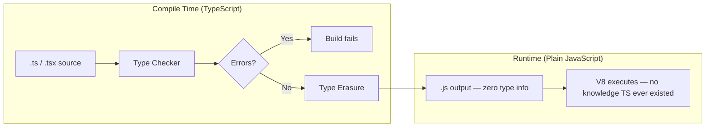
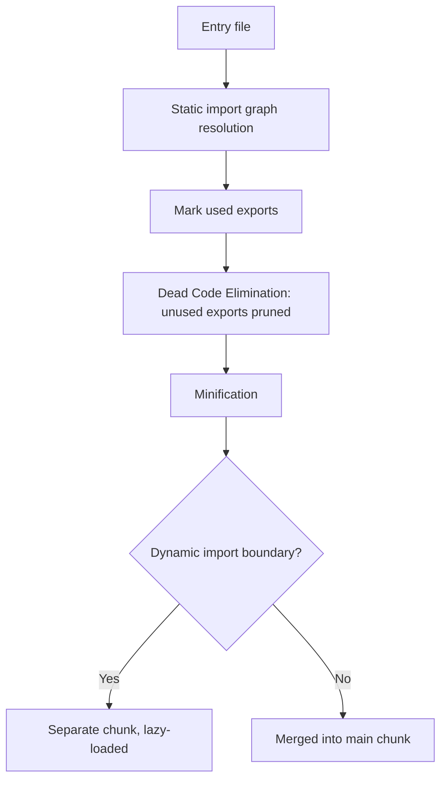

# Chapter 10: TypeScript Foundations & Modern Build Tooling

**Prerequisites:** Phase 1 Complete · **Difficulty:** Level A (TS / Build)

> 🔗 **Continuing from Phase 1:** Every JavaScript behavior from Chapters 1–5 (closures, references, the async runtime, Web APIs) applies identically in TypeScript — TS adds a compile-time layer on top; it does not change runtime semantics. This chapter introduces that layer plus the build tooling used for the rest of the course.

---

## 1. Learning Objectives

- **Explain** what TypeScript is, and precisely what problem class it solves (and doesn't).
- **Configure** a modern package/build pipeline using pnpm and a Vite/Turbopack-class bundler.
- **Apply** tree shaking and code splitting concepts to reason about bundle size.
- **Annotate** functions, variables, and collections with correct, minimal type coverage.
- **Differentiate** `any`, `unknown`, `never`, and `void`, and choose correctly among them.

---

## 2. Motivation

Runtime `TypeError: cannot read property 'x' of undefined` crashes are the single most common production JS bug class — and the majority are catchable **before deployment** by static analysis. TypeScript doesn't make your code faster or magically correct; it moves an entire category of bugs from "discovered by a user in production at 2am" to "discovered by your editor in 200ms." Separately, the build tooling section matters because interns frequently treat bundlers as black boxes — until they ship a 2MB bundle because they imported a whole library for one function, tank Lighthouse scores, and can't explain why.

---

## 3. Core Theory

### 3.1 What TypeScript Actually Is

TypeScript is a **structural, gradual type system** that compiles to plain JavaScript. Its checks exist **only at compile time** — there is no runtime type-checking overhead, and (critically, previewed here, expanded in Chapter 7) **no runtime protection** against data whose shape TypeScript merely *assumed* was correct (e.g., an untyped API response).

### 3.2 Package Management

`package.json` declares dependency ranges (semver: `^1.2.3` allows minor/patch upgrades, `~1.2.3` allows only patch). The lockfile (`package-lock.json`, `pnpm-lock.yaml`) pins the **exact resolved tree** for reproducible installs. **pnpm** differs from npm by using a single global content-addressable store and symlinking packages into a `node_modules` structure that strictly enforces the declared dependency graph (no "phantom dependencies" — accessing a package you didn't explicitly declare, which npm's flat `node_modules` historically allowed).

### 3.3 Bundlers: Why They Exist

Browsers didn't have fast, native ES module resolution across hundreds of files for years, and even now, bundling remains valuable for: minification, tree shaking, code splitting, and transforming non-JS assets (CSS, images) into a deployable graph. **Webpack** pioneered the general-purpose "everything is a module" graph-based bundling model. **Vite** flips dev-mode strategy: it serves native ESM directly to the browser during development (near-instant startup) and only bundles for production via Rollup. **Turbopack** (used by Next.js) is a Rust-based incremental bundler designed for function-level caching, aiming for far faster rebuilds on large monorepos than JS-based bundlers.

### 3.4 Tree Shaking & Code Splitting

- **Tree shaking** relies on ES Module's **static** `import`/`export` structure (unlike CommonJS's dynamic `require`) to statically determine which exports are actually used, allowing the bundler to eliminate (Dead Code Elimination) anything unreferenced.
- **Code splitting** breaks a single bundle into multiple chunks loaded on demand (e.g., via dynamic `import()`), so users pay the download cost only for code their current route/interaction actually needs.

### 3.5 The Type System Basics

| Concept | Meaning |
|---|---|
| **Type annotation** | Explicit developer-declared type: `function add(a: number, b: number): number` |
| **Type inference** | Compiler deduces type without annotation: `let x = 5` → inferred `number` |
| **Union type** | `string \| number` — value is one of several types |
| **Intersection type** | `A & B` — value must satisfy all combined members |
| **Literal type** | `"pending" \| "done"` — value restricted to exact literal values |
| **Type assertion (`as`)** | Developer override telling the compiler "trust me" — bypasses checking, a common safety hole |

### 3.6 The Escape Hatches: `any`, `unknown`, `never`, `void`

- **`any`** disables type checking entirely for that value — it is contagious (spreads to anything it touches) and is the single biggest way developers silently defeat TypeScript's entire purpose.
- **`unknown`** is the type-safe counterpart: you can assign anything to it, but you cannot *use* it until you've narrowed it (via `typeof`, `instanceof`, or a type guard) — forcing verification before use.
- **`never`** represents values that can never occur — used for exhaustiveness checks (a `switch` that has handled every union member) and functions that always throw or infinite-loop.
- **`void`** represents the absence of a meaningful return value (not the same as `undefined` as a value, though closely related).

---

## 4. Visual Diagrams

### 4.1 Compile-Time vs. Runtime Boundary



### 4.2 Bundling & Tree Shaking Pipeline



---

## 5. Step-by-Step Walkthrough: Setting Up a Strict pnpm + Vite + TypeScript Project

1. `pnpm init` — creates `package.json`.
2. `pnpm add -D typescript vite @types/node` — dev dependencies only; TS and the bundler never ship to the browser.
3. `pnpm exec tsc --init` — generates `tsconfig.json`; immediately set `"strict": true` (bundles `noImplicitAny`, `strictNullChecks`, and six other flags — non-negotiable for production code).
4. Configure `vite.config.ts` with the React plugin (or Next.js's own pipeline, Phase 4).
5. Run `pnpm dev` — Vite serves native ESM with on-demand transform-per-file, so startup time is near-constant regardless of project size (unlike bundle-everything-upfront dev servers).
6. Run `pnpm build` — Rollup-based production bundling: tree shaking, minification, and chunk splitting occur here, not in dev mode.

---

## 6. Internal Implementation

The TypeScript compiler (`tsc`) is fundamentally a **checker**, not primarily a transpiler in modern pipelines — most production setups (Vite, Next.js, esbuild, SWC) use a separate, much faster transpiler that **strips types without checking them**, running full type-checking as a parallel, non-blocking step (or in CI). This is why your dev server can hot-reload in milliseconds even on large codebases: it isn't running the (comparatively slow, semantically thorough) TypeScript type checker on every keystroke — it's doing a much simpler syntax-level type-strip. This is also *exactly* why it's possible to ship code with type errors if you don't separately enforce `tsc --noEmit` in CI — the dev/build transpiler literally does not check types by default in these fast pipelines.

---

## 7. Code Examples

### 7.1 Minimal Example — Type Annotations

```ts
function add(a: number, b: number): number {
  return a + b;
}
```

### 7.2 Practical Example — Union Types & Narrowing

```ts
type SaveStatus = "idle" | "saving" | "saved" | "error";

function describeStatus(status: SaveStatus): string {
  switch (status) {
    case "idle": return "No changes";
    case "saving": return "Saving…";
    case "saved": return "All changes saved";
    case "error": return "Failed to save";
  }
}
```

### 7.3 Production-Ready — Strict `tsconfig.json` for a pnpm Monorepo Package

```json
{
  "compilerOptions": {
    "target": "ES2022",
    "module": "ESNext",
    "moduleResolution": "Bundler",
    "strict": true,
    "noUncheckedIndexedAccess": true,
    "exactOptionalPropertyTypes": true,
    "noImplicitOverride": true,
    "isolatedModules": true,
    "skipLibCheck": true,
    "declaration": true,
    "declarationMap": true
  },
  "include": ["src"]
}
```

### 7.4 Anti-Pattern → Corrected

```ts
// ❌ ANTI-PATTERN: `any` disables all safety, and silently propagates
// through every function it touches — the compiler is now blind here.
function parseApiResponse(json: any) {
  return json.data.items.map((i: any) => i.title);
}
```

```ts
// ✅ CORRECTED: use `unknown` at the untrusted boundary and narrow explicitly
// (full runtime validation with Zod arrives in Chapter 7).
function parseApiResponse(json: unknown): string[] {
  if (
    typeof json === "object" && json !== null && "data" in json &&
    typeof (json as { data: unknown }).data === "object"
  ) {
    const data = (json as { data: { items?: { title: string }[] } }).data;
    return data.items?.map((i) => i.title) ?? [];
  }
  throw new Error("Invalid API response shape");
}
```

### 7.5 Additional Example — Function Overloads and Tuple Types

```ts
// Tuple types: fixed-length, fixed-type arrays — useful for coordinate-like data
type CursorPosition = [line: number, column: number];
const pos: CursorPosition = [12, 4];

// Function overloads: multiple call signatures for the same implementation
function createId(prefix: string): string;
function createId(prefix: string, numeric: true): number;
function createId(prefix: string, numeric?: true): string | number {
  const id = `${prefix}-${Date.now()}`;
  return numeric ? Date.now() : id;
}

createId("doc");        // typed as string
createId("doc", true);  // typed as number
```

Overload signatures let callers get a *precise* return type based on the arguments they pass, rather than a broad `string | number` union at every call site — the implementation signature (last one) is never directly visible to callers, only used internally to satisfy all declared overloads.

---

## 8. Common Mistakes

| Level | Mistake |
|---|---|
| **Junior** | Reaching for `any` the moment the compiler complains, instead of pausing to model the actual shape or using `unknown`. |
| **Mid-Level** | Importing an entire utility library (`import _ from "lodash"`) for one function, defeating tree shaking because CommonJS-style default imports of large libraries often can't be statically analyzed for unused-export elimination — should use `import { debounce } from "lodash-es"` or per-function packages. |
| **Senior/Production** | Shipping a monorepo without `"skipLibCheck": true` and consistent `tsconfig` composite project references, causing CI type-check times to balloon as the codebase grows because every package re-checks all of its dependencies' `.d.ts` files. |

---

## 9. Performance Analysis

- **Type checking cost:** does not affect runtime performance at all (types are fully erased) — the cost is entirely at build/CI time, and scales with project size and `tsconfig` strictness settings.
- **Tree shaking impact:** a well-tree-shaken bundle can be 30-70% smaller than an equivalent CommonJS bundle for the same dependency set, directly improving Largest Contentful Paint (LCP) on cold loads.
- **Vite dev-server cold start:** O(1) relative to project size (serves ESM on demand) vs. traditional bundle-then-serve dev servers which are O(n) in module count — this is the primary reason large teams migrated off Webpack-dev-server-class tooling.

---

## 10. Security Inventory

- **`any` as a security hole:** disabling type checks on data crossing a trust boundary (API responses, `localStorage` reads, URL params) means the compiler cannot help you catch a missing null check or unexpected shape that could lead to a crash or, worse, an injection vector downstream.
- **Supply-chain risk in dependencies:** every `pnpm add` pulls transitive dependencies you did not directly vet — use lockfiles, `pnpm audit`, and minimize dependency count, especially for anything handling user input or auth.
- **Build-time secret leakage:** bundlers can accidentally inline environment variables into client bundles if naming conventions (`NEXT_PUBLIC_`, `VITE_`) aren't respected — anything without the public prefix must never be referenced from client-side code (expanded in Phase 4).

---

## 11. Technology Comparisons

| Tool | npm | pnpm | Vite | Turbopack |
|---|---|---|---|---|
| **Install strategy** | Flat node_modules, phantom deps possible | Content-addressable store, strict deps | N/A (bundler, not package manager) | N/A (bundler) |
| **Disk usage** | Duplicated per project | Shared global store, hard-linked | N/A | N/A |
| **Dev server strategy** | N/A | N/A | Native ESM, on-demand transform | Rust-based incremental, function-level cache |
| **Best for** | Legacy compatibility | Monorepos, disk-conscious CI | Fast SPA/library dev | Next.js large-scale apps |

---

## 12. Engineering Decisions

ScribeCollab is structured as a **pnpm monorepo** (`apps/web`, `packages/ui`, `packages/document-core`) specifically because pnpm's strict dependency resolution prevents a common monorepo failure mode: a package accidentally working locally because it "borrowed" a phantom dependency hoisted by a sibling package, then breaking in a clean CI install. `tsconfig.json` is set to maximal strictness from day one — retrofitting `strict: true` onto a large existing codebase later is dramatically more expensive than starting strict, given how quickly implicit-`any` and null-unsafety accumulate.

---

## 13. Exercises

**Easy:** Explain the difference between `any` and `unknown` with a concrete example where using `any` would let a bug through that `unknown` would catch.

**Medium:** Write a strictly-typed `groupBy<T, K extends string | number>(items: T[], keyFn: (item: T) => K): Record<K, T[]>` utility function with correct generic constraints and no `any`.

**Hard:** Your team's Vite bundle for ScribeCollab has grown to 1.8MB gzipped. Using the concepts of tree shaking and code splitting, write an investigation plan (what tools you'd use, what you'd look for) and three concrete remediation strategies, ranked by expected impact vs. implementation effort.

---

## 14. Capstone Integration Step

**ScribeCollab — Step 6:** Initialize the compile pipeline as a pnpm monorepo (`apps/web` for the Next.js app, `packages/document-core` for shared types/utilities). Configure the strict `tsconfig.json` from Section 7.3 at the repo root, extended by each package. Define the initial strict types for a Markdown document segment (`DocSegment`, `DocNode` types from Chapter 3's structural sharing work), with zero `any` usage anywhere in `packages/document-core`.

---

## 🔜 Bridge to Chapter 7

Basic type annotations catch simple mistakes, but they can't yet express relationships between types (e.g., "the return type of this function, extracted automatically") or protect you against data whose shape you merely assumed. Chapter 7 covers the advanced type-level tools for the former, and Zod for the latter — both required before Phase 3 introduces React's generic-heavy hook APIs.

---

## 15. Supplementary Topics & Core Lecture Knowledge

The following topics from the course syllabus represent incremental lecture knowledge integrated into this chapter's systems scope:

| Line | Curriculum Topic | Technical Knowledge & Systems Context |
|---|---|---|
| 603 | **Module Introduction** | Provides concrete context and implementation strategies for Module Introduction, ensuring proper syntax alignment and optimal performance in React applications. |
| 604 | **What & Why?** | Provides concrete context and implementation strategies for What & Why?, ensuring proper syntax alignment and optimal performance in React applications. |
| 605 | **Installing & Using TypeScript** | TypeScript extends JavaScript by adding compile-time static type-checking, compiling down to clean JS with type annotations fully stripped by compiler flags. |
| 606 | **Exploring the Base Types** | Provides concrete context and implementation strategies for Exploring the Base Types, ensuring proper syntax alignment and optimal performance in React applications. |
| 607 | **Working with Array & Object Types** | Provides concrete context and implementation strategies for Working with Array & Object Types, ensuring proper syntax alignment and optimal performance in React applications. |
| 608 | **Understanding Type Inference** | Provides concrete context and implementation strategies for Understanding Type Inference, ensuring proper syntax alignment and optimal performance in React applications. |
| 609 | **Using Union Types** | Union types allow a value to be one of several types, resolving runtime conditional parameters while narrowing types using guards like `typeof` or discriminated fields. |
| 610 | **Understanding Type Aliases** | Provides concrete context and implementation strategies for Understanding Type Aliases, ensuring proper syntax alignment and optimal performance in React applications. |
| 611 | **Functions & Function Types** | Provides concrete context and implementation strategies for Functions & Function Types, ensuring proper syntax alignment and optimal performance in React applications. |
| 612 | **Diving Into Generics** | Generics parameterize types, allowing components and utilities to accept type inputs dynamically while preserving strong compile-time type safety. |
| 613 | **A Closer Look At Generics** | Generics parameterize types, allowing components and utilities to accept type inputs dynamically while preserving strong compile-time type safety. |
