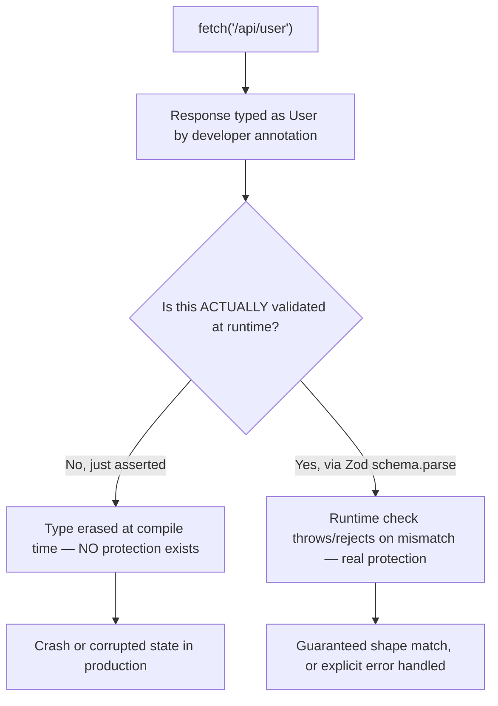
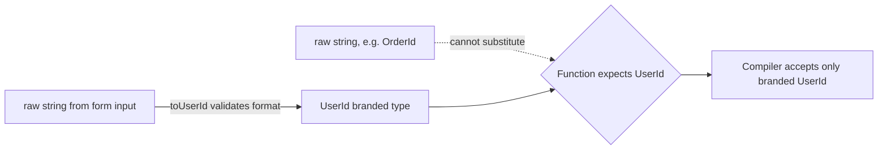

# Chapter 11: Advanced TypeScript & Runtime Validation

**Prerequisites:** Chapter 6 · **Difficulty:** Level C (TS)

> 🔗 **Continuing from Chapter 6:** You can now annotate and infer basic types. This chapter builds the advanced type-level toolkit (mapped, conditional, branded types) and — critically — the runtime validation layer that basic types alone cannot provide, closing the gap between compile-time confidence and runtime reality.

---

## 1. Learning Objectives

- **Explain** type erasure and articulate precisely why compile-time types cannot protect against untrusted runtime data.
- **Construct** mapped, conditional, and template literal types to model complex domain shapes.
- **Apply** `infer` to extract nested types automatically from generic structures.
- **Design** branded types to enforce nominal validity guarantees on primitive values.
- **Implement** runtime validation boundaries using Zod, bridging compile-time and runtime safety.

---

## 2. Motivation

The single most dangerous TypeScript misconception among mid-level engineers is: *"it's typed, so it's safe."* TypeScript types are **erased entirely** at compile time — an API response typed as `User` is, at runtime, just whatever JSON actually arrived, unchecked. Production incidents caused by this gap are common: a backend adds a nullable field, the frontend's stale type definition says it's always present, and the app crashes on `undefined.someMethod()` despite "being fully typed." This chapter is about building a genuine trust boundary — not just decorative types — using advanced type-level programming plus runtime schema validation.

---

## 3. Core Theory

### 3.1 Type Erasure

After compilation, **zero** trace of TypeScript's type annotations exists in the output `.js`. `interface`, `type`, generics, and type assertions all vanish. This means: **any function receiving external data (network, storage, user input, third-party libraries without types) is only as safe as the runtime checks you actually write** — the type system is a development-time contract, not a runtime guard.

### 3.2 Meta-Types: `keyof` and `typeof`

- `keyof T` produces a union of `T`'s property names as string/number literal types.
- `typeof value` (in type position) extracts the *type* of an existing runtime value/variable — useful for deriving types from constants without duplicating them.

```ts
const ROLES = { admin: "admin", editor: "editor", viewer: "viewer" } as const;
type Role = typeof ROLES[keyof typeof ROLES]; // "admin" | "editor" | "viewer"
```

### 3.3 Mapped Types, Indexed Access, Template Literals

- **Indexed Access Types:** `Person["name"]` extracts the type of a specific property.
- **Mapped Types:** `{ [K in keyof T]: NewType }` transforms every property of `T` uniformly (this is how `Partial<T>`, `Readonly<T>` are implemented internally).
- **Template Literal Types:** `` `on${Capitalize<K>}` `` builds new string-literal types programmatically — commonly used to type event-handler prop names derived from event names.

### 3.4 Conditional Types & `infer`

`T extends U ? X : Y` branches at the type level. `infer` inside a conditional type captures a sub-part of a matched structure into a new type variable — this is how `ReturnType<T>` and `Awaited<T>` are implemented:

```ts
type MyReturnType<T> = T extends (...args: any[]) => infer R ? R : never;
```

**Distributive Conditional Types:** when the checked type is a *naked* type parameter and you pass a union, the conditional distributes over each union member individually — `type ToArray<T> = T extends any ? T[] : never` applied to `string | number` yields `string[] | number[]`, not `(string | number)[]`.

### 3.5 Branded (Nominal) Types

TypeScript's type system is **structural** by default — any object with matching shape is interchangeable, even if conceptually distinct (a `UserId` and an `OrderId`, both `string`, are freely swappable). **Branding** attaches a unique, uninstantiable compile-time tag to force explicit construction:

```ts
type UserId = string & { readonly __brand: "UserId" };
function toUserId(raw: string): UserId {
  if (!raw.startsWith("usr_")) throw new Error("Invalid UserId format");
  return raw as UserId;
}
```

Now a plain `string` cannot be passed where `UserId` is expected without going through `toUserId`, which is exactly where you enforce your actual runtime validation rule.

### 3.6 Runtime Validation with Zod

Zod schemas are the runtime counterpart to compile-time types — a single schema definition provides both a **runtime validator** (`schema.parse(data)`, throwing/returning a `Result` on invalid data) and, via `z.infer<typeof schema>`, the **exact matching TypeScript type**, eliminating drift between your validation logic and your type definitions.

---

## 4. Visual Diagrams

### 4.1 Compile-Time Type vs. Runtime Reality



### 4.2 Branded Type Enforcement Flow



---

## 5. Step-by-Step Walkthrough: `infer`-Based Extraction

```ts
type UnwrapPromise<T> = T extends Promise<infer U> ? U : T;

async function fetchDoc(): Promise<{ id: string; title: string }> {
  /* ... */
}

type Doc = UnwrapPromise<ReturnType<typeof fetchDoc>>;
// Step 1: ReturnType<typeof fetchDoc> = Promise<{ id: string; title: string }>
// Step 2: UnwrapPromise checks: does Promise<{...}> extend Promise<infer U>? Yes.
// Step 3: U is captured as { id: string; title: string }
// Result: Doc = { id: string; title: string }
```

1. `typeof fetchDoc` extracts the function's type signature.
2. `ReturnType<...>` (itself an `infer`-based conditional type) extracts the return type: `Promise<{...}>`.
3. `UnwrapPromise` pattern-matches against `Promise<infer U>`; since it matches, `U` is bound to the wrapped type and returned — otherwise the original type passes through unchanged.

---

## 6. Internal Implementation

The TypeScript checker evaluates conditional and mapped types via a **structural, recursive unification algorithm** operating entirely within the compiler's type-checking phase — this is genuinely a small logic-programming engine embedded in `tsc`, which is why deeply recursive conditional types (common in "type gymnastics" utility libraries) can measurably slow down `tsc` and IDE responsiveness on large codebases; the compiler must re-derive these types on every dependent checked expression, and pathological recursive depth can even hit the compiler's built-in recursion limits (`Type instantiation is excessively deep`). This is a genuine engineering trade-off: powerful type-level programming has a real compile-time cost, not just a runtime-zero cost — "it's just types" doesn't mean it's free everywhere.

---

## 7. Code Examples

### 7.1 Minimal Example — `keyof` and Mapped Type

```ts
interface Doc { id: string; title: string; archived: boolean; }
type DocFlags = { [K in keyof Doc]: boolean }; // { id: boolean; title: boolean; archived: boolean }
```

### 7.2 Practical Example — Zod Schema Deriving a Type

```ts
import { z } from "zod";

const DocSchema = z.object({
  id: z.string(),
  title: z.string().min(1),
  tags: z.array(z.string()).default([]),
});

type Doc = z.infer<typeof DocSchema>; // exact match, zero drift risk

function parseIncomingDoc(raw: unknown): Doc {
  return DocSchema.parse(raw); // throws ZodError on mismatch — real runtime protection
}
```

### 7.3 Production-Ready — Recursive Mapped Type for Document History Tracking

```ts
// Deeply marks every nested property as optional AND tracks a version tag,
// modeling a diffable "patch" representation of a nested document tree.
type DeepPatch<T> = T extends object
  ? { [K in keyof T]?: T[K] extends object ? DeepPatch<T[K]> : T[K] }
  : T;

interface DocNode {
  id: string;
  text: string;
  children?: DocNode[];
}

// A valid partial, recursively-optional patch describing only what changed:
const patch: DeepPatch<DocNode> = {
  children: [{ text: "edited line" }], // id omitted — untouched
};
```

### 7.4 Anti-Pattern → Corrected

```ts
// ❌ ANTI-PATTERN: `as User` type assertion bypasses ALL runtime validation —
// this compiles cleanly but provides zero actual safety against a malformed
// or malicious API response.
async function getUser(id: string) {
  const res = await fetch(`/api/users/${id}`);
  return (await res.json()) as User; // pure wishful thinking, no verification
}
```

```ts
// ✅ CORRECTED: Zod schema validates the actual shape at the trust boundary;
// the inferred type is derived from the SAME source of truth as the check.
const UserSchema = z.object({ id: z.string(), name: z.string(), email: z.string().email() });
type User = z.infer<typeof UserSchema>;

async function getUser(id: string): Promise<User> {
  const res = await fetch(`/api/users/${id}`);
  return UserSchema.parse(await res.json()); // throws with a clear error if malformed
}
```

### 7.5 Additional Example — Discriminated Unions with Exhaustiveness Checking

```ts
type SyncEvent =
  | { type: "connected" }
  | { type: "patch"; nodeId: string; patch: Partial<DocNode> }
  | { type: "disconnected"; reason: string };

function handleSyncEvent(event: SyncEvent) {
  switch (event.type) {
    case "connected": return console.log("Connected");
    case "patch": return applyPatch(event.nodeId, event.patch);
    case "disconnected": return console.warn("Disconnected:", event.reason);
    default:
      // If a new SyncEvent variant is added later and NOT handled above,
      // `event` here is not `never`, and this line fails to COMPILE —
      // catching the missing case at build time, not at runtime.
      const _exhaustive: never = event;
      return _exhaustive;
  }
}
```

The discriminant field (`type`) lets TypeScript narrow `event`'s type inside each `case` automatically (Section 3.2's `keyof`/narrowing principles applied to unions), and the `never`-typed exhaustiveness check turns "forgot to handle a new event type" from a silent runtime gap into a compile-time build failure — a direct, practical payoff of Section 3.4's conditional-type theory.

---

## 8. Common Mistakes

| Level | Mistake |
|---|---|
| **Junior** | Believing `as SomeType` "converts" data to that type at runtime — it performs no conversion or check whatsoever; it's purely a compiler instruction to stop complaining. |
| **Mid-Level** | Writing duplicate `interface` definitions by hand that are meant to mirror a Zod schema, letting the two drift out of sync over time instead of deriving the type via `z.infer`. |
| **Senior/Production** | Overusing deeply recursive conditional "type gymnastics" utilities across a large codebase, causing IDE slowdowns and `tsc` build times to balloon, without measuring whether the added type precision is worth the compile-time cost. |

---

## 9. Performance Analysis

- **Runtime cost of types:** exactly zero — all TS constructs in this chapter vanish at compile time.
- **Zod validation cost:** O(n) relative to the size of the validated payload structure — for very large documents validated on every network message (e.g., ScribeCollab's real-time sync), consider validating only deltas/patches rather than full-document payloads on every update.
- **Compiler cost of advanced types:** deep recursive conditional/mapped types increase `tsc` checking time non-linearly in pathological cases; profile with `tsc --extendedDiagnostics` if build times regress after introducing complex utility types.

---

## 10. Security Inventory

- **Type assertions as a false sense of security:** any `as X` on data crossing a trust boundary (network, storage, `postMessage`, URL params) is a genuine security-relevant gap if that data influences authorization, rendering, or database queries downstream — always replace with Zod (or equivalent) validation at every trust boundary.
- **Branded types for security-sensitive primitives:** using branded types for values like `SanitizedHtml` or `ValidatedUserId` makes it a **compile error** to accidentally pass raw, unvalidated input into a function expecting pre-validated data — turning a whole class of "forgot to sanitize" bugs into build failures instead of runtime vulnerabilities.
- **Zod schema drift from backend contracts:** if frontend Zod schemas aren't generated from or contract-tested against the actual backend API schema (e.g., OpenAPI), silent contract drift can still let malformed-but-schema-passing data through — pair runtime validation with contract testing in CI for critical paths.

---

## 11. Technology Comparisons

| Runtime Validation Library | Zod | Yup | io-ts |
|---|---|---|---|
| **TS-first design** | Yes — schema is the type source of truth via `z.infer` | Partial — types often written separately | Yes, but steeper functional-programming learning curve |
| **Bundle size** | Small-moderate | Moderate | Small |
| **Ecosystem integration** | Excellent (React Hook Form, tRPC, Next.js Server Actions) | Historically strong with Formik | Niche, FP-oriented codebases |
| **Error message ergonomics** | Good, customizable | Good | Requires more manual formatting |

---

## 12. Engineering Decisions

ScribeCollab standardizes on **Zod at every network and storage boundary** — Server Action inputs, `fetch` responses, IndexedDB reads — with zero tolerance for bare `as Type` assertions on external data in code review. Branded types are reserved for high-value security/domain primitives (`UserId`, `DocumentId`, `SanitizedMarkdown`) rather than applied indiscriminately, because over-branding common primitives adds friction disproportionate to the safety gained for low-risk internal values.

---

## 13. Exercises

**Easy:** Explain, with a concrete failing example, why `const user = data as User` does not actually guarantee `user` matches the `User` shape at runtime.

**Medium:** Write a Zod schema for a `DocumentPermission` object (`{ userId: string; role: "owner" | "editor" | "viewer"; grantedAt: string }`) and derive its TypeScript type via `z.infer`. Add a branded `DocumentId` type and a `toDocumentId` validator function.

**Hard:** Design (in types + a short explanation, no need for full implementation) a `DeepReadonly<T>` recursive mapped type that makes every nested property of a deeply nested object type read-only, and explain one scenario in ScribeCollab's document tree where this type would catch a bug at compile time that plain `Readonly<T>` (shallow) would miss.

---

## 14. Capstone Integration Step

**ScribeCollab — Step 7:** Extend `packages/document-core`'s types using the recursive `DeepPatch<T>` pattern (7.3) to represent document history diffs. Write Zod schemas for every payload crossing the network boundary (document patches, permission grants, presence updates) with types derived exclusively via `z.infer` — no hand-duplicated interfaces. Introduce branded `DocumentId` and `UserId` types and enforce their use throughout the document-core package, eliminating all remaining `as` assertions from Chapter 6's placeholder code.

---

## 🔜 Bridge to Phase 3 (Chapter 8)

Phase 2 is complete: `document-core` is fully and safely typed, both at compile time and at runtime. Phase 3 puts this foundation to work by building the actual UI layer. Chapter 8 introduces React's core mental model — UI as a pure function of state — and every hook you learn from here on is typed using exactly the generics, unions, and inference patterns you just practiced.

---

## 15. Supplementary Topics & Core Lecture Knowledge

The following topics from the course syllabus represent incremental lecture knowledge integrated into this chapter's systems scope:

| Line | Curriculum Topic | Technical Knowledge & Systems Context |
|---|---|---|
| 614 | **Creating a React + TypeScript Project** | TypeScript extends JavaScript by adding compile-time static type-checking, compiling down to clean JS with type annotations fully stripped by compiler flags. |
| 615 | **Working with Components & TypeScript** | TypeScript extends JavaScript by adding compile-time static type-checking, compiling down to clean JS with type annotations fully stripped by compiler flags. |
| 616 | **Working with Props & TypeScript** | TypeScript extends JavaScript by adding compile-time static type-checking, compiling down to clean JS with type annotations fully stripped by compiler flags. |
| 617 | **Adding a Data Model** | Provides concrete context and implementation strategies for Adding a Data Model, ensuring proper syntax alignment and optimal performance in React applications. |
| 618 | **Time to Practice: Exercise Time!** | Provides concrete context and implementation strategies for Time to Practice: Exercise Time!, ensuring proper syntax alignment and optimal performance in React applications. |
| 619 | **Form Submissions In TypeScript Projects** | TypeScript extends JavaScript by adding compile-time static type-checking, compiling down to clean JS with type annotations fully stripped by compiler flags. |
| 620 | **Working with refs & useRef** | Refs provide a way to store mutable values that do not trigger component re-renders when updated, commonly used to reference real DOM nodes. |
| 621 | **Working with "Function Props"** | Props pass immutable configuration data down the component tree, acting as input parameters for functional UI templates. |
| 622 | **Managing State & TypeScript** | TypeScript extends JavaScript by adding compile-time static type-checking, compiling down to clean JS with type annotations fully stripped by compiler flags. |
| 623 | **Adding Styling** | Provides concrete context and implementation strategies for Adding Styling, ensuring proper syntax alignment and optimal performance in React applications. |
| 624 | **Time to Practice: Removing a Todo** | Provides concrete context and implementation strategies for Time to Practice: Removing a Todo, ensuring proper syntax alignment and optimal performance in React applications. |
| 625 | **The Context API & TypeScript** | TypeScript extends JavaScript by adding compile-time static type-checking, compiling down to clean JS with type annotations fully stripped by compiler flags. |
| 626 | **Summary** | Provides concrete context and implementation strategies for Summary, ensuring proper syntax alignment and optimal performance in React applications. |
| 627 | **Bonus: Exploring tsconfig.json** | TypeScript extends JavaScript by adding compile-time static type-checking, compiling down to clean JS with type annotations fully stripped by compiler flags. |
