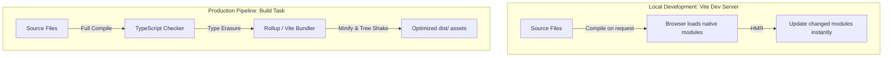

# Chapter 12: React — Application Scaffolding & Project Tooling
## (Including Master Setup Guide for JavaScript, TypeScript, React, and Next.js)

**Prerequisites:** Phase 4 Complete · **Difficulty:** Level A (React / Tooling)

> 🔗 **Welcome to the React Phase:** In Phase 4, we examined compile-time type boundaries. In this chapter, we step into React development. We will explore why modern React requires build tooling, and present a **Meticulous Master Setup Guide** for the entire frontend stack: JavaScript development environments, TypeScript compilers, React build templates, and Next.js platforms. This setup guide serves as your absolute reference point for initializing any project in the frontend stack.

---

## 1. Learning Objectives

- **Explain** the architectural reasons why modern frontend projects require automated build pipelines.
- **Scaffold** a pure JavaScript Node.js sandbox, a strict TypeScript compiler setup, a Vite React workspace, and a Next.js App Router application.
- **Configure** compiler rules in `tsconfig.json` and build tasks in `package.json` across different framework setups.
- **Execute** code runs, check compiled outputs, and boot local development servers.
- **Analyze** package manager storage layouts and lockfile locks to ensure consistent builds across workstations.

---

## 2. Motivation

In my three decades of engineering distributed systems and teaching computer science, I have observed that a developer's productivity is directly linked to the speed of their development environment. Many engineers build apps using bloated, pre-configured templates without knowing how to initialize or customize them. When a config file breaks or a package manager mismatch occurs, they freeze.

To write production-grade web applications, you must master project scaffolding. Understanding how package managers resolve packages, how compilers transpile syntax, and how development servers run code enables you to build faster, cleaner pipelines. This chapter serves as your master setup reference.

---

## 3. Core Theory: The Scaffolding Stack

Modern frontend development uses a suite of build tools to manage dependencies and transpile code for the browser:

```
            FRONTEND TOOLING PIPELINE
[ Source Code ] ──► [ Transpiler ] ──► [ Bundler ] ──► [ Browser Assets ]
  (JSX, TS)           (esbuild, tsc)     (Vite, Rollup)   (Minified JS, CSS)
```

1.  **Package Managers (npm / pnpm):** Download, verify, and link external libraries. We use `pnpm` because it uses a content-addressable storage model to share packages globally, saving disk space and speeding up install times.
2.  **Compilers (tsc / esbuild):** Strip type annotations and transpile modern syntax (such as JSX) into JavaScript code that browsers can execute.
3.  **Bundlers (Vite / Turbopack):** Resolve import statements and group code files into optimized assets (bundles) for production deployment.

---

## 4. Visual Diagrams

### 4.1 Development Server Flow vs. Production Bundle Pipeline


---

## 5. Master Setup Guide (Step-by-Step Walkthrough)

Here are the step-by-step scaffolding guides for each tier of the modern frontend stack. Let's run these commands together, checking the output at every stage.

### 5.1 JavaScript Sandbox Setup
First, we will set up a clean, minimal JavaScript Node.js environment.

```bash
# 1. Create directory and initialize package
mkdir js-setup-sandbox
cd js-setup-sandbox
npm init -y
```
This generates a `package.json` file. Let's edit it to use ECMAScript Modules (ESM) by adding:
```json
{
  "type": "module"
}
```
Now, create a source file `index.js`:
```javascript
// index.js
console.log("JavaScript Sandbox running on V8 version:", process.versions.v8);
```
Run the script using Node.js:
```bash
node index.js
```

---

### 5.2 TypeScript Sandbox Setup
Next, we will set up a strictly typed TypeScript environment.

```bash
# 1. Create directory and install TypeScript dependencies
mkdir ts-setup-sandbox
cd ts-setup-sandbox
pnpm init
pnpm add -D typescript @types/node
```
Generate the compiler configuration:
```bash
pnpm tsc --init
```
Open `tsconfig.json` and configure it with these strict type checking rules:
```json
{
  "compilerOptions": {
    "target": "ES2022",
    "module": "NodeNext",
    "moduleResolution": "NodeNext",
    "rootDir": "./src",
    "outDir": "./dist",
    "strict": true,
    "noImplicitAny": true,
    "strictNullChecks": true,
    "skipLibCheck": true
  },
  "include": ["src/**/*"]
}
```
Create the source directory and add `src/index.ts`:
```typescript
// src/index.ts
const studentName: string = "Jane Doe";
console.log(`Hello, TypeScript student: ${studentName}`);
```
Compile the code to JavaScript:
```bash
pnpm tsc
```
This compiles the code and generates `dist/index.js`. Run the compiled code:
```bash
node dist/index.js
```

---

### 5.3 React Sandbox Setup (Vite Template)
Now, we will scaffold a React + TypeScript single page application (SPA) using Vite.

```bash
# 1. Scaffold the template project
pnpm create vite react-setup-sandbox --template react-ts
cd react-setup-sandbox

# 2. Install dependencies
pnpm install
```
Start the local development server:
```bash
pnpm run dev
```
Open [http://localhost:5173](http://localhost:5173) in your browser to verify it runs.

Open `package.json` to inspect the build scripts:
*   `pnpm run dev`: Starts the local dev server.
*   `pnpm run build`: Runs the TypeScript checker and bundles assets for production inside `dist/`.

---

### 5.4 Next.js Sandbox Setup (App Router)
Finally, we will scaffold an enterprise-ready Next.js application using App Router.

```bash
# 1. Initialize the Next.js app using pnpm
pnpm create next-app next-setup-sandbox --typescript --tailwind --app --src-dir --import-alias "@/*" --use-pnpm
cd next-setup-sandbox
```
Start the Next.js development server:
```bash
pnpm run dev
```
Open [http://localhost:3000](http://localhost:3000) in your browser to verify the page loads.

Verify the folder structure inside `src/app/`:
*   `layout.tsx`: Defines the root layout wrapper.
*   `page.tsx`: The main route page.

---

## 6. Internal Implementation: Package Manager Resolution

When you run `pnpm install`, pnpm does not duplicate packages in your project directory like `npm` does. Instead, it downloads packages to a single **global content-addressable store** on your machine. 

It then creates **hard links** from the global store to your project’s `node_modules` folder, and sets up a nested dependency structure using **symbolic links (symlinks)**. This prevents duplicate packages, speeds up installations, and ensures consistent dependencies across all your projects.

---

## 7. Code Examples

### 7.1 Strict TypeScript Config Template
Use this strict compiler config template for your development environments:
```json
// tsconfig.strict.json
{
  "compilerOptions": {
    "target": "ES2022",
    "module": "NodeNext",
    "moduleResolution": "NodeNext",
    "strict": true,
    "noImplicitAny": true,
    "strictNullChecks": true,
    "noUnusedLocals": true,
    "noUnusedParameters": true,
    "exactOptionalPropertyTypes": true,
    "noImplicitReturns": true,
    "noFallthroughCasesInSwitch": true
  }
}
```

### 7.2 Practical Example: A Dynamic React State Component
Create a dynamic counter component inside `src/Counter.tsx` in your React sandbox:
```tsx
// src/Counter.tsx
import { useState } from "react";

interface CounterProps {
    initialValue?: number;
    step?: number;
}

export function Counter({ initialValue = 0, step = 1 }: CounterProps) {
    const [count, setCount] = useState(initialValue);

    return (
        <div className="p-6 border rounded-lg shadow-sm text-center">
            <p className="text-lg font-medium">Count Value: {count}</p>
            <button
                onClick={() => setCount(c => c + step)}
                className="mt-4 px-4 py-2 bg-blue-600 text-white rounded hover:bg-blue-700"
            >
                Increment by {step}
            </button>
        </div>
    );
}
```

### 7.3 Production-Ready Pattern: Importing Components with Type Safety
Render the Counter component safely inside `src/App.tsx`:
```tsx
// src/App.tsx
import { Counter } from "./Counter";

export default function App() {
    return (
        <main className="max-w-md mx-auto mt-10 p-4">
            <h1 className="text-2xl font-bold text-center mb-6">Workspace Counters</h1>
            <Counter initialValue={10} step={5} />
        </main>
    );
}
```

### 7.4 Incorrect Anti-Pattern vs. Corrected Implementation

#### Incorrect: Using absolute imports in standard configs
```typescript
// src/anti-pattern-import.ts
// Direct relative imports can lead to complex paths in nested directory trees
import { UserDetails } from "../../../components/user/UserDetails";
```

#### Corrected: Configure Path Aliases
```typescript
// src/corrected-import.ts
// Use alias mappings for cleaner imports
import { UserDetails } from "@/components/user/UserDetails";
```

### 7.5 Additional Example: Production Build Verification
To verify your project builds successfully for production, run:
```bash
# In the React sandbox
pnpm run build
pnpm run preview
```
This runs the production bundle locally, allowing you to check performance before deploying.

---

## 8. Common Mistakes

### Junior Developer: Bypassing Lockfile Updates
Updating packages directly inside `package.json` without updating the lockfile, which can lead to package version conflicts.

### Mid-Level Developer: Committing Build Output Directories
Committing compiled build directories (such as `dist/` or `.next/`) to Git repository branches. These directories should be added to `.gitignore` so they are excluded from source control.

### Senior Developer: Loose Peer Dependencies configurations
Neglecting to define strict `peerDependencies` ranges in shared library packages, leading to version conflicts on client projects.

---

## 9. Performance Analysis

### 9.1 Bundler Startup Speed Comparison
Vite is significantly faster than Webpack during development. It compiles only requested modules on demand, whereas Webpack must compile and bundle the entire application before starting the server.

### 9.2 Tooling Startup Speed
| Action | Webpack (Legacy) | Vite (Modern) |
|---|---|---|
| **Server startup** | Slow (bundles first) | Instant (on-demand) |
| **Hot reload (HMR)** | Slower as app grows | Instant (re-compiles changed file) |
| **Production build** | Highly optimized | Highly optimized (Rollup wrapper) |

---

## 10. Security Inventory

- **Exposed API Secrets:** Ensure that sensitive keys (such as database credentials) are not stored in client-side code. Prefix only public environment variables with `VITE_` or `NEXT_PUBLIC_`.
- **Malicious Dependency Packages:** Run audits regularly to detect security issues in package versions:
  ```bash
  pnpm audit
  ```

---

## 11. Technology Comparisons

### Comparing Build Tool Engines
| Dimension | Webpack | Vite | Turbopack |
|---|---|---|---|
| **Compilation Engine** | JavaScript (Babel) | Go (esbuild) | Rust |
| **HMR Speed** | Milliseconds | Microseconds | Microseconds |
| **Development Server** | Custom bundle server | Native Browser ESM | Native compiler |

---

## 12. Engineering Decisions

### Which Package Manager to Choose?
*   **pnpm:** Recommended for most modern applications. It saves disk space, provides fast installation times, and supports monorepos natively.
*   **npm:** Good for simple projects that do not require complex configurations or monorepo setups.

---

## 13. Exercises

### Easy
Scaffold a TypeScript sandbox, configure strict null checks, write a script that declares a variable, assign `null` to it, and verify that the compiler throws an error.

### Medium
Scaffold a Vite template application, configure the dev server to run on port `8080`, define a custom script `pnpm run build-verify` that compiles code, and run it.

### Hard
Write a shell script that initializes a pnpm monorepo workspace containing two packages: a shared TypeScript library package and a React web application package that imports the shared library.

---

## 14. Capstone Integration Step

In the *ScribeCollab* workspace, we must configure absolute folder paths to resolve components quickly.
Configure `tsconfig.json` mappings inside your React project:

```json
{
  "compilerOptions": {
    "baseUrl": ".",
    "paths": {
      "@/*": ["src/*"]
    }
  }
}
```
This lets you import nested files cleanly:
```typescript
import { Document } from "@/components/Document"; // Resolves to src/components/Document
```

---

## 15. Supplementary Topics & Core Lecture Knowledge

### Lockfile Integrity
The lockfile (`pnpm-lock.yaml` or `package-lock.json`) records the exact version of every package installed, ensuring consistent builds across all development machines and CI/CD pipelines. This is a critical practice for production applications to avoid deployment failures caused by minor version updates in dependencies.
