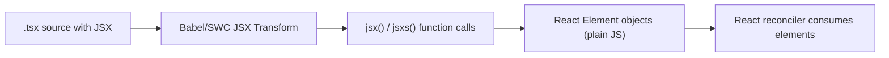
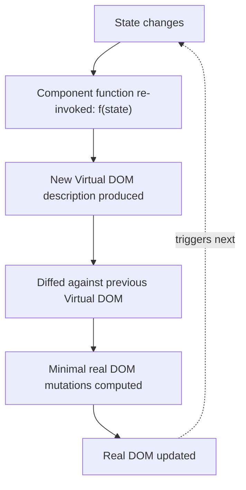
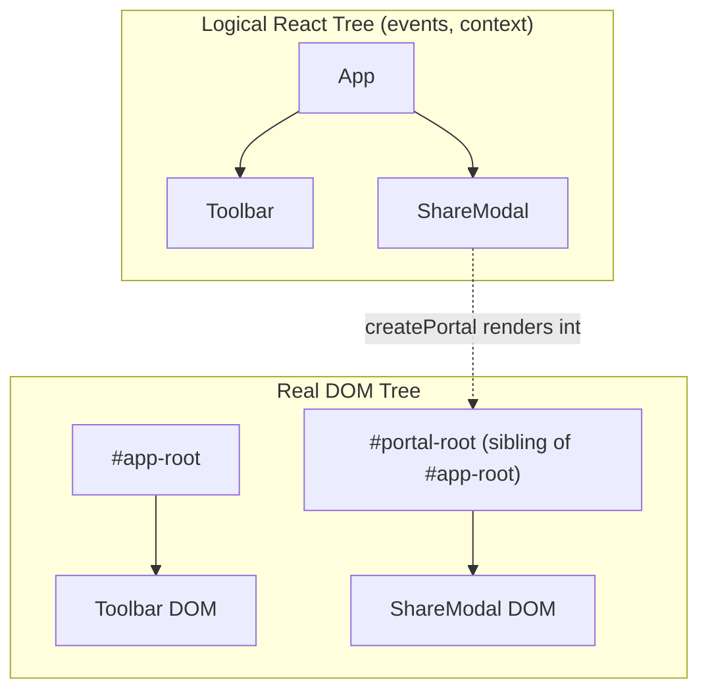

# Chapter 13: React Philosophy & Component Composition

**Prerequisites:** Phase 1 and 2 Complete · **Difficulty:** Level A (React)

> 🔗 **Continuing from Phase 2:** `document-core` is fully typed at compile time (Chapter 6) and validated at runtime (Chapter 7). This chapter puts that foundation to work by introducing React itself — the UI layer that will consume these types throughout Phase 3.

---

## 1. Learning Objectives

- **Explain** React's core mental model: UI as a pure, deterministic function of state.
- **Trace** how JSX compiles down to plain function calls and why that matters for understanding React's runtime behavior.
- **Construct** composable component trees using children, props, and typed component boundaries.
- **Apply** stable list keys correctly to avoid subtle rendering bugs.
- **Design** portal-based UI (modals, overlays) that escapes parent DOM constraints without losing React's logical tree structure.

---

## 2. Motivation

Before React (and frameworks like it), UI updates were performed by imperative DOM manipulation: find the node, mutate it, hope nothing else depended on its prior state. This scaled poorly — as an app's interactive surface grew, keeping every DOM mutation consistent with application state became a combinatorial nightmare of manual bookkeeping (a large driver behind the "spaghetti jQuery" era of web development). React's foundational insight was to make UI **declarative**: you describe *what* the UI should look like for a given state, and a separate reconciliation system figures out *how* to mutate the real DOM to match. Interns who skip this philosophy and jump straight to "hooks syntax" often write code that fights the framework — mutating props, relying on DOM query hacks, or misusing keys — because they never internalized the one idea everything else in Phase 3 is built on.

---

## 3. Core Theory

### 3.1 UI as a Pure Function of State

React's mental model, at its core, is: **UI = f(state)**. Given the same state, a component should always describe the same UI output. This determinism is what allows React to safely re-run a component function on every state change without you manually tracking "what changed" — the function itself recomputes the full description, and React's diffing (Chapter 12) figures out the minimal real DOM change needed.

### 3.2 The Virtual DOM

Directly mutating the real DOM is comparatively expensive (it can trigger layout, paint, and Accessibility Tree recomputation — Chapter 1). React instead builds a lightweight, plain-JavaScript-object description of the desired UI tree (the "Virtual DOM") on every render, then **diffs** it against the previous description to compute the minimal set of real DOM mutations required, batching them together before applying them.

### 3.3 JSX Is Not HTML

JSX is syntactic sugar that compiles to function calls. `<button onClick={onSave}>Save</button>` compiles (via the modern JSX transform) to:

```js
import { jsx as _jsx } from "react/jsx-runtime";
_jsx("button", { onClick: onSave, children: "Save" });
```

For custom components, the tag name resolves to whatever variable is in scope: `<DocEditor />` compiles to `_jsx(DocEditor, {})`. This is why component names **must** be capitalized — JSX uses capitalization purely as a syntactic signal to distinguish "look up this identifier as a component" from "treat this as a literal DOM tag string."

### 3.4 Component Composition & `children`

React components compose the same way functions compose: a parent passes a `children` prop (implicitly, via JSX nesting) to a child, which decides where and whether to render it. This is the mechanism behind layout components, providers (Chapter 9), and portal wrappers — the parent doesn't need to know what's inside `children`, only where to place it.

### 3.5 Keys and List Reconciliation (Preview of Chapter 12)

When rendering a list via `.map()`, React needs a **stable identity** for each item across renders to correctly match old Virtual DOM nodes to new ones. The `key` prop provides that identity. Using array index as a key is safe *only* if the list is static (never reordered, inserted into, or filtered) — otherwise it causes React to misattribute state (e.g., an input's focus or a checkbox's checked state jumping to the wrong row) because index-based keys shift meaning when items move.

### 3.6 Portals

`createPortal(children, domNode)` renders a React subtree into a DOM node **outside** the parent component's DOM hierarchy, while keeping it inside the parent's *logical* React tree (event bubbling, context, and error boundaries all still apply normally). This solves the classic CSS `overflow: hidden`/`z-index` stacking-context problem for modals and tooltips without breaking React's component model.

---

## 4. Visual Diagrams

### 4.1 JSX Compilation Pipeline



### 4.2 UI = f(state) Render Cycle



### 4.3 Portal Logical vs. DOM Tree



---

## 5. Step-by-Step Walkthrough: Rendering a List Correctly

```jsx
function DocumentList({ docs }) {
  return (
    <ul>
      {docs.map((doc) => (
        <DocumentRow key={doc.id} doc={doc} />
      ))}
    </ul>
  );
}
```

1. `DocumentList` is invoked as a pure function of its `docs` prop — no mutation, no side effects.
2. `.map()` produces an array of React elements, each tagged with `key={doc.id}` — a **stable identity** independent of array position.
3. On the next render (say, `docs` is re-sorted alphabetically), React's reconciler matches new elements to old ones **by key**, not by position — so `DocumentRow` instances (and their internal state, e.g., an "editing title" flag) correctly follow their document even though their index in the array changed.
4. If `key` had been the array index instead, reconciliation would match by position, causing document B's row to inherit document A's leftover internal state after a reorder — a subtle, hard-to-diagnose bug class.

---

## 6. Internal Implementation

React elements returned by `jsx()` are **not** DOM nodes and not even the "Virtual DOM" tree the reconciler ultimately operates on — they are simple, single-level descriptor objects (`{ type, key, props }`) created fresh on every render. The reconciler (Fiber, Chapter 12) consumes these lightweight descriptors and maintains its **own** persistent tree (the Fiber tree) across renders, using `key` plus `type` to decide whether an existing Fiber node can be reused (updated in place) or must be discarded and recreated. This is why creating a brand-new component *type* inline inside another component's render function (e.g., defining a nested function component inside a parent's body) is a classic anti-pattern: every render produces a structurally "new" type reference, so React discards and remounts the entire subtree every single render, destroying its internal state and losing all performance benefits of reconciliation.

---

## 7. Code Examples

### 7.1 Minimal Example

```jsx
function Greeting({ name }) {
  return <p>Hello, {name}!</p>;
}
```

### 7.2 Practical Example — Typed Children Composition

```tsx
interface PanelProps {
  title: string;
  children: React.ReactNode;
}

function Panel({ title, children }: PanelProps) {
  return (
    <section aria-label={title}>
      <h2>{title}</h2>
      {children}
    </section>
  );
}

// Usage: Panel doesn't know or care what's inside — pure composition.
<Panel title="Collaborators">
  <CollaboratorList users={activeUsers} />
</Panel>;
```

### 7.3 Production-Ready — Reusable Modal via Portal (TypeScript)

```tsx
import { createPortal } from "react-dom";
import { useFocusTrap } from "../hooks/useFocusTrap"; // from Chapter 1

interface ModalProps {
  open: boolean;
  onClose: () => void;
  titleId: string;
  children: React.ReactNode;
}

export function Modal({ open, onClose, titleId, children }: ModalProps) {
  const trapRef = useFocusTrap(open);
  if (!open) return null;

  return createPortal(
    <div className="modal-overlay" onClick={onClose}>
      <div
        ref={trapRef}
        role="dialog"
        aria-modal="true"
        aria-labelledby={titleId}
        onClick={(e) => e.stopPropagation()}
      >
        {children}
      </div>
    </div>,
    document.getElementById("portal-root")!
  );
}
```

### 7.4 Anti-Pattern → Corrected

```jsx
// ❌ ANTI-PATTERN: defining a component TYPE inside another component's
// render body. A new `Row` function identity is created every render,
// so React treats it as a brand-new component type each time and
// remounts the entire subtree, losing all internal state and hurting
// performance.
function DocumentList({ docs }) {
  function Row({ doc }) {
    return <li>{doc.title}</li>;
  }
  return <ul>{docs.map((doc) => <Row key={doc.id} doc={doc} />)}</ul>;
}
```

```jsx
// ✅ CORRECTED: component defined once, at module scope — a stable
// type reference across every render, allowing React to correctly
// reconcile and preserve state.
function Row({ doc }) {
  return <li>{doc.title}</li>;
}
function DocumentList({ docs }) {
  return <ul>{docs.map((doc) => <Row key={doc.id} doc={doc} />)}</ul>;
}
```

### 7.5 Additional Example — Fragments and Conditional Rendering Patterns

```jsx
function DocumentStatus({ doc }) {
  return (
    <>
      <h2>{doc.title}</h2>
      {doc.isShared && <ShareBadge />}
      {doc.error ? <ErrorBanner message={doc.error} /> : <SavedIndicator />}
    </>
  );
}
```

`<>...</>` (a `Fragment`) groups multiple elements without adding an extra wrapping DOM node — important for avoiding invalid HTML nesting (e.g., inside a `<table>`) and for keeping the DOM tree free of unnecessary wrapper `<div>`s that add no semantic value (directly reinforcing Chapter 1's "every DOM node has a cost" principle). `&&` short-circuits for optional content; the ternary handles mutually-exclusive branches — mixing the two idioms incorrectly (e.g., `doc.count && <Badge/>` when `count` can be `0`) is a common bug, since `0 && <Badge/>` renders the literal `0`, not nothing.

---

## 8. Common Mistakes

| Level | Mistake |
|---|---|
| **Junior** | Using array index as `key` in a list that can be reordered, filtered, or have items inserted/removed from the middle. |
| **Mid-Level** | Defining components inline inside another component's function body (7.4 anti-pattern), causing unnecessary remounts and lost state. |
| **Senior/Production** | Overusing portals for things that don't need to escape the DOM hierarchy (e.g., simple tooltips that could be positioned with CSS), adding unnecessary complexity to event handling and testing without a real stacking-context problem to solve. |

---

## 9. Performance Analysis

- **Virtual DOM diffing:** amortized O(n) in the number of elements at each tree level, using React's heuristic (not general tree-diff, which is O(n³)) that assumes elements of different types produce different trees, and uses keys to match same-type siblings efficiently.
- **Inline component definitions:** force O(subtree size) full remounts on every parent render — a measurable, avoidable cost in large lists or deeply nested trees.
- **Portal overhead:** negligible — portals do not add extra reconciliation cost; they only change *where* the resulting DOM node is attached, not how the element tree is diffed.

---

## 10. Security Inventory

- **JSX auto-escaping:** React escapes all values interpolated into JSX (`{userInput}`) by default, preventing XSS via normal text content — this protection is bypassed **only** by `dangerouslySetInnerHTML`, which must never receive unsanitized user content (relevant directly to rendering user Markdown output).
- **Portal targets and CSP:** ensure portal target containers (`#portal-root`) are part of your own trusted DOM structure, not dynamically created from untrusted third-party embed code, to avoid a foreign script gaining a foothold inside your app's logical event tree.
- **`key` is not a security boundary:** keys affect reconciliation identity only — never derive authorization or security decisions from key values.

---

## 11. Technology Comparisons

| Approach | Imperative DOM Manipulation | React (Declarative Virtual DOM) |
|---|---|---|
| **Update model** | Manual mutation, developer tracks consistency | Declarative re-render, framework computes diff |
| **Scalability** | Degrades combinatorially with UI complexity | Scales via component composition and isolated state |
| **Debuggability** | Hard to trace "who changed this DOM node" | State changes are traceable to a single render input |
| **Learning curve** | Lower initial, higher long-term maintenance cost | Higher initial (mental model shift), lower long-term cost |

---

## 12. Engineering Decisions

ScribeCollab's UI is built entirely as composed function components with no class components anywhere in the codebase (aside from the mandatory Error Boundary), and no component types are ever defined inside another component's render body — this is enforced via an ESLint rule (`react/no-unstable-nested-components`) rather than relying on code review discipline alone, because the failure mode (silent remounts) is easy to miss visually but costly in production. Modals and overlays universally use the `Modal` portal pattern from 7.3 rather than ad-hoc `z-index` stacking, to keep overlay behavior consistent and testable across the app.

---

## 13. Exercises

**Easy:** Explain why `<div>` compiles differently than `<DocEditor />` in JSX, referencing the capitalization rule and what each compiles to.

**Medium:** Build a `Tabs` component using composition (`Tabs`, `Tabs.List`, `Tabs.Panel` as compound components) that renders arbitrary children without `Tabs` needing to know their internal implementation.

**Hard:** A list of 500 collaborator presence avatars re-renders entirely (losing all CSS transition states) every time a single new collaborator joins, because the code currently uses array index as `key` and re-sorts the array by "most recently active" on every presence update. Diagnose the root cause and propose a fix, explaining exactly how the key strategy change resolves the reconciliation mismatch.

---

## 14. Capstone Integration Step

**ScribeCollab — Step 8:** Rebuild the workspace container layout as composed function components (`WorkspaceShell`, `Sidebar`, `EditorPane`, `PresencePanel`). Replace the placeholder "Share Document" modal from Chapter 1 with the production `Modal` portal component (7.3), reusing the existing `useFocusTrap` hook unchanged — demonstrating that Chapter 1's accessibility work composes cleanly into React's component model without modification.

---

## 🔜 Bridge to Chapter 9

You can now compose static and list-based UI, but ScribeCollab needs interactivity: text input, toggles, and state that changes over time and persists across renders. Chapter 9 introduces React's core hooks (`useState`, `useEffect`, `useRef`, Context, and custom hooks) — the mechanisms that let a "pure function of state" component actually hold and update that state.

---

## 15. Supplementary Topics & Core Lecture Knowledge

The following supplementary modules map and expand the core React rendering and composition foundations:

### 15.1 JSX Compiler Mechanics & Capitalization Signals

JSX is not valid JavaScript. A bundler's JSX transform compiler (like esbuild or SWC) parses the JSX markup into AST nodes and transpiles them to plain function calls:

```tsx
// TSX Input:
const element = <section className="card"><Header title="Home" /></section>;

// Transpiled Output:
import { jsx as _jsx, jsxs as _jsxs } from "react/jsx-runtime";
const element = _jsxs("section", { 
  className: "card", 
  children: _jsx(Header, { title: "Home" }) 
});
```

* **HTML tags (lowercase)**: Transpiled as string literals (`"section"`, `"div"`).
* **Custom components (Capitalized)**: Transpiled as reference identifiers (`Header`). If you define `<header>` with a lowercase letter, the compiler treats it as a native HTML header element, bypassing your custom component function.

### 15.2 Props Immutability vs. Child State Isolation

Props passed down the component tree represent input parameters. They are read-only:
* **The parent owns props**: Any attempt to mutate them inside the child (`props.userId = "x"`) is caught by React's strict runtime engine and throws errors.
* **Component instances isolate state**: If you render three `<Button>` components on a page, each instance allocates its own independent state block inside the Fiber tree. Clicking one does not affect the state of the other two.

### 15.3 Synthetic Event Delegation Model

React does not attach event listeners directly to individual DOM nodes. Instead:
1. It registers a single, centralized event listener at the root container node (the `#app-root` div) for every event category (e.g., `click`).
2. When a browser event bubbles up to the root, React's synthetic event system wraps the native event in a cross-browser compatible `SyntheticEvent` wrapper.
3. It performs a lookup on the Fiber tree to locate the target component, and dispatches the callback function (`onClick={handleClick}`).
4. Passing custom parameters to event handlers requires wrapping them in closures: `onClick={(e) => handleAction(id, e)}`.

### 15.4 Dynamic Lists & Stable Key Reconciliations

When rendering collections, React uses the `key` prop to track identity:
* **Stable Keys**: Use unique server-generated IDs (`id: "usr-42"`). If you reorder or sort the list, React matches the corresponding Fiber instances to the new DOM nodes correctly.
* **Unstable Keys**: If you use array indices (`key={index}`) as keys on list items that change positions, React maps the state of index `0` to whatever item happens to sit at index `0` after the sort, causing state parameters (like text inputs, selected fields) to stay behind.
