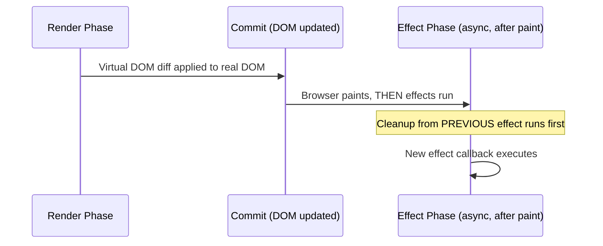
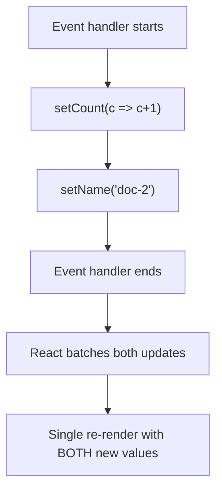
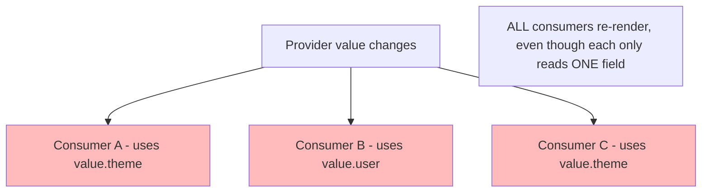

# Chapter 14: Core React Hooks & State Orchestration

**Prerequisites:** Chapter 8 · **Difficulty:** Level B (React)

> 🔗 **Continuing from Chapter 8:** You can compose static and list-based UI as pure functions of props. This chapter introduces the mechanism that lets those "pure functions" actually hold state across renders and react to changes: hooks.

---

## 1. Learning Objectives

- **Apply** `useState` correctly, including understanding React's update batching behavior.
- **Differentiate** controlled from uncontrolled form inputs and justify when to use each.
- **Manage** side effects with `useEffect`, including correct dependency arrays and cleanup semantics.
- **Use** `useRef` for both DOM access and persistent mutable values that must not trigger re-renders.
- **Design** Context providers with performance-aware boundaries.
- **Construct** custom hooks that encapsulate reusable, typed stateful logic.

---

## 2. Motivation

Hooks are the single most-used and most-misused part of the React API surface. The `useEffect` dependency array alone accounts for a disproportionate share of production React bugs — stale closures capturing outdated state, infinite re-render loops from missing dependencies, and memory leaks from missing cleanup functions. Every one of these bugs is explainable, not mysterious, once you connect hooks back to Chapter 2's closures and Chapter 4's event loop: a `useEffect` callback *is* a closure, captured at a specific render's scope, and its cleanup function is not merely "nice to have" — it's the direct mechanism preventing the memory-leak patterns you already learned to diagnose in Phase 1.

---

## 3. Core Theory

### 3.1 `useState` and Batching

`useState` returns a `[value, setter]` pair. Calling the setter does **not** mutate `value` in place (consistent with Chapter 3's immutability principles) — it schedules a re-render with the new value. React **batches** multiple state updates that occur within the same synchronous event handler (and, since React 18, even inside promises/timeouts/native event handlers) into a single re-render pass, rather than re-rendering once per `setState` call — this is a direct performance optimization built on the same "don't do unnecessary work" philosophy as tree shaking (Chapter 6).

### 3.2 State Immutability & Lifting State Up

Because React compares state via reference (Chapter 3's `shallowEqual` concept) to decide whether to re-render, state objects/arrays must be replaced, not mutated, on update — exactly the structural-sharing pattern built in Chapter 3. **Lifting state up** means moving state to the nearest common ancestor of components that need to share and stay in sync with it, rather than duplicating it — a direct application of "single source of truth."

### 3.3 Controlled vs. Uncontrolled Inputs

- **Controlled:** the input's `value` is driven by React state (`value={state}` + `onChange`), making React the single source of truth. Every keystroke round-trips through a re-render.
- **Uncontrolled:** the DOM itself owns the value; React reads it on demand via a `ref`, avoiding a re-render per keystroke — critical for very high-frequency inputs (Chapter 13 covers this trade-off in depth for form-heavy screens).

### 3.4 `useEffect`: Side Effects and Cleanup

`useEffect(fn, deps)` runs `fn` **after** the DOM has committed for that render, whenever any value in `deps` has changed since the last render (using `Object.is` comparison per element, not deep equality — another reason immutable updates from Chapter 3 matter here). If `fn` returns a cleanup function, React calls it **before** running the effect again, and on unmount — this is the primary defense against the "long-lived closure captures a stale reference" leak pattern from Chapter 3's Performance Analysis section.

### 3.5 `useRef`: The Escape Hatch from the Render Cycle

`useRef` returns a mutable `{ current }` object that **persists across renders without triggering a re-render when mutated**. It has two common uses: (1) holding a reference to a DOM node (`<div ref={myRef}>`), and (2) holding any mutable value that needs to survive renders but isn't part of the rendered output (e.g., a previous value for comparison, or a timer ID from Chapter 4's `setTimeout` patterns). Chapter 10 goes further into exposing curated imperative APIs (`forwardRef`, `useImperativeHandle`) built on top of this same primitive.

### 3.6 Context API

`createContext` + `Provider` lets a value be read by any descendant component without manually threading it through every intermediate prop (avoiding "prop drilling"). **Performance caveat:** every consumer of a context re-renders whenever the Provider's `value` changes — even if the consumer only cares about part of that value. This is why large, high-frequency state (a whole document's content) should generally live in an external store (Zustand, Chapter 13) rather than Context, while low-frequency, broadly-shared state (theme, current user) is a good Context fit.

### 3.7 Custom Hooks

A custom hook is simply a function whose name starts with `use` and which itself calls other hooks — it's a mechanism for extracting and sharing **stateful logic** (not just plain utility functions) across components, following the exact same closure and composition principles from Chapters 2 and 8.

---

## 4. Visual Diagrams

### 4.1 useEffect Timing Relative to Render & Commit



### 4.2 State Update Batching



### 4.3 Context Re-render Propagation



---

## 5. Step-by-Step Walkthrough: `useEffect` Dependency & Cleanup Lifecycle

```jsx
function AutoSaveIndicator({ docId }) {
  useEffect(() => {
    const controller = new AbortController(); // Chapter 5 pattern
    const timerId = setInterval(() => {
      pingSaveStatus(docId, controller.signal);
    }, 5000);

    return () => {
      clearInterval(timerId);
      controller.abort();
    };
  }, [docId]);

  return null;
}
```

1. On mount (`docId = "doc-1"`), the effect runs: a closure captures `docId = "doc-1"` and starts an interval + `AbortController`.
2. If `docId` prop changes to `"doc-2"`, React first invokes the **previous** effect's cleanup — clearing the old interval and aborting its controller (preventing the Chapter 4/5 race-condition class where a stale request for `doc-1` resolves after switching to `doc-2`).
3. React then runs the effect again, this time with a **new closure** capturing `docId = "doc-2"`.
4. On unmount, the cleanup runs one final time, guaranteeing no dangling interval or in-flight request survives the component's lifetime — directly preventing the memory-leak pattern flagged in Chapter 3's Performance Analysis.

---

## 6. Internal Implementation

Hooks are not "magic" — they work because React maintains a **per-Fiber linked list** of hook call records, indexed strictly **by call order**, not by name. On every render, React walks this list in the exact sequence hooks were called and matches each `useState`/`useEffect`/`useRef` call to its corresponding stored record. This is precisely why the **Rules of Hooks** ("never call hooks conditionally or in loops") exist: if a hook call is skipped on some render, every subsequent hook's position in the list shifts, and React attaches the wrong stored state to the wrong hook call — a category of bug that manifests as bizarre, seemingly unrelated state corruption. This mechanism is directly tied to Chapter 12's Fiber architecture: each Fiber node owns its own hook list, persisted across renders in the same way the Fiber tree itself persists.

---

## 7. Code Examples

### 7.1 Minimal Example

```jsx
function Counter() {
  const [count, setCount] = useState(0);
  return <button onClick={() => setCount(c => c + 1)}>{count}</button>;
}
```

### 7.2 Practical Example — Controlled Input with Validation

```tsx
function TitleInput({ value, onChange }: { value: string; onChange: (v: string) => void }) {
  const isValid = value.trim().length > 0;
  return (
    <div>
      <input
        value={value}
        onChange={(e) => onChange(e.target.value)}
        aria-invalid={!isValid}
      />
      {!isValid && <span role="alert">Title cannot be empty</span>}
    </div>
  );
}
```

### 7.3 Production-Ready — Custom `useDocumentSync` Hook (TypeScript)

```tsx
// useDocumentSync.ts — encapsulates local persistence, cleanup, and
// keyboard-triggered manual save, composing Chapter 2's closures,
// Chapter 4's macrotask debounce, and Chapter 5's storage patterns.
import { useEffect, useRef, useCallback } from "react";

interface UseDocumentSyncOptions {
  docId: string;
  content: string;
  onSave: (docId: string, content: string) => Promise<void>;
  delayMs?: number;
}

export function useDocumentSync({ docId, content, onSave, delayMs = 800 }: UseDocumentSyncOptions) {
  const timerRef = useRef<ReturnType<typeof setTimeout> | null>(null);
  const latestContent = useRef(content);
  latestContent.current = content; // always current, without re-subscribing effects

  const flush = useCallback(() => {
    if (timerRef.current) clearTimeout(timerRef.current);
    onSave(docId, latestContent.current);
  }, [docId, onSave]);

  // Debounced auto-save on content change
  useEffect(() => {
    if (timerRef.current) clearTimeout(timerRef.current);
    timerRef.current = setTimeout(() => onSave(docId, content), delayMs);
    return () => {
      if (timerRef.current) clearTimeout(timerRef.current);
    };
  }, [docId, content, delayMs, onSave]);

  // Manual save on Ctrl+S / Cmd+S
  useEffect(() => {
    function handleKeyDown(e: KeyboardEvent) {
      if ((e.ctrlKey || e.metaKey) && e.key === "s") {
        e.preventDefault();
        flush();
      }
    }
    document.addEventListener("keydown", handleKeyDown);
    return () => document.removeEventListener("keydown", handleKeyDown);
  }, [flush]);
}
```

### 7.4 Anti-Pattern → Corrected

```jsx
// ❌ ANTI-PATTERN: missing dependency causes a STALE CLOSURE — `count`
// inside the interval callback is permanently frozen at its value from
// the render where the effect first ran, because the effect never
// re-runs to capture a fresh `count`.
function Ticker() {
  const [count, setCount] = useState(0);
  useEffect(() => {
    const id = setInterval(() => {
      console.log(count); // always logs the count from the FIRST render
      setCount(count + 1); // always resets to 1, never increments further
    }, 1000);
    return () => clearInterval(id);
  }, []); // ❌ missing `count` dependency
  return <p>{count}</p>;
}
```

```jsx
// ✅ CORRECTED: use the functional updater form, which reads the LATEST
// state at call time rather than closing over a stale value — no
// dependency on `count` needed at all.
function Ticker() {
  const [count, setCount] = useState(0);
  useEffect(() => {
    const id = setInterval(() => {
      setCount((c) => c + 1); // always operates on the current value
    }, 1000);
    return () => clearInterval(id);
  }, []); // correctly empty — nothing external is captured
  return <p>{count}</p>;
}
```

### 7.5 Additional Example — `useReducer` for Complex State Transitions

```tsx
type EditorState = { text: string; history: string[]; future: string[] };
type EditorAction =
  | { type: "TYPE"; text: string }
  | { type: "UNDO" }
  | { type: "REDO" };

function editorReducer(state: EditorState, action: EditorAction): EditorState {
  switch (action.type) {
    case "TYPE":
      return { text: action.text, history: [...state.history, state.text], future: [] };
    case "UNDO": {
      if (state.history.length === 0) return state;
      const previous = state.history[state.history.length - 1];
      return {
        text: previous,
        history: state.history.slice(0, -1),
        future: [state.text, ...state.future],
      };
    }
    case "REDO": {
      if (state.future.length === 0) return state;
      const [next, ...rest] = state.future;
      return { text: next, history: [...state.history, state.text], future: rest };
    }
  }
}

function Editor() {
  const [state, dispatch] = useReducer(editorReducer, { text: "", history: [], future: [] });
  return <textarea value={state.text} onChange={(e) => dispatch({ type: "TYPE", text: e.target.value })} />;
}
```

`useReducer` centralizes related state-transition logic (undo/redo) into one pure function, tested independently of React entirely — preferable to `useState` here specifically because the *next* state depends on complex derivations from the *previous* state (history/future arrays), which quickly becomes unreadable as scattered `setState` calls.

---

## 8. Common Mistakes

| Level | Mistake |
|---|---|
| **Junior** | Mutating state directly (`state.items.push(x); setState(state)`) instead of creating a new reference, so React doesn't detect the change (direct callback to Chapter 3). |
| **Mid-Level** | Omitting dependencies from `useEffect`'s array to "stop it from re-running so much," introducing stale closures instead of fixing the actual re-render cause. |
| **Senior/Production** | Placing a large, frequently-changing object (e.g., live document content) directly in Context, causing every consumer across the tree to re-render on every keystroke — should be moved to a selector-based external store (Chapter 13). |

---

## 9. Performance Analysis

- **State update batching:** reduces N sequential state updates within one handler from O(N) re-renders to O(1) — a direct, measurable frame-budget win (tied to Chapter 4's event loop/rendering-step timing).
- **Context re-render cost:** O(number of consumers) on every value change, regardless of which slice of the value each consumer actually reads — this is the core scalability limit addressed in Chapter 13.
- **`useRef` mutation cost:** O(1), zero re-render triggered — the correct tool whenever a value needs to persist without visually affecting output (timer IDs, previous values, DOM node handles).

---

## 10. Security Inventory

- **Uncleaned effects as a resource/security risk:** an effect that registers an authenticated polling request but never cancels it in its cleanup function can continue firing authenticated network calls after a component (and its associated permission context) has unmounted — always pair `AbortController` (Chapter 5) with `useEffect` cleanup for any network-triggering effect.
- **Controlled input trust boundary:** controlled inputs give you a synchronous point to sanitize/validate input as it's typed, but this is a UX convenience, not a security control — server-side validation (Chapter 7's Zod schemas, applied again in Phase 4) remains mandatory regardless of client-side controlled-input checks.
- **Context value leakage:** placing sensitive data (auth tokens, unredacted PII) in a broadly-read Context makes it accessible to any component in the subtree, including third-party components if any exist in the tree — scope sensitive context providers as narrowly as possible.

---

## 11. Technology Comparisons

| State Location | `useState` (local) | Context API | External Store (Zustand, Ch. 13) |
|---|---|---|---|
| **Scope** | Single component | Any descendant of Provider | Anywhere in the app, even outside React |
| **Re-render granularity** | Only the owning component | All consumers on any value change | Selector-based — only subscribed slices |
| **Best for** | UI-local state (input value, toggle) | Low-frequency, broadly shared (theme, auth user) | High-frequency, large, or cross-tree shared state |

---

## 12. Engineering Decisions

ScribeCollab uses `useState`/`useRef` for component-local UI state, Context strictly for low-frequency global concerns (current user, theme, locale), and defers all document-content state to a Zustand store starting in Chapter 13 — this three-tier state strategy is decided upfront specifically to avoid the common mid-project refactor of "our Context is now causing the whole app to re-render on every keystroke," a direct, foreseeable consequence of Section 3.6's re-render propagation model.

---

## 13. Exercises

**Easy:** Explain why `setCount(count + 1); setCount(count + 1);` called twice in one handler only increments the count by 1, not 2, and how the functional updater form (`setCount(c => c + 1)`) fixes it.

**Medium:** Build a `useLocalStorage<T>(key: string, initialValue: T)` custom hook (typed, using Chapter 6/7 generics) that syncs a piece of state to `localStorage`, reading the initial value lazily on mount and writing on every change.

**Hard:** ScribeCollab's collaborator presence indicator re-renders the entire sidebar (30+ components) every time any collaborator moves their cursor, because presence data lives in a single Context value updated on every cursor move. Diagnose the re-render propagation using Section 4.3's model, and propose two alternative architectures (one Context-based with splitting, one external-store-based) with trade-offs for each.

---

## 14. Capstone Integration Step

**ScribeCollab — Step 9:** Implement the `useDocumentSync` hook (7.3) and wire it into the editor pane built in Chapter 8, replacing the placeholder auto-save logic from Chapter 4 with this typed, cleanup-safe version. Add a `WorkspaceUserContext` for the low-frequency current-user/theme data only — explicitly keep live document content out of Context, setting up the motivation for Chapter 13's store migration.

---

## 🔜 Bridge to Chapter 10

You now know how to trigger re-renders and manage effects declaratively — but some operations are fundamentally imperative (focusing an input, exposing a `play()`/`pause()` API, reading a DOM measurement on demand), and `useRef` alone only gets you halfway there. Chapter 10 completes the imperative side of the hooks API (`forwardRef`, `useImperativeHandle`) and covers the class-component model hooks replaced — essential both for building clean imperative APIs and for reading any pre-2019 React codebase you'll inevitably inherit.

---

## 15. Supplementary Topics & Core Lecture Knowledge

The following guides map and expand the core React hooks curriculum:

### 15.1 State Batching & Execution (Curriculum Lines 55-57, 217)

React batching reduces browser repaint overhead by merging multiple state updates inside a single browser macro/microtask:
* Synchronous updates schedule a reconciliation task rather than running it instantly. 
* Multiple calls to state setters (e.g. `setCount` twice in one handler) will fold together unless you pass a functional updater callback: `setCount(c => c + 1)`.

### 15.2 Avoid Stale Closures in Effects (Curriculum Lines 203-205, 210-213)

Effects run after layout paint is completed. To avoid bugs:
* Always specify all external values read inside the effect callback in its dependency array.
* If a dependency is missing, variables read inside the effect capture the values from the render where the effect *last* ran, creating a stale closure.
* The cleanup callback (returned by the effect function) runs *before* the component unmounts and before the effect re-runs, serving to tear down active event listeners, intervals, or abort network requests.

### 15.3 Function Memoization via `useCallback` (Curriculum Lines 214-216, 223)

Passing inline functions as props to child components changes the function reference on every single render:
* Wrap functions in `useCallback(() => { ... }, [deps])` to preserve their reference identity between render cycles.
* This is only beneficial when passing functions down to children memoized with `React.memo` or when referenced inside other hook dependency lists.

### 15.4 Scoped Context API vs. Reducers (Curriculum Lines 190-201)

* **Context API**: Propagates global values (e.g., current user, theme) deep down the tree. It triggers re-renders on all descendants consuming the context value whenever the value reference changes.
* **`useReducer`**: Helps isolate complex state transitions by dispatching structured actions to a pure state reducer function. It simplifies tests since the reducer contains pure data operations decoupled from the React lifecycle.
