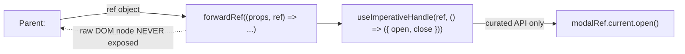
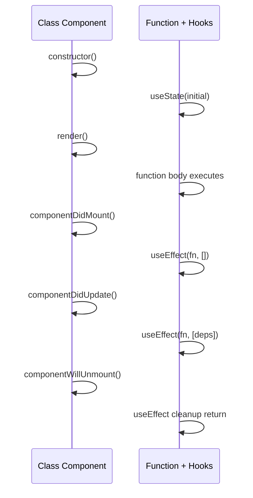

# Chapter 15: Refs Deep-Dive, Imperative APIs & Legacy Class Components

**Prerequisites:** Chapter 9 · **Difficulty:** Level B/C (React)

> 🔗 **Continuing from Chapter 9:** Chapter 9 introduced `useRef` for simple DOM access and mutable values. This chapter completes the imperative side of React's API — `forwardRef`, `useImperativeHandle`, and the class-component model that predates hooks entirely — knowledge you need both for exposing clean component APIs and for reading/maintaining any pre-2019 React codebase you'll inevitably encounter professionally.

---

## 1. Learning Objectives

- **Differentiate** when a ref is the correct tool versus when it signals a state-management mistake.
- **Implement** `forwardRef` to let a parent access a child's DOM node or exposed API.
- **Design** a minimal, well-scoped imperative API using `useImperativeHandle`.
- **Explain** the class component lifecycle and map each lifecycle method to its hook equivalent.
- **Read and reason about** a legacy class-based React codebase confidently.

---

## 2. Motivation

Modern React codebases are overwhelmingly function-component-based, but two situations still force you into imperative or legacy territory: first, some UI operations are **fundamentally imperative** (playing a video, focusing an input, scrolling to an element, triggering a CSS animation) and forcing them through state/props produces awkward, indirect code; second, most companies with a React codebase older than ~2019 still have class components somewhere, and "I've only ever seen hooks" is a real, common gap that stalls interns during their first legacy-code task. This chapter treats both as first-class knowledge, not footnotes.

---

## 3. Core Theory

### 3.1 Refs vs. State, Precisely

Chapter 9 established that `useRef` mutations don't trigger re-renders. The precise decision rule: **if a value's change should ever be reflected in the rendered UI, it belongs in state; if it's purely for imperative access or bookkeeping the render output never depends on, it belongs in a ref.** A cursor's blinking state affects rendering → state. A reference to the `<input>` DOM node itself to call `.focus()` → ref. Conflating these is the single most common ref-related bug: storing UI-affecting data in a ref and wondering why the screen never updates.

### 3.2 `forwardRef`: Passing Refs Through Component Boundaries

By default, a `ref` attribute passed to a custom component is **not** automatically forwarded to an inner DOM node — `<CustomInput ref={myRef} />` does nothing unless `CustomInput` explicitly opts in via `forwardRef((props, ref) => ...)`, attaching that `ref` to whichever inner DOM element it chooses. This is a deliberate encapsulation boundary: a component author decides exactly what, if anything, a ref exposes about their internals, rather than every DOM node being implicitly reachable from outside.

### 3.3 `useImperativeHandle`: Curating a Custom Ref API

`useImperativeHandle(ref, () => ({ ... }))` lets a component expose a **deliberately curated** object instead of a raw DOM node — e.g., a `Modal` component might expose `{ open(), close() }` methods rather than the raw `<dialog>` element, hiding internal implementation details while still giving the parent exactly the imperative control it needs. This is the React-idiomatic equivalent of a class's public method surface.

### 3.4 The Class Component Lifecycle

Before hooks (pre-React 16.8), state and side effects lived in class components via **lifecycle methods**, invoked by React at specific points:

| Lifecycle Method | When It Runs | Function-Component Equivalent |
|---|---|---|
| `constructor` | Once, before first render | `useState` initializer |
| `render` | Every render | The function component body itself |
| `componentDidMount` | Once, after first commit | `useEffect(fn, [])` |
| `componentDidUpdate` | After every subsequent commit | `useEffect(fn, [deps])` |
| `componentWillUnmount` | Before removal from the tree | `useEffect`'s cleanup return function |
| `getDerivedStateFromError` / `componentDidCatch` | On a descendant's render error | No hook equivalent — **still requires a class** (Chapter 15) |

### 3.5 Why Error Boundaries Are Still Classes

`componentDidCatch` and `getDerivedStateFromError` hook into a specific commit-phase error-handling mechanism in React's internals that was never exposed as a hook, because doing so would require a fundamentally different hook execution model (catching errors thrown by *other* components, not the hook's own component) that doesn't fit hooks' per-component, per-render call model. This is a genuine, permanent architectural reason, not a temporary gap — you'll see this applied directly when Chapter 15 builds ScribeCollab's Error Boundary.

### 3.6 When Legacy Classes Still Appear

You'll encounter class components in: codebases predating early 2019, third-party libraries maintaining backward compatibility, and Error Boundaries (Section 3.5). Understanding the lifecycle mapping above is sufficient to confidently read, and even extend, any class-based code you inherit — the underlying concepts (state, effects, cleanup) are identical to what Chapter 9 taught; only the syntax and grouping differ.

---

## 4. Visual Diagrams

### 4.1 `forwardRef` + `useImperativeHandle` Flow



### 4.2 Class Lifecycle Timeline vs. Hooks



---

## 5. Step-by-Step Walkthrough: Building a Modal with a Curated Imperative API

1. `Modal` is defined with `forwardRef`, receiving `(props, ref)` instead of just `props`.
2. Internally, `Modal` manages its own `isOpen` state via `useState` (Chapter 9) — the parent never touches this state directly.
3. `useImperativeHandle(ref, () => ({ open: () => setIsOpen(true), close: () => setIsOpen(false) }))` exposes exactly two methods on `ref.current`, nothing else — the parent cannot reach into `Modal`'s internal state or DOM structure.
4. The parent calls `modalRef.current.open()` in response to a button click — an imperative call, deliberately chosen here because "open this specific modal instance" doesn't cleanly map to a prop-driven declarative pattern when multiple independent modals might exist across the tree.
5. This is a **deliberate, narrow exception** to Chapter 8's "UI as a pure function of state" philosophy — used sparingly, for genuinely imperative operations, not as a general escape hatch from proper state management.

---

## 6. Internal Implementation

Refs are attached to their DOM nodes during React's **commit phase** (Chapter 12) — specifically, after the DOM has been mutated to match the new Fiber tree but in the same synchronous pass, guaranteeing that by the time an effect (`useEffect`/`useLayoutEffect`) runs, any ref pointing at a DOM node is already populated. `forwardRef` works by attaching a special `$$typeof` marker to the component definition that the reconciler recognizes, routing the incoming `ref` prop as a genuine second argument to the component function instead of being swallowed as a regular prop (which is why a plain function component silently ignores a `ref` passed to it — React deliberately intercepts and strips it unless `forwardRef` is used).

---

## 7. Code Examples

### 7.1 Minimal Example — `forwardRef`

```tsx
const FancyInput = forwardRef<HTMLInputElement, { label: string }>((props, ref) => (
  <label>
    {props.label}
    <input ref={ref} />
  </label>
));
```

### 7.2 Practical Example — `useImperativeHandle` Curated API

```tsx
interface ModalHandle { open: () => void; close: () => void; }

const Modal = forwardRef<ModalHandle, { children: React.ReactNode }>((props, ref) => {
  const [isOpen, setIsOpen] = useState(false);
  useImperativeHandle(ref, () => ({
    open: () => setIsOpen(true),
    close: () => setIsOpen(false),
  }));
  if (!isOpen) return null;
  return <div className="modal">{props.children}</div>;
});

function Toolbar() {
  const modalRef = useRef<ModalHandle>(null);
  return <button onClick={() => modalRef.current?.open()}>Share</button>;
}
```

### 7.3 Production-Ready — A Legacy Class Component Read Alongside Its Hook Equivalent

```jsx
// Legacy class component you might inherit:
class PresenceTracker extends React.Component {
  state = { online: false };
  componentDidMount() {
    this.socket = connectPresenceSocket(this.props.userId);
    this.socket.on("status", (online) => this.setState({ online }));
  }
  componentWillUnmount() {
    this.socket.disconnect();
  }
  render() {
    return <span>{this.state.online ? "🟢" : "⚪"}</span>;
  }
}

// Modern equivalent — same lifecycle, hook-based (Chapter 9):
function PresenceTracker({ userId }) {
  const [online, setOnline] = useState(false);
  useEffect(() => {
    const socket = connectPresenceSocket(userId);
    socket.on("status", setOnline);
    return () => socket.disconnect();
  }, [userId]);
  return <span>{online ? "🟢" : "⚪"}</span>;
}
```

### 7.4 Anti-Pattern → Corrected

```jsx
// ❌ ANTI-PATTERN: using a ref to store UI-affecting data, bypassing
// React's render cycle entirely — the count is updated but the screen
// NEVER re-renders, since ref mutations don't trigger updates (Ch.9).
function Counter() {
  const countRef = useRef(0);
  return <button onClick={() => { countRef.current++; }}>{countRef.current}</button>;
}
```

```jsx
// ✅ CORRECTED: this value affects rendered output, so it belongs in
// state, not a ref — per Section 3.1's decision rule.
function Counter() {
  const [count, setCount] = useState(0);
  return <button onClick={() => setCount(c => c + 1)}>{count}</button>;
}
```

### 7.5 Master Walkthrough: Running and Verifying Imperative Ref Examples

To verify how refs pass through custom boundaries and how `useImperativeHandle` curates an isolated API target for parents, follow this guide:

#### Step 1: Create the Component file
Inside your Vite project (`react-setup-sandbox`), create `src/components/ImperativeEditor.tsx`:
```tsx
import React, { forwardRef, useImperativeHandle, useRef, useState } from "react";

// Curated interface exposed to the parent
export interface EditorActions {
    focusAndClear: () => void;
    getLength: () => number;
}

// Child Component opting in via forwardRef
const CodeEditor = forwardRef<EditorActions, { label: string }>((props, ref) => {
    const inputRef = useRef<HTMLInputElement>(null);
    const [val, setVal] = useState("");

    // Expose only specific actions, hiding the raw input DOM node
    useImperativeHandle(ref, () => ({
        focusAndClear: () => {
            console.log("[Child] focusAndClear called imperatively from parent.");
            if (inputRef.current) {
                inputRef.current.focus();
                setVal("");
            }
        },
        getLength: () => {
            return val.length;
        }
    }));

    return (
        <div className="p-4 border rounded bg-gray-50 space-y-2">
            <label className="block text-sm font-semibold text-gray-700">{props.label}</label>
            <input
                ref={inputRef}
                type="text"
                value={val}
                onChange={(e) => setVal(e.target.value)}
                className="border p-2 w-full rounded"
                placeholder="Type code here..."
            />
        </div>
    );
});

CodeEditor.displayName = "CodeEditor";

export function ImperativeSandbox() {
    const editorRef = useRef<EditorActions>(null);
    const [charCount, setCharCount] = useState(0);

    const triggerClear = () => {
        if (editorRef.current) {
            // Retrieve data through the curated API
            const len = editorRef.current.getLength();
            setCharCount(len);
            
            // Execute the action
            editorRef.current.focusAndClear();
        }
    };

    return (
        <div className="p-6 bg-white border rounded max-w-md mx-auto space-y-6">
            <h2 className="text-xl font-bold">Imperative Ref Controller</h2>
            <CodeEditor ref={editorRef} label="ScribeCollab Code Input" />
            <div className="flex gap-4 items-center">
                <button 
                    onClick={triggerClear} 
                    className="px-4 py-2 bg-blue-600 text-white rounded hover:bg-blue-700"
                >
                    Trigger Clear & Focus
                </button>
                <p className="text-sm text-gray-600">
                    Previous length: <strong>{charCount}</strong> characters
                </p>
            </div>
        </div>
    );
}
```

#### Step 2: Import into App.tsx
Update `src/App.tsx` to render the sandbox component:
```tsx
import { ImperativeSandbox } from "./components/ImperativeEditor";

export default function App() {
    return (
        <main className="min-h-screen bg-gray-50 flex items-center justify-center">
            <ImperativeSandbox />
        </main>
    );
}
```

#### Step 3: Run and Diagnose in Browser
1. Start the dev server: `pnpm run dev`.
2. Open the page at [http://localhost:5173](http://localhost:5173).
3. Type some text into the editor input field.
4. Click **"Trigger Clear & Focus"**.
   * Observe that the input field is automatically focused, its content is cleared, and the previous character length is updated below.
   * Open **Console (F12)** and notice the log output showing that the parent called `focusAndClear` on the child's ref. The parent never had access to the raw `<input>` DOM node, keeping implementation details cleanly encapsulated.

---

## 8. Common Mistakes

| Level | Mistake |
|---|---|
| **Junior** | Storing values the UI needs to reflect inside a ref instead of state (7.4), then adding a forced re-render workaround instead of fixing the root cause. |
| **Mid-Level** | Exposing a raw DOM node via `forwardRef` when a curated `useImperativeHandle` API would better encapsulate the component, letting parents reach in and manipulate internals the component never intended to expose. |
| **Senior/Production** | Refusing to touch a legacy class component during a bug fix because "I don't know classes," instead wrapping it in an unnecessary function-component shim — when directly reading and fixing the lifecycle method (using the Section 3.4 mapping) is faster and lower-risk. |

---

## 9. Performance Analysis

- **Ref mutation cost:** O(1), no re-render — the correct tool whenever avoiding a render is specifically desired (e.g., high-frequency values only read imperatively).
- **`useImperativeHandle` cost:** negligible — it only recomputes the exposed object when its own dependency array changes, following the same memoization principles as `useMemo` (Chapter 12).
- **Class components vs. function components:** no meaningful runtime performance difference for equivalent logic — the choice is about API ergonomics and hook availability, not speed.

---

## 10. Security Inventory

- **Over-exposing imperative APIs:** a `useImperativeHandle` object that exposes more than the parent genuinely needs (e.g., exposing an internal `setState` setter directly) reintroduces the same uncontrolled-mutation risk Chapter 3's immutability principles were designed to prevent — curate the exposed surface deliberately.
- **Legacy class components and outdated dependencies:** old class-based code often accompanies old dependency versions with known vulnerabilities — auditing legacy code is also an opportunity to audit its dependency chain (Chapter 6's supply-chain note).

---

## 11. Technology Comparisons

| Approach | Raw DOM `ref` | `forwardRef` + `useImperativeHandle` | Prop-driven state (Chapter 8/9) |
|---|---|---|---|
| **Encapsulation** | None — full DOM node exposed | Curated — only chosen methods exposed | Full — parent only sees props/callbacks |
| **Best for** | Simple focus/scroll access | Reusable component libraries needing controlled imperative access | The default choice for nearly everything else |

---

## 12. Engineering Decisions

ScribeCollab exposes `useImperativeHandle`-curated APIs only for the `Modal` and `Toast` components (7.2's pattern), where "trigger this specific instance imperatively from anywhere" is a genuine requirement — every other component follows Chapter 8/9's prop-driven state model without exception. No new class components are permitted in the codebase; the only class component that exists is the mandatory `ErrorBoundary` from Chapter 15.

---

## 13. Exercises

**Easy:** Explain why `<CustomButton ref={btnRef} />` does nothing by default unless `CustomButton` is wrapped in `forwardRef`.

**Medium:** Convert the legacy `PresenceTracker` class component (7.3) into a fully equivalent function component from scratch without looking at the provided answer, then compare.

**Hard:** Design a `useImperativeHandle` API for a `VideoPlayer` component that needs to expose `play()`, `pause()`, and `seekTo(seconds)` to a parent, while keeping the underlying `<video>` element and all playback state fully encapsulated. Justify why this is an appropriate use of the imperative escape hatch rather than a state/props-driven design.

---

## 14. Capstone Integration Step

**ScribeCollab — Step 10:** Implement the `Modal` (7.2) and a `Toast` notification component using `forwardRef`/`useImperativeHandle`, replacing any ad-hoc state-lifting previously used to trigger them from arbitrary points in the tree. Document, in a code comment on each, why the imperative pattern was chosen over prop-driven state, per Section 12's rubric.

---

## 🔜 Bridge to Chapter 11

You now have the full hooks and imperative API surface. Before going deeper into performance internals, it's worth stopping to build a skill every professional React engineer needs but almost no course teaches explicitly: **debugging**. Chapter 11 covers how to read React's error messages, use Strict Mode correctly, and navigate the browser debugger and React DevTools — the toolkit you'll actually reach for every single day, starting now.

---

## 15. Supplementary Topics & Core Lecture Knowledge

The following supplementary modules map and expand the core React refs, portals, and legacy class component lifecycles:

### 15.1 Refs as Mutable Reference Buffers

A ref is an object with a single mutable `.current` property:
* Unlike state, updating `ref.current = value` compiles as a raw pointer mutation on the heap. It does not trigger V8 execution updates or trigger a re-render phase.
* **Refs for DOM Manipulation**: Attaching `ref={myRef}` to an input node injects the raw browser DOM handle into `myRef.current` during the commit phase, enabling imperative actions like `.focus()` or `.select()`.
* **Refs for Timer Handles**: Refs are the standard container to store interval or timeout IDs across rendering frames, preventing variables from getting lost or re-allocated during re-renders.

### 15.2 Portal Layout Escape Hatches

The React Portal API (`createPortal(children, domNode)`) lets you render elements elsewhere in the real DOM tree:
* **The Problem**: CSS rules like `overflow: hidden` or `position: relative` create stacking contexts that clip child components like dialog screens or tooltips.
* **The Solution**: Portal mounts overlays directly onto a target node (like `document.body` or `#portal-root`), bypassing visual layout containers while retaining normal event bubbling and Context access in the React component tree.

### 15.3 Class Component Lifecycles & State Models

In legacy class-based React, components extend `React.Component` and manage state as a class instance property:
* **Initial State**: Defined as a class property (`state = { count: 0 }`).
* **State Updates**: Handled via `this.setState({ count: 1 })`. Unlike `useState` which replaces state, `this.setState` performs a shallow merge on the current state object.
* **Lifecycles**: Class lifecycles partition operations clearly:
  * `componentDidMount()` runs once after the initial render. Ideal for network handshake requests.
  * `componentDidUpdate(prevProps, prevState)` runs after commits. You must wrap network requests inside comparison conditionals: `if (this.props.id !== prevProps.id)` to avoid loop cascades.
  * `componentWillUnmount()` runs before cleanups. Essential to clear event listeners.

```tsx
// Example Legacy Lifecycle Pattern:
class TimerClass extends React.Component {
  private timerId: number | null = null;

  componentDidMount() {
    this.timerId = window.setInterval(() => {
      console.log("Tick");
    }, 1000);
  }

  componentWillUnmount() {
    if (this.timerId) window.clearInterval(this.timerId);
  }

  render() {
    return <div>Class Component Timer Active</div>;
  }
}
```
