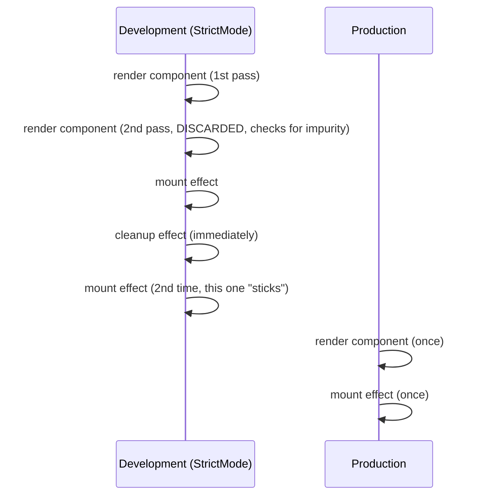
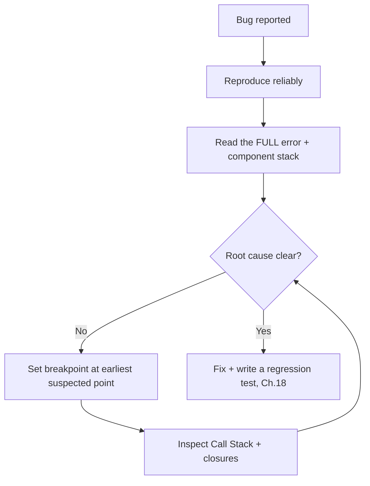

# Chapter 16: Debugging, Strict Mode & Developer Tools

**Prerequisites:** Chapter 10 · **Difficulty:** Level B (React / Browser)

> 🔗 **Continuing from Chapter 10:** You now have the full hooks and imperative API surface. Before this course goes deeper into performance internals, this chapter builds the debugging skillset you'll actually use every single day: reading React's error messages correctly, understanding what Strict Mode is really telling you, and navigating the browser debugger and React DevTools like an engineer who's done this a thousand times, not someone guessing with `console.log`.

---

## 1. Learning Objectives

- **Read** a React error message and stack trace to identify the actual root cause, not just the symptom line.
- **Explain** why Strict Mode double-invokes functions in development and what bugs it's designed to surface.
- **Use** browser breakpoints (including conditional breakpoints) to pause execution at the exact moment a bug occurs.
- **Navigate** the React DevTools Components and Profiler tabs to inspect live props, state, and hooks.
- **Diagnose** a broken component systematically, using a repeatable process rather than trial-and-error.

---

## 2. Motivation

The gap between a junior and a senior engineer is rarely "knows more APIs" — it's overwhelmingly "can debug faster." An engineer who understands Strict Mode's double-invocation won't waste two hours convinced their `useEffect` has a bug when it's actually working exactly as designed in development. An engineer who knows how to set a conditional breakpoint finds a rare race condition in minutes instead of adding twenty `console.log` statements and guessing. This chapter is deliberately placed here, right after you've learned the full hooks and imperative API surface (Chapters 9–10), because that's exactly the point where React starts producing genuinely confusing runtime warnings — and where a systematic debugging process pays for itself immediately.

---

## 3. Core Theory

### 3.1 Reading React Error Messages

React's console warnings and errors are unusually information-dense compared to typical runtime errors, and they follow predictable patterns:

- **"Warning: Each child in a list should have a unique 'key' prop."** — points directly to Chapter 8's key requirement; React even names the specific component tree location.
- **"Cannot update a component while rendering a different component."** — almost always means a state setter is being called synchronously *during* another component's render phase (Chapter 12), violating the pure-function contract from Chapter 8.
- **"Maximum update depth exceeded."** — a `setState` call inside a `useEffect` with a dependency array that includes the very state being set, without a stable exit condition, creating an infinite render loop directly traceable to Chapter 9's dependency-array rules.
- **A component stack trace** (printed below most React warnings) lists the exact JSX nesting path from the root to the offending component — read it top-to-bottom as "this component, rendered by this one, rendered by this one" to localize the bug's origin, not just where the symptom surfaced.

### 3.2 Strict Mode: What It Actually Does

`<StrictMode>` is a **development-only** wrapper that changes no production behavior whatsoever. In development, it deliberately:

1. **Double-invokes** component function bodies, reducer functions, and state initializer functions on every render.
2. **Double-invokes** `useEffect`/`useState` setup functions (mount → cleanup → mount again) for every effect.
3. Warns about legacy APIs (old lifecycle methods, legacy context, `findDOMNode`).

The double-invocation is not a bug in your code being "run twice for no reason" — it exists specifically to surface impure render logic and effects with missing/incorrect cleanup **before** they cause a real, hard-to-reproduce bug under React's Concurrent Mode (Chapter 12), which genuinely can render a component more than once, discard the result, and try again. If your effect breaks under Strict Mode's double-invocation, it would have broken silently and intermittently in production concurrent rendering anyway — Strict Mode just makes it happen deterministically, every time, in development.

### 3.3 The Browser Debugger

`debugger;` statements and DevTools breakpoints pause execution and expose the **exact Call Stack** (Chapter 2) and all in-scope variables at that point — vastly more informative than a `console.log` guess, especially for closures (Chapter 2), since the debugger shows you the actual captured environment, not just a snapshot value at log time. **Conditional breakpoints** (right-click a line number → "Add conditional breakpoint") pause only when an expression is true — essential for bugs that only manifest on, say, the 500th iteration of a loop or a specific `docId`.

### 3.4 React DevTools

The React DevTools browser extension adds two panels:

- **Components tab:** shows the live Fiber tree (Chapter 12) with each component's current props, state, and hooks values — including the ability to edit them live to test a hypothesis without changing code.
- **Profiler tab:** records render timings per component per commit (previewed here, used extensively in Chapter 12) — the first place to look when a component "feels slow" rather than guessing at the cause.

---

## 4. Visual Diagrams

### 4.1 Strict Mode Double-Invocation Timeline



### 4.2 Systematic Debugging Process



---

## 5. Step-by-Step Walkthrough: Diagnosing "Maximum Update Depth Exceeded"

```jsx
function DocumentEditor({ docId }) {
  const [wordCount, setWordCount] = useState(0);
  const stats = computeStats(docId); // returns a NEW object every render

  useEffect(() => {
    setWordCount(stats.words); // triggers a re-render
  }, [stats]); // ❌ `stats` is a new object reference every render

  return <p>{wordCount} words</p>;
}
```

1. **Reproduce:** the console fills with "Maximum update depth exceeded" almost immediately on mount.
2. **Read the error:** React points at the `useEffect` call inside `DocumentEditor` via the component stack.
3. **Reason about the dependency array:** `stats` is recomputed by calling `computeStats(docId)` directly in the render body, which — per Chapter 3's reference-equality rules — produces a **new object** on every single render, even if its contents are identical.
4. **Trace the loop:** effect runs → calls `setWordCount` → triggers a re-render → `computeStats` runs again, producing a new `stats` reference → the effect's dependency array sees a "changed" value → the effect runs again → infinite loop.
5. **Fix:** wrap `computeStats(docId)` in `useMemo(() => computeStats(docId), [docId])` (Chapter 12) so `stats` only changes when `docId` actually changes, breaking the cycle.

---

## 6. Internal Implementation

Strict Mode's double-invocation is implemented by React deliberately calling your function component body and certain hook callbacks twice in a row during development builds only — gated behind a build-time flag that's compiled out entirely in production bundles (Chapter 6), which is why it has **zero production performance cost** despite feeling like it "runs everything twice." The mount → cleanup → mount effect sequence specifically simulates what happens when a component is removed and reinserted into the tree — a real scenario under Concurrent Mode's ability to discard and restart in-progress work (Chapter 12) — surfacing effects that assume "mount only happens once, ever," which is not a guarantee React actually makes.

---

## 7. Code Examples

### 7.1 Minimal Example — Conditional Breakpoint (DevTools, not code)

```
Right-click the line number in Chrome DevTools Sources panel →
"Add conditional breakpoint" → enter: docId === "doc-42"
// Execution now pauses ONLY when processing that specific document,
// letting you skip past hundreds of irrelevant iterations.
```

### 7.2 Practical Example — Reading a Component Stack Trace

```
Warning: Each child in a list should have a unique "key" prop.

    at DocumentRow (DocumentList.tsx:12)
    at DocumentList (DocumentList.tsx:8)
    at Sidebar (Sidebar.tsx:22)
    at WorkspaceShell (WorkspaceShell.tsx:15)
```
Read bottom-to-top for the render path (`WorkspaceShell` → `Sidebar` → `DocumentList` → `DocumentRow`), and top-to-bottom to find exactly which component is missing the `key` — here, the `.map()` call inside `DocumentList.tsx` at line 8 that renders `DocumentRow`.

### 7.3 Production-Ready — A `useEffect` Written to Survive Strict Mode

```tsx
// This effect is correctly idempotent — mount/cleanup/mount under
// Strict Mode leaves the final state identical to a single mount,
// because the cleanup function fully undoes everything setup did.
useEffect(() => {
  const controller = new AbortController();
  let cancelled = false;

  fetchDocument(docId, controller.signal).then((doc) => {
    if (!cancelled) setDoc(doc);
  });

  return () => {
    cancelled = true;
    controller.abort(); // fully reverses the fetch's in-flight effect
  };
}, [docId]);
```

### 7.4 Anti-Pattern → Corrected

```jsx
// ❌ ANTI-PATTERN: an effect that assumes it only ever runs once,
// breaking under Strict Mode's mount/cleanup/mount cycle — this
// pushes a DUPLICATE entry into the analytics log in development,
// masking the fact that the same bug would cause duplicate real
// events under Concurrent Mode's discard-and-retry behavior.
useEffect(() => {
  analytics.logEvent("document_opened", { docId }); // no cleanup, not idempotent
}, [docId]);
```

```jsx
// ✅ CORRECTED: track whether THIS effect instance already fired,
// and guard against the cleanup/remount cycle firing it twice.
useEffect(() => {
  let firedByThisInstance = true;
  analytics.logEvent("document_opened", { docId });
  return () => { firedByThisInstance = false; };
}, [docId]);
// Better still: move one-time-per-entity analytics to a server-side
// event keyed on a real "open" action rather than a client mount effect.
```

### 7.5 Master Walkthrough: Running and Diagnosing Strict Mode Double-Mounts

To observe Strict Mode's double-mount diagnostics in real time and see how it exposes effect memory leaks, follow this walkthrough:

#### Step 1: Create the Component file
Inside your Vite project (`react-setup-sandbox`), create `src/components/StrictSandbox.tsx`:
```tsx
import React, { useState, useEffect } from "react";

function LeakyTimer() {
    const [seconds, setSeconds] = useState(0);

    // Anti-Pattern: registering interval without cleanup
    useEffect(() => {
        console.log("[LeakyTimer] Effect running, setting up interval.");
        setInterval(() => {
            setSeconds(s => s + 1);
        }, 1000);
        // Missing cleanup: does not call clearInterval
    }, []);

    return (
        <div className="p-4 bg-red-50 border border-red-200 rounded">
            <p className="text-red-700 font-semibold">Leaky Timer: {seconds}s</p>
            <p className="text-xs text-red-500 mt-1">Check console logs to see duplicate intervals running!</p>
        </div>
    );
}

function CleanTimer() {
    const [seconds, setSeconds] = useState(0);

    // Corrected: registering interval with proper cleanup
    useEffect(() => {
        console.log("[CleanTimer] Effect running, setting up interval.");
        const intervalId = setInterval(() => {
            setSeconds(s => s + 1);
        }, 1000);

        return () => {
            console.log("[CleanTimer] Cleaning up interval.");
            clearInterval(intervalId);
        };
    }, []);

    return (
        <div className="p-4 bg-green-50 border border-green-200 rounded">
            <p className="text-green-700 font-semibold">Clean Timer: {seconds}s</p>
            <p className="text-xs text-green-500 mt-1">Cleans up correctly on re-mount!</p>
        </div>
    );
}

export function StrictSandbox() {
    const [showTimers, setShowTimers] = useState(true);

    return (
        <div className="p-6 bg-white border rounded max-w-md mx-auto space-y-6">
            <h2 className="text-xl font-bold">Strict Mode Sandbox</h2>
            <button 
                onClick={() => setShowTimers(!showTimers)} 
                className="px-4 py-2 bg-blue-600 text-white rounded hover:bg-blue-700"
            >
                Toggle Timers View
            </button>
            {showTimers && (
                <div className="space-y-4">
                    <LeakyTimer />
                    <CleanTimer />
                </div>
            )}
        </div>
    );
}
```

#### Step 2: Import into App.tsx
Update `src/App.tsx` to render the sandbox component:
```tsx
import { StrictSandbox } from "./components/StrictSandbox";

export default function App() {
    return (
        <main className="min-h-screen bg-gray-50 flex items-center justify-center">
            <StrictSandbox />
        </main>
    );
}
```

#### Step 3: Run and Diagnose in Browser
1. Start the dev server: `pnpm run dev`.
2. Open the page at [http://localhost:5173](http://localhost:5173).
3. Open Browser **DevTools (F12)** and inspect the **Console** tab.
4. Notice that because of Strict Mode double-mounting:
   * `[LeakyTimer]` logs mounting **once** then **twice**. Because it has no cleanup, **two intervals are running in parallel**, making the timer count up twice as fast (skipping numbers).
   * `[CleanTimer]` logs mounting, then unmounting (cleaning the first interval), then mounting again. Only **one single interval remains active**, making the timer count up correctly.
5. Click **"Toggle Timers View"** to hide the timers.
   * Observe that the `CleanTimer` log displays unmount, completely clearing its interval.
   * However, `LeakyTimer`'s console logs keep printing background state setters, representing a memory leak.

---

## 8. Common Mistakes

| Level | Mistake |
|---|---|
| **Junior** | Seeing an effect run twice in development and concluding "Strict Mode is buggy," disabling it instead of fixing the underlying non-idempotent effect it correctly surfaced. |
| **Mid-Level** | Debugging exclusively with scattered `console.log` statements instead of a single breakpoint, spending far longer than necessary and often removing/re-adding logs across several cycles. |
| **Senior/Production** | Shipping code that "works" only because development's single-render, non-Strict-Mode behavior happened to mask a race condition that a later React upgrade (enabling more aggressive Concurrent features) turns into an intermittent production bug. |

---

## 9. Performance Analysis

- **Strict Mode cost:** development-only, compiled away entirely in production builds (Chapter 6) — zero production runtime cost, despite the doubled function calls you observe locally.
- **Breakpoint-based debugging cost:** pausing execution has no cost to the *shipped* application (DevTools-only); the cost is purely developer time, and a well-placed conditional breakpoint is almost always faster than iterative `console.log` cycles for non-trivial bugs.
- **React DevTools Profiler overhead:** recording profiling data adds measurable overhead *while recording* — never leave profiling instrumentation (Chapter 12's `<Profiler>` component) enabled unconditionally in production.

---

## 10. Security Inventory

- **Leaving `debugger;` statements in committed code:** a forgotten `debugger;` statement ships to production and pauses execution for any user with DevTools open — lint for this (`no-debugger` ESLint rule) as a CI gate (Chapter 19).
- **React DevTools exposing application state:** the Components tab reveals live props/state to anyone with the extension installed and DevTools open on your page — avoid rendering raw sensitive data (unmasked tokens, full PII) into component state/props where it doesn't need to be, since it's trivially inspectable this way regardless of what's visually rendered.
- **Console logging sensitive data during debugging:** temporary debug `console.log(user)` calls containing tokens or PII are easy to forget and ship — treat any debug logging of request/response objects with the same care as Chapter 19's structured-logging PII guidance.

---

## 11. Technology Comparisons

| Debugging Approach | `console.log` | Browser Breakpoints | React DevTools |
|---|---|---|---|
| **Shows live closures/scope** | No — only the value at log time | Yes — full scope inspection | Partial — component-level state/props |
| **Interrupts execution** | No | Yes | No |
| **Best for** | Quick, low-stakes value checks | Complex logic bugs, race conditions | Component tree structure, prop/state drilling issues, render performance |

---

## 12. Engineering Decisions

ScribeCollab's codebase runs `<StrictMode>` unconditionally in development (never disabled, even temporarily "to stop the noise") — any effect that breaks under Strict Mode is treated as a genuine bug to fix, not friction to suppress, per Section 3.2's reasoning. `no-debugger` and `no-console` (except through the Chapter 19 structured logger) are enforced as CI lint gates, ensuring debugging artifacts never reach production by accident.

---

## 13. Exercises

**Easy:** Explain why a `useEffect` that calls `analytics.logEvent(...)` with no cleanup function might record duplicate events under Strict Mode in development, and why that's useful information rather than a false alarm.

**Medium:** Given a "Maximum update depth exceeded" error, write out the exact five-step diagnostic process you'd follow (referencing Section 5) to locate and fix the root cause in an unfamiliar component.

**Hard:** A teammate disabled `<StrictMode>` across the entire ScribeCollab app six months ago "to fix a weird double-fetch bug," and the team has since shipped three production incidents traceable to non-idempotent effects that Strict Mode would have caught locally. Write a short technical memo (150-250 words) making the case for re-enabling it, addressing the likely objection that "it makes local development noisier."

---

## 14. Capstone Integration Step

**ScribeCollab — Step 11:** Audit every `useEffect` in the workspace codebase built so far (Chapters 8–10) for Strict Mode idempotency, fixing any that assume single-invocation (using the pattern in 7.3/7.4). Add `no-debugger` and a custom `no-console` lint rule to the project's ESLint config, to be enforced in Chapter 19's CI pipeline.

---

## 🔜 Bridge to Chapter 12

You can now debug confidently. Under fast, continuous input (like rapid typing in ScribeCollab's editor), naive re-rendering still causes visible jank — and Strict Mode's double-render behavior you just learned about is only explainable once you understand *why* React can render a component more than once per commit. Chapter 12 opens up React's Fiber architecture and Concurrent Mode: the internal engine that decides when and how your `useState` updates actually reach the screen.

---

## 15. Supplementary Topics & Core Lecture Knowledge

The following supplementary modules map and expand the core React debugging, DevTools, and Strict Mode mechanics:

### 15.1 Anatomy of React DevTools & Fiber Inspections

The React DevTools browser extension exposes two main tabs that inspect the internal Fiber tree:
* **Components Tab**:
  * Displays the visual hierarchy of components. Selecting a component displays its current props, state, hooks, and parent context values.
  * Allows you to edit state values live, triggering instant re-renders to test different UI conditions.
  * Allows you to check the source file location of the component, jumping straight to browser debugger files.
* **Profiler Tab**:
  * Records render durations for each component in the tree.
  * Shows "Why did this render?" (e.g. state change, prop change, parent render) to help you isolate unnecessary render loops.

### 15.2 Demystifying React Error Overlays & Call Stacks

When React encounters a rendering error in development, it displays a full-screen red error overlay. To debug efficiently:
1. **Locate the Error Origin**: Read the top line of the error trace (e.g. `TypeError: Cannot read properties of undefined (reading 'map')`).
2. **Examine the Component Stack**: Look below the native JS stack trace for the "Component Stack" trace. This trace displays the exact component parent-child nesting path (e.g. `App` -> `WorkspaceShell` -> `EditorPane`), narrowing down the visual container that crashed.
3. **Check Source Maps**: Click the file paths in the overlay to open the code directly inside your browser DevTools source panel or IDE workspace.

### 15.3 Browser Breakpoints vs. Console Logs

Relying solely on `console.log` forces you to keep modifying and re-compiling code. Instead, master the browser debugger:
* **Inline Breakpoints**: Open DevTools (`F12`) -> **Sources** tab -> Locate your source file. Click on the line number inside your event handler or component function to set a pause trigger.
* **Conditional Breakpoints**: Right-click a line number and add a conditional expression like `userId === undefined`. The debugger will pause execution *only* when this returns true, letting you inspect closure scope variables live.
* **Call Stack Navigation**: While paused, look at the "Call Stack" panel on the right. You can click on previous stack frames to step backward in time and inspect parent variable scopes.
