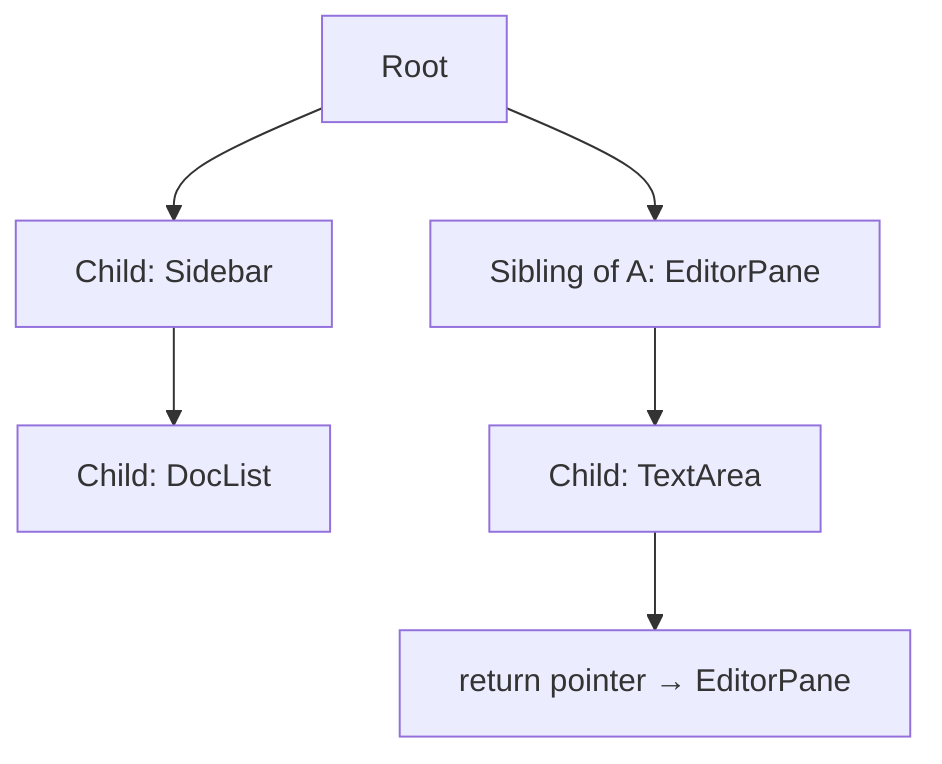
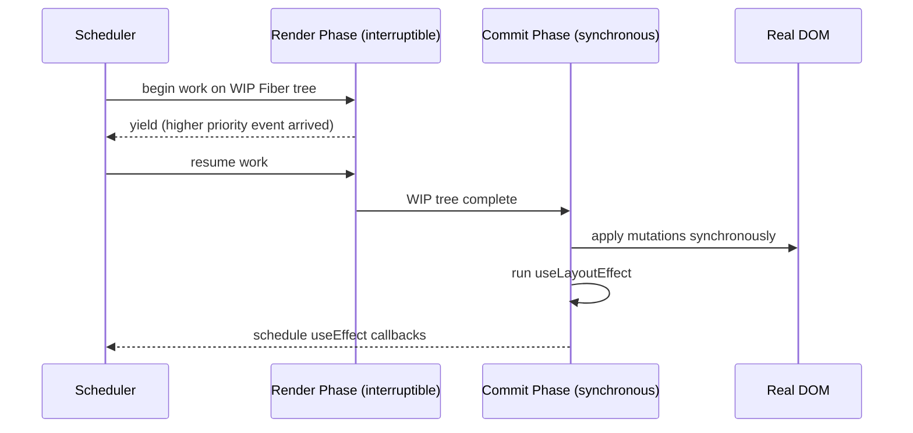
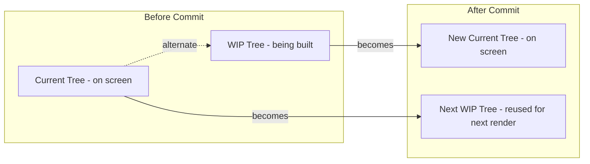

# Chapter 17: React Rendering Internals & Concurrent Mode

**Prerequisites:** Chapter 9, Chapter 11 (and Chapter 2) · **Difficulty:** Level C (React)

> 🔗 **Continuing from Chapter 11:** You can now debug confidently, including reasoning about Strict Mode's double-render behavior. This chapter explains *why* React is even capable of rendering a component more than once per commit in the first place — directly building on Chapter 2's Call Stack model and Chapter 4's event loop, since React's scheduler is, at its core, a custom cooperative task scheduler layered on top of both.

---

## 1. Learning Objectives

- **Explain** the Fiber architecture as a linked-list-based reification of the Call Stack, enabling interruptible rendering.
- **Differentiate** the Render Phase from the Commit Phase and their respective guarantees.
- **Trace** the double-buffering mechanism between the Current Tree and the Work-In-Progress Tree.
- **Apply** `useTransition` and `useDeferredValue` to prioritize urgent updates over expensive ones.
- **Diagnose** rendering performance issues using the React Profiler and Chrome Performance panel.

---

## 2. Motivation

A synchronous, recursive Virtual DOM diff (as pre-Fiber React and many other frameworks implement) has one fatal flaw: once started, it cannot be paused. On a large tree, this means a single re-render can block the main thread long enough to make an app feel unresponsive to typing or clicking — directly recreating the "frozen UI" failure mode you diagnosed in Chapter 4 with long synchronous macrotasks. React's Fiber architecture exists specifically to solve this: it re-implements the recursive tree-walk as an **interruptible, resumable** unit-of-work queue, so React can pause mid-render, let the browser handle an urgent input event or paint a frame, and resume exactly where it left off. This is also the exact mechanism behind Chapter 11's Strict Mode double-render: because rendering is just data-driven unit-of-work processing rather than an irreversible native call stack, React can deliberately throw away and redo it to check for impurity. Understanding this is what separates engineers who can *use* `useTransition` from engineers who can explain *why* it exists and correctly predict when it will and won't help.

---

## 3. Core Theory

### 3.1 Fiber: Reifying the Call Stack

A **Fiber** is a plain JavaScript object representing a single unit of work for one component instance, with explicit `child`, `sibling`, and `return` (parent) pointers — deliberately structured as a **singly-linked list tree** rather than relying on the native JS Call Stack (Chapter 2) for traversal. Because it's just data, not actual stack frames, React can pause traversal at any Fiber node, save its position, yield control back to the browser's event loop (Chapter 4), and resume later — something a native recursive function call on the real Call Stack fundamentally cannot do (you cannot "pause" a JS call stack frame and hand control back arbitrarily).

### 3.2 Render Phase vs. Commit Phase

- **Render Phase:** React calls your component functions, computes the new Fiber tree, and diffs it against the current tree — this phase is **interruptible** and can be thrown away and restarted (which is why component functions must be pure — Chapter 8 — since they might run more than once per eventual commit, exactly as Chapter 11's Strict Mode demonstrates deliberately).
- **Commit Phase:** React applies the computed DOM mutations, runs layout effects (`useLayoutEffect`) synchronously, then schedules `useEffect` callbacks — this phase is **synchronous and uninterruptible**, guaranteeing the DOM is never left in a half-updated, inconsistent state.

### 3.3 Double-Buffering: Current Tree vs. Work-In-Progress Tree

React keeps **two** Fiber trees alive simultaneously: the **Current Tree** (reflecting what's on screen) and a **Work-In-Progress (WIP) Tree** being built during the Render Phase. Each Fiber node has an `alternate` pointer linking it to its counterpart in the other tree. When the Render Phase completes, React atomically swaps which tree is "current" — a technique directly analogous to double-buffering in graphics rendering, ensuring the screen never displays a partially-rendered intermediate state.

### 3.4 The Scheduler & Priority Lanes

React's Scheduler assigns each update a **priority lane** (e.g., discrete user input like clicks/typing gets the highest priority; transitions and data fetching get lower priority). Using techniques conceptually similar to `requestIdleCallback`, the Scheduler processes Fiber units of work in small time slices, checking after each unit whether it should yield back to the browser (to handle a higher-priority event or paint a frame) before continuing — this is the direct mechanism that keeps input responsive even during large re-renders.

### 3.5 `useTransition` and `useDeferredValue`

- **`useTransition`** marks a state update as **non-urgent**: React will render it at lower priority, allowing more urgent updates (like the next keystroke) to interrupt and be processed first, without blocking the input itself.
- **`useDeferredValue`** takes a value and returns a version of it that "lags behind" during urgent updates, letting you render an expensive downstream computation (like a Markdown preview) using a stale-but-responsive value while urgent work (the raw input) stays instantly responsive.

### 3.6 The React Compiler ("React Forget")

Manual memoization (`useMemo`, `useCallback`, `React.memo`) exists to avoid the cost from Section 3.1's re-render mechanics — recomputing a value or re-rendering a subtree unnecessarily. The React Compiler statically analyzes component code at build time and **automatically inserts equivalent memoization**, based on the same reference-equality principles from Chapter 3, without requiring developers to manually manage dependency arrays — reducing an entire class of stale-memoization bugs where a manually-specified dependency array is subtly wrong.

---

## 4. Visual Diagrams

### 4.1 Fiber Tree Traversal (Linked List, Not Native Recursion)



### 4.2 Render/Commit Phase Separation



### 4.3 Double-Buffered Tree Swap



---

## 5. Step-by-Step Walkthrough: Splitting Urgent Input from Expensive Rendering

```jsx
function MarkdownEditor() {
  const [rawText, setRawText] = useState("");
  const [isPending, startTransition] = useTransition();
  const deferredText = useDeferredValue(rawText);

  function handleChange(e) {
    setRawText(e.target.value);       // urgent: must feel instant
    startTransition(() => {
      // marks any state derived here as low priority (alternative pattern)
    });
  }

  return (
    <>
      <textarea value={rawText} onChange={handleChange} />
      <div style={{ opacity: isPending ? 0.6 : 1 }}>
        <MarkdownPreview text={deferredText} />  {/* expensive render */}
      </div>
    </>
  );
}
```

1. User types a character; `setRawText` is called — this update has **high priority** because it's a direct response to discrete input, so React renders the `<textarea>` update immediately, keeping the cursor perfectly responsive.
2. `deferredText` initially still holds the **previous** value — React schedules a **low-priority** re-render to catch it up to `rawText`.
3. If the user types again before that low-priority render completes, the Scheduler **interrupts** the in-progress low-priority `MarkdownPreview` render (Section 3.4's yield mechanism) and prioritizes the new urgent `textarea` update instead.
4. Once typing pauses, the Scheduler finally has an idle window to complete the deferred `MarkdownPreview` render, and the UI settles to a fully consistent state — the user experienced zero input lag throughout.

---

## 6. Internal Implementation

The Fiber reconciler's "unit of work" loop is, concretely, a `while` loop (`workLoopConcurrent`) that processes one Fiber node at a time and calls `shouldYield()` (backed by the Scheduler package, using techniques similar to `MessageChannel`-based macrotask scheduling from Chapter 4) after each unit — if `shouldYield()` returns true (typically because the current time slice, ~5ms, has elapsed, or the browser reports pending input), the loop exits and control returns to the browser's event loop, exactly the "yield back to the event loop" pattern you implemented manually with `processInChunks` in Chapter 4. React's Concurrent Mode is, at its core, the same chunking technique from Chapter 4 — applied automatically, systematically, and with priority-aware scheduling, to the specific problem of tree reconciliation.

---

## 7. Code Examples

### 7.1 Minimal Example — `useTransition`

```jsx
const [isPending, startTransition] = useTransition();
function handleTabChange(nextTab) {
  startTransition(() => setActiveTab(nextTab)); // low priority, interruptible
}
```

### 7.2 Practical Example — Deferred Search Results

```jsx
function SearchableDocList({ docs }) {
  const [query, setQuery] = useState("");
  const deferredQuery = useDeferredValue(query);
  const results = useMemo(
    () => docs.filter((d) => d.title.includes(deferredQuery)),
    [docs, deferredQuery]
  );
  return (
    <>
      <input value={query} onChange={(e) => setQuery(e.target.value)} />
      <ResultsList results={results} />
    </>
  );
}
```

### 7.3 Production-Ready — Profiling-Instrumented Editor Wrapper

```tsx
import { Profiler, type ProfilerOnRenderCallback } from "react";

const onRenderCallback: ProfilerOnRenderCallback = (
  id, phase, actualDuration, baseDuration
) => {
  if (actualDuration > 16) { // exceeded one 60fps frame budget
    console.warn(`[perf] ${id} (${phase}) took ${actualDuration.toFixed(1)}ms`);
  }
};

export function ProfiledEditor({ children }: { children: React.ReactNode }) {
  return (
    <Profiler id="ScribeCollabEditor" onRender={onRenderCallback}>
      {children}
    </Profiler>
  );
}
```

### 7.4 Anti-Pattern → Corrected

```jsx
// ❌ ANTI-PATTERN: every keystroke triggers a full, synchronous,
// expensive Markdown-to-HTML compilation on the SAME priority as the
// text input update — the cursor visibly stutters on large documents.
function Editor() {
  const [text, setText] = useState("");
  const html = compileMarkdownToHtml(text); // expensive, runs every render
  return (
    <>
      <textarea value={text} onChange={(e) => setText(e.target.value)} />
      <div dangerouslySetInnerHTML={{ __html: html }} />
    </>
  );
}
```

```jsx
// ✅ CORRECTED: input stays high-priority; the expensive compile step
// runs against a DEFERRED value, so it never blocks keystroke rendering.
function Editor() {
  const [text, setText] = useState("");
  const deferredText = useDeferredValue(text);
  const html = useMemo(() => compileMarkdownToHtml(deferredText), [deferredText]);
  return (
    <>
      <textarea value={text} onChange={(e) => setText(e.target.value)} />
      <div dangerouslySetInnerHTML={{ __html: html }} />
    </>
  );
}
```

### 7.5 Additional Example — `startTransition` for Non-Urgent Tab Switching

```jsx
function DocumentTabs({ tabs }) {
  const [activeTab, setActiveTab] = useState(tabs[0].id);
  const [isPending, startTransition] = useTransition();

  function selectTab(tabId) {
    startTransition(() => setActiveTab(tabId)); // deprioritized vs. urgent input
  }

  return (
    <>
      <nav>
        {tabs.map((tab) => (
          <button key={tab.id} onClick={() => selectTab(tab.id)} style={{ opacity: isPending ? 0.7 : 1 }}>
            {tab.label}
          </button>
        ))}
      </nav>
      <TabPanel tabId={activeTab} /> {/* potentially expensive to render */}
    </>
  );
}
```

Wrapping `setActiveTab` in `startTransition` tells React the resulting render is interruptible — if the user clicks a second tab before the first tab's (expensive) `TabPanel` finishes rendering, React abandons the stale in-progress render and starts fresh on the new tab, rather than finishing a render the user no longer cares about, directly applying Section 3.4's priority-lane model to a common UI pattern.

### 7.6 Master Walkthrough: Running and Verifying Concurrent Transitions

To observe how Concurrent Mode scheduling keeps input responsive during heavy render calculations, follow this walkthrough:

#### Step 1: Create the Component file
Inside your Vite project (`react-setup-sandbox`), create `src/components/ConcurrentSandbox.tsx`:
```tsx
import React, { useState, useDeferredValue, useMemo } from "react";

// Helper component that simulates expensive rendering load
function ExpensiveList({ query }: { query: string }) {
    console.log(`[ExpensiveList] Rendering for query: "${query}"`);
    
    // Artificially slow down rendering block
    const items = useMemo(() => {
        const result = [];
        for (let i = 0; i < 15000; i++) {
            if (i % 200 === 0) {
                // Yield simulation or check if query is matching
                result.push({ id: i, label: `Item ${i} matching "${query}"` });
            }
        }
        // Artificial busy-wait to stress the render engine (~40ms)
        const start = performance.now();
        while (performance.now() - start < 40) {
            // block main thread
        }
        return result;
    }, [query]);

    return (
        <ul className="border p-2 rounded max-h-60 overflow-y-auto space-y-1 text-sm bg-gray-50">
            {items.map(item => (
                <li key={item.id} className="py-1 border-b text-gray-700">{item.label}</li>
            ))}
        </ul>
    );
}

export function ConcurrentSandbox() {
    const [query, setQuery] = useState("");
    const [useConcurrent, setUseConcurrent] = useState(false);
    
    // Defers the value update for concurrent path
    const deferredQuery = useDeferredValue(query);

    return (
        <div className="p-6 bg-white border rounded max-w-md mx-auto space-y-6">
            <h2 className="text-xl font-bold">Concurrent Mode Sandbox</h2>
            <div className="flex gap-4 items-center">
                <label className="flex items-center gap-2 font-medium text-sm">
                    <input 
                        type="checkbox" 
                        checked={useConcurrent} 
                        onChange={(e) => setUseConcurrent(e.target.checked)}
                    />
                    Enable useDeferredValue
                </label>
            </div>
            
            <div className="space-y-2">
                <label className="block text-sm font-semibold text-gray-700">Search Workspace Logs</label>
                <input
                    type="text"
                    value={query}
                    onChange={(e) => setQuery(e.target.value)}
                    className="border p-2 w-full rounded focus:ring-2 focus:ring-blue-500 outline-none"
                    placeholder="Type fast here..."
                />
            </div>

            <div className="space-y-2">
                <h3 className="font-semibold text-sm">Results Feed:</h3>
                {useConcurrent ? (
                    // Concurrent search: passes deferred value
                    <ExpensiveList query={deferredQuery} />
                ) : (
                    // Synchronous search: passes live state
                    <ExpensiveList query={query} />
                )}
            </div>
        </div>
    );
}
```

#### Step 2: Import into App.tsx
Update `src/App.tsx` to render the sandbox component:
```tsx
import { ConcurrentSandbox } from "./components/ConcurrentSandbox";

export default function App() {
    return (
        <main className="min-h-screen bg-gray-50 flex items-center justify-center">
            <ConcurrentSandbox />
        </main>
    );
}
```

#### Step 3: Run and Diagnose in Browser
1. Start the dev server: `pnpm run dev`.
2. Open the page at [http://localhost:5173](http://localhost:5173).
3. First, leave **"Enable useDeferredValue" unchecked** (the synchronous path).
4. Type in the input field as fast as you can.
   * Observe that the input field **lags heavily**. Your keystrokes do not render on screen in real time because the main thread is locked, busy compiling the list on every single key press.
5. Now, check **"Enable useDeferredValue"**.
6. Type fast again.
   * Observe that the typing is **completely responsive and fluid**! 
   * The list results lag slightly behind because React is rendering them at a lower priority, keeping the input updates responsive.
7. Open **React Profiler** or console logs to trace how the search runs asynchronously in the background.

---

## 8. Common Mistakes

| Level | Mistake |
|---|---|
| **Junior** | Assuming all state updates are equally "instant," and not recognizing when an expensive derived computation is coupled to a high-frequency input, causing visible jank. |
| **Mid-Level** | Wrapping *everything* in `useTransition`/`useDeferredValue` defensively, including cheap updates that never needed deprioritization — adding complexity without measurable benefit; these APIs solve a specific, profiler-verified problem, not a general "make it faster" button. |
| **Senior/Production** | Shipping a `Profiler`-instrumented component to production without gating the console warnings behind a development-only flag, leaking performance diagnostics (and a small perf cost) into the production bundle. |

---

## 9. Performance Analysis

- **Fiber unit-of-work processing:** each yield check adds negligible overhead (~microseconds) per unit, dramatically outweighed by the responsiveness gained from never blocking the main thread for more than a single time slice (~5ms target).
- **`useTransition`/`useDeferredValue` cost:** these do not make the underlying computation faster — they change **when** it runs relative to more urgent work. If the expensive computation itself is asymptotically slow (e.g., O(n²) Markdown parsing), deferring it avoids blocking input but doesn't fix the underlying algorithmic cost — profile first (7.3) before reaching for these APIs.
- **Frame budget target:** 16.6ms per frame at 60fps; the React Profiler's `actualDuration` exceeding this on a component directly correlates with visible jank — this is the concrete, measurable threshold referenced throughout this chapter's examples.

---

## 10. Security Inventory

- **Profiler data exposure:** `Profiler` callback data (component render durations) is generally safe, but avoid piping it to third-party analytics endpoints without review, since render timing can occasionally leak information about data shape/size (a minor, low-severity side-channel).
- **Priority starvation as availability risk:** an attacker-controlled input stream that continuously triggers high-priority urgent updates (e.g., a scripted flood of synthetic input events) could, in principle, starve legitimate low-priority transitions from ever completing — rate-limit programmatically-triggered state updates on any publicly-reachable surface.

---

## 11. Technology Comparisons

| Approach | Manual `useMemo`/`useCallback` | `useTransition`/`useDeferredValue` | React Compiler (automatic) |
|---|---|---|---|
| **What it optimizes** | Recomputation/re-render skipping | Update priority/scheduling | Recomputation/re-render skipping (automatically) |
| **Developer burden** | High — manual dependency arrays, easy to get wrong | Moderate — targeted use at known bottlenecks | Low — compiler infers memoization boundaries |
| **Failure mode if misused** | Silent stale values from wrong dependencies | Minimal — worst case is no improvement | Compiler bails out safely on unsupported patterns |
| **Maturity (as of this course)** | Stable, ubiquitous | Stable (React 18+) | Newer, rolling out — verify version compatibility |

---

## 12. Engineering Decisions

ScribeCollab defers the expensive Markdown-to-preview compilation step using `useDeferredValue` rather than manually debouncing it with `setTimeout` (Chapter 4's pattern), because the deferred-value approach integrates with React's own scheduler and correctly stays interruptible under the Scheduler's priority lanes, whereas a manual debounce is priority-blind and would still compete with urgent renders on the same synchronous priority once it fires. Manual `useMemo`/`useCallback` remain the default within Phase 3 for correctness/dependency clarity; the team tracks React Compiler adoption but does not depend on it being present, to keep the codebase resilient regardless of rollout timing.

---

## 13. Exercises

**Easy:** Explain the difference between the Render Phase and the Commit Phase, and why component functions must remain pure given that the Render Phase can be thrown away and restarted — and how this connects to what you observed with Strict Mode in Chapter 11.

**Medium:** Take the `Editor` anti-pattern (7.4) and modify it to use `useTransition` instead of `useDeferredValue` for the Markdown compilation, explaining the behavioral difference between the two approaches for this use case.

**Hard:** Using the React Profiler pattern from 7.3, ScribeCollab's document tree (5,000+ nodes) shows a `commit` phase `actualDuration` of 180ms whenever a single character is typed, even though only one node's text actually changed. Diagnose likely root causes referencing Chapter 3's structural sharing and Chapter 8's key/component-identity rules, and propose a concrete fix.

---

## 14. Capstone Integration Step

**ScribeCollab — Step 12:** Instrument the editor with the `Profiler` wrapper (7.3) during a sustained fast-typing test. Apply `useTransition` to split the Markdown rendering pipeline (low-priority) from the raw text input and cursor position (high-priority), verifying via the Profiler that the `textarea`'s commit duration stays under 5ms regardless of document size, directly fulfilling the capstone rubric's "Render Tuning — Exceptional" tier from the course README.

---

## 🔜 Bridge to Chapter 13

You now understand how React schedules renders, but not yet how to architect **state itself** at scale — Context's re-render-everything model (Chapter 9) doesn't hold up for ScribeCollab's large, high-frequency document state. Chapter 13 introduces external store architectures (Zustand), `useSyncExternalStore`, and high-performance forms — the state layer that this chapter's rendering optimizations are ultimately in service of.

---

## 15. Supplementary Topics & Core Lecture Knowledge

The following supplementary modules map and expand the core React rendering internals and performance tuning:

### 15.1 Component Render Skipping via `React.memo`

By default, when a parent component renders, React recursively renders *all* of its child components down the tree, regardless of whether their props have changed.
* **`React.memo(Component, compareProps?)`**: Memoizes the component. React will skip rendering this component and reuse its last rendered output if the incoming props match the previous props (performing a shallow equality check).
* **When to use**: On components that render frequently with identical props, and have an expensive render computation cost. Do not memoize components whose props always change (e.g. they accept `children`), as the comparison overhead is wasted.

### 15.2 Expensive Calculations Caching via `useMemo`

Unlike `React.memo` which prevents component re-renders, `useMemo` caches the result of an expensive calculation inside a component function:

```tsx
// Example useMemo Optimization:
const sortedCollaborators = useMemo(() => {
  return [...collaborators].sort((a, b) => b.lastActive - a.lastActive);
}, [collaborators]); // Only re-runs sorting when collaborators array changes
```

* Without `useMemo`, the sort operation runs on *every single render* (e.g. even if a unrelated theme state changes).
* Always measure with browser DevTools Profiler to ensure the computation cost exceeds the hook instantiation overhead before adding `useMemo`.

### 15.3 Fiber Scheduling & Batching Queues

React updates state using an internal queue of update objects:
1. When state setters are called, React allocates an update object containing the new payload and inserts it into the component's Fiber queue.
2. It assigns a priority level to the update (e.g., Immediate, UserBlocking, Normal, Idle).
3. In Concurrent Mode, the scheduler processes updates in order of priority. If a high-priority event (like keypress typing) occurs while a low-priority render is executing, React pauses the low-priority render, runs the keystroke event handler, commits the input character to screen, and then resumes the low-priority render from scratch.
4. **Batching**: Updates triggered in the same browser macro-task queue are processed in a single render pass, reducing paint cycles.

### 15.4 Automatic vs Compiler-Aided Virtual DOM (e.g. MillionJS)

Traditional React uses a Virtual DOM tree representation, diffing it node-by-node on every render:
* **The Cost**: For lists with thousands of items, diffing the structure in JS takes time.
* **Million.js**: A light compiler-aided optimization tool that analyzes your JSX during build time and translates it into direct, compiler-generated DOM edits ("Block DOM"), bypassing the virtual tree generation and diffing phase altogether. Useful for extreme data feed situations, but adds build tooling complexity.
