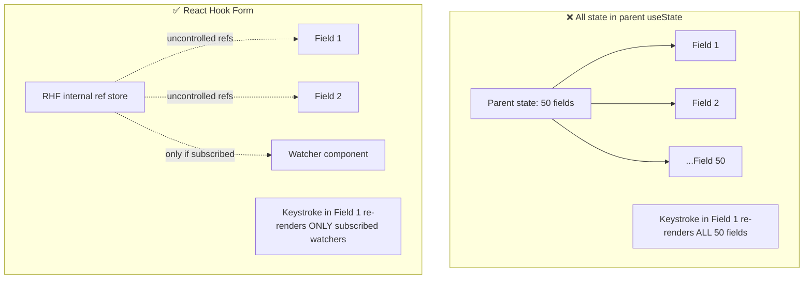
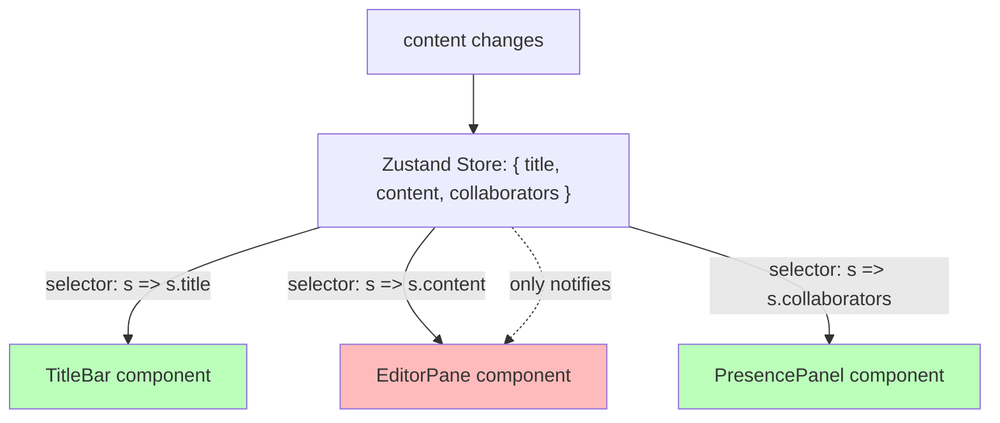
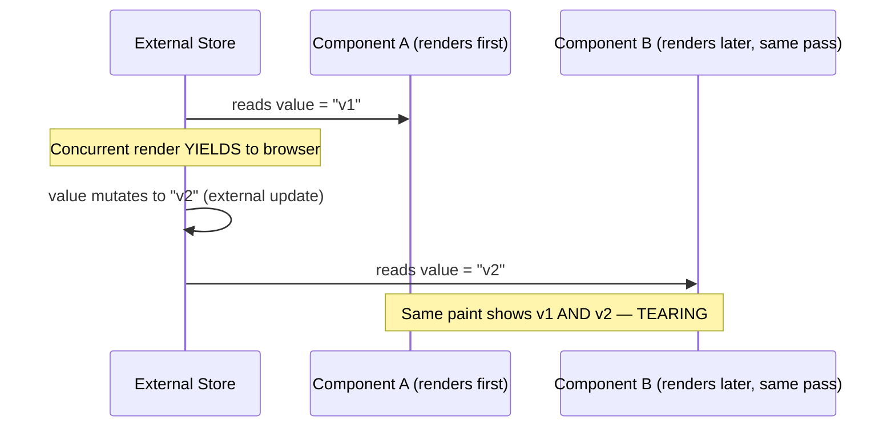

# Chapter 18: Advanced Forms, Validation & Store Architectures

**Prerequisites:** Chapter 12, Chapter 7 · **Difficulty:** Level B/C (React)

> 🔗 **Continuing from Chapter 12:** You can now keep rendering responsive under scheduling pressure. This chapter addresses the layer beneath that scheduling: how state itself should be architected so high-frequency updates (typing, live collaboration) don't trigger unnecessary work in the first place — before the scheduler even needs to get involved.

---

## 1. Learning Objectives

- **Analyze** the performance cost of controlled inputs at high input frequency.
- **Apply** React Hook Form's subscription model to minimize re-renders in large forms.
- **Evaluate** the scalability limits of the Context API under high-frequency updates (formalizing Chapter 9's warning).
- **Construct** a Zustand store with selector-based subscriptions and modular slices.
- **Explain** and prevent UI tearing using `useSyncExternalStore`.

---

## 2. Motivation

Chapter 9 warned that placing high-frequency state in Context causes every consumer to re-render. Chapter 12 showed how React's scheduler mitigates *some* of the resulting jank. This chapter addresses the actual root cause: **state architecture**. A form with 50 fields implemented with 50 individual `useState` calls, each triggering a full parent re-render on every keystroke, will feel sluggish long before Chapter 12's scheduling tricks can help — the fix isn't "schedule the re-renders better," it's "don't cause 50 components to re-render for a change that affects one field." This is the architectural layer senior engineers reach for after Chapter 12's tools have already been correctly applied and a bottleneck still remains.

---

## 3. Core Theory

### 3.1 The Real Cost of Controlled Inputs

Every keystroke into a controlled input (Chapter 9) triggers: state update → re-render of the owning component and (absent memoization) its subtree → diff → possible commit. For a *single* text field this is trivial. For a form where every field's state lives in one parent component, every keystroke in *any* field re-renders *all* sibling fields — an O(number of fields) cost per keystroke that scales badly.

### 3.2 React Hook Form's Subscription Model

React Hook Form (RHF) keeps field values in an internal, mutable ref-backed store **outside** React's render cycle, registering each input via a `ref` (an uncontrolled-input pattern, per Chapter 9's Section 3.3) rather than driving `value` from `useState`. Components only re-render when they explicitly subscribe to specific field state (via `useWatch` or `formState` destructuring) — turning the O(number of fields) re-render cost into O(number of components actually watching the changed field), typically O(1) for most forms.

### 3.3 Context API Scaling Limits, Formalized

Chapter 9 flagged this qualitatively; here's the precise mechanism: Context has **no field-level subscription granularity** — `useContext(MyContext)` subscribes the entire calling component to the *whole* value object, so any change to any field of that object re-renders every consumer, regardless of which sub-field it actually reads. This is a structural limitation of the Context API itself, not a misuse pattern — beyond a certain update frequency and consumer count, no amount of careful usage fixes it; you need a subscription model with real granularity (Section 3.4).

### 3.4 Zustand: External Store with Selector-Based Subscriptions

Zustand stores state in a plain object **outside React entirely**, and components subscribe via a **selector function**: `useStore(state => state.document.title)`. Crucially, the component only re-renders when the *selected slice's* reference changes (compared via `Object.is`, same principle as Chapter 9's dependency array comparisons) — not on every store update. This gives Context-like global accessibility with per-field subscription granularity that Context structurally cannot provide.

### 3.5 Tearing and `useSyncExternalStore`

**Tearing** is a visual artifact unique to concurrent rendering (Chapter 12): because React can pause and resume rendering (interruptible Render Phase), if an external store's value changes *mid-render*, different parts of the same tree being rendered in that pass could read different, mutually-inconsistent snapshots of that store — producing a UI where, within a single paint, two components show contradictory data derived from what should be the same state. `useSyncExternalStore` is React's official API for safely subscribing to external stores (which is exactly what Zustand uses internally) — it guarantees the entire render pass sees a single consistent snapshot, even if the store updates concurrently during an in-progress render.

---

## 4. Visual Diagrams

### 4.1 Controlled-State-in-Parent vs. RHF Subscription Model



### 4.2 Zustand Selector Subscription Granularity



### 4.3 Tearing Scenario Without `useSyncExternalStore`



---

## 5. Step-by-Step Walkthrough: Zustand Selector Update Flow

1. Component calls `useDocStore(state => state.title)` — Zustand registers this component with a subscription tied to the **result** of that selector, not the whole store.
2. An action elsewhere calls `setTitle("New Title")`, which internally does `set(state => ({ ...state, title: "New Title" }))` — producing a new store object (structural sharing, per Chapter 3).
3. Zustand re-runs every registered selector against the new state and compares each result to its previous result via `Object.is`.
4. Only components whose selector result actually changed (here, anything selecting `title`) are notified to re-render — a component selecting `state.collaborators` sees no change in its selected slice and is skipped entirely, even though the store object as a whole did change.

---

## 6. Internal Implementation

Zustand's core is deceptively small: it's a plain closure (directly the Chapter 2 module pattern) holding a state object and a `Set` of subscriber callbacks. `useStore(selector)` internally calls React's own `useSyncExternalStore(store.subscribe, () => selector(store.getState()))` — meaning Zustand does not reinvent tearing-safe subscription logic; it delegates directly to React's official primitive, which internally forces a synchronous re-check of the selected value during the commit phase if the store changed mid-render, discarding any inconsistent intermediate render and re-running it against the latest snapshot. This is precisely why hand-rolled "global state via a mutable object plus manual `forceUpdate`" patterns (a common pre-Zustand anti-pattern) are unsafe under Concurrent Mode — they lack this synchronization guarantee entirely.

---

## 7. Code Examples

### 7.1 Minimal Example — Zustand Store

```ts
import { create } from "zustand";

interface DocStore {
  title: string;
  setTitle: (title: string) => void;
}

export const useDocStore = create<DocStore>((set) => ({
  title: "Untitled",
  setTitle: (title) => set({ title }),
}));

// Usage: only re-renders when `title` changes
function TitleBar() {
  const title = useDocStore((s) => s.title);
  return <h1>{title}</h1>;
}
```

### 7.2 Practical Example — React Hook Form with Zod (bridging Chapter 7)

```tsx
import { useForm } from "react-hook-form";
import { zodResolver } from "@hookform/resolvers/zod";
import { z } from "zod";

const PermissionSchema = z.object({
  userId: z.string().min(1, "Required"),
  role: z.enum(["owner", "editor", "viewer"]),
});
type PermissionForm = z.infer<typeof PermissionSchema>;

function PermissionFormComponent({ onSubmit }: { onSubmit: (data: PermissionForm) => void }) {
  const { register, handleSubmit, formState: { errors } } = useForm<PermissionForm>({
    resolver: zodResolver(PermissionSchema),
  });

  return (
    <form onSubmit={handleSubmit(onSubmit)}>
      <input {...register("userId")} />
      {errors.userId && <span role="alert">{errors.userId.message}</span>}
      <select {...register("role")}>
        <option value="viewer">Viewer</option>
        <option value="editor">Editor</option>
        <option value="owner">Owner</option>
      </select>
      <button type="submit">Grant Access</button>
    </form>
  );
}
```

### 7.3 Production-Ready — Modular, Sliced Zustand Store for ScribeCollab

```ts
import { create } from "zustand";
import { immer } from "zustand/middleware/immer";
import type { DocNode } from "@scribecollab/document-core"; // from Chapter 6/7

interface DocumentSlice {
  document: DocNode;
  patchNode: (id: string, patch: Partial<DocNode>) => void;
}
interface PresenceSlice {
  collaborators: Record<string, { name: string; cursor: number }>;
  updateCursor: (userId: string, cursor: number) => void;
}

type Store = DocumentSlice & PresenceSlice;

export const useScribeStore = create<Store>()(
  immer((set) => ({
    document: { id: "root", text: "" },
    patchNode: (id, patch) =>
      set((state) => {
        // Immer lets us "mutate" a draft; internally produces a new,
        // structurally-shared object (Chapter 3 principle, automated).
        const node = findNode(state.document, id);
        if (node) Object.assign(node, patch);
      }),

    collaborators: {},
    updateCursor: (userId, cursor) =>
      set((state) => {
        state.collaborators[userId] ??= { name: userId, cursor: 0 };
        state.collaborators[userId].cursor = cursor;
      }),
  }))
);

function findNode(root: DocNode, id: string): DocNode | undefined {
  if (root.id === id) return root;
  for (const child of root.children ?? []) {
    const found = findNode(child, id);
    if (found) return found;
  }
  return undefined;
}
```

### 7.4 Anti-Pattern → Corrected

```jsx
// ❌ ANTI-PATTERN: entire large form's state lives in one parent
// useState object — every keystroke in ANY field re-renders every
// field component in the form (Section 3.1's O(n) cost).
function PermissionForm() {
  const [formState, setFormState] = useState({ userId: "", role: "viewer" });
  return (
    <>
      <input
        value={formState.userId}
        onChange={(e) => setFormState({ ...formState, userId: e.target.value })}
      />
      <RoleSelect
        value={formState.role}
        onChange={(role) => setFormState({ ...formState, role })}
      />
    </>
  );
}
```

```tsx
// ✅ CORRECTED: React Hook Form keeps field values out of React state
// entirely via uncontrolled refs — no parent re-render per keystroke.
function PermissionForm() {
  const { register } = useForm<PermissionForm>();
  return (
    <>
      <input {...register("userId")} />
      <select {...register("role")}>{/* options */}</select>
    </>
  );
}
```

### 7.5 Additional Example — Persisting a Zustand Slice to `localStorage`

```ts
import { create } from "zustand";
import { persist } from "zustand/middleware";

interface PreferencesStore {
  theme: "light" | "dark";
  sidebarCollapsed: boolean;
  toggleTheme: () => void;
}

export const usePreferencesStore = create<PreferencesStore>()(
  persist(
    (set, get) => ({
      theme: "light",
      sidebarCollapsed: false,
      toggleTheme: () => set({ theme: get().theme === "light" ? "dark" : "light" }),
    }),
    { name: "scribecollab-preferences" } // localStorage key (Chapter 5's Web Storage)
  )
);
```

The `persist` middleware automatically syncs this slice to `localStorage` (Chapter 5) on every change and rehydrates it on app load — directly implementing the "small, synchronous, low-frequency settings" use case Chapter 5 recommended `localStorage` for, while keeping the large, high-frequency document content slice (7.3) entirely separate and un-persisted this way.

### 7.6 Master Walkthrough: Running and Verifying Zustand Selectors

To observe how Zustand's selector-based subscription model optimizes re-renders compared to global Context updates, follow this walkthrough:

#### Step 1: Create the Component file
Inside your Vite project (`react-setup-sandbox`), create `src/components/ZustandSandbox.tsx`:
```tsx
import React, { useState } from "react";
import { create } from "zustand";

// 1. Create a global Zustand store containing two fields
interface SandboxState {
    fieldA: string;
    fieldB: string;
    setFieldA: (val: string) => void;
    setFieldB: (val: string) => void;
}

const useSandboxStore = create<SandboxState>((set) => ({
    fieldA: "Initial A",
    fieldB: "Initial B",
    setFieldA: (val) => set({ fieldA: val }),
    setFieldB: (val) => set({ fieldB: val })
}));

// 2. Component subscribing only to fieldA
function ConsumerA() {
    const fieldA = useSandboxStore(state => state.fieldA);
    const setFieldA = useSandboxStore(state => state.setFieldA);
    
    console.log("[ConsumerA] Rendered!");

    return (
        <div className="p-4 border rounded bg-blue-50 space-y-2">
            <h3 className="font-semibold text-blue-700">Consumer A (Subscribed to Field A)</h3>
            <p>Current value: <strong>{fieldA}</strong></p>
            <input 
                type="text" 
                value={fieldA} 
                onChange={(e) => setFieldA(e.target.value)} 
                className="border p-1 w-full rounded"
            />
        </div>
    );
}

// 3. Component subscribing only to fieldB
function ConsumerB() {
    const fieldB = useSandboxStore(state => state.fieldB);
    const setFieldB = useSandboxStore(state => state.setFieldB);
    
    console.log("[ConsumerB] Rendered!");

    return (
        <div className="p-4 border rounded bg-green-50 space-y-2">
            <h3 className="font-semibold text-green-700">Consumer B (Subscribed to Field B)</h3>
            <p>Current value: <strong>{fieldB}</strong></p>
            <input 
                type="text" 
                value={fieldB} 
                onChange={(e) => setFieldB(e.target.value)} 
                className="border p-1 w-full rounded"
            />
        </div>
    );
}

export function ZustandSandbox() {
    return (
        <div className="p-6 bg-white border rounded max-w-md mx-auto space-y-6">
            <h2 className="text-xl font-bold">Zustand Selector Optimization</h2>
            <p className="text-xs text-gray-500">Check browser console logs to verify that updating input A does NOT trigger re-renders in Consumer B!</p>
            <div className="space-y-4">
                <ConsumerA />
                <ConsumerB />
            </div>
        </div>
    );
}
```

#### Step 2: Import into App.tsx
Update `src/App.tsx` to render the sandbox component:
```tsx
import { ZustandSandbox } from "./components/ZustandSandbox";

export default function App() {
    return (
        <main className="min-h-screen bg-gray-50 flex items-center justify-center">
            <ZustandSandbox />
        </main>
    );
}
```

#### Step 3: Run and Diagnose in Browser
1. Start the dev server: `pnpm run dev`.
2. Open the page at [http://localhost:5173](http://localhost:5173).
3. Open Browser **DevTools (F12)** and inspect the **Console** tab.
4. Type in the input field inside **Consumer A**.
   * Observe the console prints `[ConsumerA] Rendered!` on every keystroke.
   * Notice that `[ConsumerB] Rendered!` is **never logged** during this input! The rendering engine completely bypasses Consumer B because its selected slice (`fieldB`) remains unchanged in the store.
5. Contrast this to standard Context API behavior where any field mutation forces all consumers in the tree to re-evaluate immediately.

---

## 8. Common Mistakes

| Level | Mistake |
|---|---|
| **Junior** | Building large forms with one `useState` per field or one big object in a parent, unaware of the O(n) re-render cost per keystroke this causes. |
| **Mid-Level** | Selecting the *entire* Zustand store (`useDocStore(state => state)`) instead of a specific slice, accidentally reintroducing Context's "re-render on any change" problem inside a tool designed to avoid it. |
| **Senior/Production** | Hand-rolling a global mutable store with manual subscriber callbacks and `forceUpdate`-style re-renders instead of using `useSyncExternalStore`, introducing tearing bugs under Concurrent Mode that only appear intermittently and are extremely hard to reproduce. |

---

## 9. Performance Analysis

- **Controlled form re-render cost:** O(number of fields) per keystroke when state is centralized in a parent; O(1) with RHF's ref-based subscription model.
- **Zustand selector re-render cost:** O(number of components subscribed to the *changed* slice), independent of total store size or unrelated slice update frequency.
- **Context consumer re-render cost (recap from Ch. 9):** O(number of all consumers), regardless of which slice changed — this asymmetry is the core justification for migrating high-frequency state out of Context.

---

## 10. Security Inventory

- **Zustand store as a global mutable surface:** since the store lives outside React and is often exposed via a hook, ensure store actions perform their own authorization checks rather than trusting that "only the right UI calls this action" — any code with access to the store's exported hook can call any action.
- **Form validation duplication:** the same Zod schema (7.2) used for client-side RHF validation must also be enforced server-side (Phase 4's Server Actions) — client validation is a UX layer, never a security boundary, consistent with Chapter 9's Security Inventory note.
- **Sensitive data in globally-selectable stores:** avoid storing raw secrets or unredacted sensitive fields in a Zustand store that's selectable from anywhere in the app; scope sensitive data behind narrower access patterns.

---

## 11. Technology Comparisons

| Form/State Tool | Centralized `useState` | React Hook Form | Formik |
|---|---|---|---|
| **Re-render model** | Full parent + children on any change | Ref-based, subscription-granular | Context-based, more re-renders than RHF |
| **Bundle size** | None (native) | Small (~9KB gzip) | Larger |
| **Validation integration** | Manual | Zod/Yup resolvers built-in | Yup-oriented, Zod possible via adapters |
| **Best for** | Tiny forms (1-2 fields) | Medium-large production forms | Legacy codebases already using it |

| Global State Tool | Context API | Zustand | Redux Toolkit |
|---|---|---|---|
| **Subscription granularity** | None (whole value) | Per-selector | Per-selector (with `useSelector`) |
| **Boilerplate** | Low | Very low | Moderate (even with Toolkit) |
| **DevTools/time-travel** | None built-in | Via middleware | Excellent, mature ecosystem |
| **Best for** | Low-frequency global config | Most app state in modern React apps | Large teams needing strict action/reducer conventions |

---

## 12. Engineering Decisions

ScribeCollab migrates all document and presence state into Zustand (7.3) rather than Redux Toolkit, prioritizing minimal boilerplate and direct `useSyncExternalStore` integration over Redux's mature but heavier DevTools/middleware ecosystem — a reasonable trade-off for a single-team, single-app codebase without the multi-team action-convention needs Redux is optimized for. All forms use React Hook Form with Zod resolvers exclusively for complex, multi-field forms, ensuring the exact same schema (Chapter 7) validates both client-side UX feedback and, unmodified, the server-side Action boundary in Phase 4.

---

## 13. Exercises

**Easy:** Explain why selecting `state => state` from a Zustand store (rather than a specific field) defeats the purpose of using Zustand over Context.

**Medium:** Convert the anti-pattern `PermissionForm` (7.4) into a fully working React Hook Form + Zod implementation with at least two fields and inline validation error display.

**Hard:** ScribeCollab's presence panel (30 collaborator avatars, each showing live cursor position) currently reads all collaborator data from a single Zustand selector (`state => state.collaborators`), causing every avatar to re-render whenever *any* collaborator moves. Redesign the selector strategy (and any necessary store restructuring) so each avatar only re-renders when its *own* collaborator's data changes, and explain the Big-O improvement.

---

## 14. Capstone Integration Step

**ScribeCollab — Step 13:** Migrate the workspace's core document state (built with `useDocumentSync` in Chapter 9) into the sliced Zustand store from Section 7.3, using Immer for structural updates. Implement the document permissions form using React Hook Form + the Zod schema from Chapter 7's `DocumentPermission` exercise, with zero validation logic duplicated between client and (future) server layers.

---

## 🔗 Going further

Zustand isn't the only option here, and React Hook Form isn't the only way to handle mutations. [Chapter 24](../phase-6-state-ecosystem-and-patterns/chapter-24-state-ecosystem-redux-tanstack-query.md) covers Redux Toolkit as an alternative client-state store and TanStack Query for server-state caching (a concern this chapter didn't address at all) — read it any time after this chapter if you want the fuller ecosystem picture.

---

## 🔜 Bridge to Chapter 14

Not every mutation needs an external form library. React 19 introduced native `useActionState`, `useFormStatus`, and `useOptimistic` hooks that bring Server-Action-like ergonomics to *any* form, in *any* React app — with or without Next.js. Chapter 14 covers this framework-agnostic approach, which directly explains what Phase 4's Next.js Server Actions are actually built on top of.

---

## 15. Supplementary Topics & Core Lecture Knowledge

The following supplementary modules map and expand the core React form mechanics, validation strategies, and external state stores:

### 15.1 Controlled vs. Uncontrolled Forms & Two-Way Binding

Handling user inputs in React generally follows one of two paradigms:
* **Controlled Inputs (Two-Way Binding)**:
  * Component state acts as the "single source of truth".
  * Input reads its value directly from state: `value={textValue}`.
  * Changes trigger state updates: `onChange={(e) => setTextValue(e.target.value)}`.
  * **Benefit**: Allows real-time validation, dynamic input masking, and instant disable buttons.
  * **Drawback**: Triggers component re-renders on *every single keystroke*.
* **Uncontrolled Inputs (Refs / FormData)**:
  * The browser DOM maintains the input value.
  * React reads the input value only when requested (e.g., on submit) using a ref: `inputRef.current.value` or by calling `new FormData(event.currentTarget)`.
  * **Benefit**: Zero re-renders during typing, leading to optimal typing performance on large, complex form screens.

### 15.2 Progressive Validation Execution Strategies

Input validation should be executed strategically to balance user feedback against cognitive distraction:
1. **On Keystroke (Immediate)**: Useful to show password strength or character counts. However, displaying "Invalid Email" while the user is still typing their first characters creates a frustrating user experience.
2. **On Lost Focus (Blur)**: Checked via `onBlur`. The ideal window to validate email formats or fields that require a minimum length, giving feedback once the user is done with the input.
3. **On Submission (Final)**: Run inside the `onSubmit` handler. Acts as a safety net before sending payloads to network APIs, capturing errors across the entire form.

### 15.3 Global State propagation: Context API vs. Zustand

As applications grow, sharing state across distant component nodes becomes a bottleneck:
* **Context API**: Renders the value down the component tree. However, Context does not support fine-grained selector optimizations: whenever the context value object changes, *every* component consuming that context is forced to re-render, even if it only reads an unaffected property.
* **Zustand (External Store)**: Moves state outside the React Fiber tree entirely, managing notifications via a publisher-subscriber model.
  * Components select only the state slice they require: `const user = useStore(state => state.user)`.
  * React re-renders the component *only* if the selected slice fails a strict equality check (`===`), preventing bulk re-renders across the visual hierarchy.

```tsx
// Zustand Selector Pattern:
import { create } from "zustand";

interface AppState {
  theme: "light" | "dark";
  username: string;
  setTheme: (t: "light" | "dark") => void;
}

export const useAppStore = create<AppState>((set) => ({
  theme: "light",
  username: "Guest",
  setTheme: (theme) => set({ theme }),
}));

// Inside Component:
// ONLY re-renders when state.theme changes! Username changes are ignored.
const ThemeToggler = () => {
  const theme = useAppStore((state) => state.theme);
  const setTheme = useAppStore((state) => state.setTheme);
  return (
    <button onClick={() => setTheme(theme === "light" ? "dark" : "light")}>
      Current: {theme}
    </button>
  );
};
```
