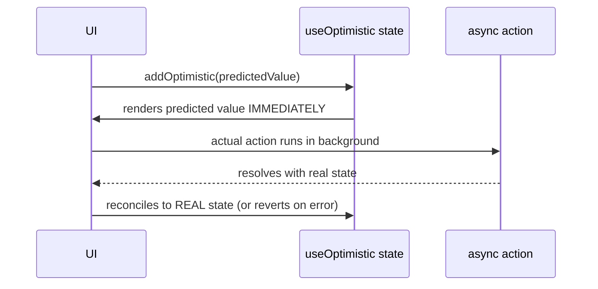

# Chapter 19: Modern Form Actions — `useActionState`, `useFormStatus` & `useOptimistic`

**Prerequisites:** Chapter 13 · **Difficulty:** Level C (React)

> 🔗 **Continuing from Chapter 13:** You now have two ways to manage state and forms — Zustand for client state, React Hook Form for complex validation-heavy forms. This chapter covers React 19's **native, framework-agnostic** form hooks, which work in any React app (with or without Next.js) and give you built-in pending states, progressive enhancement, and optimistic UI with zero external dependencies. When Phase 4 introduces Next.js Server Actions, you'll recognize them immediately as this exact mechanism, wired to a server-executed function via a `'use server'` boundary.

---

## 1. Learning Objectives

- **Differentiate** React's native Form Actions from React Hook Form's client-only model and from Next.js's Server Actions.
- **Implement** `useActionState` to manage form submission state and validation errors declaratively.
- **Apply** `useFormStatus` to build reusable, submission-aware UI without prop drilling.
- **Design** optimistic UI updates using `useOptimistic`.
- **Evaluate** when native Form Actions are preferable to React Hook Form or manual state management.

---

## 2. Motivation

Before React 19, "handle a form submission with a pending state, show validation errors, and support progressive enhancement" required either a form library (Chapter 13's React Hook Form) or a substantial amount of hand-written `useState`/`useTransition` boilerplate. React 19 promotes this to a first-class, built-in pattern: a `<form>`'s `action` prop can be a plain async function, and React automatically manages pending state, passes the previous state and `FormData` into the function, and integrates with Suspense/transitions — all without any external library. Understanding this now, before Phase 4 introduces Next.js, is deliberate: it lets you see these hooks as pure React features first, so that when Next.js's Server Actions are introduced later as "the same hooks, plus a server boundary," the mental model is already solid.

---

## 3. Core Theory

### 3.1 Form Actions vs. React Hook Form vs. (Later) Server Actions

- **React Hook Form (Chapter 13):** an external library managing form state via uncontrolled refs, entirely client-side, with no built-in concept of server communication.
- **React's native Form Actions (this chapter):** built into React itself — a `<form action={fn}>` where `fn` can be any async function (client-only logic, or a call to an API), with pending/error state managed by `useActionState`.
- **Next.js Server Actions (Phase 4):** a *specific case* of a Form Action where the function is marked `'use server'`, so React/Next.js handle serializing the call across the network boundary — everything you learn here about `useActionState`/`useFormStatus` applies identically whether the action function runs on the client or, later via Next.js, on the server.

### 3.2 `useActionState`: Declarative Submission State

`const [state, formAction, isPending] = useActionState(actionFn, initialState)` wraps an action function, returning: the **latest returned state** from the action (e.g., validation errors), a **wrapped action** to pass to `<form action={formAction}>`, and a **pending boolean** — replacing the manual `useState` triad (data/loading/error) that Chapter 9's `useEffect`-based data fetching required, but for *submissions* rather than fetches.

### 3.3 `useFormStatus`: Submission-Aware Child Components

`useFormStatus()` reads the pending status of the **nearest parent `<form>`** from any descendant component — without any props being passed down. This lets you build a fully generic `<SubmitButton>` that disables itself and shows a spinner whenever *any* form it's placed inside is submitting, with zero coupling to that specific form's state — a direct application of Chapter 8's composition philosophy to form UX.

### 3.4 `useOptimistic`: Optimistic UI Without a Library

`const [optimisticState, addOptimistic] = useOptimistic(state, updateFn)` lets you render a **predicted** future state immediately when an action starts, automatically reverting to the real `state` if the action fails or reconciling once it succeeds — the same optimistic-update concept you'll see again with TanStack Query's `onMutate`/rollback pattern (Chapter 24), but built into React directly for the Form Actions model, requiring no separate cache/rollback bookkeeping.

### 3.5 Progressive Enhancement

Because a native Form Action is fundamentally still a `<form>` element with real submission semantics, these forms can, in principle, work even before JavaScript has hydrated (particularly relevant once Phase 4 covers SSR/hydration) — a resilience property that manually-wired `onClick`-based submission handlers do not have, since they require JS execution to do anything at all.

---

## 4. Visual Diagrams

### 4.1 `useActionState` Data Flow

```mermaid
flowchart TD
    A["<form action={formAction}>"] --> B[User submits]
    B --> C["React calls actionFn(previousState, formData)"]
    C --> D{"actionFn resolves"}
    D --> E[Returned value becomes new 'state']
    E --> F[Component re-renders with new state, isPending resets to false]
```



### 4.2 `useFormStatus` Reading Parent Form State

```mermaid
flowchart TD
    Form["<form action={createDoc}>"] --> Input[<input name='title'>]
    Form --> SubmitBtn["<SubmitButton /> — reads useFormStatus()"]
    Form -.pending state.-> SubmitBtn
    Note1["SubmitButton needs NO props — reads ambient form status directly"]
```



### 4.3 `useOptimistic` Reconciliation



---

## 5. Step-by-Step Walkthrough: A Comment Form with Optimistic Updates

```tsx
function CommentSection({ comments, addComment }: {
  comments: Comment[];
  addComment: (text: string) => Promise<Comment[]>;
}) {
  const [optimisticComments, addOptimisticComment] = useOptimistic(
    comments,
    (state, newText: string) => [...state, { id: "temp", text: newText, pending: true }]
  );

  async function formAction(formData: FormData) {
    const text = formData.get("text") as string;
    addOptimisticComment(text); // Step 2
    await addComment(text);     // Step 3
  }

  return (
    <>
      <ul>{optimisticComments.map((c) => <li key={c.id} style={{ opacity: c.pending ? 0.5 : 1 }}>{c.text}</li>)}</ul>
      <form action={formAction}><input name="text" /><button type="submit">Post</button></form>
    </>
  );
}
```

1. User types a comment and submits — React calls `formAction` with the submitted `FormData`.
2. `addOptimisticComment(text)` immediately appends a predicted comment (marked `pending: true`) to the rendered list — the user sees their comment appear **instantly**, before any network round trip completes.
3. `addComment(text)` (the real, slower operation — an API call, or later a Next.js Server Action) runs in the background.
4. Once `addComment` resolves and the parent's real `comments` prop updates, `useOptimistic` automatically reconciles: the optimistic entry is replaced by the real, server-confirmed comment list — if the action had thrown instead, React automatically reverts to the pre-optimistic state.

---

## 6. Internal Implementation

`useOptimistic` works by maintaining an internal, **transition-scoped** overlay state on top of the real state passed in — React tags the optimistic update with the same low-priority transition lane machinery from Chapter 12's Concurrent Mode, meaning an optimistic update is inherently interruptible and automatically discarded/replaced the moment the real state prop changes, without any manual cache-invalidation bookkeeping. `useActionState` internally wraps the provided action in a `startTransition` (Chapter 12) as well, which is precisely why its `isPending` flag integrates correctly with Suspense and doesn't block urgent UI updates elsewhere on the page during submission — the entire native Form Actions system is built directly on Concurrent Mode's priority-lane infrastructure, not a separate mechanism layered awkwardly on top.

---

## 7. Code Examples

### 7.1 Minimal Example — `useActionState`

```tsx
function NewsletterForm() {
  const [error, formAction, isPending] = useActionState(async (_prev: string | null, formData: FormData) => {
    const email = formData.get("email") as string;
    if (!email.includes("@")) return "Invalid email";
    await subscribe(email);
    return null;
  }, null);

  return (
    <form action={formAction}>
      <input name="email" />
      {error && <p role="alert">{error}</p>}
      <button disabled={isPending}>{isPending ? "Subscribing…" : "Subscribe"}</button>
    </form>
  );
}
```

### 7.2 Practical Example — `useFormStatus` Reusable Submit Button

```tsx
function SubmitButton({ children }: { children: React.ReactNode }) {
  const { pending } = useFormStatus(); // no props needed — reads ambient parent <form>
  return <button type="submit" disabled={pending}>{pending ? "Saving…" : children}</button>;
}

// Reused across every form in the app with zero per-form wiring:
<form action={updateTitleAction}>
  <input name="title" />
  <SubmitButton>Save Title</SubmitButton>
</form>
```

### 7.3 Production-Ready — Validated Action with Zod (bridging Chapter 7)

```tsx
const TitleSchema = z.object({ title: z.string().min(1, "Required").max(200) });

type FormState = { errors?: Record<string, string>; success?: boolean };

async function updateTitleAction(_prev: FormState, formData: FormData): Promise<FormState> {
  const parsed = TitleSchema.safeParse({ title: formData.get("title") });
  if (!parsed.success) {
    return { errors: { title: parsed.error.flatten().fieldErrors.title?.[0] ?? "Invalid" } };
  }
  await saveTitle(parsed.data.title); // a plain API call today; a Next.js Server Action later (Phase 4)
  return { success: true };
}

function TitleForm() {
  const [state, formAction] = useActionState(updateTitleAction, {});
  return (
    <form action={formAction}>
      <input name="title" aria-invalid={!!state.errors?.title} />
      {state.errors?.title && <p role="alert">{state.errors.title}</p>}
      <SubmitButton>Save</SubmitButton>
    </form>
  );
}
```

### 7.4 Anti-Pattern → Corrected

```tsx
// ❌ ANTI-PATTERN: manually wiring isPending/error state with useState,
// re-implementing exactly what useActionState provides, with more
// boilerplate and more opportunities for the pending flag to get out
// of sync with the actual submission lifecycle.
function TitleForm() {
  const [isPending, setIsPending] = useState(false);
  const [error, setError] = useState<string | null>(null);
  async function handleSubmit(e: React.FormEvent) {
    e.preventDefault();
    setIsPending(true);
    try { await saveTitle(title); } catch { setError("Failed"); }
    setIsPending(false); // easy to forget in an early-return/error path
  }
  return <form onSubmit={handleSubmit}>{/* ... */}</form>;
}
```

```tsx
// ✅ CORRECTED: useActionState manages pending/error state correctly
// and consistently by construction — no manual flag bookkeeping,
// no risk of a forgotten setIsPending(false) on an error path.
function TitleForm() {
  const [error, formAction, isPending] = useActionState(async (_prev: string | null, formData: FormData) => {
    const title = formData.get("title") as string;
    if (title.length === 0) return "Title is required";
    await saveTitle(title);
    return null;
  }, null);
  return (
    <form action={formAction}>
      <input name="title" />
      {error && <p>{error}</p>}
      <button disabled={isPending}>{isPending ? "Saving..." : "Save"}</button>
    </form>
  );
}
```

### 7.6 Master Walkthrough: Running and Verifying Form Actions

To observe React 19's native Form Actions, pending states, and optimistic UI updates in action, follow this walkthrough:

#### Step 1: Create the Component file
Inside your Vite project (`react-setup-sandbox`), create `src/components/FormActionSandbox.tsx`:
```tsx
import React, { useState, useActionState, useOptimistic } from "react";
import { useFormStatus } from "react-dom";

interface TodoItem {
    id: string;
    text: string;
    pending?: boolean;
}

// 1. Reusable Submit Button that reads ambient parent form state
function SubmitButton() {
    const { pending } = useFormStatus();
    return (
        <button
            type="submit"
            disabled={pending}
            className="px-4 py-2 bg-blue-600 text-white rounded disabled:bg-gray-400"
        >
            {pending ? "Adding Todo..." : "Add Todo"}
        </button>
    );
}

export function FormActionSandbox() {
    const [todos, setTodos] = useState<TodoItem[]>([
        { id: "1", text: "Learn core JavaScript runtimes" },
        { id: "2", text: "Configure strict TypeScript" }
    ]);

    // 2. Setup useOptimistic state to update the UI instantly
    const [optimisticTodos, addOptimisticTodo] = useOptimistic(
        todos,
        (currentTodos, newText: string) => [
            ...currentTodos,
            { id: Math.random().toString(), text: newText, pending: true }
        ]
    );

    // 3. Setup form action with useActionState
    const [errorMessage, formAction] = useActionState(async (_prevError: string | null, formData: FormData) => {
        const text = formData.get("todoText") as string;
        
        if (!text || text.trim().length === 0) {
            return "Text cannot be empty";
        }

        // Add to optimistic state immediately
        addOptimisticTodo(text);

        // Simulate server network latency (~1.5s)
        await new Promise((resolve) => setTimeout(resolve, 1500));

        // Randomly simulate error status
        if (text.toLowerCase().includes("error")) {
            return "Failed to save on server. Action reverted.";
        }

        // Apply actual state update
        setTodos(t => [...t, { id: Math.random().toString(), text }]);
        return null;
    }, null);

    return (
        <div className="p-6 bg-white border rounded max-w-md mx-auto space-y-6">
            <h2 className="text-xl font-bold">React 19 Form Actions & Optimistic UI</h2>
            
            {errorMessage && (
                <div className="p-3 bg-red-50 border border-red-200 text-red-700 text-sm rounded">
                    {errorMessage}
                </div>
            )}

            <form action={formAction} className="space-y-4">
                <div>
                    <label className="block text-sm font-semibold text-gray-700">New Todo Item</label>
                    <input
                        type="text"
                        name="todoText"
                        className="border p-2 w-full rounded focus:ring-2 focus:ring-blue-500 outline-none"
                        placeholder="Type 'error' to trigger a revert..."
                    />
                </div>
                <SubmitButton />
            </form>

            <div className="space-y-2 border-t pt-4">
                <h3 className="font-semibold text-sm">Todo List:</h3>
                <ul className="space-y-2">
                    {optimisticTodos.map(todo => (
                        <li 
                            key={todo.id} 
                            className={`p-2 rounded border flex justify-between items-center ${
                                todo.pending ? "bg-yellow-50 border-yellow-200 opacity-60" : "bg-gray-50 border-gray-200"
                            }`}
                        >
                            <span>{todo.text}</span>
                            {todo.pending && <span className="text-xs text-yellow-600 font-medium">Saving...</span>}
                        </li>
                    ))}
                </ul>
            </div>
        </div>
    );
}
```

#### Step 2: Import into App.tsx
Update `src/App.tsx` to render the sandbox component:
```tsx
import { FormActionSandbox } from "./components/FormActionSandbox";

export default function App() {
    return (
        <main className="min-h-screen bg-gray-50 flex items-center justify-center">
            <FormActionSandbox />
        </main>
    );
}
```

#### Step 3: Run and Diagnose in Browser
1. Start the dev server: `pnpm run dev`.
2. Open the page at [http://localhost:5173](http://localhost:5173).
3. Type a normal todo item (e.g. "Scaffold React application") and submit.
   * Observe that the item appears **instantly** in yellow ("Saving...") via the optimistic state update.
   * Notice that the button disables itself during the 1.5-second simulated server request.
   * Once the request finishes, the item's background stabilizes to gray, confirming it was saved.
4. Now, type a word containing "error" (e.g. "simulate error") and submit.
   * Observe that the item appears instantly in yellow, but as soon as the simulated 1.5-second server request fails, the item **disappears from the list** (reverting to actual state) and the error message displays above.

---

## 8. Common Mistakes

| Level | Mistake |
|---|---|
| **Junior** | Manually managing `isPending`/error `useState` for every form (7.4's anti-pattern) instead of using `useActionState`, risking an inconsistent pending flag on error paths. |
| **Mid-Level** | Placing `useFormStatus()` in the *same* component that renders the `<form>` element itself — it only reads status from an **ancestor** form, so calling it in the form's own top-level component always returns `pending: false`; it must be called from a component nested *inside* the form. |
| **Senior/Production** | Using `useOptimistic` for a mutation with a high failure rate or long-tail latency without clear visual distinction (e.g., opacity/pending styling) between optimistic and confirmed data, confusing users when reverts occur. |

---

## 9. Performance Analysis

- **`useActionState` transition integration:** because submissions run inside a transition (Section 6), a pending form submission does not block unrelated, urgent UI updates elsewhere on the page — directly benefiting from Chapter 12's scheduler without any extra code.
- **`useOptimistic` render cost:** the optimistic overlay is cheap to compute (typically a simple array append/update) but its *user-perceived* performance benefit is large — it removes the round-trip latency from the user's perceived timeline entirely for the common case of eventual success.
- **Native Form Actions vs. React Hook Form:** for simple forms, native Form Actions have less client-side JS overhead (no external library); for complex forms with many interdependent fields and client-side-only validation UX (real-time as-you-type feedback), React Hook Form's subscription model (Chapter 13) remains better suited — these tools are complementary, not strictly one-replaces-the-other.

---

## 10. Security Inventory

- **Client-side validation in `useActionState` remains a UX layer only:** exactly as emphasized in Chapters 7 and 13 — any action function must be re-validated with the same rigor server-side if it crosses a network boundary at all, regardless of which client-side hook triggered it. This becomes concrete again once Phase 4 introduces Server Actions.
- **Optimistic UI and authorization:** never let an optimistic update reveal data the user isn't authorized to see "just in case it succeeds" — the predicted state should only ever reflect data the user could legitimately already construct or infer from their own input.
- **Progressive enhancement and security headers:** forms that must function via real HTML submission (before JS hydration) still traverse CSP/CSRF considerations covered in Phase 4 — verify your CSP's `form-action` directive permits the action's actual target if applicable.

---

## 11. Technology Comparisons

| Form Approach | React Hook Form (Ch. 13) | Native `useActionState` (this chapter) | Manual `useState` (7.4 anti-pattern) |
|---|---|---|---|
| **Best for** | Complex, highly interactive forms with rich client-side validation UX | Simple-to-moderate forms, especially mutation-triggering ones | Nothing — superseded by the other two options |
| **External dependency** | Yes | No (built into React 19) | No |
| **Server integration** | Requires manual wiring to an API/Server Action | Directly IS the mechanism Next.js Server Actions build on (Phase 4) | Manual |
| **Optimistic UI support** | Manual | Built-in via `useOptimistic` | Manual |

---

## 12. Engineering Decisions

ScribeCollab uses **React Hook Form + Zod** (Chapter 13) for its complex, multi-field permission and settings forms where real-time per-field validation UX matters, and **native `useActionState`/`useFormStatus`/`useOptimistic`** for simpler, single-purpose mutation forms (renaming a document, posting a comment) where the built-in pending/optimistic ergonomics are sufficient and avoid pulling in RHF for a two-field form — a deliberate, form-complexity-based choice rather than standardizing on exactly one approach everywhere.

---

## 13. Exercises

**Easy:** Explain why calling `useFormStatus()` directly inside the component that renders the `<form>` tag itself always returns `pending: false`.

**Medium:** Build a `useActionState`-based "rename document" form with Zod validation (7.3's pattern), including a reusable `SubmitButton` using `useFormStatus`.

**Hard:** Extend the `CommentSection` (Section 5) so that a failed comment submission (simulated network error) visibly reverts the optimistic entry and shows an inline retry option, without manually tracking a separate "failed comments" list — reasoning through exactly how `useOptimistic`'s automatic reconciliation interacts with a thrown error in the action function.

---

## 14. Capstone Integration Step

**ScribeCollab — Step 14:** Build the document title-rename and comment-posting flows using `useActionState`, `useFormStatus`, and `useOptimistic` (7.3, Section 5). Keep the permission-management form (Chapter 13) on React Hook Form, documenting in a code comment why each form uses its respective approach, per Section 12's rubric. When Phase 4 arrives, these same action functions will be upgraded to real Next.js Server Actions with no change to the hooks themselves.

---

## 🔜 Bridge to Chapter 15

Your state and form handling are now both solid. The remaining Phase 3 gap is resilience: what happens when a component throws, when data is still loading, or when a list grows to thousands of items? Chapter 15 covers Error Boundaries, Suspense, and list virtualization.

---

## 15. Supplementary Topics & Core Lecture Knowledge

The following supplementary modules map and expand the core React 19 Form Actions and Optimistic UI mechanics:

### 15.1 React 19 Form Actions Architecture

React 19 elevates forms from passive DOM containers to active transition orchestrators:
* **The HTML `<form>` `action` attribute**: Permitted to accept a standard function reference instead of a URL string: `<form action={handleSubmit}>`.
* **Execution Environment**: When submitted, React handles the function inside a Transition block. This sets a `pending` state automatically, catches asynchronous errors, and resets the input values cleanly if successful.
* **Component-Decoupled Actions**: The action function can be a pure function imported from a separate module file. This decouples visual UI components from side-effect logic, making testing easier.

### 15.2 Managing State & Loading via `useActionState`

To tie form submission output (e.g. error messages, validation statuses) back to UI state:
* **`useActionState(actionFn, initialValue)`**: Replaces manual `try/catch` and pending status variables.
* It returns: `[state, formAction, isPending]`.
  * `state`: The return value of the last execution of `actionFn`.
  * `formAction`: The wrapper function to attach to the `<form action={formAction}>` tag.
  * `isPending`: A boolean indicating whether the asynchronous action function is currently executing, letting you show spinner indicators easily.

### 15.3 The `useFormStatus` Subtree Constraint

To access form pending status deep inside a complex form component tree without prop-drilling:
* **`useFormStatus()`**: Returns `{ pending, data, method, action }`.
* **Crucial Rule**: `useFormStatus` behaves exactly like a Context consumer. It can *only* read status if it is placed inside a child component rendered *within* a `<form>` tree. If you call it inside the component that renders the `<form>` tag itself, it will always return `pending: false` because there is no ancestor Form element in its Fiber path.

### 15.4 `useOptimistic` Temporary State Overlays

Optimistic UI assumes success to hide network latency from the user interface:
1. **Trigger**: When a form is submitted, call `setOptimisticState(predictedValue)` inside the transition handler.
2. **Overlay**: The component immediately re-renders using the optimistic state value, giving the user instant visual confirmation.
3. **Resolve/Rollback**: Once the asynchronous action function finishes (whether it returns success or throws an error), React automatically discards the optimistic value and falls back to the actual, confirmed state returned by the store, ensuring eventual consistency.

```tsx
// Abstract useOptimistic Logic Flow:
const [state, setState] = useState<Item[]>([]);
const [optimisticState, setOptimisticState] = useOptimistic(
  state,
  (currentState, newItem: Item) => [...currentState, { ...newItem, pending: true }]
);

const action = async (formData: FormData) => {
  const name = formData.get("name") as string;
  // 1. Trigger optimistic insert
  setOptimisticState({ id: "temp-id", name });
  // 2. Perform network request
  const savedItem = await api.save(name);
  // 3. Update actual state: React discards temporary array and mounts savedItem
  setState(current => [...current, savedItem]);
};
```
