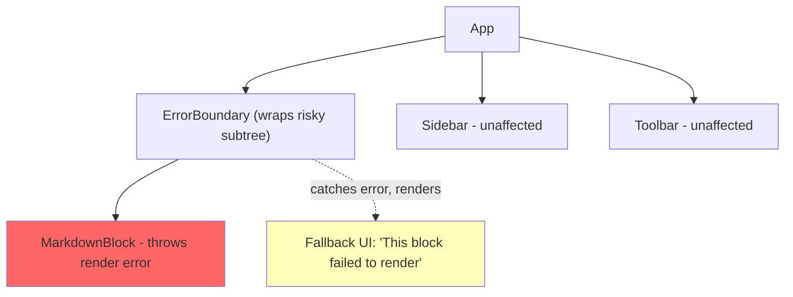
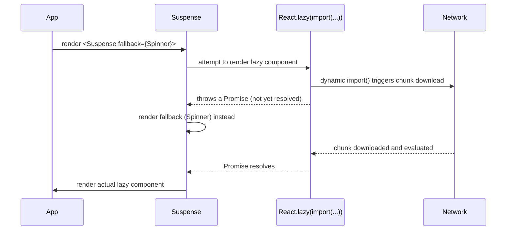
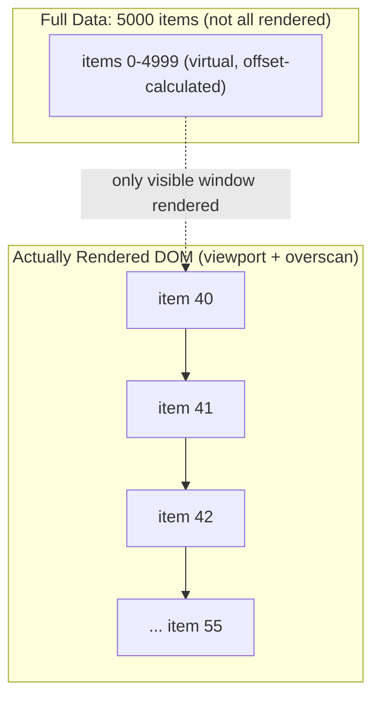

# Chapter 20: React Error Handling, Suspense & List Virtualization

**Prerequisites:** Chapter 14 · **Difficulty:** Level C (React)

> 🔗 **Continuing from Chapter 14:** Your state and form handling are both solid. This chapter addresses the remaining resilience gaps: unhandled errors, async loading states, and rendering cost at large list sizes.

---

## 1. Learning Objectives

- **Implement** Error Boundaries to contain rendering failures without crashing the whole application.
- **Apply** Suspense boundaries to coordinate async loading states and code splitting.
- **Explain** why list virtualization is necessary and how it changes rendering complexity.
- **Design** a resilient, performant list UI for datasets with thousands of items.

---

## 2. Motivation

An uncaught exception thrown during React's render phase (Chapter 12) unmounts the **entire** React tree by default — a single malformed Markdown block in one document can, without an Error Boundary, take down the whole ScribeCollab workspace, including the sidebar, toolbar, and every other open panel that had nothing to do with the failure. Separately, rendering 5,000 real DOM nodes for a long list (even if each is simple) creates real, measurable cost in initial paint, layout, and memory — costs that scale linearly with data size regardless of viewport size, unless you virtualize. Both problems share a theme: React's default behavior optimizes for correctness and simplicity, and it is the engineer's job to explicitly opt into resilience and scalability boundaries where the default isn't good enough.

---

## 3. Core Theory

### 3.1 Error Boundaries

An Error Boundary is a component (still, as of this course, **must** be a class component — this is one of the few remaining mandatory uses of `class` in modern React, since there is no hook equivalent for `componentDidCatch`/`getDerivedStateFromError`, exactly as Chapter 10 explained) that catches JavaScript errors thrown during rendering **in its child tree**, logs them, and renders a fallback UI instead of unmounting the whole tree. Critically, Error Boundaries catch **rendering** errors — not errors in event handlers, async code, or server-side rendering (those need explicit `try/catch` or, for async data, Suspense-integrated error handling).

### 3.2 Suspense: Coordinating Async Boundaries

`<Suspense fallback={...}>` lets a component "pause" rendering (by throwing a Promise, a mechanism React specifically recognizes) until data or code is ready, displaying `fallback` in the meantime. `React.lazy()` uses exactly this mechanism for **code splitting** (Chapter 6's concept, applied at the component level): the lazy-loaded component's module import is the "thrown promise," and Suspense shows a fallback until the chunk downloads and evaluates.

### 3.3 List Virtualization

Rendering N list items costs O(N) real DOM nodes, O(N) layout computation, and O(N) memory — regardless of how many are actually visible in the viewport at once. **Virtualization** renders only the small window of items currently visible (plus a small overscan buffer), computing scroll position offsets to simulate the full list's height — reducing the *rendered* cost from O(N) to O(viewport size), a constant relative to total data size. Because list items often have variable heights (e.g., collapsed vs. expanded document nodes), a production virtualizer must **measure and cache** actual rendered heights dynamically rather than assuming a fixed row height.

---

## 4. Visual Diagrams

### 4.1 Error Boundary Containment



### 4.2 Suspense + `React.lazy()` Code-Splitting Flow



### 4.3 Virtualized List Rendering Window



---

## 5. Step-by-Step Walkthrough: Error Boundary + Suspense Composition for a Document Block

```jsx
<ErrorBoundary fallback={<BlockErrorFallback />}>
  <Suspense fallback={<BlockSkeleton />}>
    <LazyDiagramBlock blockId={block.id} />
  </Suspense>
</ErrorBoundary>
```

1. `LazyDiagramBlock` is defined via `React.lazy(() => import("./DiagramBlock"))` — its module hasn't downloaded yet.
2. On first render attempt, the lazy wrapper throws the in-flight import Promise; the nearest **Suspense** boundary catches it and renders `<BlockSkeleton />` instead of crashing.
3. Once the chunk resolves, React automatically re-attempts rendering `LazyDiagramBlock` — if it renders successfully, the skeleton is replaced with the real content.
4. If, instead, `DiagramBlock` throws a genuine JavaScript error during rendering (e.g., malformed diagram data), the **Suspense** boundary does *not* catch it (it only catches thrown Promises) — it propagates up to the nearest **Error Boundary**, which renders `<BlockErrorFallback />`, containing the failure to just this block while the rest of the document (and app) remains fully interactive.

---

## 6. Internal Implementation

Suspense works by React catching a **thrown value** during the Render Phase (Chapter 12) and checking if it's a `thenable` (has a `.then` method) — if so, React registers a continuation to retry rendering that subtree once the promise settles, and in the meantime commits the nearest Suspense boundary's fallback instead. This reuses the exact same Fiber-tree pause/resume machinery from Chapter 12 that makes Concurrent Mode possible — Suspense isn't a separate system bolted onto React, it's a direct application of Fiber's interruptible rendering to the specific case of "this subtree isn't ready yet." Error Boundaries, by contrast, hook into React's commit-phase error handling via lifecycle methods that only exist on the class component API (Chapter 10) — this is the concrete, historical reason no hook-based equivalent exists.

---

## 7. Code Examples

### 7.1 Minimal Example — Error Boundary

```tsx
class ErrorBoundary extends React.Component<
  { fallback: React.ReactNode; children: React.ReactNode },
  { hasError: boolean }
> {
  state = { hasError: false };
  static getDerivedStateFromError() { return { hasError: true }; }
  componentDidCatch(error: Error, info: React.ErrorInfo) {
    console.error("Caught render error:", error, info);
  }
  render() {
    return this.state.hasError ? this.props.fallback : this.props.children;
  }
}
```

### 7.2 Practical Example — Suspense with `React.lazy`

```tsx
const SettingsPanel = React.lazy(() => import("./SettingsPanel"));

function App() {
  return (
    <Suspense fallback={<Spinner />}>
      <SettingsPanel />
    </Suspense>
  );
}
```

### 7.3 Production-Ready — Virtualized Workspace Log List (TanStack Virtual)

```tsx
import { useVirtualizer } from "@tanstack/react-virtual";
import { useRef } from "react";

interface LogEntry { id: string; message: string; }

function WorkspaceLogList({ logs }: { logs: LogEntry[] }) {
  const parentRef = useRef<HTMLDivElement>(null);

  const virtualizer = useVirtualizer({
    count: logs.length,
    getScrollElement: () => parentRef.current,
    estimateSize: () => 32,      // initial guess; measured dynamically below
    overscan: 8,                 // render a buffer beyond the visible window
    measureElement: (el) => el.getBoundingClientRect().height, // real dynamic height
  });

  return (
    <div ref={parentRef} style={{ height: 500, overflow: "auto" }}>
      <div style={{ height: virtualizer.getTotalSize(), position: "relative" }}>
        {virtualizer.getVirtualItems().map((row) => (
          <div
            key={logs[row.index].id}
            data-index={row.index}
            ref={virtualizer.measureElement}
            style={{
              position: "absolute",
              top: 0,
              transform: `translateY(${row.start}px)`,
              width: "100%",
            }}
          >
            {logs[row.index].message}
          </div>
        ))}
      </div>
    </div>
  );
}
```

### 7.4 Anti-Pattern → Corrected

```jsx
// ❌ ANTI-PATTERN: no Error Boundary anywhere — a single malformed
// document block's render error unmounts the ENTIRE app, including
// the sidebar and every other unrelated panel.
function App() {
  return (
    <>
      <Sidebar />
      <Toolbar />
      <DocumentBody blocks={blocks} /> {/* one bad block crashes everything */}
    </>
  );
}
```

```jsx
// ✅ CORRECTED: failure is contained to the specific block, everything
// else in the app remains fully interactive.
function App() {
  return (
    <>
      <Sidebar />
      <Toolbar />
      <ErrorBoundary fallback={<p>Document failed to render.</p>}>
        <DocumentBody blocks={blocks} />
      </ErrorBoundary>
    </>
  );
}
```

### 7.5 Additional Example — Suspense-Compatible Data Fetching with a Resource Cache

```tsx
const cache = new Map<string, Promise<any> | any>();

function fetchDocResource(id: string) {
  const cached = cache.get(id);
  if (cached instanceof Promise) throw cached; // Suspense catches this
  if (cached) return cached;

  const promise = new Promise((resolve) => setTimeout(resolve, 1500))
    .then(() => {
      const doc = { title: "Document Title " + id };
      cache.set(id, doc);
      return doc;
    });
  cache.set(id, promise);
  throw promise; // signals Suspense to show the fallback until resolved
}

function DocTitle({ id }: { id: string }) {
  const doc = fetchDocResource(id); // throws on first call, returns data after
  return <h1>{doc.title}</h1>;
}
```

This is the same "throw a Promise" mechanism from Section 6 made explicit and hand-rolled, rather than hidden inside a data-fetching library — seeing it built manually here demystifies what libraries like React Query or Next.js's `use()` hook do automatically for you in Phase 4.

### 7.6 Master Walkthrough: Running and Verifying Error Boundaries & Suspense

To observe how Error Boundaries contain crashes and Suspense manages async states, follow this walkthrough:

#### Step 1: Create the Component file
Inside your Vite project (`react-setup-sandbox`), create `src/components/ErrorSandbox.tsx`:
```tsx
import React, { Component, ReactNode, useState, Suspense } from "react";

// 1. Core Error Boundary implementation (requires Class Component)
interface Props {
    fallback: ReactNode;
    children: ReactNode;
}

interface State {
    hasError: boolean;
}

class ErrorBoundary extends Component<Props, State> {
    public state: State = {
        hasError: false
    };

    public static getDerivedStateFromError(_: Error): State {
        return { hasError: true };
    }

    public componentDidCatch(error: Error, errorInfo: React.ErrorInfo) {
        console.error("[ErrorBoundary] Caught rendering error:", error, errorInfo);
    }

    public render() {
        if (this.state.hasError) {
            return this.props.fallback;
        }
        return this.props.children;
    }
}

// 2. Child component that throws a render error on click
function RiskyWidget() {
    const [shouldCrash, setShouldCrash] = useState(false);

    if (shouldCrash) {
        throw new Error("Simulated widget rendering failure!");
    }

    return (
        <div className="p-4 border rounded bg-white space-y-2">
            <h3 className="font-semibold text-gray-800">ScribeCollab Editor Widget</h3>
            <button
                onClick={() => setShouldCrash(true)}
                className="px-3 py-1.5 bg-red-600 text-white rounded text-sm hover:bg-red-700"
            >
                Simulate Render Crash
            </button>
        </div>
    );
}

// 3. Ambient state counter to verify tree interactivity
export function ErrorSandbox() {
    const [counter, setCounter] = useState(0);

    return (
        <div className="p-6 bg-white border rounded max-w-md mx-auto space-y-6">
            <h2 className="text-xl font-bold">Error Resilience Sandbox</h2>
            
            <div className="flex justify-between items-center bg-gray-50 p-3 rounded">
                <span>Ambient state counter: <strong>{counter}</strong></span>
                <button 
                    onClick={() => setCounter(c => c + 1)}
                    className="px-2 py-1 bg-gray-200 rounded text-sm"
                >
                    Increment
                </button>
            </div>

            <ErrorBoundary 
                fallback={
                    <div className="p-4 border border-red-200 bg-red-50 text-red-700 rounded text-sm">
                        ⚠️ Widget crashed, but remainder of the app stays active!
                    </div>
                }
            >
                <RiskyWidget />
            </ErrorBoundary>
        </div>
    );
}
```

#### Step 2: Import into App.tsx
Update `src/App.tsx` to render the sandbox component:
```tsx
import { ErrorSandbox } from "./components/ErrorSandbox";

export default function App() {
    return (
        <main className="min-h-screen bg-gray-50 flex items-center justify-center">
            <ErrorSandbox />
        </main>
    );
}
```

#### Step 3: Run and Diagnose in Browser
1. Start the dev server: `pnpm run dev`.
2. Open the page at [http://localhost:5173](http://localhost:5173).
3. Test the **"Increment"** button to confirm normal state updates.
4. Click **"Simulate Render Crash"**.
   * Observe that the widget immediately disappears and is replaced by the red error boundary fallback banner.
   * Notice that the **"Increment"** button and ambient counter **remain fully functional and interactive**! The crash was perfectly isolated to the boundary subtree, preventing the entire application from unmounting.
5. Open browser **Console** to review the captured stack trace printed by `componentDidCatch`.

---

## 8. Common Mistakes

| Level | Mistake |
|---|---|
| **Junior** | Forgetting Error Boundaries entirely, discovering only in production that one bad piece of data can crash the whole app. |
| **Mid-Level** | Wrapping *every single component* in its own Error Boundary "just in case," fragmenting error handling and making it hard to reason about which failures should actually be isolated versus surfaced more broadly. |
| **Senior/Production** | Rendering a large, non-virtualized list (thousands of items) "because it works fine in local testing with 50 items," not accounting for real production data volume until users report slow scrolling and high memory usage. |

---

## 9. Performance Analysis

- **Non-virtualized list render cost:** O(N) DOM nodes, O(N) layout cost, O(N) memory — for N=5,000 rows, this can mean multi-hundred-millisecond initial paint and noticeably increased memory footprint.
- **Virtualized list render cost:** O(viewport size + overscan), effectively constant regardless of total N — the dominant remaining cost becomes scroll-position recalculation, which is O(1) per scroll event with a well-implemented virtualizer.
- **Suspense fallback flicker:** rapidly resolving Suspense boundaries (data ready in a few milliseconds) can cause a jarring flash of the fallback UI; consider a minimum-display-time or skip-fallback-if-fast strategy for perceived-performance tuning.

---

## 10. Security Inventory

- **Error message leakage:** `componentDidCatch`'s error details must never be rendered directly to end users in production (e.g., full stack traces, internal file paths) — log them to a monitoring service (Chapter 19) and show a generic, safe fallback message instead.
- **Suspense and race conditions on sensitive data:** ensure Suspense-driven data fetches (previewed further in Phase 4's Server Component data fetching) still respect authorization checks — a fast-resolving fallback swap must not briefly expose privileged content before an auth check completes.
- **Virtualized list and DOM recycling:** ensure recycled row components fully reset any sensitive per-row state (e.g., a "reveal password" toggle) when the underlying data item changes, since virtualized rows reuse component instances across different underlying data as the user scrolls.

---

## 11. Technology Comparisons

| List Rendering Approach | Plain `.map()` Rendering | TanStack Virtual | react-window |
|---|---|---|---|
| **DOM node count** | O(N) | O(viewport) | O(viewport) |
| **Variable row height support** | N/A (renders everything) | Yes, with dynamic measurement | Limited, prefers fixed/known sizes |
| **Bundle size** | None | Small, headless (bring your own markup) | Small, slightly more opinionated API |
| **Best for** | Small, bounded lists (<100 items) | Large, variable-height production lists (ScribeCollab's use case) | Large, uniform-height lists |

---

## 12. Engineering Decisions

ScribeCollab wraps each **major layout region** (sidebar, editor pane, presence panel) in its own Error Boundary — granular enough that a failure in one region doesn't take down the others, but not so granular (e.g., per-paragraph) that error handling becomes unmanageable noise. TanStack Virtual is chosen over react-window specifically because ScribeCollab's workspace log and document outline lists have genuinely variable row heights (collapsible nested items), which TanStack Virtual's dynamic measurement handles natively.

---

## 13. Exercises

**Easy:** Explain why Suspense's `fallback` is not shown when a component throws a plain JavaScript error (not a Promise), and which boundary type is responsible for handling that case instead.

**Medium:** Wrap the `WorkspaceLogList` (7.3) with an Error Boundary and a loading Suspense boundary that shows a skeleton while `logs` is being fetched asynchronously via a Suspense-compatible data source.

**Hard:** ScribeCollab's document outline sidebar renders 3,000 nested, collapsible tree nodes with variable heights depending on expand/collapse state, and currently uses plain `.map()` rendering, causing a 400ms+ initial render delay. Redesign it using TanStack Virtual, addressing how you'll handle dynamic height remeasurement when a node's expand/collapse state changes at runtime.

---

## 14. Capstone Integration Step

**ScribeCollab — Step 15 (Phase 3 Complete):** Add an Error Boundary around the Markdown compilation pipeline (built across Chapters 4, 9, and 12) so a malformed block cannot crash the editing workspace. Implement the virtualized navigation menu (7.3) for the document outline, confirmed via the Profiler (Chapter 12) to handle 5,000+ entries without exceeding a 16ms paint budget on scroll.

---

## 🔜 Bridge to Chapter 16

ScribeCollab is now a fully resilient, well-architected client-side React application. Before moving into Next.js (which handles routing very differently), it's worth seeing how routing works in a plain React SPA — both because you'll encounter this in many real codebases, and because Next.js's own data-loading model borrows directly from ideas React Router pioneered first. Chapter 16 covers React Router, closing out Phase 3.

---

## 15. Supplementary Topics & Core Lecture Knowledge

The following supplementary modules map and expand the core React resilience and rendering boundaries curriculum:

### 15.1 Anatomy of a Declarative Error Boundary

React Error Boundaries are class components implementing static `getDerivedStateFromError` and `componentDidCatch` lifecycle methods:
* **`static getDerivedStateFromError(error)`**: Triggered during the render phase when a child component throws a JavaScript exception. It returns a state object update (e.g. `{ hasError: true }`) to render the fallback UI on the next frame.
* **`componentDidCatch(error, errorInfo)`**: Triggered in the commit phase. The ideal location to send error objects, details, and component stacks to error monitoring services (such as Sentry).
* **Isolation**: Placing error boundaries around component sub-sections (e.g., `<Sidebar />` separate from `<Workspace />`) guarantees a crash inside a single widget does not tear down the rest of the application layout.

### 15.2 Suspense Boundaries & Asynchronous Data Swaps

React `<Suspense fallback={<Skeleton />}>` wraps child components that read asynchronous data:
* **The Suspense Mechanism**: When a component reads data that is still loading, it "throws" a promise up the component tree.
* **Catching the Promise**: React intercepts the thrown promise, pauses rendering that component subtree, and mounts the specified `fallback` UI.
* **Swapping the DOM**: Once the promise resolves, React resumes rendering the component using the resolved data, swapping out the fallback UI with the final component nodes smoothly.

### 15.3 DOM Recycling & Virtualized Scroll Lists

Rendering standard lists with thousands of items forces the browser to layout and paint thousands of DOM nodes:
* **The Problem**: A scroll layout containing 5,000 document log lines causes scrolling lag as the browser recalculates geometry changes on every frame.
* **The Solution (Virtualization)**:
  * Only render the items currently visible in the user's viewport, plus a small buffer of items above and below (overscan).
  * Absolutely position items inside a scrolling container using `translateY` offset values, recycling DOM elements as they scroll out of view.
  * Ensures DOM node count remains constant (e.g., 20 items instead of 5,000) regardless of the total array size, keeping layouts fast.

```tsx
// Virtualized Item Offset Calculation (Conceptual):
const ViewportVirtualizer = ({ items, itemHeight, viewportHeight }: { items: any[], itemHeight: number, viewportHeight: number }) => {
  const [scrollTop, setScrollTop] = useState(0);
  
  const startIndex = Math.floor(scrollTop / itemHeight);
  const endIndex = Math.min(items.length - 1, Math.floor((scrollTop + viewportHeight) / itemHeight));
  
  const visibleItems = items.slice(startIndex, endIndex + 1).map((item, index) => {
    const itemIndex = startIndex + index;
    return (
      <div 
        key={itemIndex} 
        style={{ 
          position: "absolute", 
          top: 0, 
          transform: `translateY(${itemIndex * itemHeight}px)`,
          height: `${itemHeight}px` 
        }}
      >
        {item.name}
      </div>
    );
  });

  return (
    <div 
      onScroll={(e) => setScrollTop(e.currentTarget.scrollTop)}
      style={{ overflowY: "auto", height: `${viewportHeight}px`, position: "relative" }}
    >
      <div style={{ height: `${items.length * itemHeight}px`, position: "relative" }}>
        {visibleItems}
      </div>
    </div>
  );
};
```
