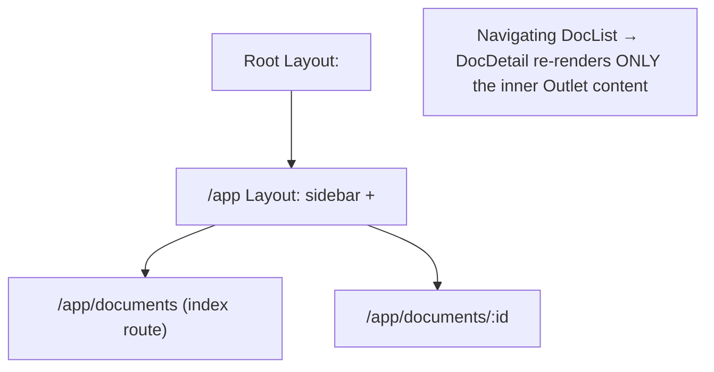
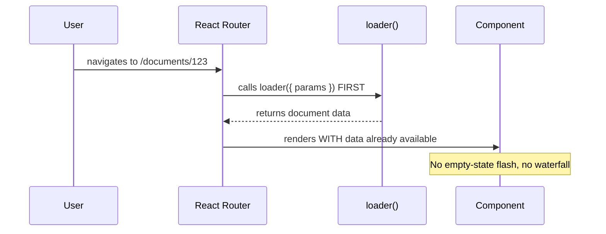
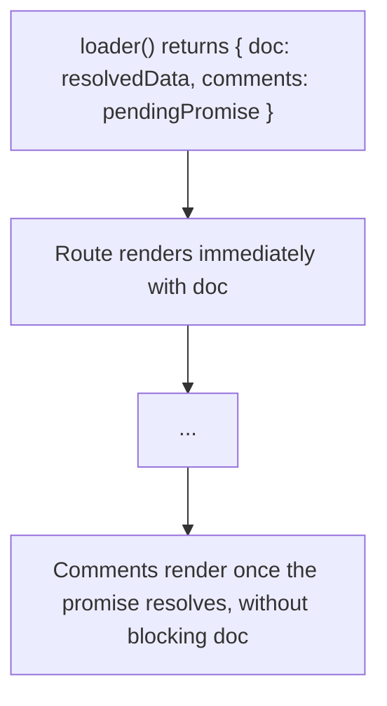

# Chapter 21: Client-Side Routing with React Router

**Prerequisites:** Chapter 15 (Phase 3 complete) · **Difficulty:** Level B/C (React)

> 🔗 **Continuing from Chapter 15:** ScribeCollab is now a fully resilient client-side React application. Phase 4 will move it into Next.js, where routing is file-system-based and server-integrated. Before that shift, this chapter covers React Router — the standard client-side routing library for plain React SPAs — both because you'll meet it constantly in real (non-Next.js) codebases, and because it makes Phase 4's `loader`/`action` data-fetching model far easier to understand: Next.js's App Router is a direct, server-integrated descendant of ideas React Router pioneered first.

---

## 1. Learning Objectives

- **Explain** why single-page applications need a dedicated routing library at all.
- **Construct** nested routes with shared layouts using React Router's route configuration.
- **Implement** data loading and mutations using `loader()` and `action()` functions.
- **Apply** deferred data loading for non-critical, slower data.
- **Design** route protection (authentication guards) and code-split, lazily-loaded routes.
- **Deploy** a client-side-routed SPA correctly, including server rewrite configuration.

---

## 2. Motivation

A "single-page application" still needs the *experience* of multiple pages — distinct URLs, back/forward button support, bookmarkable links, and code-split bundles loaded per section. Without a routing library, you'd hand-roll URL parsing, history management, and manual component swapping — solved problems that React Router has refined over a decade of edge cases (nested layouts, scroll restoration, race-condition-safe data loading). Understanding React Router now, right before Phase 4, is the fastest path to *deeply* understanding Next.js's rendering model, since Next.js's nested layouts, per-route error boundaries, and data-loading patterns are conceptually a server-integrated evolution of exactly what this chapter teaches.

---

## 3. Core Theory

### 3.1 Why Routing Is Non-Trivial in an SPA

Full-page navigation is "free" in a traditional multi-page site — the browser handles URL, back/forward, and rendering the new page entirely. In an SPA, all of this must be reimplemented in JavaScript: intercepting link clicks to prevent full reloads, updating the URL via the History API (`pushState`, extending Chapter 5's Web API catalog) without a page refresh, and rendering the correct component tree for the current URL — all while keeping the browser's native back/forward buttons working correctly.

### 3.2 Route Configuration & Nested Layouts

React Router (v6.4+) lets you declare routes as a tree, where a parent route's element renders an `<Outlet />` — the exact spot where the matched child route's element is injected. This is the same "persistent shared layout, swapped inner content" model Next.js's `layout.tsx` will formalize in Phase 4: navigating between child routes re-renders only the `<Outlet />` content, while the parent layout (and its component state) persists unchanged, per Chapter 8's stable-component-identity principle.

### 3.3 `loader()` and `action()`: Data as a Routing Concern

A `loader()` function attached to a route runs **before** that route's component renders, fetching the data the component needs — the component then reads this data via `useLoaderData()`, eliminating the classic "component mounts empty, then fetches, then re-renders with data" waterfall from a plain `useEffect`-based approach (Chapter 9's pattern). An `action()` function handles form submissions/mutations for that route, receiving the submitted `FormData` and typically redirecting or returning validation errors — directly foreshadowing Phase 4's Server Actions, but running entirely client-side (or calling a separate API) rather than executing on a server.

### 3.4 Deferred Data Loading

Not all of a route's data is equally urgent — a document's core content might need to render immediately, while its comment count or activity feed can load a moment later. `defer()` lets a `loader()` return a mix of resolved and still-pending promises; the route component wraps the slower data in `<Suspense>` and `<Await>` (Chapter 15's Suspense mechanics, applied at the routing data layer), rendering the fast data immediately without blocking on the slow data.

### 3.5 Authentication & Route Protection

Route guards are typically implemented as a `loader()` that checks for a valid session and calls `redirect("/login")` if absent — running *before* the protected route's component (or its data loading) ever executes. Phase 4 will show the server-side equivalent of this same gatekeeping idea implemented as Edge Middleware, running even earlier in the request lifecycle.

### 3.6 Code Splitting & Deployment

`React.lazy()` (Chapter 15) combined with per-route imports lets each route's code download only when actually navigated to — critical for SPA bundle size, since (unlike Next.js) there's no server-side code-splitting infrastructure doing this automatically. Deploying a client-routed SPA requires configuring the hosting server to **rewrite all paths to `index.html`** (a "catch-all" fallback) — otherwise, a user directly visiting or refreshing `/documents/123` gets a 404, since no real file exists at that server path; only client-side JavaScript knows how to render it.

---

## 4. Visual Diagrams

### 4.1 Nested Routes & `<Outlet />`



### 4.2 `loader()` Timing Relative to Rendering



### 4.3 Deferred Loading with `<Await>`



---

## 5. Step-by-Step Walkthrough: Protected Route with a Loader Guard

```tsx
// routes/documents.tsx
export async function loader() {
  const session = await getSession(); // reads a stored token, Chapter 5's storage patterns
  if (!session) throw redirect("/login");
  const docs = await fetchDocuments(session.token);
  return { docs };
}

function DocumentsPage() {
  const { docs } = useLoaderData() as { docs: Doc[] };
  return <DocumentList docs={docs} />;
}
```

1. A user navigates to `/documents` (via `<Link>` or a direct URL).
2. React Router calls this route's `loader()` **before** rendering `DocumentsPage` at all.
3. If no valid session exists, `redirect("/login")` is thrown — React Router intercepts this special exception and performs the redirect immediately, and `DocumentsPage` never renders, avoiding any flash of protected content.
4. If a session exists, `fetchDocuments` runs, and its resolved data is passed directly into the component via `useLoaderData()` — the component renders **already populated**, with no loading-then-populated flash for this data.

---

## 6. Internal Implementation

React Router's `loader()`/`action()` model works by **matching the URL against the route tree *before* any component rendering begins**, then running all matched-route loaders (parent and child) **in parallel**, waiting for all to settle before committing the new route's render — this parallel-loader execution is what eliminates the "wait for parent, then wait for child" waterfall that plain nested `useEffect`-based fetching (Chapter 9) is prone to. `redirect()` and `defer()` are implemented as special return/throw values React Router's internal data router recognizes and intercepts, rather than ordinary return values your component ever sees directly — conceptually similar to Chapter 15's "throw a Promise for Suspense" mechanism, generalized to a broader set of routing-specific control-flow signals.

---

## 7. Code Examples

### 7.1 Minimal Example — Route Configuration

```tsx
const router = createBrowserRouter([
  {
    path: "/",
    element: <RootLayout />,
    children: [
      { index: true, element: <Home /> },
      { path: "documents/:id", element: <DocumentPage /> },
    ],
  },
]);
```

### 7.2 Practical Example — `action()` for Form Submission

```tsx
export async function action({ request }: ActionFunctionArgs) {
  const formData = await request.formData();
  const title = formData.get("title") as string;
  if (!title.trim()) return { error: "Title is required" }; // returned, not thrown
  const doc = await createDocument({ title });
  return redirect(`/documents/${doc.id}`);
}

function NewDocumentForm() {
  const actionData = useActionData() as { error?: string } | undefined;
  return (
    <Form method="post">
      <input name="title" />
      {actionData?.error && <p role="alert">{actionData.error}</p>}
      <button type="submit">Create</button>
    </Form>
  );
}
```

### 7.3 Production-Ready — Deferred Loading + Lazy Route + Auth Guard

```tsx
// routes/document-detail.tsx
export async function loader({ params }: LoaderFunctionArgs) {
  const session = requireSession(); // throws redirect("/login") if absent
  const doc = await fetchDocument(params.id!); // critical, awaited
  const commentsPromise = fetchComments(params.id!); // non-critical, NOT awaited
  return defer({ doc, comments: commentsPromise });
}

function DocumentDetailPage() {
  const { doc, comments } = useLoaderData() as { doc: Doc; comments: Promise<Comment[]> };
  return (
    <>
      <DocumentBody doc={doc} />
      <Suspense fallback={<CommentsSkeleton />}>
        <Await resolve={comments}>{(resolved) => <CommentsList comments={resolved} />}</Await>
      </Suspense>
    </>
  );
}

// Route registration with lazy code splitting:
{
  path: "documents/:id",
  lazy: () => import("./routes/document-detail"), // separate chunk, downloaded on demand
}
```

### 7.4 Anti-Pattern → Corrected

```tsx
// ❌ ANTI-PATTERN: fetching data inside the component with useEffect
// AFTER the route already rendered — produces an empty-state flash and,
// in nested routes, a parent-then-child fetch WATERFALL.
function DocumentPage() {
  const { id } = useParams();
  const [doc, setDoc] = useState(null);
  useEffect(() => { fetchDocument(id).then(setDoc); }, [id]);
  if (!doc) return <Spinner />;
  return <DocumentBody doc={doc} />;
}
```

```tsx
// ✅ CORRECTED: loader() fetches BEFORE the component renders, and runs
// in parallel with any parent route's loader — no waterfall, no flash.
export async function loader({ params }: LoaderFunctionArgs) {
  return { doc: await fetchDocument(params.id!) };
}
function DocumentPage() {
  const { doc } = useLoaderData() as { doc: Doc };
  return <DocumentBody doc={doc} />;
}
```

### 7.5 Master Walkthrough: Running and Verifying Client-Side Routing

To install, configure, and verify client-side nested routing and loaders using React Router, follow this detailed guide:

#### Step 1: Install React Router DOM
Open your terminal inside the Vite sandbox directory (`react-setup-sandbox`) and run:
```bash
pnpm add react-router-dom
```

#### Step 2: Create the Router Sandbox file
Create `src/components/RouterSandbox.tsx` and paste the following implementation:
```tsx
import React from "react";
import { 
    createBrowserRouter, 
    RouterProvider, 
    Link, 
    Outlet, 
    useLoaderData, 
    useParams, 
    useNavigation 
} from "react-router-dom";

// 1. Mock Data Fetcher
const mockDocs = [
    { id: "1", title: "Project Alpha Spec", body: "Detailed system architecture details for Alpha..." },
    { id: "2", title: "API Guide v2", body: "REST endpoint specifications and payload formatting schemas..." }
];

async function fetchDocById(id: string) {
    // Simulate API delay (~800ms)
    await new Promise(resolve => setTimeout(resolve, 800));
    return mockDocs.find(d => d.id === id) || { id, title: "Unknown Doc", body: "No content found." };
}

// 2. Parent Layout Component with Navigation Indicators
function Layout() {
    const navigation = useNavigation();
    
    return (
        <div className="p-6 bg-white border rounded max-w-lg mx-auto space-y-6">
            <header className="border-b pb-4 flex justify-between items-center">
                <h2 className="text-xl font-bold">Workspace Routing Hub</h2>
                <nav className="flex gap-4 text-sm text-blue-600">
                    <Link to="/" className="hover:underline">Home</Link>
                    <Link to="/doc/1" className="hover:underline">Alpha Spec</Link>
                    <Link to="/doc/2" className="hover:underline">API Guide</Link>
                </nav>
            </header>

            {/* Display loader indicator while fetching data in the background */}
            {navigation.state === "loading" && (
                <div className="p-2 bg-yellow-50 text-yellow-700 text-xs rounded border border-yellow-200 text-center animate-pulse">
                    Loading Route Data...
                </div>
            )}

            <main className="min-h-32 bg-gray-50 p-4 border rounded">
                <Outlet />
            </main>
        </div>
    );
}

// 3. Home View Component
function HomeView() {
    return (
        <div className="space-y-2">
            <h3 className="font-semibold text-gray-800">Welcome to ScribeCollab Routing Panel</h3>
            <p className="text-sm text-gray-600">Click the document links above to trigger the loaders.</p>
        </div>
    );
}

// 4. Document Detail View using loaders
function DocView() {
    const doc = useLoaderData() as { id: string; title: string; body: string };
    const params = useParams();

    return (
        <div className="space-y-3">
            <h3 className="font-bold text-lg text-gray-800">{doc.title}</h3>
            <p className="text-sm text-gray-600">{doc.body}</p>
            <p className="text-xs text-gray-400">Route param: <strong>docId = {params.id}</strong></p>
        </div>
    );
}

// 5. Define Route Hierarchy with loader hooks
const router = createBrowserRouter([
    {
        path: "/",
        element: <Layout />,
        children: [
            {
                index: true,
                element: <HomeView />
            },
            {
                path: "doc/:id",
                element: <DocView />,
                loader: async ({ params }) => {
                    console.log(`[Loader] Triggered for id: ${params.id}`);
                    return fetchDocById(params.id!);
                }
            }
        ]
    }
]);

export function RouterSandbox() {
    return <RouterProvider router={router} />;
}
```

#### Step 3: Wire into App.tsx
Update `src/App.tsx` to render the sandbox component:
```tsx
import { RouterSandbox } from "./components/RouterSandbox";

export default function App() {
    return (
        <main className="min-h-screen bg-gray-50 flex items-center justify-center">
            <RouterSandbox />
        </main>
    );
}
```

#### Step 4: Run and Diagnose in Browser
1. Start the dev server: `pnpm run dev`.
2. Open the page at [http://localhost:5173](http://localhost:5173).
3. Open Browser **DevTools (F12)** and inspect the **Console** tab.
4. Click on **"Alpha Spec"** link.
   * Observe the yellow loader message pops up indicating that the route transition state is pending.
   * Look at the Console: `[Loader] Triggered for id: 1` logs immediately before the page changes.
   * Notice that the URL in your browser changes to `/doc/1`, but **no full-page network refresh occurs**. The layout component's state persists.
5. Click **"API Guide"** to see it swap routes cleanly.

---

## 8. Common Mistakes

| Level | Mistake |
|---|---|
| **Junior** | Fetching data with `useEffect` inside every route component (7.4's anti-pattern), reintroducing the loading-flash and waterfall problems `loader()` exists to solve. |
| **Mid-Level** | Forgetting to configure the hosting server's SPA fallback rewrite, causing every deep-linked or refreshed URL (`/documents/123`) to 404 in production despite working fine in local dev (which typically has this rewrite built into the dev server by default). |
| **Senior/Production** | Awaiting *all* data in a `loader()` (including slow, non-critical data like analytics or comment counts) instead of using `defer()` for the non-critical portions, needlessly delaying the entire route's render behind the slowest query. |

---

## 9. Performance Analysis

- **Parallel loader execution:** nested routes' loaders run concurrently, not sequentially — an O(max loader time) cost instead of O(sum of loader times) for a route with N nested layout levels each needing data.
- **Route-based code splitting (`lazy`):** reduces initial bundle size proportionally to how much of the app's total route tree is *not* the landing route — directly analogous to Chapter 6's tree-shaking/code-splitting principles, applied at the routing granularity.
- **`defer()` trade-off:** improves perceived performance (critical content visible sooner) without improving total data-fetch time — appropriate specifically when part of a route's data is non-critical to initial render, not as a blanket "make everything defer" strategy.

---

## 10. Security Inventory

- **Client-side-only route guards are not sufficient:** a `loader()`-based auth check (Section 3.5) prevents the *UI* from rendering protected content, but any API endpoints the app calls must independently verify authorization server-side (a principle Phase 4 formalizes as defense-in-depth) — a determined attacker can call your API directly, bypassing the client router entirely.
- **Token storage for SPA auth:** storing auth tokens for React Router-based SPAs faces the same trade-offs covered in Chapter 5's storage security notes — prefer httpOnly cookies over `localStorage` where the backend architecture allows it, to reduce XSS-driven token theft risk.
- **SPA fallback rewrite scope:** ensure the catch-all rewrite (Section 3.6) applies only to actual app routes, not to real static asset paths or API routes, which must still resolve to their real files/handlers rather than being swallowed by the SPA fallback.

---

## 11. Technology Comparisons

| Routing Approach | React Router (client SPA) | Next.js App Router (Phase 4) |
|---|---|---|
| **Rendering** | Entirely client-side | Server + client (RSC, SSR, SSG) |
| **Data loading** | `loader()`, client-side or via API calls | `async` Server Components, direct DB/server access |
| **SEO** | Poor without extra tooling | Strong, built-in |
| **Best for** | Internal tools, dashboards behind auth, embedded widgets, non-Next React apps | Public-facing apps needing SEO/SSR |

---

## 12. Engineering Decisions

ScribeCollab's primary product ships on Next.js (Phase 4), but its embeddable "Quick Notes" widget — a lightweight, auth-gated tool distributed as a standalone JS bundle for third-party sites — uses React Router with client-side rendering exclusively, since it requires no SEO, must be a small self-contained bundle, and cannot depend on a Next.js server being present on the host page. This is a deliberate, scoped exception to the Phase 4 architecture, chosen specifically because the widget's deployment constraints don't fit a server-rendered model.

---

## 13. Exercises

**Easy:** Explain why a plain `useEffect`-based data-fetching approach in a nested route can produce a fetch waterfall, and how `loader()` avoids it.

**Medium:** Convert the anti-pattern `DocumentPage` (7.4) into a `loader()`-based implementation with an `action()` handling an inline title-rename form on the same route.

**Hard:** ScribeCollab's "Quick Notes" widget needs an auth-gated `/notes` route, a `/notes/:id` detail route with deferred comment loading, and correct behavior when a user directly loads (or refreshes) `/notes/42` in their browser. Design the route configuration, the loader guard, and specify the exact server rewrite rule needed for correct deployment.

---

## 14. Capstone Integration Step (Phase 3 Complete)

**ScribeCollab — Step 16:** Build the "Quick Notes" embeddable widget as a separate React Router SPA: a root layout, an authenticated `/notes` route guarded by a `loader()`-based redirect, and a `/notes/:id` detail route using `defer()` for non-critical activity data. Configure and document the required static-hosting rewrite rule for correct deep-link support in production.

---

## 🔜 Bridge to Phase 4 (Chapter 17)

Phase 3 is complete: ScribeCollab is a fully client-side React application with sound state architecture, scheduling-aware rendering, resilient error/loading/virtualization boundaries, and a working understanding of client-side routing. Phase 4 moves the *primary* application into Next.js, introducing server-side rendering, React Server Components, edge middleware, and deployment — transforming ScribeCollab from a client-only SPA into a production-grade, server-integrated system. Chapter 17 begins with Next.js's App Router layout model, and you'll immediately recognize its nested-layout and data-loading ideas from this chapter.

---

## 15. Supplementary Topics & Core Lecture Knowledge

The following supplementary modules map and expand the core React Router Client-Side SPA routing:

### 15.1 Link Interception & Client Navigation

Traditional web applications use standard anchor links (`<a href="/about">`), forcing the browser to destroy the current page heap and perform a full document round-trip request:
* **React Router `<Link to="/about">`**:
  * Registers a click listener on the underlying anchor element.
  * Intercepts the browser's default navigation event using `event.preventDefault()`.
  * Manipulates the browser history stack using HTML5 History API `pushState`.
  * Instructs the router to parse the new URL path, match the mapped component path, and swap the active routes inside the current DOM layout, maintaining full client state intact.

### 15.2 Nested Routes & Outlet Layout Portals

React Router supports hierarchical routing tree layouts:
* **The Root Layout**: A shell container rendering global assets (like headers, navigation bars).
* **Nested Outlets**: Nested routes define their visual insertion target inside the parent layout using the `<Outlet />` component:
  
```tsx
// Nested Layout Example:
const WorkspaceLayout = () => {
  return (
    <div className="flex">
      <Sidebar />
      <div className="workspace-main">
        {/* Child route components are mounted right here! */}
        <Outlet />
      </div>
    </div>
  );
};
```

* **Index Routes**: Mount at the exact parent route path (e.g. `/workspace`) when no specific sub-path child is loaded, acting as a default placeholder view.

### 15.3 Intercepting Waterfalls via `loader` Functions

The traditional pattern of fetching data inside components (`useEffect`) creates network waterfalls:
1. Parent component mounts, renders loading state, triggers fetch.
2. Fetch resolves after 100ms, parent renders child component.
3. Child component mounts, renders loading state, triggers second fetch.
4. Total latency = sum of all sequential network trips.
* **React Router `loader()`**:
  * Resolves data *before* route rendering begins.
  * When a user initiates a navigation, the router fetches loaders for all matched nested paths in parallel, completely skipping parent-to-child sequential waterfalls.

### 15.4 Asynchronous defer() & `<Await>` Resolvers

If a page loader contains non-critical, slow-resolving network requests (such as analytics history logs), you don't want to delay rendering the entire screen.
* **`defer({ criticalData, lazyData: fetchLazy() })`**: Instructs the router to resolve `criticalData` first, mount the route layout, and return a promise placeholder for `lazyData`.
* **`<Await resolve={lazyData}>`**: Used in tandem with `<Suspense>` inside your component layout. React renders the fallback loading skeleton immediately and mounts the resolved data structure once the promise completes.

### 15.5 Programmatic Actions & useFetcher

* **Form Submissions via `action()`**: Binds a function helper to form posts, processing request payloads (extractable via `await request.formData()`) and handling database writes or state revalidation cycles automatically.
* **`useFetcher()`**: Allows you to run actions or load data from routes without triggering transition routing. Perfect to trigger small UI interactions (e.g., adding an item to list, triggering a background save) where the user must remain on their current page.
