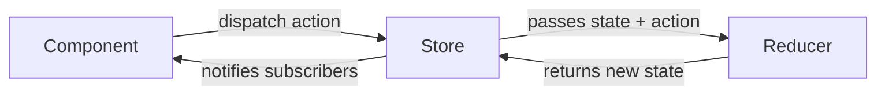
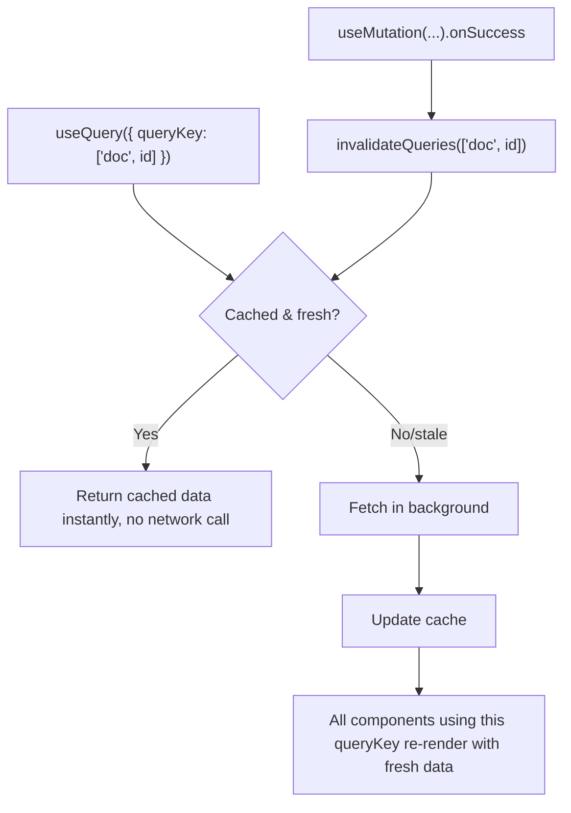
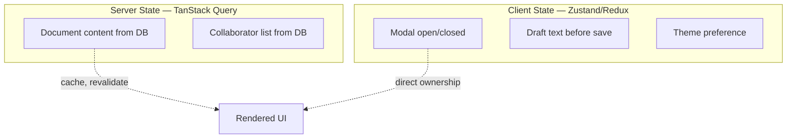

# Chapter 22: State Management Ecosystem — Redux Toolkit & TanStack Query

**Prerequisites:** Chapter 13, Chapter 16 · **Difficulty:** Level C (React)

> 🔗 **Continuing from Chapter 13 & Chapter 16:** Chapter 13 established Zustand for ScribeCollab's client state and warned about Context's scaling limits. Chapter 16 introduced `loader()`-based data fetching for React Router apps. This chapter completes the state-management landscape with the two other tools you'll most often meet in real codebases: Redux Toolkit (an alternative to Zustand with different trade-offs) and TanStack Query (a purpose-built tool for a category of state Zustand was never designed for: server state).

---

## 1. Learning Objectives

- **Differentiate** client state from server state and explain why they need different tools.
- **Implement** a Redux Toolkit store using slices, and connect it to React components.
- **Apply** thunks to handle asynchronous logic within Redux.
- **Configure** TanStack Query for caching, background refetching, and mutations.
- **Evaluate** when Redux Toolkit, Zustand, or TanStack Query (or a combination) is the correct choice.

---

## 2. Motivation

A huge fraction of "state management" code in real applications isn't actually *application* state at all — it's a **local cache of server data** (a list of documents, a user profile) being manually synchronized via `useEffect` + `useState`, with hand-rolled loading/error flags, no caching, no deduplication of concurrent identical requests, and no automatic background refresh. This is the single most common source of "why are there two different, slightly stale versions of this document showing on screen" bugs. TanStack Query exists specifically to solve *this* category of problem, distinctly from Zustand/Redux's job of managing genuine client-only state (UI toggles, form drafts, undo history). Separately, while Chapter 13 chose Zustand for ScribeCollab, Redux (and Redux Toolkit) remains extremely common in industry codebases, especially larger, multi-team organizations valuing its strict conventions and mature DevTools — you need to recognize its patterns even where you don't choose it yourself.

---

## 3. Core Theory

### 3.1 Client State vs. Server State

**Client state** is state your application owns entirely — it has no "true" source elsewhere (a modal's open/closed flag, a form draft, a theme preference). **Server state** is a client-side *cache* of data whose true source of record lives elsewhere (a database, an API) — it can go stale, may be updated by other users or sessions, and conceptually needs caching, deduplication, and revalidation semantics that client-state tools like Zustand/Redux don't provide out of the box. Treating server state as if it were client state (manually replicating fetch/cache/invalidate logic per feature) is the root cause of the staleness bugs from Section 2.

### 3.2 Redux's Core Model

Redux enforces a strict unidirectional data flow: components **dispatch** plain object **actions** (`{ type: "documents/add", payload: doc }`), a **reducer** (a pure function, directly reusing Chapter 9's `useReducer` principles at the application-store scale) computes the next state from the current state and the action, and the **store** holds the single resulting state tree, notifying subscribed components. This strict discipline (all state changes go through one auditable path) is Redux's core value proposition for large teams — every state change is traceable, loggable, and replayable.

### 3.3 Redux Toolkit: Removing the Boilerplate

Classic Redux required extensive hand-written action type constants, action creators, and immutable reducer logic (manual spreading, per Chapter 3). **Redux Toolkit (RTK)** is the now-standard way to write Redux: `createSlice` generates action creators and reducers together from a single object, and uses **Immer internally** (the same library from Chapter 13's Zustand setup) so reducer logic can be written as if directly mutating state, while RTK produces correct immutable updates underneath — directly eliminating the exact boilerplate/immutability-mistake risk Chapter 3 and Chapter 13 both flagged.

### 3.4 Thunks: Handling Async Logic in Redux

A reducer must be a **pure function** (Section 3.2) — it cannot perform async work. **Thunks** are functions that receive `dispatch` and `getState`, allowing async logic (an API call) to run before dispatching the actual state-changing action(s), typically dispatching a `pending` → `fulfilled`/`rejected` action sequence that RTK's `createAsyncThunk` generates automatically, mapping cleanly onto Chapter 9's loading/error/data state pattern but centralized in the store rather than per-component.

### 3.5 TanStack Query: `useQuery` and Caching

`useQuery({ queryKey, queryFn })` fetches data and stores it in a global, **key-addressed cache** — any component calling `useQuery` with the same `queryKey` shares the same cached data and in-flight request (automatic deduplication), and the library handles background refetching (e.g., on window refocus), stale-time configuration, and retry logic entirely declaratively, replacing what would otherwise be substantial hand-written `useEffect`/Zustand-based fetching logic.

### 3.6 `useMutation` and Cache Invalidation

`useMutation` wraps a data-changing operation (create/update/delete); on success, calling `queryClient.invalidateQueries({ queryKey })` marks related cached data as stale, triggering an automatic background refetch — ensuring the UI reflects the mutation's effect without manually threading the updated data through every component that displayed the old version. Optimistic updates (the same concept as Chapter 14's `useOptimistic`, generalized here to a cache) let the cache be updated **immediately** on mutation start, then rolled back automatically if the mutation fails.

---

## 4. Visual Diagrams

### 4.1 Redux Unidirectional Data Flow



### 4.2 TanStack Query Cache Lifecycle



### 4.3 Server State vs. Client State Ownership



---

## 5. Step-by-Step Walkthrough: A Mutation with Cache Invalidation

```tsx
function useUpdateTitle() {
  const queryClient = useQueryClient();
  return useMutation({
    mutationFn: (vars: { id: string; title: string }) =>
      fetch(`/api/documents/${vars.id}`, { method: "PATCH", body: JSON.stringify(vars) }),
    onSuccess: (_data, vars) => {
      queryClient.invalidateQueries({ queryKey: ["document", vars.id] });
    },
  });
}
```

1. A component calls `updateTitle.mutate({ id: "doc-1", title: "New Title" })` on form submit.
2. TanStack Query runs `mutationFn`, sending the actual PATCH request — no manual loading-state bookkeeping needed; `updateTitle.isPending` is provided automatically.
3. On success, `invalidateQueries({ queryKey: ["document", "doc-1"] })` marks that specific cached query as stale.
4. **Every** component anywhere in the tree currently using `useQuery({ queryKey: ["document", "doc-1"] })` automatically refetches in the background and re-renders with the fresh title — without any manual prop drilling, Context update, or Zustand action needed to propagate the change.

---

## 6. Internal Implementation

TanStack Query's cache is, structurally, a plain in-memory object keyed by the **serialized `queryKey` array** — `["document", "doc-1"]` and `["document", "doc-2"]` are distinct cache entries, which is why query keys must include every parameter that affects the query's result (a classic bug is omitting a filter/sort parameter from the key, causing different views of the "same" query to incorrectly share one cache entry). Internally, `useQuery` is built on the exact same `useSyncExternalStore` primitive from Chapter 13's Zustand internals — the cache is an external store, and components subscribe to specific cache-entry slices, giving it the same tearing-safe, selector-granular re-render behavior Chapter 13 established as the gold standard for external state.

---

## 7. Code Examples

### 7.1 Minimal Example — Redux Toolkit Slice

```ts
import { createSlice, configureStore } from "@reduxjs/toolkit";

const uiSlice = createSlice({
  name: "ui",
  initialState: { sidebarOpen: true },
  reducers: {
    toggleSidebar: (state) => { state.sidebarOpen = !state.sidebarOpen; }, // Immer-powered "mutation"
  },
});

export const { toggleSidebar } = uiSlice.actions;
export const store = configureStore({ reducer: { ui: uiSlice.reducer } });
```

### 7.2 Practical Example — `createAsyncThunk` for Async Redux Logic

```ts
export const fetchDocuments = createAsyncThunk("documents/fetch", async (userId: string) => {
  const res = await fetch(`/api/users/${userId}/documents`);
  return res.json();
});

const documentsSlice = createSlice({
  name: "documents",
  initialState: { items: [], status: "idle" as "idle" | "loading" | "failed" },
  reducers: {},
  extraReducers: (builder) => {
    builder
      .addCase(fetchDocuments.pending, (state) => { state.status = "loading"; })
      .addCase(fetchDocuments.fulfilled, (state, action) => {
        state.status = "idle";
        state.items = action.payload;
      })
      .addCase(fetchDocuments.rejected, (state) => { state.status = "failed"; });
  },
});
```

### 7.3 Production-Ready — TanStack Query with Optimistic Update

```tsx
function useToggleFavorite(docId: string) {
  const queryClient = useQueryClient();
  return useMutation({
    mutationFn: () => fetch(`/api/documents/${docId}/favorite`, { method: "POST" }),
    onMutate: async () => {
      await queryClient.cancelQueries({ queryKey: ["document", docId] }); // Chapter 5's AbortController principle, applied to cache
      const previous = queryClient.getQueryData(["document", docId]);
      queryClient.setQueryData(["document", docId], (old: any) => ({ ...old, favorited: true }));
      return { previous }; // rollback context
    },
    onError: (_err, _vars, context) => {
      queryClient.setQueryData(["document", docId], context?.previous); // rollback on failure
    },
    onSettled: () => queryClient.invalidateQueries({ queryKey: ["document", docId] }),
  });
}
```

### 7.4 Anti-Pattern → Corrected

```tsx
// ❌ ANTI-PATTERN: manually replicating server-state caching logic with
// Zustand — no deduplication, no automatic revalidation, no shared
// cache across components requesting the same document independently.
const useDocStore = create((set) => ({
  docs: {},
  fetchDoc: async (id) => {
    const res = await fetch(`/api/documents/${id}`);
    set((state) => ({ docs: { ...state.docs, [id]: await res.json() } }));
  },
}));
```

```tsx
// ✅ CORRECTED: TanStack Query provides caching, deduplication, and
// revalidation for FREE — Zustand remains reserved for genuine client
// state (Chapter 13), server state moves to its purpose-built tool.
function useDocument(id: string) {
  return useQuery({
    queryKey: ["document", id],
    queryFn: () => fetch(`/api/documents/${id}`).then((r) => r.json()),
  });
}
```

### 7.5 Master Walkthrough: Running and Verifying Redux Toolkit

To install, configure, and verify Redux Toolkit store actions and Immer-backed mutation pipelines, follow this guide:

#### Step 1: Install Redux Toolkit & React Redux
Open your terminal in the Vite sandbox directory (`react-setup-sandbox`) and run:
```bash
pnpm add @reduxjs/toolkit react-redux
```

#### Step 2: Create the Redux Slice and Store file
Create `src/components/ReduxSandbox.tsx` and paste the following implementation:
```tsx
import React from "react";
import { configureStore, createSlice, PayloadAction } from "@reduxjs/toolkit";
import { Provider, useDispatch, useSelector } from "react-redux";

// 1. Create a Slice using createSlice (Immer-powered mutations)
interface CounterState {
    value: number;
    history: number[];
}

const initialState: CounterState = {
    value: 0,
    history: []
};

const counterSlice = createSlice({
    name: "counter",
    initialState,
    reducers: {
        increment: (state) => {
            // Immer allows us to directly push/mutate the draft
            state.value += 1;
            state.history.push(state.value);
        },
        decrement: (state) => {
            state.value -= 1;
            state.history.push(state.value);
        },
        reset: (state) => {
            state.value = 0;
            state.history = [];
        }
    }
});

// 2. Export Actions and Setup configureStore
const { increment, decrement, reset } = counterSlice.actions;
const store = configureStore({
    reducer: {
        counter: counterSlice.reducer
    }
});

type RootState = ReturnType<typeof store.getState>;
type AppDispatch = typeof store.dispatch;

// 3. Child Component consuming Redux State
function ReduxCounter() {
    const dispatch = useDispatch<AppDispatch>();
    const value = useSelector((state: RootState) => state.counter.value);
    const history = useSelector((state: RootState) => state.counter.history);

    console.log(`[ReduxCounter] Rendered! Current value: ${value}`);

    return (
        <div className="p-6 bg-white border rounded max-w-md mx-auto space-y-4 text-center">
            <h2 className="text-xl font-bold">Redux Toolkit Sandbox</h2>
            
            <div className="text-3xl font-extrabold text-indigo-600">{value}</div>
            
            <div className="flex gap-4 justify-center">
                <button
                    onClick={() => {
                        console.log("[Redux] Dispatching increment action.");
                        dispatch(increment());
                    }}
                    className="px-4 py-2 bg-green-600 text-white rounded hover:bg-green-700"
                >
                    + Increment
                </button>
                <button
                    onClick={() => {
                        console.log("[Redux] Dispatching decrement action.");
                        dispatch(decrement());
                    }}
                    className="px-4 py-2 bg-red-600 text-white rounded hover:bg-red-700"
                >
                    - Decrement
                </button>
                <button
                    onClick={() => {
                        console.log("[Redux] Dispatching reset action.");
                        dispatch(reset());
                    }}
                    className="px-4 py-2 bg-gray-500 text-white rounded hover:bg-gray-600"
                >
                    Reset
                </button>
            </div>

            <div className="text-left text-xs text-gray-500 border-t pt-4">
                <strong>Dispatch History:</strong> {history.length > 0 ? history.join(" -> ") : "None"}
            </div>
        </div>
    );
}

// 4. Wrap with Provider
export function ReduxSandbox() {
    return (
        <Provider store={store}>
            <ReduxCounter />
        </Provider>
    );
}
```

#### Step 3: Wire into App.tsx
Update `src/App.tsx` to render the sandbox component:
```tsx
import { ReduxSandbox } from "./components/ReduxSandbox";

export default function App() {
    return (
        <main className="min-h-screen bg-gray-50 flex items-center justify-center">
            <ReduxSandbox />
        </main>
    );
}
```

#### Step 4: Run and Diagnose in Browser
1. Start the dev server: `pnpm run dev`.
2. Open the page at [http://localhost:5173](http://localhost:5173).
3. Open Browser **DevTools (F12)** and inspect the **Console** tab.
4. Click on **"+ Increment"** once.
   * Observe the console prints: `[Redux] Dispatching increment action.`
   * Then prints: `[ReduxCounter] Rendered! Current value: 1`
   * Review the dispatch history array displaying `1`. Because RTK automatically encapsulates actions, dispatch triggers clean unidirectional updates.

---

## 8. Common Mistakes


| Level | Mistake |
|---|---|
| **Junior** | Using `useEffect` + `useState` (or a hand-rolled Zustand store) to fetch and cache server data, unaware that TanStack Query solves caching/deduplication/revalidation declaratively. |
| **Mid-Level** | Omitting a relevant parameter from a `queryKey` (e.g., a search filter), causing TanStack Query to incorrectly treat two different queries as the same cache entry. |
| **Senior/Production** | Adopting Redux for an entire application "because it's the standard," including for state that's actually server state better handled by TanStack Query, resulting in hand-written thunks re-implementing caching/revalidation logic TanStack Query provides out of the box. |

---

## 9. Performance Analysis

- **TanStack Query deduplication:** N simultaneous components requesting the same `queryKey` result in exactly **one** network request, not N — a direct, automatic optimization over naive per-component fetching.
- **Redux selector re-renders:** using `useSelector` with a broad selector (returning a new object reference every call) causes unnecessary re-renders identical to Context's Chapter 9 pitfall; scoped, memoized selectors (or RTK Query, Redux's own server-state solution) avoid this.
- **Cache memory growth:** TanStack Query's cache grows with the number of distinct `queryKey`s used; configure `gcTime` (garbage collection time) appropriately for data that's fetched but rarely revisited, to avoid unbounded cache growth in long-lived sessions.

---

## 10. Security Inventory

- **Redux DevTools in production:** Redux DevTools expose the *entire* state tree and action history to anyone with browser DevTools access — ensure it's disabled or scrubbed of sensitive data in production builds.
- **TanStack Query cache and sensitive data:** cached server-state data persists in memory for the cache's configured lifetime — avoid caching highly sensitive, short-lived-authorization data (e.g., a one-time payment token) using the same long-lived cache configuration as regular content.
- **Optimistic updates and authorization:** an optimistic update (7.3) reflects a change in the UI *before* server confirmation — ensure the rollback path is always correctly triggered on a 403/401 response, so a user never sees a false-positive UI state for an action the server actually rejected.

---

## 11. Technology Comparisons

| Tool | Zustand (Ch. 13) | Redux Toolkit | TanStack Query |
|---|---|---|---|
| **Manages** | Client state | Client state | Server state (cache) |
| **Boilerplate** | Minimal | Moderate (slices, even with RTK) | Minimal for its specific purpose |
| **DevTools maturity** | Basic (via middleware) | Excellent, industry-mature | Excellent, purpose-built (React Query Devtools) |
| **Caching/revalidation** | None built-in | None built-in (RTK Query add-on provides this) | Core feature |
| **Best for** | Small-to-medium client state, low ceremony | Large teams needing strict conventions/traceability | Any server-derived data, regardless of client-state tool used alongside it |

---

## 12. Engineering Decisions

ScribeCollab retains **Zustand** for genuine client state (Chapter 13: document editing UI state, presence cursor positions received over the sync socket) and adopts **TanStack Query** for everything server-derived (document metadata, permission lists, collaborator directories fetched via REST) — explicitly **not** adopting Redux, since the team is small and doesn't need Redux's strict-convention/traceability benefits enough to justify its added boilerplate over Zustand for the client-state slice. Redux Toolkit is taught in this chapter specifically because interns will very likely encounter it at other companies or in larger legacy codebases.

---

## 13. Exercises

**Easy:** Explain the difference between client state and server state, giving two examples of each from ScribeCollab.

**Medium:** Convert the anti-pattern `useDocStore` (7.4) fully into a TanStack Query-based `useDocument` and `useUpdateDocument` (mutation) pair, including cache invalidation on update.

**Hard:** ScribeCollab's collaborator list is fetched independently by three different components (sidebar, share modal, mentions autocomplete), each currently using its own `useEffect` + local state fetch, resulting in three separate network requests and occasionally inconsistent data between them. Redesign this using TanStack Query, explaining exactly how deduplication resolves the inconsistency, and specify an appropriate `queryKey` and `staleTime`.

---

## 14. Capstone Integration Step

**ScribeCollab — Ecosystem Track:** Migrate all server-derived data fetching (document metadata, permissions, collaborator directory) to TanStack Query, removing any remaining hand-rolled fetch-and-cache logic from the Zustand store built in Chapter 13 — Zustand retains only genuine client-only state going forward. Implement optimistic favoriting (7.3) as a concrete demonstration of the rollback-safe mutation pattern.

---

## 🔜 Bridge to Chapter 25

Server state is now handled declaratively. The final chapter closes out the course with the visual and API-design polish layer: animation systems and advanced component design patterns.

---

## 15. Supplementary Topics & Core Lecture Knowledge

The following supplementary modules map and expand the core global client-state (Redux Toolkit) and server-state (TanStack Query) ecosystems:

### 15.1 Redux Core Store Architecture & Action Dispatching

Redux manages global client state using a centralized, single source of truth:
* **The Store**: Holds the complete, immutable application state object tree.
* **Unidirectional Flow**:
  1. UI triggers an event handler.
  2. The event dispatches a plain JS action object: `dispatch({ type: "counter/increment", payload: 1 })`.
  3. The store passes the current state and the incoming action to a pure **Reducer** function: `(state, action) => newState`.
  4. The reducer computes the next state and returns it.
  5. The store notifies all active selector subscribers (`useSelector`), triggering UI updates *only* for components whose selected values changed.

### 15.2 Redux Toolkit (RTK) & Immer Mutations

Traditional Redux required writing verbose code and copying state objects manually (`return { ...state, count: state.count + 1 }`). Redux Toolkit simplifies this:
* **`createSlice`**: Combines initial state, reducers, and action creators in one structure.
* **Immer Integration**: RTK reducer callbacks are wrapped inside the **Immer** library. This lets you write standard JavaScript mutative code safely:
  
```tsx
// RTK createSlice Example:
import { createSlice, PayloadAction } from "@reduxjs/toolkit";

const todoSlice = createSlice({
  name: "todos",
  initialState: [] as string[],
  reducers: {
    addTodo(state, action: PayloadAction<string>) {
      // Immer intercepts this push mutation and translates it to an immutable update!
      state.push(action.payload);
    }
  }
});
```

### 15.3 Asynchronous Side Effects via Thunks

Reducers must remain pure functions (meaning they accept inputs and return outputs with zero side effects, no API calls, no random generators). Asynchronous logic is moved to **Thunks**:
* A Thunk is an action creator that returns a *function* instead of an action object.
* This returned function accepts `dispatch` and `getState` parameters, enabling you to fetch data asynchronously and then dispatch synchronous actions once the network payload arrives.

### 15.4 TanStack Query (React Query) Server-State Caching

TanStack Query manages data fetched from external network API endpoints:
* **Query Keys**: Unique arrays (such as `["documents", docId]`) that serve as cache coordinates. If two components make identical requests using the same query key, React Query deduplicates them, issuing a single network request.
* **`staleTime` vs `gcTime`**:
  * `staleTime`: The duration (in milliseconds) before data is considered "stale". Stale queries are refetched in the background when the window is refocused or the component mounts.
  * `gcTime` (Garbage Collection): The duration unused cached query data is kept in memory before being garbage-collected from the store heap.
* **Mutations & Invalidations**:
  * Mutations write data to the server: `useMutation({ mutationFn: saveDoc })`.
  * Upon mutation success, instruct the client cache to invalidate specific query keys: `queryClient.invalidateQueries({ queryKey: ["documents"] })`. This triggers background refetching, keeping the UI synchronized.
