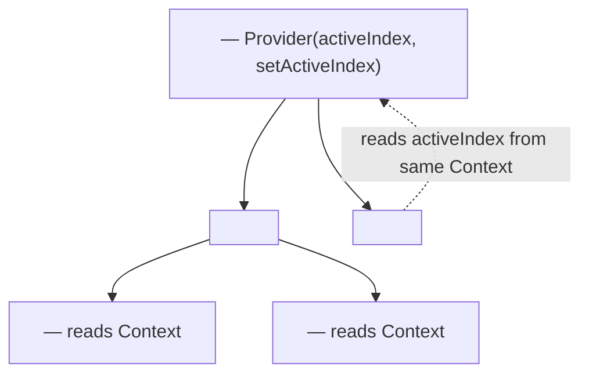
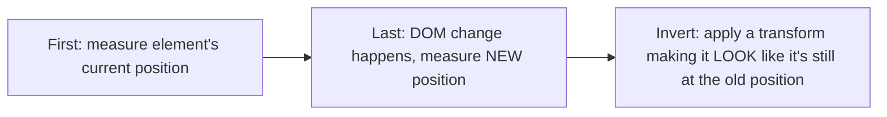

# Chapter 23: Advanced Component Design Patterns


---

## 1. Learning Objectives

- **Design** Compound Components that share implicit state via Context.
- **Apply** the Render Props pattern to share cross-cutting logic without hooks.
- **Evaluate** a lightweight custom-hook-as-store pattern as an alternative to Zustand/Redux for small-scoped shared state.

---

## 2. Motivation


---

## 3. Core Theory


### 3.5 Compound Components

A **Compound Component** pattern exposes a set of components that implicitly share state via Context (Chapter 9), letting consumers compose them freely while the parent manages coordination invisibly: `<Tabs><Tabs.List><Tabs.Tab>...</Tabs.Tab></Tabs.List><Tabs.Panel>...</Tabs.Panel></Tabs>` — each sub-component reads shared state (active tab index) from a Context Provider established by the outer `Tabs`, without the consumer ever passing that state explicitly as props.

### 3.6 Render Props

The **Render Props** pattern shares logic by passing a **function as a child or prop** that receives the shared state/logic and returns JSX: `<MouseTracker>{(pos) => <Cursor x={pos.x} y={pos.y} />}</MouseTracker>`. Largely superseded by custom hooks (Chapter 9) for most use cases — a custom hook achieves the same logic-sharing goal with less nesting — but Render Props remain relevant for cases needing to inject markup at a specific, controlled position within another component's render output (some component libraries still expose this pattern for maximum flexibility).

### 3.7 Custom Hook as a Lightweight Store

For state shared across a *small*, bounded set of components (not the whole app), a plain custom hook wrapping a module-level variable plus a subscriber list can serve as an extremely lightweight alternative to Zustand/Redux (Chapters 13, 24) — essentially hand-building the same `useSyncExternalStore`-based pattern those libraries provide, useful to understand as the "what these libraries automate" foundation, and occasionally appropriate for a single, self-contained feature that doesn't warrant a full store dependency.

---

## 4. Visual Diagrams


```mermaid
flowchart TD
```

### 4.2 Compound Component Implicit State Sharing






---

## 5. Step-by-Step Walkthrough: Building a Compound `Tabs` Component

```tsx
const TabsContext = createContext<{ active: number; setActive: (i: number) => void } | null>(null);

function Tabs({ children, defaultIndex = 0 }: { children: React.ReactNode; defaultIndex?: number }) {
  const [active, setActive] = useState(defaultIndex);
  return <TabsContext.Provider value={{ active, setActive }}>{children}</TabsContext.Provider>;
}

function Tab({ index, children }: { index: number; children: React.ReactNode }) {
  const ctx = useContext(TabsContext)!;
  return (
    <button aria-selected={ctx.active === index} onClick={() => ctx.setActive(index)}>
      {children}
    </button>
  );
}

function Panel({ index, children }: { index: number; children: React.ReactNode }) {
  const ctx = useContext(TabsContext)!;
  return ctx.active === index ? <div role="tabpanel">{children}</div> : null;
}

Tabs.Tab = Tab;
Tabs.Panel = Panel;
```

1. `Tabs` establishes a `Context.Provider` holding `active`/`setActive` — this is the **only** place state lives; `Tab` and `Panel` never receive it as an explicit prop.
2. `Tab` reads the shared context to determine if it's the active tab and to trigger switching — directly reusing Chapter 9's `useContext` mechanics, but scoped narrowly to this one component family rather than a broad app-level concern (avoiding the Chapter 9 Context-scaling warning, since this Context's consumers are always few and co-located).
3. `Panel` reads the same context to decide whether to render its children — coordination between `Tab` and `Panel` is entirely implicit from the consumer's perspective.
4. A consumer composes `<Tabs><Tabs.Tab index={0}>...</Tabs.Tab><Tabs.Panel index={0}>...</Tabs.Panel></Tabs>` freely, in any order or nesting depth, exactly matching Chapter 8's composition philosophy applied to a stateful, coordinated component family.

---

## 6. Internal Implementation


---

## 7. Code Examples

### 7.1 Compound Components Example

```tsx
import React, { createContext, useContext, useState } from "react";

const ToggleContext = createContext<{ on: boolean; toggle: () => void } | null>(null);

export function Toggle({ children }: { children: React.ReactNode }) {
  const [on, setOn] = useState(false);
  const toggle = () => setOn((prev) => !prev);
  return (
    <ToggleContext.Provider value={{ on, toggle }}>
      {children}
    </ToggleContext.Provider>
  );
}

function ToggleOn({ children }: { children: React.ReactNode }) {
  const context = useContext(ToggleContext);
  if (!context) throw new Error("ToggleOn must be used within <Toggle>");
  return context.on ? <>{children}</> : null;
}

function ToggleOff({ children }: { children: React.ReactNode }) {
  const context = useContext(ToggleContext);
  if (!context) throw new Error("ToggleOff must be used within <Toggle>");
  return !context.on ? <>{children}</> : null;
}

function ToggleButton() {
  const context = useContext(ToggleContext);
  if (!context) throw new Error("ToggleButton must be used within <Toggle>");
  return (
    <button onClick={context.toggle} className="border p-2 rounded">
      {context.on ? "Turn Off" : "Turn On"}
    </button>
  );
}

// Bind sub-components to parent namespaces
Toggle.On = ToggleOn;
Toggle.Off = ToggleOff;
Toggle.Button = ToggleButton;
```

### 7.2 Render Props Example

```tsx
import React, { useState } from "react";

interface MousePosition { x: number; y: number; }

function MouseTracker({ children }: { children: (pos: MousePosition) => React.ReactNode }) {
  const [position, setPosition] = useState<MousePosition>({ x: 0, y: 0 });

  const handleMouseMove = (e: React.MouseEvent) => {
    setPosition({ x: e.clientX, y: e.clientY });
  };

  return (
    <div onMouseMove={handleMouseMove} style={{ height: "200px", border: "1px dashed gray" }}>
      {children(position)}
    </div>
  );
}
```

### 7.3 Master Walkthrough: Running and Verifying Compound Components

To verify implicit state coordination using Compound Components inside the Vite environment, follow this guide:

#### Step 1: Create the Component file
Inside your Vite project (`react-setup-sandbox`), create `src/components/CompoundSandbox.tsx`:
```tsx
import React, { createContext, useContext, useState } from "react";

// 1. Establish the scoped Context
const TabsContext = createContext<{ active: number; setActive: (i: number) => void } | null>(null);

// 2. Parent Coordinator
export function Tabs({ children, defaultIndex = 0 }: { children: React.ReactNode; defaultIndex?: number }) {
    const [active, setActive] = useState(defaultIndex);
    return (
        <TabsContext.Provider value={{ active, setActive }}>
            <div className="border rounded p-4 bg-white space-y-4 max-w-sm mx-auto shadow-sm">
                {children}
            </div>
        </TabsContext.Provider>
    );
}

// 3. Tab Button Sub-component
function Tab({ index, children }: { index: number; children: React.ReactNode }) {
    const context = useContext(TabsContext);
    if (!context) throw new Error("Tab must be rendered inside a Tabs component.");
    
    const isActive = context.active === index;
    return (
        <button
            onClick={() => context.setActive(index)}
            className={`px-4 py-2 text-sm font-semibold rounded transition ${
                isActive ? "bg-blue-600 text-white" : "bg-gray-100 text-gray-700 hover:bg-gray-200"
            }`}
        >
            {children}
        </button>
    );
}

// 4. Panel Display Sub-component
function Panel({ index, children }: { index: number; children: React.ReactNode }) {
    const context = useContext(TabsContext);
    if (!context) throw new Error("Panel must be rendered inside a Tabs component.");
    
    if (context.active !== index) return null;
    return (
        <div className="p-4 bg-gray-50 border rounded text-gray-700 text-sm">
            {children}
        </div>
    );
}

// Attach sub-components
Tabs.Tab = Tab;
Tabs.Panel = Panel;

export function CompoundSandbox() {
    return (
        <div className="space-y-6">
            <h2 className="text-xl font-bold text-center">Compound Tabs Controller</h2>
            <Tabs defaultIndex={0}>
                <div className="flex gap-2 border-b pb-2">
                    <Tabs.Tab index={0}>Overview</Tabs.Tab>
                    <Tabs.Tab index={1}>Settings</Tabs.Tab>
                </div>
                <Tabs.Panel index={0}>
                    <h4>📄 Project Overview Panel</h4>
                    <p className="text-xs mt-1 text-gray-500">Document configuration settings and workspace summaries live here.</p>
                </Tabs.Panel>
                <Tabs.Panel index={1}>
                    <h4>⚙️ Settings Configuration</h4>
                    <p className="text-xs mt-1 text-gray-500">Set workspace keys, access tokens, and collaborative socket ports.</p>
                </Tabs.Panel>
            </Tabs>
        </div>
    );
}
```

#### Step 2: Wire into App.tsx
Update `src/App.tsx` to render the sandbox component:
```tsx
import { CompoundSandbox } from "./components/CompoundSandbox";

export default function App() {
    return (
        <main className="min-h-screen bg-gray-50 flex items-center justify-center">
            <CompoundSandbox />
        </main>
    );
}
```

#### Step 3: Run and Diagnose in Browser
1. Start the dev server: `pnpm run dev`.
2. Open the page at [http://localhost:5173](http://localhost:5173).
3. Click between **"Overview"** and **"Settings"** tab buttons.
   * Observe the panel swaps instantly.
   * Review the JSX code structure: notice the consumer never has to write explicit state handlers or thread `activeIndex` down as props to the Tab or Panel components. All coordination happens implicitly through context encapsulated inside the parent boundary.

---

## 8. Common Mistakes

| Level | Mistake |
|---|---|

---

## 9. Performance Analysis

- **Compound Component Context re-renders:** scoped narrowly (Section 5's `Tabs` example has few consumers), this avoids the broad re-render cost Chapter 9 flagged for app-wide Context — a key reason Compound Components remain a safe, non-performance-compromising pattern even in performance-sensitive codebases.

---

## 10. Security Inventory


---

## 11. Technology Comparisons

|---|---|---|

| Reusability Pattern | Boolean-prop-heavy component | Compound Components | Render Props |
|---|---|---|---|
| **Implicit coordination** | None — all explicit props | Yes, via Context | Yes, via function-as-child |
| **Modern preferred alternative** | N/A | Preferred for markup-heavy composable UI | Mostly superseded by custom hooks (Ch. 9) |

---

## 12. Engineering Decisions


---

## 13. Exercises


**Medium:** Build a Compound `Accordion` component (`Accordion`, `Accordion.Item`, `Accordion.Trigger`, `Accordion.Content`) supporting multiple simultaneously-open items, using Context to share open/closed state per item.


---

## 14. Capstone Integration Step (Course Complete)


---

## 🎓 Course Complete

You have built ScribeCollab across 25 chapters, spanning the DOM to JWT-verified, canary-deployed production infrastructure, plus the wider ecosystem of routing, state, and design-pattern alternatives you'll meet in real codebases. The engineering discipline this course was actually teaching was never any single API — it was the habit of asking, at every layer: *what does this actually cost, what breaks if I'm wrong, and how do I verify it's correct in production, not just in development.* Apply that habit to whatever you build next. Return to the [course README](../README.md) for the full map and capstone rubric.

---

## 15. Supplementary Topics & Core Lecture Knowledge

The following supplementary modules map and expand the core React advanced component patterns and UI compositions:

### 15.1 Compound Components Pattern & Implicit Context Coordination

Compound components design a clean API surface by coordinating related sub-components implicitly, avoiding explicit prop-drilling:
* **The Coordination Problem**: In a `<Tabs>` component, the active state and setter callback need to be accessible by both the Tab buttons and the Panel content windows.
* **The Compound Solution**: 
  1. The parent container component holds the active state and sets up a localized React Context Provider.
  2. Sub-components (like `Tabs.Tab` and `Tabs.Panel`) use `useContext` internally to read active index properties and dispatch setters.
  3. The consumer writes clean, declarative markup without managing layout coordination logic directly:

```tsx
<Tabs defaultIndex={0}>
  <Tabs.List>
    <Tabs.Tab index={0}>Tab A</Tabs.Tab>
    <Tabs.Tab index={1}>Tab B</Tabs.Tab>
  </Tabs.List>
  <Tabs.Panel index={0}>Content A</Tabs.Panel>
  <Tabs.Panel index={1}>Content B</Tabs.Panel>
</Tabs>
```

### 15.2 Render Props: Dynamic Control Inversion

The Render Props pattern shares logic by receiving a function component as a child or prop:
* **The Concept**: Instead of a component hard-coding what it renders, it executes a callback function, passing dynamic state variables (e.g. coordinates, search list indices) back to the consumer.
* **Modern Alternative**: While mostly superseded by Custom Hooks for simple state sharing, render props are still powerful when creating layouts that require wrapper logic and custom markup templates dynamically.

### 15.3 Input Debouncing in Search Queries

When binding dynamic searches to inputs:
* **The Problem**: Executing query requests on every keystroke floods the network stack with requests and lags rendering.
* **The Solution (Debounce)**: Wrap input changes in a debounce timer. This delays executing the search logic until the user stops typing for a specified time (e.g. 300ms).

```tsx
// Simple Debounce Hook:
export function useDebounce<T>(value: T, delay: number): T {
  const [debouncedValue, setDebouncedValue] = useState<T>(value);

  useEffect(() => {
    const handler = setTimeout(() => {
      setDebouncedValue(value);
    }, delay);

    return () => clearTimeout(handler); // Clears previous timer on keypress
  }, [value, delay]);

  return debouncedValue;
}
```
