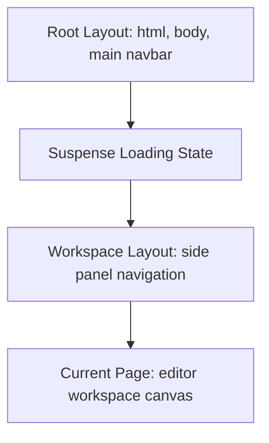

# Chapter 24: Next.js — Enterprise Project Scaffolding & App Router

**Prerequisites:** Phase 5 Complete · **Difficulty:** Level A (Next.js)

> 🔗 **Welcome to the Next.js Phase:** In Phase 5, we explored React client-side architectures, custom hooks, store selectors, and rendering optimizations. Now, we step into the framework for enterprise web platforms: Next.js. In this chapter, we will scaffold a Next.js App Router application, dissect its project layout structure, and build dynamic page segments. This setup is the structural foundation for Server Components and edge caching models we will build across Phase 6.

---

## 1. Learning Objectives

- **Scaffold** an enterprise Next.js App Router project using pnpm packages CLI tools.
- **Explain** Next.js App Router file-system routing conventions, layouts, pages, loading templates, and error boundaries.
- **Configure** nested folder routing paths and access dynamic URL segments cleanly.
- **Analyze** client-side navigation prefetching optimizations inside route link components.
- **Run** build compilation scripts and verify generated deployment assets.

---

## 2. Motivation

Next.js is a meta-framework that adds server-side rendering (SSR), static site generation (SSG), and API routing pipelines to React. In plain React apps, users download a blank HTML page and wait for JavaScript to execute in the browser before seeing any UI. Next.js does this compilation work on the server, sending pre-rendered HTML to the client for faster page loads and improved SEO.

To build clean Next.js platforms, you must understand its folder-based routing structure. Organizing layouts incorrectly can lead to layout shifts, redundant data fetches, and broken authentication redirects.

---

## 3. Core Theory

### 3.1 Next.js Routing Model
Next.js App Router uses a folder-based routing structure. Each directory inside `src/app/` represents a URL path segment. A route is made active by placing a `page.tsx` file inside the folder.

```
          FOLDER ROUTING HIERARCHY
src/app/
├── layout.tsx         # Shared root layout (HTML header, navbar)
├── page.tsx           # Home page UI (Resolves to /)
├── loading.tsx        # Suspense loading screen UI
└── workspace/
    ├── layout.tsx     # Nested layout for workspace path
    ├── page.tsx       # Workspace dashboard (Resolves to /workspace)
    └── [id]/
        └── page.tsx   # Dynamic workspace document (Resolves to /workspace/doc-1)
```

### 3.2 Special Next.js App Router Files
*   `layout.tsx`: Defines shared layouts. They preserve state and do not re-render during page transitions.
*   `page.tsx`: Unique UI segment rendered for the route.
*   `loading.tsx`: Automatically wraps the route inside a React Suspense boundary to show loading screens during async data loads.
*   `error.tsx`: Wraps the route inside a React Error Boundary to catch runtime errors without crashing the main application.

---

## 4. Visual Diagrams

### 4.1 Next.js App Router Nested Layout Composition


---

## 5. Step-by-Step Walkthrough: Scaffolding a Next.js App

Let’s step through scaffolding a new Next.js App Router project:

1.  **Initialize Next.js CLI:** Scaffold the application non-interactively.
    ```bash
    pnpm create next-app next-collab-app --typescript --tailwind --app --src-dir --import-alias "@/*" --use-pnpm
    ```
2.  **Navigate & Inspect:** Access the folder directory:
    ```bash
    cd next-collab-app
    ```
3.  **Inspect Package Scripts:** Open `package.json` to verify run scripts:
    ```json
    "scripts": {
      "dev": "next dev",
      "build": "next build",
      "start": "next start",
      "lint": "next lint"
    }
    ```
4.  **Run Development Server:** Boot the dev server locally.
    ```bash
    pnpm run dev
    ```
    Next.js is now running locally on [http://localhost:3000](http://localhost:3000).

---

## 6. Internal Implementation: Server-Side Pre-Rendering

Under the hood, when a request hits Next.js, the server renders the page component tree into a static HTML string. For interactive components (Client Components), Next.js serializes their props into a JSON-like payload embedded inside the HTML. 

When the browser receives this pre-rendered HTML, it displays it instantly. The browser then downloads the JavaScript bundles and executes them to bind event listeners to the HTML elements. This process is called **hydration**.

---

## 7. Code Examples

### 7.1 Root Layout Implementation
Create a root layout to wrap the entire application in `src/app/layout.tsx`:
```tsx
// src/app/layout.tsx
import type { Metadata } from "next";
import "./globals.css";

export const metadata: Metadata = {
  title: "ScribeCollab Portal",
  description: "Enterprise Collaborative Workspace"
};

export default function RootLayout({ children }: { children: React.ReactNode }) {
  return (
    <html lang="en">
      <body className="bg-gray-50 text-gray-900">
        <header className="p-4 bg-white border-b">
          <nav className="max-w-7xl mx-auto font-bold text-lg">ScribeCollab</nav>
        </header>
        <main className="max-w-7xl mx-auto p-6">{children}</main>
      </body>
    </html>
  );
}
```

### 7.2 Practical Example: A Nested Workspace Dashboard Route
Create a dashboard page in `src/app/dashboard/page.tsx`:
```tsx
// src/app/dashboard/page.tsx
import Link from "next/link";

export default function DashboardPage() {
    const testWorkspaces = [
        { id: "ws-1", name: "Engineering Design Docs" },
        { id: "ws-2", name: "Marketing Blog Drafts" }
    ];

    return (
        <div className="space-y-6">
            <h1 className="text-3xl font-bold">Your Workspaces</h1>
            <ul className="grid gap-4 md:grid-cols-2">
                {testWorkspaces.map(ws => (
                    <li key={ws.id} className="p-6 bg-white border rounded-lg shadow-sm">
                        <h2 className="text-xl font-semibold mb-2">{ws.name}</h2>
                        {/* Optimised pre-fetched route link navigation */}
                        <Link 
                            href={`/workspace/${ws.id}`}
                            className="text-blue-600 hover:underline font-medium"
                        >
                            Open Workspace →
                        </Link>
                    </li>
                ))}
            </ul>
        </div>
    );
}
```

### 7.3 Production-Ready Pattern: Extracting Dynamic Parameters safely
Create a dynamic workspace page file in `src/app/workspace/[id]/page.tsx`:
```tsx
// src/app/workspace/[id]/page.tsx

interface WorkspacePageProps {
    params: {
        id: string;
    };
}

export default function WorkspacePage({ params }: WorkspacePageProps) {
    // Access parameter id safely with type verification
    const activeWorkspaceId = params.id;

    return (
        <div className="p-6 bg-white border rounded-lg shadow-md space-y-4">
            <h1 className="text-2xl font-bold">Active Canvas</h1>
            <p className="text-gray-600">
                Editing Workspace Resource Identifier: <code className="bg-gray-100 px-2 py-1 rounded">{activeWorkspaceId}</code>
            </p>
        </div>
    );
}
```

### 7.4 Incorrect Anti-Pattern vs. Corrected Implementation

#### Incorrect: Using Standard Anchor Tags for Page Transitions
```tsx
// src/anti-pattern-nav.tsx
export function NavigationBar() {
    // standard <a> tags trigger full page reloads, clearing React state and slowing down transitions
    return <a href="/dashboard">Dashboard</a>;
}
```

#### Corrected: Use Next.js Link Components
```tsx
// src/corrected-nav.tsx
import Link from "next/link";

export function NavigationBar() {
    // Next.js <Link> intercepts page loads, prefetching route chunks for instant transitions
    return <Link href="/dashboard">Dashboard</Link>;
}
```

### 7.5 Additional Example: Route Loading State fallbacks
Create a loading fallback screen inside `src/app/dashboard/loading.tsx`:
```tsx
// src/app/dashboard/loading.tsx
export default function DashboardLoading() {
    return (
        <div className="flex items-center justify-center min-h-[200px]">
            <p className="text-gray-500 font-medium animate-pulse">
                Fetching workspace configurations, please wait...
            </p>
        </div>
    );
}
```

---

## 8. Common Mistakes

### Junior Developer: Direct Window Access in Server Components
Using client-side APIs (like `window.localStorage` or `document.getElementById`) directly in server components, causing compilation errors because they run on the server where these APIs do not exist.

### Mid-Level Developer: Uncached Server Actions
Exposing raw database queries directly in dynamic pages without setting up appropriate layout caches, leading to duplicate queries and slower loading speeds.

### Senior Developer: Duplicate Layout Scaffolding
Re-declaring global navbar components inside individual page files instead of the shared parent layout file, leading to redundant re-renders and page shifts.

---

## 9. Performance Analysis

### 9.1 Prefetching Impact
The Next.js Link component automatically prefetches code for target routes when they enter the user's viewport, making page transitions feel instant.

### 9.2 Route Target Output Comparisons
| Target Option | Type | Rendering Server Cost | SEO Value |
|---|---|---|---|
| Static Site Generation (SSG) | Build-time | Low | Excellent |
| Server-Side Rendering (SSR) | Request-time | Moderate | Excellent |
| Client-Side Rendering (CSR) | Client-time | None (server-side) | Limited |

---

## 10. Security Inventory

- **Secret Variable Leaks:** Exposing sensitive server-side variables (such as database credentials or API keys) to the client. Keep them secure by omitting the `NEXT_PUBLIC_` prefix in `.env` files.
- **Cross-Site Scripting (XSS):** Ensure that any dynamic variables rendered directly onto the page are sanitized to prevent malicious script injections.

---

## 11. Technology Comparisons

### App Router vs. Pages Router
| Dimension | App Router | Pages Router |
|---|---|---|
| **Root Routing Folder** | `src/app/` | `src/pages/` |
| **Component Type** | React Server Components (RSC) | Client-side Components (CSR) |
| **Data Fetching Methods** | Native `fetch` integrations | `getServerSideProps` methods |
| **Layout Nesting** | Yes (native nested layout) | No (custom custom wrappers) |

---

## 12. Engineering Decisions

### When to use Pages Router over App Router?
*   **App Router (Next.js 13+):** Recommended for new projects. It leverages React Server Components to reduce client-side bundle sizes and supports native nested layouts.
*   **Pages Router (Legacy):** Best for maintaining legacy applications that already use `getServerSideProps` frameworks.

---

## 13. Exercises

### Easy
Scaffold a Next.js App Router application, create a dynamic segment path `/user/[username]`, render the username parameter dynamically, and test it in your browser.

### Medium
Implement a custom navigation component with a sidebar layout. Use path indicators (such as `usePathname` from `next/navigation`) to highlight the active menu item.

### Hard
Write a dashboard layout containing a search field. Pass the search value to nested page components as query parameters (`?query=value`) without triggering page refreshes.

---

## 14. Capstone Integration Step

In the *ScribeCollab* workspace application, we must configure absolute folder paths to resolve components quickly.
Configure `tsconfig.json` mappings inside your Next.js project:

```json
{
  "compilerOptions": {
    "baseUrl": ".",
    "paths": {
      "@/*": ["src/*"]
    }
  }
}
```
This lets you import nested files cleanly:
```typescript
import { Document } from "@/components/Document"; // Resolves to src/components/Document
```

---

## 15. Supplementary Topics & Core Lecture Knowledge

### Next.js Caching Pipeline
Next.js optimizes performance using a multi-layer caching system:
1.  **Request Memoization:** De-duplicates identical `fetch` requests within the same server render pass.
2.  **Data Cache:** Caches fetched data across user requests and deployments until it is invalidated.
3.  **Full Route Cache:** Caches compiled HTML and Server Component payloads at build time to speed up page loads.
4.  **Router Cache:** Caches route segments on the client side in memory during user sessions.
