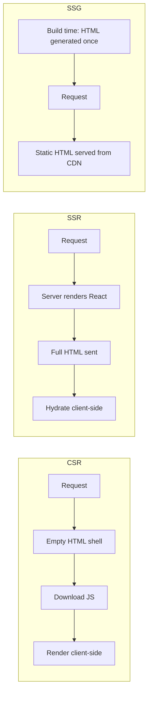
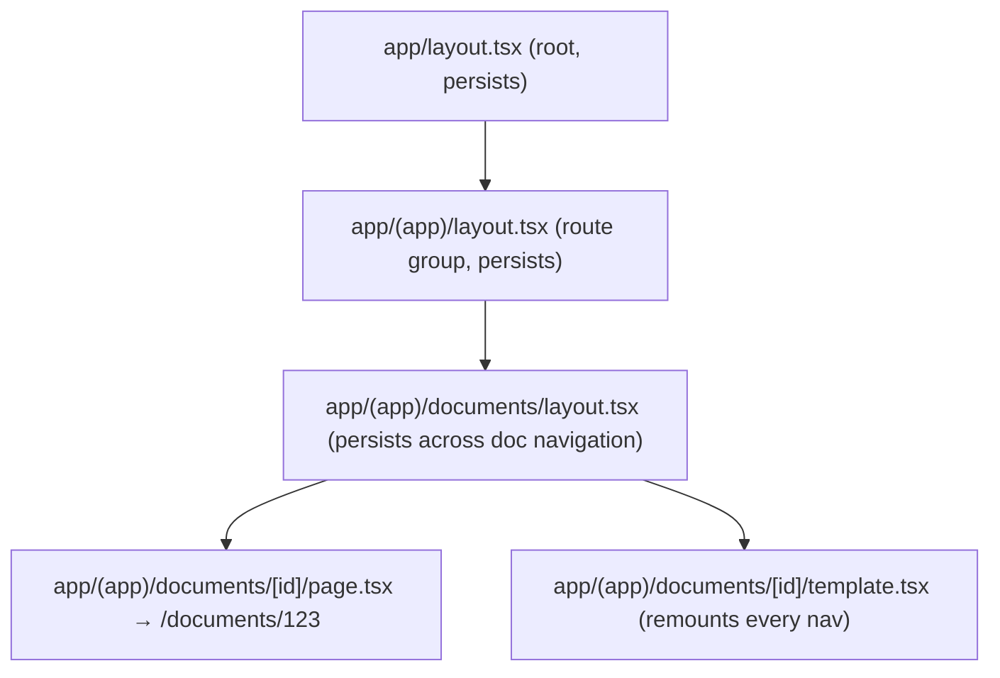

# Chapter 25: Next.js Layout Architecture, Navigation & Accessibility (A11Y)

**Prerequisites:** Phase 3 Complete · **Difficulty:** Level A (Next.js)

> 🔗 **Continuing from Phase 3:** ScribeCollab is a complete, resilient client-side React application, and Chapter 16 gave you a working model of client-side routing with React Router. This chapter moves the primary app into Next.js, introducing the App Router's layout model — you'll recognize its nested-layout and data-loading ideas immediately from Chapter 16, now integrated with server rendering.

---

## 1. Learning Objectives

- **Differentiate** SSR, CSR, and Static Site Generation (SSG) and articulate when each is appropriate.
- **Construct** nested layouts, templates, and route groups using the Next.js App Router.
- **Implement** dynamic routes and client-side navigation with correct prefetching behavior.
- **Configure** internationalized routing.
- **Apply** accessible focus management across client-side route transitions.

---

## 2. Motivation

A pure client-side React SPA (Chapter 16's React Router approach) has two structural weaknesses at production scale: the browser must download and execute the entire JS bundle before showing *anything* meaningful (poor Largest Contentful Paint), and search engines/social previews see an empty shell unless they execute JavaScript. Next.js's App Router exists to solve both, by making server rendering, layouts, and routing first-class, file-system-driven concepts — but it also reintroduces a problem the SPA era briefly hid: **client-side route transitions don't natively announce navigation to screen readers** the way full page loads do, since no `document` unload/load event fires. Chapter 1's accessibility investment must now be extended to explicitly handle this.

---

## 3. Core Theory

### 3.1 Rendering Strategies: SSR, CSR, SSG

- **CSR (Client-Side Rendering):** the model Chapter 16 used exclusively — the server sends a near-empty HTML shell; the browser downloads JS and renders everything client-side.
- **SSR (Server-Side Rendering):** the server executes React on each request, sending fully-formed HTML immediately, then "hydrates" it with client-side interactivity (Chapter 18 covers hydration mechanics in depth).
- **SSG (Static Site Generation):** HTML is generated **once**, at build time, and served as a static file from a CDN — fastest possible delivery, but the content is fixed until the next build (or ISR, Chapter 18).

### 3.2 The App Router's File-System Model

The `app/` directory maps folder structure directly to routes: `app/documents/[id]/page.tsx` maps to `/documents/123`. Special files carry specific meaning: `layout.tsx` wraps all routes beneath it and **persists across navigations within it** (it does not re-render or remount when a child route changes — critical for preserving scroll position and component state in persistent UI like a sidebar, exactly the `<Outlet />` persistence behavior you saw with React Router in Chapter 16); `template.tsx` looks similar but **does** remount on every navigation, useful for enter/exit animations; `page.tsx` is the leaf route's actual content.

### 3.3 Route Groups & Dynamic Segments

**Route Groups** (`(groupName)`) let you organize routes into folders **without** affecting the URL path — useful for applying a shared layout to a subset of routes (e.g., `(authenticated)` wrapping all logged-in pages) without that grouping appearing in the URL. **Dynamic segments** (`[id]`) capture URL parameters as props to the page component, the direct file-system-based equivalent of React Router's `:id` path parameters; `[...slug]` captures multiple segments (catch-all); `[[...slug]]` makes the catch-all optional.

### 3.4 Client Navigation & Prefetching

The `<Link>` component performs client-side navigation (no full page reload) and, by default, **prefetches** the linked route's code and (for static routes) data when the link enters the viewport — directly reusing Chapter 5's IntersectionObserver-based lazy-loading pattern, but applied by the framework to route prefetching instead of content loading.

### 3.5 Internationalization (i18n) Routing

Localized routing is typically implemented via a dynamic `[locale]` segment at the root of `app/` (e.g., `app/[locale]/documents/page.tsx`), combined with middleware (Chapter 19) that detects the user's preferred locale and redirects/rewrites accordingly.

### 3.6 Accessible Navigation Across Route Transitions

Because client-side navigation doesn't trigger a full page load, screen readers receive **no automatic announcement** that the page changed, and focus silently remains on the (now-stale, possibly removed) link that was clicked — the exact same gap you'd face building this by hand with Chapter 16's React Router. Production-grade accessible routing requires explicitly: (1) moving focus to the new page's main heading or `<main>` landmark after navigation, and (2) announcing the new page title via a visually-hidden `aria-live` region — directly extending Chapter 1's live-region and focus-management patterns to the routing layer.

---

## 4. Visual Diagrams

### 4.1 SSR vs. CSR vs. SSG Timing



### 4.2 App Router File-System Mapping



### 4.3 Accessible Route Transition Sequence

```mermaid
sequenceDiagram
    participant User
    participant Link as Link component
    participant Router as Next.js Router
    participant A11y as Focus/Live Region Manager
    User->>Link: clicks navigation link
    Link->>Router: client-side navigation (no full reload)
    Router->>Router: fetch/render new route
    Router->>A11y: navigation complete event
    A11y->>A11y: move focus to new <main>/heading
    A11y->>A11y: update aria-live region with new page title
    Note over User: Screen reader announces the page change
```

---

## 5. Step-by-Step Walkthrough: Persistent Layout vs. Remounting Template

1. User is on `/documents/1`, with a `layout.tsx` rendering the document sidebar and a `page.tsx` rendering the document content.
2. User clicks a `<Link href="/documents/2">` in the sidebar.
3. Next.js's router matches the new route, determines that `layout.tsx` (sidebar) is **shared** between `/documents/1` and `/documents/2`, and does **not** remount it — its component state (e.g., scroll position, expanded folders) is preserved.
4. Only `page.tsx` (the document content) is swapped for the new route's content — this is the direct, framework-level analog of Chapter 8's "stable component identity avoids remounting" principle, applied at the routing layer.
5. If a `template.tsx` were present instead of relying purely on `layout.tsx`, it would remount on every navigation — appropriate only when you specifically want fresh state or a transition animation per navigation.

---

## 6. Internal Implementation

The App Router's layout persistence is implemented via React's own reconciliation rules from Chapter 8: Next.js constructs a **nested React element tree** mirroring the folder structure, and because the `layout.tsx` component at a given path segment retains the same **type and position** in that tree across a navigation that only changes a deeper segment, React's Fiber reconciler (Chapter 12) naturally treats it as the *same* component instance to update in place, not a new one to mount — layout persistence is not special-cased routing magic, it's a direct, predictable consequence of the same key/type-based reconciliation rules from Chapter 8 applied to route segments as if they were regular nested components.

---

## 7. Code Examples

### 7.1 Minimal Example — Nested Layout

```tsx
// app/(app)/layout.tsx
export default function AppLayout({ children }: { children: React.ReactNode }) {
  return (
    <div className="app-shell">
      <Sidebar />
      <main>{children}</main>
    </div>
  );
}
```

### 7.2 Practical Example — Dynamic Route

```tsx
// app/(app)/documents/[id]/page.tsx
export default async function DocumentPage({ params }: { params: { id: string } }) {
  const doc = await getDocument(params.id);
  return <DocumentEditor doc={doc} />;
}
```

### 7.3 Production-Ready — Accessible Route Announcer (Client Component)

```tsx
"use client";
import { usePathname } from "next/navigation";
import { useEffect, useRef } from "react";

export function RouteAnnouncer() {
  const pathname = usePathname();
  const liveRegionRef = useRef<HTMLDivElement>(null);
  const isFirstRender = useRef(true);

  useEffect(() => {
    if (isFirstRender.current) {
      isFirstRender.current = false; // don't announce the initial load
      return;
    }
    const title = document.title;
    if (liveRegionRef.current) liveRegionRef.current.textContent = `Navigated to ${title}`;

    const mainHeading = document.querySelector<HTMLElement>("main h1");
    mainHeading?.setAttribute("tabIndex", "-1");
    mainHeading?.focus();
  }, [pathname]);

  return (
    <div
      ref={liveRegionRef}
      role="status"
      aria-live="polite"
      style={{ position: "absolute", width: 1, height: 1, overflow: "hidden" }}
    />
  );
}
```

### 7.4 Anti-Pattern → Corrected

```tsx
// ❌ ANTI-PATTERN: relying purely on client-side navigation with no
// focus management or announcement — sighted mouse users don't notice,
// but screen reader users get NO indication the page changed at all,
// and keyboard focus remains on a link that may have scrolled away.
<Link href={`/documents/${nextId}`}>Next Document</Link>
```

```tsx
// ✅ CORRECTED: pair every layout with the RouteAnnouncer (7.3) mounted
// once near the root, so ALL navigations — regardless of which link
// triggered them — get consistent focus and announcement handling.
// app/layout.tsx
export default function RootLayout({ children }: { children: React.ReactNode }) {
  return (
    <html lang="en">
      <body>
        <RouteAnnouncer />
        {children}
      </body>
    </html>
  );
}
```

### 7.5 Additional Example — `generateStaticParams` for Pre-Rendered Dynamic Routes

```tsx
// app/(marketing)/blog/[slug]/page.tsx
export async function generateStaticParams() {
  const posts = await getAllPublicPostSlugs();
  return posts.map((slug) => ({ slug })); // pre-renders each at build time (SSG)
}

export default async function BlogPost({ params }: { params: { slug: string } }) {
  const post = await getPostBySlug(params.slug);
  return <Article post={post} />;
}
```

`generateStaticParams` tells Next.js exactly which dynamic segment values to pre-render as static HTML at build time (Section 3.1's SSG, formalized further in Chapter 18), while any slug *not* returned here falls back to on-demand rendering — letting a single dynamic route file serve both a known set of static marketing blog posts and, if configured, newly-published ones without a full rebuild. This is precisely the build-time pre-rendering capability Chapter 16 flagged as structurally unavailable to a pure React Router SPA.

---

## 8. Common Mistakes

| Level | Mistake |
|---|---|
| **Junior** | Using `template.tsx` everywhere out of confusion with `layout.tsx`, unnecessarily remounting shared UI (like a sidebar) on every navigation and losing its state. |
| **Mid-Level** | Shipping client-side routing without any focus/announcement handling, passing visual QA but failing screen-reader-based accessibility audits entirely. |
| **Senior/Production** | Choosing SSR for every single route "for SEO," including highly personalized, rarely-shared, authenticated dashboard views where SSR's per-request server cost provides no real SEO benefit and only adds server load — rendering strategy should match the route's actual sharing/indexing needs (formalized further in Chapter 18). |

---

## 9. Performance Analysis

- **Layout persistence:** avoids re-fetching and re-rendering shared UI (sidebar, header) on every navigation, directly reducing redundant work — analogous to Chapter 8's stable-component-identity performance benefit, now applied at the route level.
- **Link prefetching:** shifts route code/data download earlier (on viewport entry, per Chapter 5's IntersectionObserver model), trading some background bandwidth usage for near-instant perceived navigation — tunable via the `prefetch` prop on `<Link>` where bandwidth is a concern.
- **SSG vs. SSR request cost:** SSG serves a pre-built static file with effectively O(1) per-request server cost; SSR incurs a full render cost on every request — choose based on how frequently content actually changes versus how many requests it serves.

---

## 10. Security Inventory

- **Route groups are not an authorization mechanism:** organizing routes under an `(authenticated)` group changes folder structure only — it does **not** enforce access control by itself; real enforcement must happen in Middleware (Chapter 19) or server-side data-fetching checks.
- **Locale-based routing and open redirects:** i18n middleware that redirects based on detected locale must validate the target path against an allowlist of known locales/routes, never blindly redirecting to a locale value taken directly from an unvalidated header or query parameter.
- **Focus management and information disclosure:** ensure the `RouteAnnouncer`'s announced page title doesn't leak sensitive document titles into contexts where they shouldn't be exposed (e.g., shared screen-reading software on a public kiosk) — align announcement content with the same visibility rules as the rendered page itself.

---

## 11. Technology Comparisons

| Rendering Strategy | CSR (Chapter 16's React Router) | SSR | SSG |
|---|---|---|---|
| **Time to first meaningful paint** | Slowest (full JS download required) | Fast (HTML ready on arrival) | Fastest (pre-built, CDN-served) |
| **SEO/social preview support** | Poor without extra tooling | Excellent | Excellent |
| **Content freshness** | Always current (client-fetched) | Always current (per-request) | Fixed until rebuild (or ISR, Ch. 18) |
| **Best for** | Highly interactive, authenticated app shells | Personalized, frequently-changing pages | Marketing pages, docs, rarely-changing content |

---

## 12. Engineering Decisions

ScribeCollab's authenticated workspace shell adopts SSR (not SSG, given per-user document content) organized under an `(app)` route group, while the marketing/landing pages and public documentation are built as SSG routes under a separate `(marketing)` group — a deliberate rendering-strategy split based on Section 11's comparison, made explicit and enforced by folder structure rather than left as an implicit, inconsistent per-page decision. The `RouteAnnouncer` (7.3) is mounted once in the root layout, making accessible navigation the default for every route rather than an opt-in per-page concern.

---

## 13. Exercises

**Easy:** Explain the difference between `layout.tsx` and `template.tsx`, including one concrete UI scenario where you'd deliberately choose `template.tsx`.

**Medium:** Design the `app/` folder structure for ScribeCollab supporting: a public marketing home page, an authenticated dashboard listing documents, and a dynamic document editor route — using route groups to separate public and authenticated layouts.

**Hard:** ScribeCollab needs to support English and Spanish locales with `/en/documents/123` and `/es/documents/123` style URLs. Design the `[locale]` routing structure, explain how you'd avoid duplicating every layout/page file per locale, and identify what middleware logic (previewed for Chapter 19) would be needed to redirect a bare `/documents/123` request to the user's detected locale.

---

## 14. Capstone Integration Step

**ScribeCollab — Step 17:** Reconstruct the workspace dashboard inside the Next.js App Router: a root layout, an `(app)` route group with a persistent sidebar layout, and a dynamic `documents/[id]/page.tsx` route. Mount the `RouteAnnouncer` (7.3) globally and verify with a screen reader that navigating between documents announces the new title and moves focus to the document's heading, directly extending Chapter 1's accessibility investment to the routing layer.

---

## 🔜 Bridge to Chapter 18

You now have working layouts and navigation, but every route so far has been conceptually simple client- or server-rendered content. Chapter 18 goes deep into *how* the server actually renders these routes — React Server Components, the serialization bridge to the client, caching, and the hydration process that turns SSR's static HTML into an interactive app — the mechanics underneath the rendering strategies you just chose.
