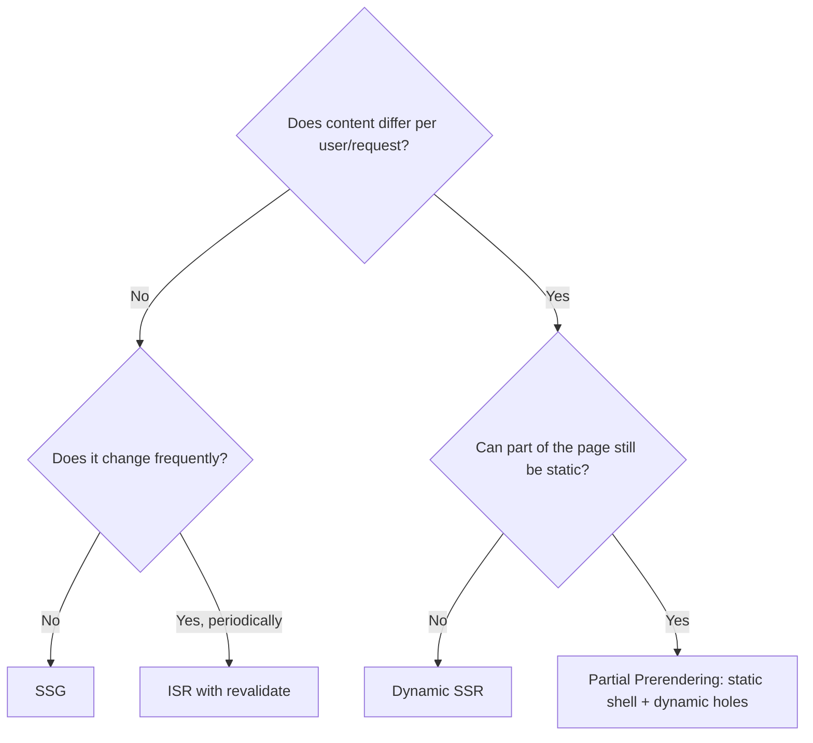
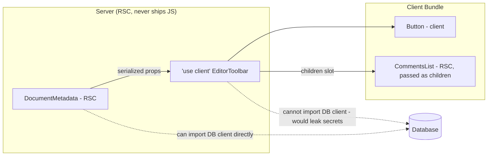
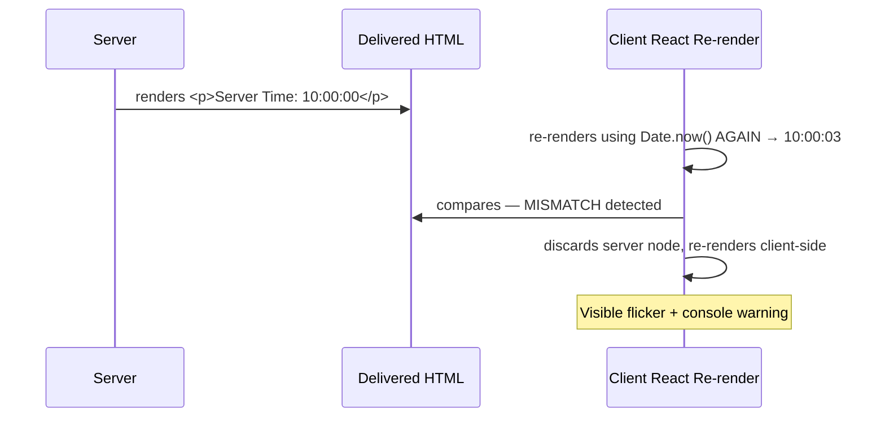

# Chapter 26: Next.js Rendering Strategies & Server Architecture

**Prerequisites:** Chapter 17 · **Difficulty:** Level C (Next.js)

> 🔗 **Continuing from Chapter 17:** You chose rendering strategies (SSR/SSG) and built the routing/layout shell. This chapter opens up *how* those strategies are actually implemented — React Server Components, hydration, caching, and Server Actions — the server-side counterpart to Phase 3's client-side rendering internals (Chapter 12).

---

## 1. Learning Objectives

- **Differentiate** SSG, Static/Dynamic SSR, ISR, and Partial Prerendering, and select correctly among them.
- **Explain** React Server Components and their bundle/security implications.
- **Diagnose** and prevent hydration mismatches.
- **Apply** Next.js's caching and revalidation model correctly for a given data-freshness requirement.
- **Implement** safe, validated Server Actions for client-to-server mutations.

---

## 2. Motivation

Chapter 17 taught you to *choose* between SSR, SSG, and CSR — but production Next.js apps rarely fit cleanly into one bucket per route. A document page might need static shell content (fast, cacheable) alongside live, per-user collaborator presence (must be dynamic) on the *same* page. Understanding React Server Components and Partial Prerendering is what lets you mix these within a single route instead of being forced into an all-or-nothing rendering decision. Separately, hydration mismatches are one of the most common and most confusing production Next.js bugs — an app that "worked in dev" throwing console errors and visibly flickering in production — and they are entirely explainable once you understand exactly what hydration is actually verifying.

---

## 3. Core Theory

### 3.1 The Full Rendering Strategy Spectrum

| Strategy | When HTML is generated | Data freshness |
|---|---|---|
| **SSG** | Build time | Fixed until next build |
| **ISR (Incremental Static Regeneration)** | Build time, then regenerated in the background after a `revalidate` interval | Stale-while-revalidate — serves cached HTML instantly, refreshes periodically |
| **Static SSR** | Per-request, but cacheable (no per-user dynamic data) | Effectively similar to SSG for caching purposes |
| **Dynamic SSR** | Per-request, always | Always current, highest per-request server cost |
| **PPR (Partial Prerendering)** | Static "shell" at build time + dynamic "holes" streamed in per-request | Mixes static speed with per-request freshness on the same page |

### 3.2 React Server Components (RSC)

RSC is a component type that renders **exclusively on the server** and never ships its own JavaScript to the client — its output is serialized (Section 3.4) and sent as part of the initial payload. This means: RSCs can directly access server-only resources (databases, file systems, secrets) safely, and importing a large library inside an RSC (e.g., a heavy Markdown parser) **does not** add to the client bundle at all, since the component's code never executes in the browser.

### 3.3 The Client Boundary: `'use client'`

Any component needing browser-only capability — `useState`, `useEffect`, event handlers, browser APIs (Chapter 5) — must be marked `'use client'`. This directive marks a **boundary**, not just a single file: once you cross into a Client Component, everything it imports and renders beneath it is also part of the client bundle (unless that Client Component explicitly receives Server Components as `children`/props — a key composition pattern for keeping the client bundle minimal).

### 3.4 The Serialization Bridge

Data passed from a Server Component into a Client Component must cross a network-like serialization boundary — only **JSON-serializable values plus a few special cases** (like passing Server Components as `children`) survive this boundary. Functions, class instances, and Symbols generally cannot be passed directly from server to client props (with the specific exception of Server Actions, Section 3.6, which use a special reference-based serialization).

### 3.5 Hydration Mismatches, Precisely Defined

**Hydration** is the process where React, on the client, re-renders the component tree **in memory** and compares it against the server-delivered HTML to attach event listeners and internal state **without re-creating DOM nodes** — it is fundamentally a reconciliation-style match, reusing Chapter 8's type/key matching rules, but matching against real DOM nodes instead of a previous Virtual DOM. A **hydration mismatch** occurs when the client's re-render produces different output than what the server sent (common causes: using `Date.now()` or `Math.random()` directly in render output, or reading browser-only globals like `window` during a code path that also runs server-side) — React detects the mismatch, discards the server-rendered node(s), and re-renders them client-side, causing a visible flicker and, in development, a console warning.

### 3.6 Server Actions

A Server Action (`'use server'`) is a function defined once but callable directly from a Client Component as if it were a normal async function — Next.js generates a secure RPC-style network call under the hood, serializing arguments similarly to Section 3.4. This is exactly the `useActionState`/`useFormStatus`/`useOptimistic` model from Chapter 14, now with the action function itself marked `'use server'` — the hooks you already know don't change at all; only the function they call does. This still requires the exact same server-side authorization and validation rigor as any other network-exposed endpoint.

---

## 4. Visual Diagrams

### 4.1 Rendering Strategy Decision Flow



### 4.2 Server/Client Component Boundary & Serialization



### 4.3 Hydration Match vs. Mismatch



---

## 5. Step-by-Step Walkthrough: Diagnosing a Hydration Mismatch

1. A component renders `<span>{new Date().toLocaleTimeString()}</span>` directly in its body.
2. On the server, this evaluates at request time, producing e.g. `"10:00:00"`, embedded in the HTML sent to the browser.
3. The browser parses and displays that HTML immediately (pre-hydration) — the user briefly sees `"10:00:00"`.
4. React then hydrates: it re-runs the component function **on the client** to build its expected Virtual DOM and reconcile against the existing real DOM nodes (Section 3.5). This client-side evaluation of `new Date()` now produces a *different* value, e.g. `"10:00:02"`.
5. React detects the text content doesn't match what it expected to find in the existing DOM node, logs a hydration mismatch warning, and **discards and re-renders** that node client-side — the displayed time visibly jumps from `10:00:00` to `10:00:02`.
6. **Fix:** compute time-sensitive or client-only values inside a `useEffect` (Chapter 9) so they render only after hydration completes, or explicitly suppress hydration warnings only for genuinely-expected, cosmetic mismatches via `suppressHydrationWarning` (used sparingly, never to paper over real bugs).

---

## 6. Internal Implementation

The serialization bridge (Section 3.4) is implemented via the **React Server Components wire format** — not plain JSON, but a specialized streaming format that can represent references to Client Components (as placeholders to be filled in by the client bundle) interleaved with actual serialized data, sent as a single stream the client progressively parses. This is why Server Actions can "pass functions" across the boundary despite functions not being JSON-serializable: Next.js doesn't literally serialize the function's code — it serializes an **opaque reference ID** bound server-side to the real function, and the generated client-side stub, when called, performs a POST request carrying that reference ID plus the serialized arguments, which the server looks up and invokes — conceptually similar to a stored-procedure call, not a literal code transfer.

---

## 7. Code Examples

### 7.1 Minimal Example — Server Component Fetching Data Directly

```tsx
// app/(app)/documents/[id]/metadata.tsx — a Server Component, no 'use client'
async function DocumentMetadata({ id }: { id: string }) {
  const doc = await db.documents.findUnique({ where: { id } }); // safe: server-only
  return <p>Last edited by {doc.lastEditor}</p>;
}
```

### 7.2 Practical Example — Client/Server Composition via `children`

```tsx
// EditorToolbar.tsx — 'use client', needs onClick handlers
"use client";
export function EditorToolbar({ children }: { children: React.ReactNode }) {
  const [expanded, setExpanded] = useState(false);
  return (
    <div>
      <button onClick={() => setExpanded(!expanded)}>Toggle</button>
      {expanded && children} {/* children can still be an RSC, passed from the server */}
    </div>
  );
}

// page.tsx — Server Component, passes a Server Component as children
export default function Page() {
  return (
    <EditorToolbar>
      <CommentsList /> {/* stays a Server Component, adds zero client JS */}
    </EditorToolbar>
  );
}
```

### 7.3 Production-Ready — Validated Server Action for Document Updates

```tsx
// actions/updateDocumentTitle.ts
"use server";
import { z } from "zod";
import { auth } from "@/lib/auth"; // Chapter 20
import { revalidateTag } from "next/cache";

const UpdateTitleSchema = z.object({
  documentId: z.string(),
  title: z.string().min(1).max(200),
});

export async function updateDocumentTitle(formData: FormData) {
  const session = await auth();
  if (!session) throw new Error("Unauthorized");

  const parsed = UpdateTitleSchema.parse({
    documentId: formData.get("documentId"),
    title: formData.get("title"),
  });

  const doc = await db.documents.findUnique({ where: { id: parsed.documentId } });
  if (doc?.ownerId !== session.userId) throw new Error("Forbidden");

  await db.documents.update({
    where: { id: parsed.documentId },
    data: { title: parsed.title },
  });

  revalidateTag(`document-${parsed.documentId}`); // targeted cache invalidation
}
```

### 7.4 Anti-Pattern → Corrected

```tsx
// ❌ ANTI-PATTERN: rendering a client-only or time-sensitive value
// directly during render, on a component that runs on BOTH server
// and client — guaranteed hydration mismatch.
function LastSaved() {
  return <span>Last saved: {new Date().toLocaleTimeString()}</span>;
}
```

```tsx
// ✅ CORRECTED: render a stable placeholder during SSR/initial hydration,
// then populate the client-only value AFTER hydration completes via
// useEffect (Chapter 9) — no mismatch, since the initial client render
// matches the server output exactly.
"use client";
function LastSaved() {
  const [time, setTime] = useState<string | null>(null);
  useEffect(() => setTime(new Date().toLocaleTimeString()), []);
  return <span>Last saved: {time ?? "—"}</span>;
}
```

### 7.5 Additional Example — Streaming a Slow Section with a Route-Level `loading.tsx`

```tsx
// app/(app)/documents/[id]/loading.tsx — automatic Suspense fallback for this route segment
export default function Loading() {
  return <DocumentSkeleton />;
}

// app/(app)/documents/[id]/page.tsx
export default async function DocumentPage({ params }: { params: { id: string } }) {
  const doc = await getDocument(params.id); // slow query
  return <DocumentEditor doc={doc} />;
}
```

Next.js automatically wraps the route segment in a Suspense boundary using `loading.tsx` as its fallback — the layout (sidebar, header) streams to the browser immediately while `getDocument` is still pending, and the skeleton is swapped for real content the moment the data resolves, all without manually writing a `<Suspense>` tag, directly building on Chapter 15's Suspense mechanics applied at the routing layer.

---

## 8. Common Mistakes

| Level | Mistake |
|---|---|
| **Junior** | Adding `'use client'` to nearly every component "just in case," unnecessarily bloating the client bundle with code that could have stayed server-only. |
| **Mid-Level** | Rendering `Date.now()`, `Math.random()`, or `window`-dependent logic directly in a component's render body without guarding it behind `useEffect`, causing hydration mismatches. |
| **Senior/Production** | Treating Server Actions as inherently secure because "they're not a public API route" — omitting explicit auth/ownership checks (7.3) inside the action itself, when in reality any Server Action is a network-reachable endpoint an attacker can call directly, bypassing the UI entirely. |

---

## 9. Performance Analysis

- **RSC bundle impact:** code that only ever runs in a Server Component contributes **zero** bytes to the client JS bundle — this is a direct, measurable Largest Contentful Paint and Time-to-Interactive improvement compared to shipping the same logic as a Client Component.
- **ISR cost model:** serves cached static HTML for most requests (O(1), CDN-servable) with only occasional background regeneration cost, offering most of SSG's speed with bounded staleness.
- **Hydration cost:** proportional to the size of the initially-rendered interactive tree — minimizing the amount of code marked `'use client'` (Section 3.3) directly reduces hydration time, since only Client Components need to be re-evaluated and matched against existing DOM during hydration.

---

## 10. Security Inventory

- **RSCs as a secrets boundary:** Server Components are the correct place to use database credentials, API keys, and other secrets, specifically because their code never ships to the browser — never import a secret-holding module into a file marked `'use client'`.
- **Server Actions require independent authorization:** as shown in the Common Mistakes table, a Server Action is a fully network-reachable endpoint; it must independently verify the caller's session and ownership of the resource being mutated, exactly as rigorously as a REST/Route Handler endpoint (Chapter 19).
- **Serialization boundary data leakage:** avoid passing an entire database record from a Server Component into a Client Component's props "for convenience" — only pass the specific fields the client actually needs, since anything serialized across the boundary becomes visible in the client-side React DevTools and initial HTML payload.

---

## 11. Technology Comparisons

| Data-Fetching Location | Client Component + `useEffect`/`fetch` | Server Component (`async` component) | Server Action |
|---|---|---|---|
| **Waterfall risk** | High — fetch starts after JS loads and component mounts | Low — fetch starts on the server, in parallel with rendering | N/A (mutation, not fetch) |
| **Bundle impact** | Adds fetching logic + library code to client bundle | Zero client bundle cost | Minimal — generates a small RPC stub |
| **Secret access** | Never safe | Safe | Safe |
| **Best for** | Data that depends on client-only interaction (e.g., search-as-you-type) | Initial page data | Form submissions, mutations |

---

## 12. Engineering Decisions

ScribeCollab's document metadata panel (author, tags, permissions summary) is implemented as a pure Server Component with zero client JS, since it's read-only display data — while the actual text editor remains a Client Component, since it fundamentally requires `useState`/`useEffect`/DOM event handling from Phase 3. All mutations (title updates, permission grants) go through Server Actions (7.3) built directly on the `useActionState` hooks from Chapter 14, with the same Zod schemas (Chapter 7) and explicit authorization checks used throughout the codebase — deliberately avoiding a separate, parallel validation implementation for the Server Action layer.

---

## 13. Exercises

**Easy:** Explain why a Server Component can safely import a database client directly, while a Client Component cannot, tying your answer back to Section 3.2's bundle behavior.

**Medium:** Take the `LastSaved` anti-pattern (7.4) and identify two other common sources of hydration mismatches in a typical dashboard app (beyond time/randomness), explaining the underlying cause for each using Section 3.5's model.

**Hard:** ScribeCollab's document page needs: a static marketing-style header (rarely changes), live per-user permission-gated action buttons (must be dynamic per request), and a comments section that updates every few minutes. Design a Partial Prerendering-based architecture for this page, specifying which parts are static, which are dynamic "holes," and how ISR's `revalidate` might apply to the comments section specifically.

---

## 14. Capstone Integration Step

**ScribeCollab — Step 18:** Convert the document metadata panel into a pure Server Component fetching directly from the database. Implement `updateDocumentTitle` (7.3) as a validated, authorization-checked Server Action, wired to the same `useActionState` pattern built in Chapter 14 — note in a code comment exactly which lines changed to go from a client-only action to a real Server Action. Audit the codebase for any component unnecessarily marked `'use client'` and demote it to a Server Component where no browser-only API is actually used.

---

## 🔜 Bridge to Chapter 19

You can now render efficiently and mutate data safely via Server Actions. The next gap is the network boundary itself: custom API routes for external consumers, middleware that runs before your app's routing logic even begins, and the security headers required to defend against the threats every public web app faces. Chapter 19 covers Route Handlers, Edge Middleware, and security shields.

---

## 15. Supplementary Topics & Core Lecture Knowledge

The following topics from the course syllabus represent incremental lecture knowledge integrated into this chapter's systems scope:

| Line | Curriculum Topic | Technical Knowledge & Systems Context |
|---|---|---|
| 452 | **Module Introduction** | Provides concrete context and implementation strategies for Module Introduction, ensuring proper syntax alignment and optimal performance in React applications. |
| 453 | **Creating a NextJS Project** | Next.js wraps React in an opinionated meta-framework that provides file-system routing, Server Components, API endpoints, edge middleware, and built-in optimization layers. |
| 454 | **Understanding File-based Routing & React Server Components** | React Server Components execute exclusively on the server, streaming serialized JSON (not HTML) to the client, reducing bundle size by eliminating server-only dependencies. |
| 455 | **Adding Another Route via the Filesystem** | Provides concrete context and implementation strategies for Adding Another Route via the Filesystem, ensuring proper syntax alignment and optimal performance in React applications. |
| 456 | **Navigating Between Pages** | Provides concrete context and implementation strategies for Navigating Between Pages, ensuring proper syntax alignment and optimal performance in React applications. |
| 457 | **Working with Pages & Layouts** | Provides concrete context and implementation strategies for Working with Pages & Layouts, ensuring proper syntax alignment and optimal performance in React applications. |
| 458 | **Reserved File Names, Custom Components & How To Organize A NextJS Project** | Next.js wraps React in an opinionated meta-framework that provides file-system routing, Server Components, API endpoints, edge middleware, and built-in optimization layers. |
| 459 | **Reserved Filenames** | Provides concrete context and implementation strategies for Reserved Filenames, ensuring proper syntax alignment and optimal performance in React applications. |
| 460 | **Configuring Dynamic Routes & Using Route Parameters** | Provides concrete context and implementation strategies for Configuring Dynamic Routes & Using Route Parameters, ensuring proper syntax alignment and optimal performance in React applications. |
| 461 | **Onwards to the Main Project: The Foodies App** | Provides concrete context and implementation strategies for Onwards to the Main Project: The Foodies App, ensuring proper syntax alignment and optimal performance in React applications. |
| 462 | **Exercise: Your Task** | Provides concrete context and implementation strategies for Exercise: Your Task, ensuring proper syntax alignment and optimal performance in React applications. |
| 463 | **Exercise: Solution** | Provides concrete context and implementation strategies for Exercise: Solution, ensuring proper syntax alignment and optimal performance in React applications. |
| 464 | **Revisiting The Concept Of Layouts** | Provides concrete context and implementation strategies for Revisiting The Concept Of Layouts, ensuring proper syntax alignment and optimal performance in React applications. |
| 465 | **Adding a Custom Component To A Layout** | Components are the building blocks of React, mapping configuration data (props) and dynamic data (state) to UI structures. |
| 466 | **Styling NextJS Project: Your Options & Using CSS Modules** | CSS Modules output localized class names by appending a unique hash at compile-time, solving stylesheet collision issues while maintaining zero runtime JS evaluation overhead. |
| 467 | **Optimizing Images with the NextJS Image Component** | Next.js wraps React in an opinionated meta-framework that provides file-system routing, Server Components, API endpoints, edge middleware, and built-in optimization layers. |
| 468 | **Using More Custom Components** | Components are the building blocks of React, mapping configuration data (props) and dynamic data (state) to UI structures. |
| 469 | **Populating The Starting Page Content** | Provides concrete context and implementation strategies for Populating The Starting Page Content, ensuring proper syntax alignment and optimal performance in React applications. |
| 470 | **Preparing an Image Slideshow** | Provides concrete context and implementation strategies for Preparing an Image Slideshow, ensuring proper syntax alignment and optimal performance in React applications. |
| 471 | **React Server Components vs Client Components - When To Use What** | React Server Components execute exclusively on the server, streaming serialized JSON (not HTML) to the client, reducing bundle size by eliminating server-only dependencies. |
| 472 | **Using Client Components Efficiently** | Client components are hydrated on the client by shipping JS bundles, allowing interactive features like state, event listeners, and access to Web APIs. |
| 473 | **Outputting Meals Data & Images With Unknown Dimensions** | Provides concrete context and implementation strategies for Outputting Meals Data & Images With Unknown Dimensions, ensuring proper syntax alignment and optimal performance in React applications. |
| 474 | **Setting Up A SQLite Database** | Provides concrete context and implementation strategies for Setting Up A SQLite Database, ensuring proper syntax alignment and optimal performance in React applications. |
| 475 | **Fetching Data By Leveraging NextJS & Fullstack Capabilities** | Next.js wraps React in an opinionated meta-framework that provides file-system routing, Server Components, API endpoints, edge middleware, and built-in optimization layers. |
| 476 | **Adding A Loading Page** | Provides concrete context and implementation strategies for Adding A Loading Page, ensuring proper syntax alignment and optimal performance in React applications. |
| 477 | **Using Suspense & Streamed Responses For Granular Loading State Management** | State represents dynamic component data that triggers reconciliation and re-rendering when changed, maintaining visual synchronization. |
| 478 | **Handling Errors** | Provides concrete context and implementation strategies for Handling Errors, ensuring proper syntax alignment and optimal performance in React applications. |
| 479 | **Handling "Not Found" States** | State represents dynamic component data that triggers reconciliation and re-rendering when changed, maintaining visual synchronization. |
| 480 | **Loading & Rendering Meal Details via Dynamic Routes & Route Parameters** | Provides concrete context and implementation strategies for Loading & Rendering Meal Details via Dynamic Routes & Route Parameters, ensuring proper syntax alignment and optimal performance in React applications. |
| 481 | **Throwing Not Found Errors For Individual Meals** | Provides concrete context and implementation strategies for Throwing Not Found Errors For Individual Meals, ensuring proper syntax alignment and optimal performance in React applications. |
| 482 | **Getting Started with the "Share Meal" Form** | Provides concrete context and implementation strategies for Getting Started with the "Share Meal" Form, ensuring proper syntax alignment and optimal performance in React applications. |
| 483 | **Getting Started with a Custom Image Picker Input Component** | Components are the building blocks of React, mapping configuration data (props) and dynamic data (state) to UI structures. |
| 484 | **Adding an Image Preview to the Picker** | Provides concrete context and implementation strategies for Adding an Image Preview to the Picker, ensuring proper syntax alignment and optimal performance in React applications. |
| 485 | **Improving the Image Picker Component** | Components are the building blocks of React, mapping configuration data (props) and dynamic data (state) to UI structures. |
| 486 | **Introducing & Using Server Actions for Handling Form Submissions** | Server Actions are asynchronous backend functions invoked directly from client forms, bridging client-server communication without REST/GraphQL endpoints. |
| 487 | **Storing Server Actions in Separate Files** | Server Actions are asynchronous backend functions invoked directly from client forms, bridging client-server communication without REST/GraphQL endpoints. |
| 488 | **Creating a Slug & Sanitizing User Input for XSS Protection** | Provides concrete context and implementation strategies for Creating a Slug & Sanitizing User Input for XSS Protection, ensuring proper syntax alignment and optimal performance in React applications. |
| 489 | **Storing Uploaded Images & Storing Data in the Database** | Provides concrete context and implementation strategies for Storing Uploaded Images & Storing Data in the Database, ensuring proper syntax alignment and optimal performance in React applications. |
| 490 | **Managing the Form Submission Status with useFormStatus** | Provides concrete context and implementation strategies for Managing the Form Submission Status with useFormStatus, ensuring proper syntax alignment and optimal performance in React applications. |
| 491 | **Adding Server-Side Input Validation** | Provides concrete context and implementation strategies for Adding Server-Side Input Validation, ensuring proper syntax alignment and optimal performance in React applications. |
| 492 | **Working with Server Action Responses & useFormState** | Server Actions are asynchronous backend functions invoked directly from client forms, bridging client-server communication without REST/GraphQL endpoints. |
| 493 | **Building For Production & Understanding NextJS Caching** | Next.js wraps React in an opinionated meta-framework that provides file-system routing, Server Components, API endpoints, edge middleware, and built-in optimization layers. |
| 494 | **Triggering Cache Revalidations** | Provides concrete context and implementation strategies for Triggering Cache Revalidations, ensuring proper syntax alignment and optimal performance in React applications. |
| 495 | **Don't Store Files Locally On The Filesystem!** | Provides concrete context and implementation strategies for Don't Store Files Locally On The Filesystem!, ensuring proper syntax alignment and optimal performance in React applications. |
| 496 | **Bonus: Storing Uploaded Images In The Cloud (AWS S3)** | Provides concrete context and implementation strategies for Bonus: Storing Uploaded Images In The Cloud (AWS S3), ensuring proper syntax alignment and optimal performance in React applications. |
| 497 | **Adding Static Metadata** | Provides concrete context and implementation strategies for Adding Static Metadata, ensuring proper syntax alignment and optimal performance in React applications. |
| 498 | **Adding Dynamic Metadata** | Provides concrete context and implementation strategies for Adding Dynamic Metadata, ensuring proper syntax alignment and optimal performance in React applications. |
| 499 | **Module Summary** | Provides concrete context and implementation strategies for Module Summary, ensuring proper syntax alignment and optimal performance in React applications. |
| 500 | **About the NextJS Pages Router** | Next.js wraps React in an opinionated meta-framework that provides file-system routing, Server Components, API endpoints, edge middleware, and built-in optimization layers. |
| 501 | **Creating a NextJS Project** | Next.js wraps React in an opinionated meta-framework that provides file-system routing, Server Components, API endpoints, edge middleware, and built-in optimization layers. |
| 502 | **Analyzing the Created Project** | Provides concrete context and implementation strategies for Analyzing the Created Project, ensuring proper syntax alignment and optimal performance in React applications. |
| 503 | **Adding First Pages** | Provides concrete context and implementation strategies for Adding First Pages, ensuring proper syntax alignment and optimal performance in React applications. |
| 504 | **Adding Nested Paths & Pages (Nested Routes)** | Provides concrete context and implementation strategies for Adding Nested Paths & Pages (Nested Routes), ensuring proper syntax alignment and optimal performance in React applications. |
| 505 | **Creating Dynamic Pages (with Parameters)** | Provides concrete context and implementation strategies for Creating Dynamic Pages (with Parameters), ensuring proper syntax alignment and optimal performance in React applications. |
| 506 | **Extracting Dynamic Parameter Values** | Provides concrete context and implementation strategies for Extracting Dynamic Parameter Values, ensuring proper syntax alignment and optimal performance in React applications. |
| 507 | **Linking Between Pages** | Provides concrete context and implementation strategies for Linking Between Pages, ensuring proper syntax alignment and optimal performance in React applications. |
| 508 | **Onwards to a bigger Project!** | Provides concrete context and implementation strategies for Onwards to a bigger Project!, ensuring proper syntax alignment and optimal performance in React applications. |
| 509 | **Preparing the Project Pages** | Provides concrete context and implementation strategies for Preparing the Project Pages, ensuring proper syntax alignment and optimal performance in React applications. |
| 510 | **Outputting a List of Meetups** | Provides concrete context and implementation strategies for Outputting a List of Meetups, ensuring proper syntax alignment and optimal performance in React applications. |
| 511 | **Adding the New Meetup Form** | Provides concrete context and implementation strategies for Adding the New Meetup Form, ensuring proper syntax alignment and optimal performance in React applications. |
| 512 | **The "_app.js" File & Layout Wrapper** | Provides concrete context and implementation strategies for The "_app.js" File & Layout Wrapper, ensuring proper syntax alignment and optimal performance in React applications. |
| 513 | **Using Programmatic (Imperative) Navigation** | Provides concrete context and implementation strategies for Using Programmatic (Imperative) Navigation, ensuring proper syntax alignment and optimal performance in React applications. |
| 514 | **Adding Custom Components & CSS Modules** | CSS Modules output localized class names by appending a unique hash at compile-time, solving stylesheet collision issues while maintaining zero runtime JS evaluation overhead. |
| 515 | **How Pre-rendering Works & Which Problem We Face** | Provides concrete context and implementation strategies for How Pre-rendering Works & Which Problem We Face, ensuring proper syntax alignment and optimal performance in React applications. |
| 516 | **Data Fetching for Static Pages** | Provides concrete context and implementation strategies for Data Fetching for Static Pages, ensuring proper syntax alignment and optimal performance in React applications. |
| 517 | **More on Static Site Generation (SSG)** | Static Site Generation pre-renders HTML at build-time, serving static pages from a CDN with ultra-low latency, requiring revalidation to update data. |
| 518 | **Exploring Server-side Rendering (SSR) with "getServerSideProps"** | Server-Side Rendering generates HTML dynamically on every request, providing up-to-date data for pages containing user-specific or real-time content. |
| 519 | **Working with Params for SSG Data Fetching** | Static Site Generation pre-renders HTML at build-time, serving static pages from a CDN with ultra-low latency, requiring revalidation to update data. |
| 520 | **Preparing Paths with "getStaticPaths" & Working With Fallback Pages** | Static Site Generation pre-renders HTML at build-time, serving static pages from a CDN with ultra-low latency, requiring revalidation to update data. |
| 521 | **Introducing API Routes** | Provides concrete context and implementation strategies for Introducing API Routes, ensuring proper syntax alignment and optimal performance in React applications. |
| 522 | **Working with MongoDB** | Provides concrete context and implementation strategies for Working with MongoDB, ensuring proper syntax alignment and optimal performance in React applications. |
| 523 | **Sending Http Requests To Our API Routes** | Provides concrete context and implementation strategies for Sending Http Requests To Our API Routes, ensuring proper syntax alignment and optimal performance in React applications. |
| 524 | **Getting Data From The Database** | Provides concrete context and implementation strategies for Getting Data From The Database, ensuring proper syntax alignment and optimal performance in React applications. |
| 525 | **Getting Meetup Details Data & Preparing Pages** | Provides concrete context and implementation strategies for Getting Meetup Details Data & Preparing Pages, ensuring proper syntax alignment and optimal performance in React applications. |
| 526 | **Adding "head" Metadata** | Provides concrete context and implementation strategies for Adding "head" Metadata, ensuring proper syntax alignment and optimal performance in React applications. |
| 527 | **Deploying Next.js Projects** | Next.js wraps React in an opinionated meta-framework that provides file-system routing, Server Components, API endpoints, edge middleware, and built-in optimization layers. |
| 528 | **Using Fallback Pages & Re-deploying** | Deployment packages code into optimized static bundles and serverless route functions, configured with reverse-proxies and CDNs to serve assets near users. |
| 529 | **Summary** | Provides concrete context and implementation strategies for Summary, ensuring proper syntax alignment and optimal performance in React applications. |
| 530 | **Module Resources** | Provides concrete context and implementation strategies for Module Resources, ensuring proper syntax alignment and optimal performance in React applications. |
| 531 | **Module Introduction** | Provides concrete context and implementation strategies for Module Introduction, ensuring proper syntax alignment and optimal performance in React applications. |
| 532 | **Why We Need A Special Project Setup** | Provides concrete context and implementation strategies for Why We Need A Special Project Setup, ensuring proper syntax alignment and optimal performance in React applications. |
| 533 | **Understanding React Server Components** | React Server Components execute exclusively on the server, streaming serialized JSON (not HTML) to the client, reducing bundle size by eliminating server-only dependencies. |
| 534 | **Changing Server to Client Components** | Client components are hydrated on the client by shipping JS bundles, allowing interactive features like state, event listeners, and access to Web APIs. |
| 535 | **Combining Server and Client Components** | Client components are hydrated on the client by shipping JS bundles, allowing interactive features like state, event listeners, and access to Web APIs. |
| 536 | **Fetching Data with RSCs** | React Server Components execute exclusively on the server, streaming serialized JSON (not HTML) to the client, reducing bundle size by eliminating server-only dependencies. |
| 537 | **Submitting Data with Server Actions** | Server Actions are asynchronous backend functions invoked directly from client forms, bridging client-server communication without REST/GraphQL endpoints. |
| 538 | **Using the use() Hook for Promises & Data Fetching** | Provides concrete context and implementation strategies for Using the use() Hook for Promises & Data Fetching, ensuring proper syntax alignment and optimal performance in React applications. |
| 539 | **The use() Hook In Action** | Provides concrete context and implementation strategies for The use() Hook In Action, ensuring proper syntax alignment and optimal performance in React applications. |
| 540 | **Handling Errors** | Provides concrete context and implementation strategies for Handling Errors, ensuring proper syntax alignment and optimal performance in React applications. |
| 541 | **Theory Wrap Up** | Provides concrete context and implementation strategies for Theory Wrap Up, ensuring proper syntax alignment and optimal performance in React applications. |
