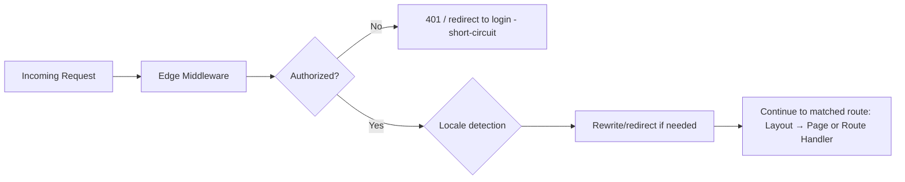
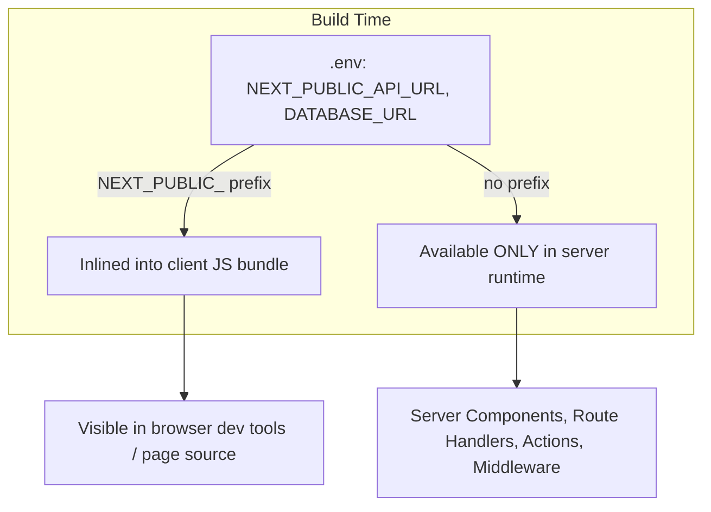
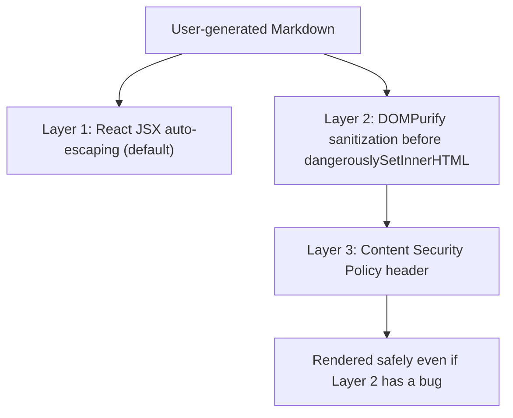

# Chapter 27: APIs, Middleware & Modern Security Shields

**Prerequisites:** Chapter 18 · **Difficulty:** Level C/D (Next.js)

> 🔗 **Continuing from Chapter 18:** Server Actions handle in-app mutations safely. This chapter extends the network boundary outward — custom API routes for external consumers, Edge Middleware that runs before routing even begins, and the security headers required to defend the whole stack you've built since Chapter 1.

---

## 1. Learning Objectives

- **Implement** custom Route Handlers supporting multiple HTTP methods and streaming responses.
- **Apply** Edge Middleware for request interception, rewriting, and lightweight authentication.
- **Configure** dynamic SEO metadata, OpenGraph data, and sitemaps.
- **Differentiate** server-only and public environment variables and prevent secret leakage.
- **Design** a defense-in-depth security posture against XSS, CSRF, and DOM Clobbering.

---

## 2. Motivation

Every chapter so far has treated ScribeCollab's server logic as trusted, internal code. But the moment your app is reachable on the public internet, it faces the same threat model as any web service: malicious requests, credential theft attempts, injected scripts, and forged cross-origin requests. Route Handlers and Middleware are where these threats first make contact with your code — get authentication and validation wrong here, and every defense built in earlier chapters (Zod schemas, Server Action auth checks) can be bypassed entirely by a request that never goes through your app's expected UI flow at all.

---

## 3. Core Theory

### 3.1 Route Handlers

Files named `route.ts` inside `app/` export functions named after HTTP methods (`GET`, `POST`, `PATCH`, `DELETE`) and receive a standard `Request` object (the same Fetch API primitive from Chapter 5), returning a standard `Response` — meaning your Chapter 5 knowledge of `ReadableStream`, `Headers`, and `AbortController`-style cancellation transfers directly to server-side request handling.

### 3.2 Edge Middleware

Middleware (`middleware.ts` at the project root) runs **before** a request reaches any route, layout, or page — on Vercel's Edge Runtime, a lightweight, geographically-distributed JS runtime (not full Node.js — no filesystem access, restricted API surface) optimized for low-latency interception. Middleware can rewrite the URL (serve different content without changing the browser's address bar), redirect, modify headers, or short-circuit the request entirely (e.g., returning a 401 before any page logic runs) — making it the natural place for authentication gatekeeping and i18n locale redirects (previewed in Chapter 17), and the server-side equivalent of the `loader()`-based route guard you built by hand in Chapter 16.

### 3.3 SEO & Metadata

The Metadata API (`export const metadata` or `generateMetadata()` in `page.tsx`/`layout.tsx`) lets Next.js inject `<title>`, `<meta>`, OpenGraph, and Twitter Card tags **server-side**, ensuring social media crawlers and search engines (which often don't execute JavaScript) see fully-formed metadata — directly solving the CSR-era SEO weakness flagged back in Chapter 16.

### 3.4 Environment Variables & the Public/Private Boundary

Any environment variable prefixed `NEXT_PUBLIC_` is **inlined into the client bundle at build time** and is visible to anyone who views your site's source — treat it exactly as if it were hardcoded, public information. Any variable **without** that prefix is available only in server-side code (Server Components, Route Handlers, Server Actions, Middleware) and is never sent to the browser — this is the concrete mechanism enforcing the Chapter 18 principle that secrets belong exclusively in server-only code.

### 3.5 Security Shields

- **XSS (Cross-Site Scripting):** injecting attacker-controlled script into your page. React's JSX auto-escaping (Chapter 8) mitigates most cases; `dangerouslySetInnerHTML` (used for rendering compiled Markdown) remains the primary residual risk and must always pass through a sanitizer.
- **CSRF (Cross-Site Request Forgery):** tricking an authenticated user's browser into making an unwanted request to your app. Server Actions include built-in CSRF protections (origin-checking); custom Route Handlers accepting state-changing requests need explicit origin/token validation if they rely on cookie-based auth.
- **DOM Clobbering:** a lesser-known attack where attacker-controlled HTML (`id`/`name` attributes) overrides global `window`/`document` properties that vulnerable script code implicitly trusts — mitigated by never trusting global-scope lookups for security-relevant identifiers derived from user-controlled HTML.
- **CSP (Content Security Policy):** an HTTP header that declares which script/style/resource sources the browser is allowed to load and execute, providing a strong, defense-in-depth mitigation against XSS even if a sanitization bug slips through.

---

## 4. Visual Diagrams

### 4.1 Request Lifecycle Through Middleware



### 4.2 Public vs. Private Environment Variable Flow



### 4.3 Defense-in-Depth Layers Against XSS



---

## 5. Step-by-Step Walkthrough: Auth-Gating Middleware

```ts
// middleware.ts
import { NextResponse, type NextRequest } from "next/server";

export function middleware(request: NextRequest) {
  const sessionCookie = request.cookies.get("session")?.value;
  const isAuthRoute = request.nextUrl.pathname.startsWith("/documents");

  if (isAuthRoute && !sessionCookie) {
    const loginUrl = new URL("/login", request.url);
    loginUrl.searchParams.set("from", request.nextUrl.pathname);
    return NextResponse.redirect(loginUrl);
  }
  return NextResponse.next();
}

export const config = { matcher: ["/documents/:path*"] };
```

1. A request arrives for `/documents/123`.
2. Before any layout, page, or data fetching runs, the Edge Middleware executes — checking for a `session` cookie, exactly the same gatekeeping idea as Chapter 16's `loader()`-based redirect, just running one layer earlier, before the client even downloads route code.
3. If absent, the middleware **short-circuits** the request entirely with a redirect to `/login?from=/documents/123` — the actual `/documents/[id]/page.tsx` code never runs, meaning no database query or sensitive data ever gets fetched for an unauthenticated request.
4. If present, `NextResponse.next()` allows the request to continue to normal routing — note that this only checks for *presence* of a cookie; verifying the session's actual validity (signature, expiry) still needs to happen, either here (with an Edge-compatible verification library) or as defense-in-depth in the page/Server Action itself (Chapter 20 covers full session verification).

---

## 6. Internal Implementation

Next.js's Edge Middleware runs on a runtime deliberately restricted relative to Node.js — it's built on the **Web platform-standard APIs** (the same `Request`/`Response`/`Headers` primitives from Chapter 5, not Node's `http` module), specifically so the same middleware code can be deployed to geographically-distributed edge locations (V8 isolates, not full containerized Node processes) for minimal latency. This constraint is exactly why Edge Middleware **cannot** use Node-specific APIs like the filesystem or many npm packages that assume a Node environment — a common source of confusing build errors when a dependency imported into `middleware.ts` transitively relies on Node built-ins.

---

## 7. Code Examples

### 7.1 Minimal Example — Route Handler

```ts
// app/api/documents/[id]/route.ts
export async function GET(request: Request, { params }: { params: { id: string } }) {
  const doc = await db.documents.findUnique({ where: { id: params.id } });
  if (!doc) return new Response("Not found", { status: 404 });
  return Response.json(doc);
}
```

### 7.2 Practical Example — Dynamic OpenGraph Metadata

```tsx
// app/(app)/documents/[id]/page.tsx
export async function generateMetadata({ params }: { params: { id: string } }) {
  const doc = await getDocument(params.id);
  return {
    title: `${doc.title} · ScribeCollab`,
    openGraph: {
      title: doc.title,
      description: doc.excerpt,
      images: [{ url: doc.coverImageUrl }],
    },
  };
}
```

### 7.3 Production-Ready — Strict CSP Header Configuration

```ts
// next.config.ts
const cspHeader = `
  default-src 'self';
  script-src 'self' 'nonce-{NONCE}' 'strict-dynamic';
  style-src 'self' 'unsafe-inline';
  img-src 'self' https://cdn.scribecollab.com data:;
  connect-src 'self' https://api.scribecollab.com;
  frame-ancestors 'none';
  base-uri 'self';
`.replace(/\s{2,}/g, " ").trim();

export default {
  async headers() {
    return [
      {
        source: "/:path*",
        headers: [
          { key: "Content-Security-Policy", value: cspHeader },
          { key: "X-Content-Type-Options", value: "nosniff" },
          { key: "Referrer-Policy", value: "strict-origin-when-cross-origin" },
        ],
      },
    ];
  },
};
```

### 7.4 Anti-Pattern → Corrected

```ts
// ❌ ANTI-PATTERN: leaking a secret API key to the client by prefixing
// it NEXT_PUBLIC_ "so the fetch call in a client component works" —
// this key is now visible to anyone viewing the page source.
// .env
NEXT_PUBLIC_INTERNAL_API_KEY=sk_live_51H8...

// SomeClientComponent.tsx
"use client";
fetch("https://api.example.com/data", {
  headers: { Authorization: `Bearer ${process.env.NEXT_PUBLIC_INTERNAL_API_KEY}` },
});
```

```ts
// ✅ CORRECTED: keep the secret server-only, and proxy the request
// through a Route Handler or Server Action that attaches it server-side.
// .env
INTERNAL_API_KEY=sk_live_51H8...

// app/api/proxy-data/route.ts
export async function GET() {
  const res = await fetch("https://api.example.com/data", {
    headers: { Authorization: `Bearer ${process.env.INTERNAL_API_KEY}` }, // server-only
  });
  return Response.json(await res.json());
}
```

### 7.5 Additional Example — Simple Fixed-Window Rate Limiting in Middleware

```ts
// middleware.ts (excerpt) — naive in-memory limiter; production should use
// a shared store (e.g., Redis) since Edge instances aren't guaranteed to share memory
const requestLog = new Map<string, number[]>();

function isRateLimited(ip: string, limit = 20, windowMs = 60_000): boolean {
  const now = Date.now();
  const timestamps = (requestLog.get(ip) ?? []).filter((t) => now - t < windowMs);
  timestamps.push(now);
  requestLog.set(ip, timestamps);
  return timestamps.length > limit;
}

export function middleware(request: NextRequest) {
  const ip = request.ip ?? "unknown";
  if (request.nextUrl.pathname.startsWith("/api/") && isRateLimited(ip)) {
    return new Response("Too Many Requests", { status: 429 });
  }
  return NextResponse.next();
}
```

This applies Chapter 4's closure-based state-tracking pattern (a `Map` capturing request timestamps) directly at the security boundary — rejecting abusive traffic before it ever reaches a Route Handler or Server Action, complementing (not replacing) the auth checks from Section 5.

---

## 8. Common Mistakes

| Level | Mistake |
|---|---|
| **Junior** | Prefixing a secret with `NEXT_PUBLIC_` to "fix" a build error about the variable being undefined in client code, without realizing this permanently exposes the secret. |
| **Mid-Level** | Implementing auth-gating only in Middleware and assuming that's sufficient, without independently re-checking authorization inside the actual Route Handler/Server Action — Middleware can be misconfigured (wrong `matcher`) or bypassed if the underlying handler is also reachable via a path the matcher doesn't cover. |
| **Senior/Production** | Deploying a CSP header copied from a tutorial without auditing it against the app's actual script/style/image sources, either breaking legitimate functionality (silently, since CSP violations often only show as console errors) or leaving it so permissive (`unsafe-inline` for scripts) that it provides no real XSS protection. |

---

## 9. Performance Analysis

- **Edge Middleware latency:** executes at the CDN edge, geographically close to the user, typically adding low-single-digit milliseconds of overhead — but every byte of middleware code and every dependency it imports adds to this cold-start cost, so middleware should stay minimal and dependency-light.
- **Route Handler vs. Server Action for mutations:** functionally similar server-side cost; the choice is primarily about API shape (public/external clients need Route Handlers; internal UI-triggered mutations are simpler as Server Actions) rather than performance.
- **CSP overhead:** negligible request-time cost (a static header); the real cost is the audit and maintenance overhead of keeping the policy accurate as the app's resource dependencies evolve.

---

## 10. Security Inventory

- **Defense in depth is mandatory, not optional:** Middleware auth checks, Server Action authorization (Chapter 18), and CSP headers are complementary layers, not substitutes for one another — a real production incident often occurs when a team relies on exactly one layer and it has a single misconfiguration.
- **CSRF and cookie-based sessions:** any Route Handler performing state-changing operations based on a cookie-based session (rather than a bearer token explicitly attached by client JS) needs explicit CSRF protection (e.g., `SameSite=Strict` cookies plus origin header validation), since browsers attach cookies automatically to cross-origin requests unless mitigated.
- **DOM Clobbering awareness:** never write code that looks up a security-relevant value via a bare global identifier that could be shadowed by an `id`/`name` attribute in user-controlled HTML (e.g., `window.isAdmin` overridden by `<div id="isAdmin">`) — use explicit, namespaced application state instead.

---

## 11. Technology Comparisons

| Boundary Layer | Middleware | Route Handler | Server Action |
|---|---|---|---|
| **Runs before routing?** | Yes | No (it *is* the route) | No (invoked from within a rendered page) |
| **Runtime** | Edge (restricted, Web-standard APIs) | Node.js or Edge (configurable) | Node.js or Edge (configurable) |
| **Best for** | Auth gatekeeping, redirects, i18n | Public/external APIs, webhooks | Internal form/UI mutations |
| **CSRF exposure** | N/A (read-only interception typically) | Needs explicit handling if cookie-based | Built-in origin-check protection |

---

## 12. Engineering Decisions

ScribeCollab uses Edge Middleware strictly for **coarse-grained** auth gatekeeping (redirect unauthenticated users away from `/documents/*`) and locale detection, while every Route Handler and Server Action independently re-verifies fine-grained authorization (does *this* user own *this* document) — a deliberate defense-in-depth choice, accepting minor redundancy in exchange for resilience against a middleware misconfiguration. The CSP header (7.3) is generated with a per-request nonce for inline scripts rather than blanket `unsafe-inline`, chosen specifically because ScribeCollab's design system requires no inline `<script>` tags, making a strict policy achievable without breaking functionality.

---

## 13. Exercises

**Easy:** Explain why `NEXT_PUBLIC_SECRET_KEY` in `.env` is functionally equivalent to hardcoding that secret directly into your client-side JavaScript source.

**Medium:** Write a Route Handler for `POST /api/documents/[id]/comments` that validates the request body with a Zod schema (Chapter 7), checks the caller is authenticated, and returns appropriate 400/401/201 status codes for each failure/success case.

**Hard:** ScribeCollab's Middleware currently only matches `/documents/:path*`, but a new internal analytics Route Handler at `/api/internal/stats` was added without updating the matcher or adding its own auth check, leaving it publicly reachable. Write an incident analysis explaining the defense-in-depth failure, and propose both an immediate fix and a process change (e.g., a lint rule or test) to prevent recurrence.

---

## 14. Capstone Integration Step

**ScribeCollab — Step 19:** Implement the auth-gating Middleware (7.1/Section 5) protecting all `/documents/*` routes, and independently verify document ownership inside every Route Handler and Server Action that touches document data — no exceptions, even for routes already covered by Middleware. Configure dynamic OpenGraph metadata (7.2) for shared document links, and deploy the strict CSP header (7.3) tuned to ScribeCollab's actual script/style/image sources.

---

## 🔜 Bridge to Chapter 20

Your app is now authenticated at the edge and network-hardened. The final gap is production operational maturity: real session/JWT-based auth (versus the simplified cookie-presence check used here), containerized deployment, and telemetry to know how the app actually performs for real users. Chapter 20 closes out Phase 4 with enterprise auth, deployment, and performance auditing.
