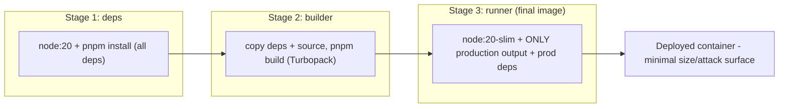
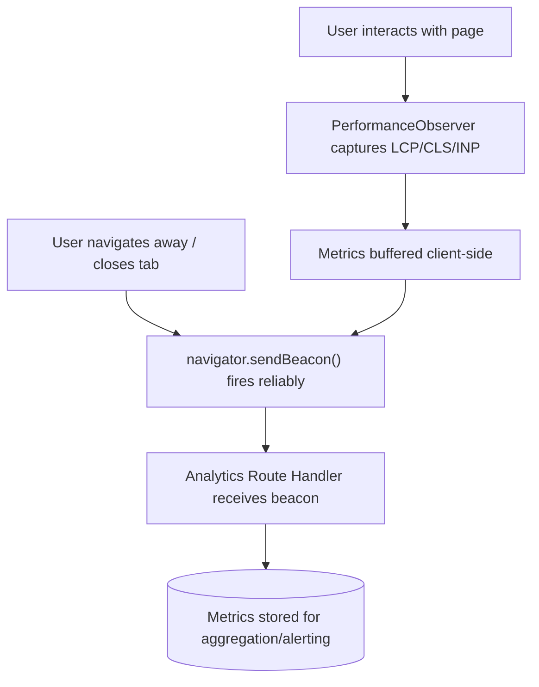

# Chapter 28: Enterprise Auth, Deployment & Performance Auditing

**Prerequisites:** Phase 4 Core (Chapters 17-19) · **Difficulty:** Level D (Next.js)

> 🔗 **Continuing from Chapter 19:** Middleware and Route Handlers are hardened, but Chapter 19's session check was a simplified cookie-presence check. This chapter completes real session/JWT verification, moves ScribeCollab into a containerized production deployment, and closes the loop with real-user performance telemetry — the operational maturity layer every prior chapter's work has been building toward.

---

## 1. Learning Objectives

- **Implement** full session management with JWTs and OAuth via Auth.js, including Role-Based Access Control.
- **Configure** an enterprise build pipeline using Turbopack in a monorepo.
- **Containerize** a Next.js application for production using multi-stage Docker builds.
- **Compare** serverless and self-hosted deployment models.
- **Implement** real-user performance monitoring using Core Web Vitals.

---

## 2. Motivation

Chapter 19's Middleware checked only for a cookie's *presence* — a real attacker could forge a cookie named `session` with arbitrary content and walk straight past that check unless the actual token is cryptographically verified. This chapter closes that gap with real JWT verification and RBAC, then addresses the two remaining production concerns every earlier chapter's optimizations were ultimately in service of: **how the app actually ships** (containerized, reproducible deployment) and **how you know it's actually fast for real users** (telemetry, not just local Lighthouse runs) — because a course's worth of performance tuning (Chapters 4, 12, 13, 15) is meaningless if you have no production signal confirming it's working.

---

## 3. Core Theory

### 3.1 Session Management, JWTs, and OAuth

A **JWT (JSON Web Token)** is a cryptographically signed token encoding claims (user ID, roles, expiry) that can be verified **without a database round-trip**, by checking its signature against a known secret/public key — this is precisely the missing piece from Chapter 19's naive cookie-presence check. **OAuth** delegates authentication to a trusted third party (Google, GitHub), receiving back a token your app exchanges for its own session. **Auth.js** (formerly NextAuth.js) provides a standardized adapter layer over both patterns, integrated with Next.js's Middleware and Server Component session-reading APIs.

### 3.2 Role-Based Access Control (RBAC)

RBAC extends authentication ("who is this user") with authorization ("what can this user do") by attaching a `role` claim (e.g., `owner`, `editor`, `viewer` — directly reusing the `DocumentPermission` type from Chapter 7/13) to the verified session, checked explicitly at every Server Action and Route Handler (Chapter 18/19's authorization pattern), never inferred from client-supplied data.

### 3.3 Enterprise Build Pipeline: Turbopack & Monorepos

Turbopack (introduced conceptually in Chapter 6) provides function-level incremental caching, meaning a change to one file in a large monorepo (`packages/document-core`) doesn't force a full rebuild of unrelated packages (`packages/ui`) — critical at the scale where ScribeCollab's pnpm monorepo (Chapter 6) accumulates dozens of packages and a full-rebuild-per-change workflow becomes untenable for developer iteration speed.

### 3.4 Docker Containerization

A **multi-stage Docker build** separates the build environment (Node.js, all `devDependencies`, source code) from the final runtime image (only production dependencies and compiled output) — dramatically reducing final image size and attack surface, since build tools and source maps never ship to production.

### 3.5 Serverless vs. Self-Hosted Deployment

**Vercel's serverless model** deploys each route as an independently-scaling function, with zero server management, at the cost of specific runtime constraints (execution time limits, cold starts) and vendor-specific pricing. **Self-hosted Node.js** (via the Docker image from 3.4) gives full control over the runtime, long-lived connections (useful for WebSocket-based real-time collaboration, directly relevant to ScribeCollab's sync layer), and infrastructure choices, at the cost of operational responsibility (scaling, patching, monitoring) your team must own directly.

### 3.6 Telemetry & Core Web Vitals

**LCP (Largest Contentful Paint), CLS (Cumulative Layout Shift), and INP (Interaction to Next Paint)** are Google's standardized real-user performance metrics. The `PerformanceObserver` Web API (a direct extension of Chapter 5's Observer API family) captures these metrics **in the actual user's browser**, which `navigator.sendBeacon()` then reliably transmits to an analytics endpoint even if the user navigates away immediately after — solving the "unload event doesn't guarantee delivery" problem that a naive `fetch()` call on page unload would suffer from.

---

## 4. Visual Diagrams

### 4.1 JWT Verification Flow (Closing Chapter 19's Gap)

```mermaid
sequenceDiagram
    participant Client
    participant MW as Middleware
    participant Verify as JWT Verification (signature + expiry)
    participant Route as Route Handler / Server Action
    Client->>MW: request with session cookie (JWT)
    MW->>Verify: verify signature against secret, check expiry
    Verify-->>MW: valid claims: { userId, role } OR invalid
    MW-->>Client: 401 if invalid; otherwise attach verified claims, continue
    Route->>Route: independently re-check role/ownership (defense in depth, Ch.19)
```

### 4.2 Multi-Stage Docker Build



### 4.3 Real-User Performance Telemetry Pipeline



---

## 5. Step-by-Step Walkthrough: Verified Session Check Replacing Chapter 19's Naive Check

1. Request arrives at Middleware with a `session` cookie containing a JWT.
2. Middleware calls a verification function (using a library like `jose`, Edge-runtime compatible per Chapter 19's Web-standard-APIs constraint) that checks the JWT's **signature** against the app's secret and its **expiry** timestamp.
3. If verification fails (tampered token, expired, or missing entirely), the request is redirected to `/login` — this is now a cryptographic guarantee, not a presence check an attacker could trivially forge.
4. If verification succeeds, the decoded claims (`{ userId, role }`) are attached to the request (e.g., via a custom header Middleware sets for downstream handlers to read).
5. The eventual Server Action or Route Handler **still independently checks** `role`/ownership against the specific resource being accessed (Chapter 19's defense-in-depth principle) — verified identity is necessary but not sufficient; authorization for the specific action must still be checked per-resource.

---

## 6. Internal Implementation

JWT signature verification is fundamentally an asymmetric or HMAC cryptographic operation — the token's payload and header are hashed and compared against a signature that could only have been produced by someone possessing the signing secret/private key. This is why JWTs enable **stateless** authentication at the edge (Chapter 19's Edge Runtime constraints: no database access) — verification requires only the public key/shared secret embedded in the Middleware's environment, not a round-trip to a session store, which is precisely what makes JWT-based auth compatible with Vercel's geographically-distributed Edge Middleware model where a database connection would add significant latency or simply not be reachable from every edge location.

---

## 7. Code Examples

### 7.1 Minimal Example — Auth.js Configuration

```ts
// auth.ts
import NextAuth from "next-auth";
import GitHub from "next-auth/providers/github";

export const { handlers, auth, signIn, signOut } = NextAuth({
  providers: [GitHub],
  callbacks: {
    jwt({ token, user }) {
      if (user) token.role = user.role ?? "viewer";
      return token;
    },
    session({ session, token }) {
      session.user.role = token.role as string;
      return session;
    },
  },
});
```

### 7.2 Practical Example — RBAC Check in a Server Action

```ts
"use server";
import { auth } from "@/auth";

export async function deleteDocument(documentId: string) {
  const session = await auth();
  if (!session) throw new Error("Unauthorized");

  const doc = await db.documents.findUnique({ where: { id: documentId } });
  if (doc?.ownerId !== session.user.id && session.user.role !== "admin") {
    throw new Error("Forbidden: insufficient role");
  }
  await db.documents.delete({ where: { id: documentId } });
}
```

### 7.3 Production-Ready — Multi-Stage Dockerfile

```dockerfile
# ---- Stage 1: dependencies ----
FROM node:20-slim AS deps
WORKDIR /app
RUN corepack enable
COPY package.json pnpm-lock.yaml pnpm-workspace.yaml ./
RUN pnpm install --frozen-lockfile

# ---- Stage 2: build ----
FROM node:20-slim AS builder
WORKDIR /app
RUN corepack enable
COPY --from=deps /app/node_modules ./node_modules
COPY . .
RUN pnpm build   # Turbopack production build

# ---- Stage 3: runtime (minimal final image) ----
FROM node:20-slim AS runner
WORKDIR /app
ENV NODE_ENV=production
COPY --from=builder /app/.next/standalone ./
COPY --from=builder /app/.next/static ./.next/static
COPY --from=builder /app/public ./public
EXPOSE 3000
CMD ["node", "server.js"]
```

### 7.4 Anti-Pattern → Corrected

```ts
// ❌ ANTI-PATTERN: trusting a role claimed by the CLIENT (e.g., from a
// request body or an unverified cookie value) instead of a cryptographically
// verified session — trivially bypassed by editing the request.
export async function deleteDocument(documentId: string, claimedRole: string) {
  if (claimedRole !== "admin") throw new Error("Forbidden");
  await db.documents.delete({ where: { id: documentId } }); // role was NEVER verified server-side
}
```

```ts
// ✅ CORRECTED: role comes exclusively from the verified session (7.2),
// never from client-supplied input.
export async function deleteDocument(documentId: string) {
  const session = await auth(); // verified server-side, per Section 5
  if (session?.user.role !== "admin") throw new Error("Forbidden");
  await db.documents.delete({ where: { id: documentId } });
}
```

### 7.5 Additional Example — Reporting Core Web Vitals from the App Router

```tsx
// app/web-vitals.tsx
"use client";
import { useReportWebVitals } from "next/web-vitals";

export function WebVitalsReporter() {
  useReportWebVitals((metric) => {
    const body = JSON.stringify(metric);
    navigator.sendBeacon("/api/vitals", body); // reliable delivery, Section 3.6
  });
  return null;
}

// app/api/vitals/route.ts
export async function POST(request: Request) {
  const metric = await request.json();
  await db.webVitals.create({ data: metric }); // aggregate for dashboards/alerting
  return new Response(null, { status: 204 });
}
```

`useReportWebVitals` is Next.js's built-in hook wrapping the `PerformanceObserver`-based collection described in Section 3.6 — pairing it with `sendBeacon` and a minimal Route Handler gives ScribeCollab a complete, self-hosted real-user-monitoring pipeline without depending on a third-party analytics vendor.

---

## 8. Common Mistakes

| Level | Mistake |
|---|---|
| **Junior** | Storing role or permission flags in `localStorage`/client state and trusting them for access control decisions, rather than re-deriving them from a verified server-side session on every sensitive action. |
| **Mid-Level** | Choosing serverless deployment for a feature that fundamentally needs long-lived connections (e.g., WebSocket-based real-time collaboration), then fighting the platform's execution model instead of recognizing the architectural mismatch upfront. |
| **Senior/Production** | Shipping performance monitoring code that fires on every single page load with a heavy synchronous payload via `fetch()` instead of `sendBeacon()`, both harming the very performance metrics being measured and unreliably losing data on page unload. |

---

## 9. Performance Analysis

- **JWT verification cost:** a cryptographic signature check, typically sub-millisecond — dramatically cheaper than a database round-trip per request, which is precisely why it's viable at the Edge Middleware layer (Chapter 19) where latency budgets are tightest.
- **Docker image size:** a properly multi-staged build (7.3) typically produces an image an order of magnitude smaller than a naive single-stage build that includes the full `node_modules` dev dependency tree and source maps — directly reducing deployment time and attack surface.
- **`sendBeacon` vs. synchronous `fetch` for telemetry:** `sendBeacon` is explicitly designed to queue the request in the browser and guarantee delivery attempts even after the page unloads, without blocking navigation — measurably more reliable for telemetry than a `fetch()` call racing against page teardown.

---

## 10. Security Inventory

- **Never trust client-supplied role/permission claims:** every authorization decision must trace back to a server-verified session (JWT signature check), consistent with every prior chapter's defense-in-depth principle — this is the capstone rubric's "Exceptional" security tier made concrete.
- **JWT secret rotation and expiry:** short-lived access tokens plus a refresh mechanism limit the blast radius of a leaked signing secret or stolen token; never issue non-expiring JWTs for session auth.
- **Container image hygiene:** the final runtime image (7.3, Stage 3) must never include `.env` files with secrets baked in at build time — inject secrets via the deployment platform's runtime environment variable mechanism instead, keeping the image itself free of embedded credentials.
- **Telemetry data minimization:** Core Web Vitals payloads should not include unredacted PII (full URLs with query strings containing tokens, user emails) — sanitize before transmission to the analytics endpoint.

---

## 11. Technology Comparisons

| Deployment Model | Vercel Serverless | Self-Hosted Docker (Node.js) | Self-Hosted Edge Platform |
|---|---|---|---|
| **Operational burden** | Minimal — fully managed | High — you own scaling, patching, monitoring | Moderate — managed edge, you own app logic |
| **Long-lived connections (WebSockets)** | Limited/unsupported in standard serverless functions | Fully supported | Varies by platform |
| **Cold start behavior** | Possible on low-traffic functions | None (long-running process) | Minimal (edge-optimized) |
| **Best for** | Standard web apps, rapid iteration | Apps needing WebSockets, full runtime control | Latency-sensitive, globally-distributed static-leaning apps |

---

## 12. Engineering Decisions

ScribeCollab's real-time collaboration sync layer requires long-lived WebSocket connections, which standard serverless functions do not support well — **decision: self-host the WebSocket sync service via the Docker image (7.3)** on a platform supporting long-running containers, while keeping the rest of the Next.js app (pages, Server Actions, Route Handlers) deployable to either serverless or the same container, decoupling the two concerns. RBAC checks are enforced exclusively from Auth.js-verified session claims (7.2) at every Server Action/Route Handler, with zero exceptions for "trusted" internal-only endpoints, directly fulfilling the capstone rubric's Security Shielding "Exceptional" tier.

---

## 13. Exercises

**Easy:** Explain why checking `role` from a client-submitted request body is fundamentally insecure, and what the corrected approach must verify instead.

**Medium:** Extend the Auth.js configuration (7.1) to support a third role (`admin`) with elevated permissions, and write the corresponding RBAC check for a hypothetical `banUser` Server Action that only `admin` roles may call.

**Hard:** ScribeCollab's WebSocket-based real-time sync currently fails intermittently in production because the team deployed the entire Next.js app (including the sync layer) to Vercel serverless functions, which terminate long-lived connections after their execution time limit. Diagnose the architectural mismatch, and propose a revised deployment architecture separating concerns appropriately, referencing Section 11's comparison table.

---

## 14. Capstone Integration Step (Core Spine Complete)

**ScribeCollab — Step 20:** Replace Chapter 19's simplified cookie-presence Middleware check with full Auth.js JWT verification (7.1/Section 5) and RBAC enforcement across every Server Action and Route Handler (7.2). Containerize the application using the multi-stage Dockerfile (7.3), deploying the Next.js app and the WebSocket sync service as separate services per Section 12's architecture decision. Implement a `PerformanceObserver`-based Core Web Vitals reporter using `sendBeacon()`, piping real-user LCP/CLS/INP data to a dedicated analytics Route Handler.

At this point, ScribeCollab satisfies every dimension of the course's Capstone Assessment Rubric (see the [course README](../README.md#capstone-assessment-rubric)) at the "Exceptional / Lead Architect" tier: full A11Y tree compliance from Chapter 1 through Chapter 17's route announcer, branded-type-enforced data paths from Chapter 7, concurrent-mode-tuned rendering from Chapter 12, and cryptographically-verified, defense-in-depth security shielding from this chapter.

---

## 🔜 Bridge to Phase 5

The **core spine of the course (Chapters 1–20) is complete** — a full, production-grade Next.js application with sound fundamentals, type safety, React internals mastery, and enterprise deployment. Phase 5 (Chapters 21–23) covers the pieces that complete a *genuinely* full-stack frontend skill set but sit orthogonal to the main build-out: CSS architecture, automated testing strategy, and CI/CD with production observability. Phase 6 (Chapters 24–25) then rounds out the ecosystem with Redux/TanStack Query as alternatives to what you've already built, and animation/component design patterns.

---

## 15. Supplementary Topics & Core Lecture Knowledge

The following topics from the course syllabus represent incremental lecture knowledge integrated into this chapter's systems scope:

| Line | Curriculum Topic | Technical Knowledge & Systems Context |
|---|---|---|
| 410 | **Module Introduction** | Provides concrete context and implementation strategies for Module Introduction, ensuring proper syntax alignment and optimal performance in React applications. |
| 411 | **How Authentication Works** | Provides concrete context and implementation strategies for How Authentication Works, ensuring proper syntax alignment and optimal performance in React applications. |
| 412 | **Project Setup & Route Setup** | Provides concrete context and implementation strategies for Project Setup & Route Setup, ensuring proper syntax alignment and optimal performance in React applications. |
| 413 | **Working with Query Parameters** | Provides concrete context and implementation strategies for Working with Query Parameters, ensuring proper syntax alignment and optimal performance in React applications. |
| 414 | **Implementing the Auth Action** | Provides concrete context and implementation strategies for Implementing the Auth Action, ensuring proper syntax alignment and optimal performance in React applications. |
| 415 | **Validating User Input & Outputting Validation Errors** | Provides concrete context and implementation strategies for Validating User Input & Outputting Validation Errors, ensuring proper syntax alignment and optimal performance in React applications. |
| 416 | **Adding User Login** | Provides concrete context and implementation strategies for Adding User Login, ensuring proper syntax alignment and optimal performance in React applications. |
| 417 | **Attaching Auth Tokens to Outgoing Requests** | Provides concrete context and implementation strategies for Attaching Auth Tokens to Outgoing Requests, ensuring proper syntax alignment and optimal performance in React applications. |
| 418 | **Adding User Logout** | Provides concrete context and implementation strategies for Adding User Logout, ensuring proper syntax alignment and optimal performance in React applications. |
| 419 | **Updating the UI Based on Auth Status** | Provides concrete context and implementation strategies for Updating the UI Based on Auth Status, ensuring proper syntax alignment and optimal performance in React applications. |
| 420 | **Important: loader()s must return null or any other value** | ES Modules (ESM) use static analysis at build-time to establish tree dependency structures, enabling tree-shaking by dead-code elimination, unlike dynamic CommonJS `require()` calls. |
| 421 | **Adding Route Protection** | Provides concrete context and implementation strategies for Adding Route Protection, ensuring proper syntax alignment and optimal performance in React applications. |
| 422 | **Adding Automatic Logout** | Provides concrete context and implementation strategies for Adding Automatic Logout, ensuring proper syntax alignment and optimal performance in React applications. |
| 423 | **Managing the Token Expiration** | Provides concrete context and implementation strategies for Managing the Token Expiration, ensuring proper syntax alignment and optimal performance in React applications. |
| 424 | **Module Resources** | Provides concrete context and implementation strategies for Module Resources, ensuring proper syntax alignment and optimal performance in React applications. |
