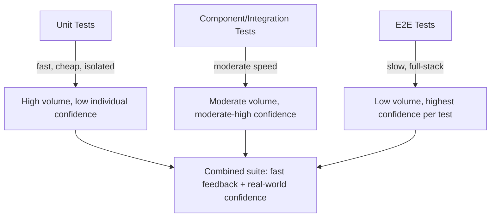
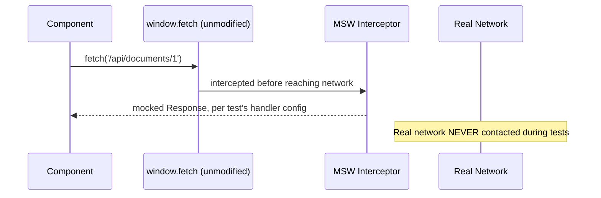
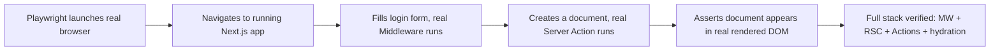

# Chapter 29: Testing Strategy — Unit, Component & End-to-End Testing

**Prerequisites:** Chapter 15 (component/hook testing), Chapter 18 (Server Component/Action testing) · **Difficulty:** Level B/C (Testing / React / Next.js)

> 🔗 **Continuing from Chapter 15 & Chapter 18:** You've built resilient, well-architected components and server logic across Phases 3-4. This chapter answers the question every prior chapter's code examples implicitly raised: how do you *prove* this code is correct, and keep it correct as ScribeCollab grows? It draws directly on Chapter 2's closures (mocking), Chapter 4's async model (testing promises/timers), and Chapter 9's hooks (testing custom hooks in isolation).

---

## 1. Learning Objectives

- **Apply** the test pyramid to allocate testing effort appropriately across unit, integration, and end-to-end layers.
- **Write** unit tests for pure functions and closures using Vitest.
- **Test** React components and custom hooks using React Testing Library's user-centric philosophy.
- **Mock** network requests deterministically using MSW (Mock Service Worker).
- **Implement** end-to-end tests for critical user flows using Playwright.
- **Integrate** accessibility assertions into the automated test suite.

---

## 2. Motivation

Every optimization and architectural decision from the prior chapters is only valuable if it keeps working as the codebase changes — and in a real team, it *will* change, often by someone who didn't write the original code and doesn't know every implicit assumption baked into it. Untested code doesn't stay correct; it silently regresses. The specific failure mode this chapter targets is **wasted testing effort**: teams that write hundreds of brittle, implementation-detail-coupled tests (asserting on internal state shape, or over-mocking to the point where the test verifies the mock rather than the code) get all the maintenance cost of testing with almost none of the safety benefit. This chapter teaches testing calibrated to actually catch the regressions that matter, at the layer where each type of bug is cheapest to catch.

---

## 3. Core Theory

### 3.1 The Test Pyramid

```
        /\
       /E2E\        <- few, slow, high-confidence, expensive to maintain
      /------\
     /Integr. \     <- moderate count, component + hook interaction tests
    /----------\
   /   Unit     \   <- many, fast, cheap, test pure logic in isolation
  /--------------\
```

**Unit tests** verify a single function or hook in isolation (Chapter 2's closures, Chapter 7's Zod schemas, Chapter 3's `patchNode`) — fast, numerous, and pinpoint failures precisely. **Integration/component tests** verify that multiple units work together correctly from a user's perspective (a form correctly submits, a component correctly re-renders on store changes). **End-to-end (E2E) tests** verify a real browser driving the actual, fully-integrated application (including the real Next.js server) through a critical user journey — slow and comparatively expensive to run and maintain, so reserved for the highest-value flows (login, document creation, sharing).

### 3.2 Unit Testing Pure Logic

Functions with no side effects and no framework dependency (Chapter 3's `patchNode`, Chapter 7's Zod-derived validators, Chapter 2's `debounce`/`memoize`) are the cheapest, highest-value tests to write — they require no rendering, no mocking of React internals, and run in milliseconds. **Vitest** (a Vite-native test runner, continuing Chapter 6's tooling choice) provides a Jest-compatible API with significantly faster execution via native ESM and the same transform pipeline as the app's dev server.

### 3.3 Component Testing Philosophy: Test Behavior, Not Implementation

**React Testing Library (RTL)**'s guiding principle: *"the more your tests resemble the way your software is used, the more confidence they can give you."* Concretely, this means querying the rendered output the way a **user** (or screen reader — directly connecting to Chapter 1's accessibility work) would: by visible text, label, or ARIA role (`getByRole("button", { name: "Save" })`) — never by internal implementation details like a component's state variable names or CSS class names, which are free to change without being an actual regression.

### 3.4 Testing Hooks in Isolation

A custom hook (Chapter 9) cannot be called outside a component's render — RTL's `renderHook` utility mounts a minimal throwaway component internally, letting you assert on a hook's returned values and behavior (e.g., `useDocumentSync`'s debounce timing) without needing a full component tree.

### 3.5 Mocking the Network Deterministically

Directly mocking `fetch` or `jest.mock`-ing a data-fetching module tightly couples tests to *how* a component fetches data, not *what* it does with the response. **MSW (Mock Service Worker)** intercepts actual network requests at the network layer (via a Service Worker in the browser, or a Node.js request interceptor in tests), letting components call real `fetch`/Server Actions unmodified while the test controls exactly what the "server" returns — producing tests that would catch a bug even if the component's internal fetching mechanism were refactored entirely.

### 3.6 End-to-End Testing with Playwright

Playwright drives a **real browser** (Chromium, Firefox, WebKit) against a **real running instance** of the Next.js app, verifying the entire stack — Middleware (Chapter 19), Server Actions (Chapter 18), hydration (Chapter 18), and rendered UI — actually works together, which no amount of mocked unit/component tests can fully guarantee, since mocks can drift from real integration behavior.

### 3.7 Testing Server Components & Actions

Server Components (Chapter 18) that are `async` and fetch data directly cannot be tested with standard RTL rendering (which assumes a synchronous client render) — they are typically tested either via E2E (Section 3.6, exercising the real server) or by unit-testing the underlying data-fetching function separately from the component's JSX. Server Actions, being plain async functions once unwrapped from the `'use server'` boundary, are unit-testable directly by calling them with mocked `auth()`/database layers, verifying authorization logic (Chapter 19/20) without needing a browser at all.

---

## 4. Visual Diagrams

### 4.1 Test Pyramid Cost/Confidence Trade-off



### 4.2 MSW Interception Layer



### 4.3 Playwright E2E Flow



---

## 5. Step-by-Step Walkthrough: Testing `useDocumentSync` (from Chapter 9)

```tsx
import { renderHook, act } from "@testing-library/react";
import { vi, describe, it, expect, beforeEach } from "vitest";
import { useDocumentSync } from "./useDocumentSync";

describe("useDocumentSync", () => {
  beforeEach(() => vi.useFakeTimers()); // controls Chapter 4's setTimeout deterministically

  it("debounces save calls while typing", () => {
    const onSave = vi.fn().mockResolvedValue(undefined);
    const { rerender } = renderHook(
      ({ content }) => useDocumentSync({ docId: "doc-1", content, onSave, delayMs: 500 }),
      { initialProps: { content: "a" } }
    );

    rerender({ content: "ab" });
    rerender({ content: "abc" });

    act(() => vi.advanceTimersByTime(499));
    expect(onSave).not.toHaveBeenCalled(); // not yet — still within debounce window

    act(() => vi.advanceTimersByTime(1));
    expect(onSave).toHaveBeenCalledTimes(1);
    expect(onSave).toHaveBeenCalledWith("doc-1", "abc"); // only the LATEST content, per Ch.9's design
  });
});
```

1. `vi.useFakeTimers()` replaces the real `setTimeout` with a controllable fake, directly letting the test manipulate Chapter 4's event loop timing deterministically rather than waiting real milliseconds.
2. `renderHook` mounts `useDocumentSync` in an isolated test harness, and `rerender` simulates the prop changes that would occur on each keystroke.
3. Advancing fake time by less than `delayMs` confirms the debounce hasn't fired yet — directly testing the closure-based debounce logic from Chapter 9's Section 7.3 without needing a full editor UI.
4. Advancing past the threshold confirms exactly one save call fires, with the *latest* content — verifying the "always current, without re-subscribing effects" `useRef` pattern from Chapter 9 actually works as designed.

---

## 6. Internal Implementation

Vitest and Jest both implement fake timers by **replacing the global `setTimeout`/`setInterval`/`Date` implementations** with an internal virtual clock that only advances when explicitly told to (`vi.advanceTimersByTime`) — this is possible specifically because JavaScript's timer APIs are just functions on the global object (Chapter 3's prototype/global object model), not compiler-level language constructs, so a test runner can monkey-patch them entirely. RTL's `getByRole` queries work by querying the **Accessibility Tree** (Chapter 1), not raw DOM structure — under the hood, RTL uses the `dom-testing-library` engine which computes accessible names and roles using the same algorithm browsers use to build the AX tree, which is precisely why a test written against `getByRole("button", { name: "Save" })` fails correctly if the button's accessible name is missing, serving as an incidental but valuable accessibility regression check.

---

## 7. Code Examples

### 7.1 Minimal Example — Unit Test for a Pure Function

```ts
import { describe, it, expect } from "vitest";
import { patchNode } from "./patchNode"; // from Chapter 3

describe("patchNode", () => {
  it("preserves referential identity of untouched siblings", () => {
    const root = { id: "root", children: [{ id: "a", text: "1" }, { id: "b", text: "2" }] };
    const result = patchNode(root, "a", { text: "updated" });

    expect(result.children[0].text).toBe("updated");
    expect(result.children[1]).toBe(root.children[1]); // same reference — Chapter 3's guarantee
  });
});
```

### 7.2 Practical Example — Component Test with React Testing Library

```tsx
import { render, screen, fireEvent } from "@testing-library/react";
import { describe, it, expect, vi } from "vitest";
import { TitleInput } from "./TitleInput"; // from Chapter 9

describe("TitleInput", () => {
  it("shows a validation error for an empty title", () => {
    const onChange = vi.fn();
    render(<TitleInput value="" onChange={onChange} />);

    expect(screen.getByRole("alert")).toHaveTextContent("Title cannot be empty");

    fireEvent.change(screen.getByRole("textbox"), { target: { value: "New Title" } });
    expect(onChange).toHaveBeenCalledWith("New Title");
  });
});
```

### 7.3 Production-Ready — MSW-Backed Integration Test + Playwright E2E

```tsx
// mocks/handlers.ts
import { http, HttpResponse } from "msw";

export const handlers = [
  http.get("/api/documents/:id", ({ params }) =>
    HttpResponse.json({ id: params.id, title: "Mocked Doc", content: "Hello" })
  ),
];

// DocumentLoader.test.tsx
import { render, screen } from "@testing-library/react";
import { setupServer } from "msw/node";
import { handlers } from "../mocks/handlers";
import { DocumentLoader } from "./DocumentLoader";

const server = setupServer(...handlers);
beforeAll(() => server.listen());
afterEach(() => server.resetHandlers());
afterAll(() => server.close());

it("renders document title after fetch resolves", async () => {
  render(<DocumentLoader id="doc-1" />);
  expect(await screen.findByText("Mocked Doc")).toBeInTheDocument();
});
```

```ts
// e2e/create-document.spec.ts — Playwright, runs against the REAL app
import { test, expect } from "@playwright/test";

test("user can create and rename a document", async ({ page }) => {
  await page.goto("/login");
  await page.getByLabel("Email").fill("intern@scribecollab.dev");
  await page.getByRole("button", { name: "Sign in" }).click();

  await page.getByRole("button", { name: "New Document" }).click();
  await page.getByRole("textbox", { name: "Title" }).fill("My First Doc");
  await page.keyboard.press("Enter");

  await expect(page.getByRole("heading", { name: "My First Doc" })).toBeVisible();
});
```

### 7.4 Anti-Pattern → Corrected

```tsx
// ❌ ANTI-PATTERN: testing IMPLEMENTATION DETAILS (internal state, CSS
// class names) instead of user-visible behavior — this test breaks on
// any harmless refactor (renaming state, changing styling) even though
// nothing user-facing actually changed.
it("sets isValid state to false", () => {
  const { container } = render(<TitleInput value="" onChange={() => {}} />);
  expect(container.querySelector(".input-invalid")).toBeTruthy();
});
```

```tsx
// ✅ CORRECTED: asserts on what a USER (or screen reader) actually
// perceives — survives refactors of internal state shape or styling.
it("shows an accessible error message for an empty title", () => {
  render(<TitleInput value="" onChange={() => {}} />);
  expect(screen.getByRole("alert")).toHaveTextContent(/cannot be empty/i);
});
```

---

## 8. Common Mistakes

| Level | Mistake |
|---|---|
| **Junior** | Writing snapshot tests for every component without reviewing what the snapshot actually asserts, leading to a habit of blindly running `--updateSnapshot` whenever a test fails, defeating the test's entire purpose. |
| **Mid-Level** | Over-mocking: mocking so many internal modules that the test only verifies the mocks were called correctly, not that the real code produces correct behavior — MSW's network-level interception (Section 3.5) exists specifically to avoid this failure mode. |
| **Senior/Production** | Building an E2E suite so large and slow that CI feedback takes 45+ minutes, causing the team to skip or ignore it under deadline pressure — E2E coverage must be deliberately scoped to critical paths (Section 3.1), not exhaustive feature coverage, which belongs at the unit/component layer. |

---

## 9. Performance Analysis

- **Unit test execution:** typically sub-millisecond to a few milliseconds each; a suite of thousands can run in seconds — the correct layer for exhaustive edge-case coverage (Chapter 7's Zod schema boundary cases, Chapter 3's structural sharing edge cases).
- **Component test execution:** tens to low-hundreds of milliseconds each due to DOM rendering/JSDOM overhead — acceptable in the hundreds, but not the thousands, without noticeably slowing CI.
- **E2E test execution:** seconds per test (real browser launch, real network/server round trips) — this cost is exactly why Section 3.1's pyramid shape (few E2E tests) is a deliberate, necessary constraint, not a shortcut.

---

## 10. Security Inventory

- **Test credentials in source control:** never commit real API keys or production credentials into test fixtures/`.env.test` files committed to the repo — use clearly fake, non-functional values, consistent with Chapter 19's environment variable discipline.
- **E2E tests against production:** Playwright suites must run against a dedicated test/staging environment with synthetic data, never against production — an E2E test that creates/deletes real documents run against production could cause real data loss.
- **Testing authorization logic explicitly:** Chapter 20's RBAC checks in Server Actions deserve dedicated unit tests asserting that a `viewer`-role user's mutation attempt is correctly rejected — authorization logic is exactly the kind of code where an untested regression has severe, silent security consequences.

---

## 11. Technology Comparisons

| Tool | Vitest | Jest |
|---|---|---|
| **Transform pipeline** | Shares Vite's transform (Chapter 6), fast | Separate transform config (Babel/ts-jest), historically slower |
| **ESM support** | Native | Improving, historically required workarounds |
| **API compatibility** | Jest-compatible API | Original API |
| **Best for** | Vite/Next.js projects wanting speed and config unification | Legacy projects, teams standardized on Jest tooling |

| E2E Tool | Playwright | Cypress |
|---|---|---|
| **Multi-browser support** | Chromium, Firefox, WebKit, single API | Primarily Chromium-family, growing WebKit/Firefox support |
| **Execution model** | Out-of-process browser automation | In-browser test runner |
| **Parallelization** | Built-in, mature | Available, sometimes requires paid dashboard for full parallelization |
| **Best for** | Cross-browser confidence, modern async-heavy apps | Teams valuing its interactive time-travel debugging UI |

---

## 12. Engineering Decisions

ScribeCollab standardizes on **Vitest** for unit/component tests (matching the Vite/Turbopack-adjacent tooling philosophy from Chapter 6) and **Playwright** for E2E, with a strict test-pyramid budget enforced in CI (Chapter 23): unit/component tests must complete in under 2 minutes, E2E suite under 10 minutes, covering only the login, document-creation, sharing, and permission-change flows explicitly — deliberately **not** attempting E2E coverage of every UI interaction, trusting the component-test layer (Section 3.3) for that instead.

---

## 13. Exercises

**Easy:** Explain why `screen.getByRole("button", { name: "Save" })` is preferred over `container.querySelector(".save-btn")` in an RTL test, referencing Section 3.3's philosophy.

**Medium:** Write a Vitest unit test for the `memoize` function from Chapter 2's Section 7.5, verifying that the wrapped function is called only once for repeated calls with identical arguments, and called again for different arguments.

**Hard:** ScribeCollab's E2E suite has grown to 90 minutes and frequently fails intermittently due to timing-sensitive assertions against the real-time collaboration sync feature. Propose a restructuring plan: which of these scenarios should move down to component/integration tests (with MSW or a mocked WebSocket), which must remain true E2E, and how you'd address the flakiness in the tests that do remain at the E2E layer.

---

## 14. Capstone Integration Step

**ScribeCollab — Testing Track:** Write unit tests for `patchNode` (Chapter 3), the Zod schemas (Chapter 7), and `useDocumentSync` (Chapter 9) achieving full branch coverage of their validation/edge-case logic. Add MSW-backed component tests for the document loading and permission-form flows (Chapter 13). Implement a Playwright E2E suite covering exactly four critical paths: login, document creation, sharing, and permission changes — enforced as a required, time-budgeted CI gate in Chapter 23.

---

## 🔜 Bridge to Chapter 23

Your test suite can now catch regressions locally — but tests only provide value if they actually run automatically on every change, and if you have visibility into how the app behaves once real users hit production, beyond what any test environment can simulate. Chapter 23 closes the loop with CI/CD pipelines and production observability, tying together Chapter 20's Docker deployment, this chapter's test suite, and real-world monitoring into one operational whole.

---

## 15. Supplementary Topics & Core Lecture Knowledge

The following topics from the course syllabus represent incremental lecture knowledge integrated into this chapter's systems scope:

| Line | Curriculum Topic | Technical Knowledge & Systems Context |
|---|---|---|
| 590 | **Module Introduction** | Provides concrete context and implementation strategies for Module Introduction, ensuring proper syntax alignment and optimal performance in React applications. |
| 591 | **What & Why?** | Provides concrete context and implementation strategies for What & Why?, ensuring proper syntax alignment and optimal performance in React applications. |
| 592 | **Understanding Different Kinds Of Tests** | Unit and integration tests verify logical contracts and component behavior under simulated render trees, using mocks to isolate dependencies and Web APIs. |
| 593 | **What To Test & How To Test** | Unit and integration tests verify logical contracts and component behavior under simulated render trees, using mocks to isolate dependencies and Web APIs. |
| 594 | **Understanding the Technical Setup & Involved Tools** | Provides concrete context and implementation strategies for Understanding the Technical Setup & Involved Tools, ensuring proper syntax alignment and optimal performance in React applications. |
| 595 | **Running a First Test** | Unit and integration tests verify logical contracts and component behavior under simulated render trees, using mocks to isolate dependencies and Web APIs. |
| 596 | **Writing Our First Test** | Unit and integration tests verify logical contracts and component behavior under simulated render trees, using mocks to isolate dependencies and Web APIs. |
| 597 | **Grouping Tests Together With Test Suites** | Unit and integration tests verify logical contracts and component behavior under simulated render trees, using mocks to isolate dependencies and Web APIs. |
| 598 | **Testing User Interaction & State** | Unit and integration tests verify logical contracts and component behavior under simulated render trees, using mocks to isolate dependencies and Web APIs. |
| 599 | **Testing Connected Components** | Unit and integration tests verify logical contracts and component behavior under simulated render trees, using mocks to isolate dependencies and Web APIs. |
| 600 | **Testing Asynchronous Code** | Unit and integration tests verify logical contracts and component behavior under simulated render trees, using mocks to isolate dependencies and Web APIs. |
| 601 | **Working With Mocks** | Unit and integration tests verify logical contracts and component behavior under simulated render trees, using mocks to isolate dependencies and Web APIs. |
| 602 | **Summary & Further Resources** | Provides concrete context and implementation strategies for Summary & Further Resources, ensuring proper syntax alignment and optimal performance in React applications. |
