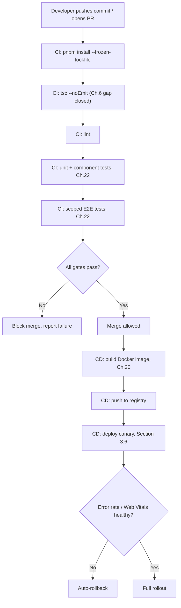
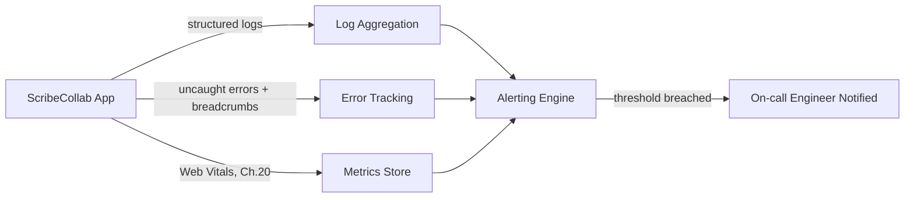
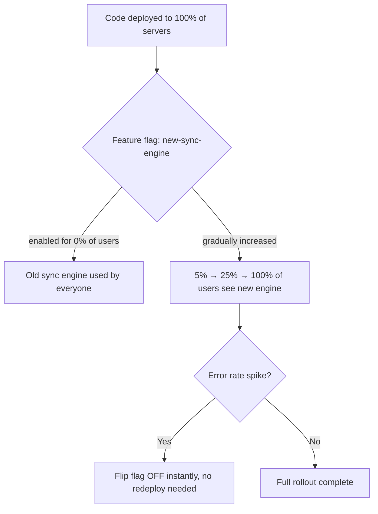

# Chapter 30: CI/CD Pipelines & Production Observability

**Prerequisites:** Chapter 20, Chapter 22 · **Difficulty:** Level D (DevOps / Next.js)

> 🔗 **Continuing from Chapter 20 & Chapter 22:** You have a containerized deployment (Chapter 20) and a test suite (Chapter 22). This chapter automates the path between "code committed" and "safely running in production," and closes the loop on Chapter 20's Web Vitals reporting with full error tracking, structured logging, and alerting — the operational layer that makes every other chapter's engineering discipline actually visible and enforceable over time.

---

## 1. Learning Objectives

- **Design** a CI pipeline that gates merges on type-checking, linting, and the Chapter 22 test pyramid.
- **Implement** a CD pipeline that builds, tests, and deploys the Chapter 20 Docker image automatically.
- **Apply** structured logging and error tracking (Sentry-style) to gain production visibility.
- **Configure** alerting thresholds tied to the Chapter 20 Core Web Vitals pipeline.
- **Explain** progressive delivery strategies (canary/feature flags) for reducing deployment risk.

---

## 2. Motivation

A test suite (Chapter 22) that only runs when a developer remembers to run it locally provides almost none of its intended safety guarantee — the entire value of automated testing is that it runs **automatically, on every change, before code reaches production**, and blocks the merge if it fails. Similarly, Chapter 20's Web Vitals reporter tells you *aggregate* performance trends, but says nothing about the specific unhandled exception a specific user hit at 2am — that requires dedicated error tracking with stack traces, breadcrumbs, and user context. This chapter is where all of the course's engineering discipline (types, tests, security checks, performance budgets) becomes **enforced by infrastructure** rather than relying on individual developer diligence, and where "it works on my machine" is replaced with "we have data confirming it works for real users."

---

## 3. Core Theory

### 3.1 Continuous Integration (CI): Gating Merges

CI runs an automated pipeline on every pull request: install dependencies (Chapter 6's pnpm lockfile ensures reproducibility), run `tsc --noEmit` (Chapter 6's note that dev servers don't type-check — CI is where this gap must be closed), run linting, run the Chapter 22 unit/component test suite, and optionally a scoped E2E run — merging is blocked unless every gate passes.

### 3.2 Continuous Deployment (CD): Automating Release

CD picks up where CI leaves off: on merge to the main branch, build the Chapter 20 multi-stage Docker image, push it to a container registry, and deploy it to production (or a staging environment first) — removing manual, error-prone "someone SSHes in and runs a deploy script" processes entirely.

### 3.3 Structured Logging

Plain `console.log` output is unsearchable and unstructured at scale. **Structured logging** emits log entries as JSON objects with consistent fields (`level`, `timestamp`, `requestId`, `userId`, `message`) — enabling log aggregation platforms to filter, correlate, and alert on specific patterns (e.g., "all 500 errors for user X in the last hour") that plain-text logs make prohibitively difficult to query.

### 3.4 Error Tracking

Error tracking tools (Sentry-class) capture **uncaught exceptions** (both from Chapter 15's Error Boundaries and unhandled server-side errors) along with a stack trace, breadcrumb trail (the sequence of user actions/log events leading up to the error), and environment context (browser, release version) — transforming "a user reported something broke" into "here is the exact line of code, the exact input, and the exact user session that caused it."

### 3.5 Alerting Thresholds

Raw metrics (Chapter 20's Web Vitals, error rates from Section 3.4) are only actionable if someone is notified when they cross a meaningful threshold — alerting rules (e.g., "p75 LCP exceeds 2.5s for 10 minutes" or "error rate exceeds 1% of requests") convert passive dashboards into active incident detection, ideally firing *before* a large fraction of users notice a problem, not after.

### 3.6 Progressive Delivery: Canary Releases & Feature Flags

Rather than deploying a change to 100% of production traffic simultaneously, **canary releases** route a small percentage of traffic to the new version first, monitoring error rates and Web Vitals (Section 3.5) before a full rollout. **Feature flags** decouple *deployment* (code is live on the server) from *release* (the feature is actually enabled for users), letting a risky feature (e.g., a new real-time sync algorithm) be shipped dark, then enabled gradually or instantly rolled back without a new deployment.

---

## 4. Visual Diagrams

### 4.1 Full CI/CD Pipeline



### 4.2 Observability Data Flow



### 4.3 Feature Flag Decoupling Deployment from Release



---

## 5. Step-by-Step Walkthrough: A Pull Request's Journey Through CI

1. A developer opens a PR modifying `packages/document-core`'s `patchNode` function (Chapter 3).
2. CI triggers automatically: dependencies install from the exact `pnpm-lock.yaml` (Chapter 6), guaranteeing the same dependency versions as every other environment.
3. `tsc --noEmit` runs across the whole monorepo — since Chapter 6 noted the dev server's fast transpiler doesn't type-check, this is the **first point** in the entire workflow where a type error is guaranteed to be caught if it wasn't caught in the developer's editor.
4. The Chapter 22 unit tests for `patchNode` run — if the change broke the referential-identity guarantee from Chapter 3, the test from Chapter 22's Section 7.1 fails here, before any human review even happens.
5. If a test fails, CI reports the failure directly on the PR, blocking merge until fixed — the team's Chapter 3 correctness guarantee is now enforced by infrastructure, not by hoping the reviewer notices.
6. Once all gates pass and the PR is approved and merged, CD takes over: building and deploying the change automatically, per Section 4.1's pipeline.

---

## 6. Internal Implementation

CI/CD platforms (GitHub Actions, GitLab CI) execute each pipeline step in **ephemeral, isolated containers** — a fresh environment per run, with no state leaking between builds, which is precisely why `pnpm install --frozen-lockfile` (rather than a mutable `pnpm install`) is used in CI: it fails the build outright if `pnpm-lock.yaml` doesn't exactly match `package.json`, rather than silently resolving slightly different dependency versions than what a developer tested locally — directly extending Chapter 6's reproducibility guarantee into the CI environment itself. Canary deployment routing (Section 3.6) is typically implemented at the load balancer or edge layer, using weighted traffic splitting keyed on request hashing (e.g., a percentage of requests, or a consistent per-user hash so a given user doesn't flip between canary and stable mid-session) — the same request/response primitives from Chapter 5 and Chapter 19, operating one layer further out in the infrastructure.

---

## 7. Code Examples

### 7.1 Minimal Example — CI Pipeline Definition (GitHub Actions)

```yaml
# .github/workflows/ci.yml
name: CI
on: [pull_request]
jobs:
  verify:
    runs-on: ubuntu-latest
    steps:
      - uses: actions/checkout@v4
      - uses: pnpm/action-setup@v3
      - run: pnpm install --frozen-lockfile
      - run: pnpm tsc --noEmit
      - run: pnpm lint
      - run: pnpm test          # Vitest unit + component suite, Chapter 22
```

### 7.2 Practical Example — Structured Logging Helper

```ts
// lib/logger.ts
type LogLevel = "info" | "warn" | "error";

function log(level: LogLevel, message: string, context: Record<string, unknown> = {}) {
  console.log(JSON.stringify({
    level,
    message,
    timestamp: new Date().toISOString(),
    ...context, // e.g., { requestId, userId, documentId }
  }));
}

export const logger = {
  info: (msg: string, ctx?: Record<string, unknown>) => log("info", msg, ctx),
  warn: (msg: string, ctx?: Record<string, unknown>) => log("warn", msg, ctx),
  error: (msg: string, ctx?: Record<string, unknown>) => log("error", msg, ctx),
};

// Usage inside a Server Action (Chapter 18):
logger.info("document.title.updated", { userId: session.userId, documentId: parsed.documentId });
```

### 7.3 Production-Ready — Full CI/CD Pipeline with Deployment Gate

```yaml
# .github/workflows/deploy.yml
name: CD
on:
  push:
    branches: [main]
jobs:
  build-and-test:
    runs-on: ubuntu-latest
    steps:
      - uses: actions/checkout@v4
      - uses: pnpm/action-setup@v3
      - run: pnpm install --frozen-lockfile
      - run: pnpm tsc --noEmit
      - run: pnpm test
      - run: pnpm exec playwright install --with-deps
      - run: pnpm test:e2e        # scoped critical-path suite, Chapter 22

  build-and-push-image:
    needs: build-and-test
    runs-on: ubuntu-latest
    steps:
      - uses: actions/checkout@v4
      - name: Build Docker image (Chapter 20 multi-stage Dockerfile)
        run: docker build -t registry.scribecollab.dev/app:${{ github.sha }} .
      - name: Push image
        run: docker push registry.scribecollab.dev/app:${{ github.sha }}

  deploy-canary:
    needs: build-and-push-image
    runs-on: ubuntu-latest
    steps:
      - name: Deploy to 5% of traffic
        run: ./scripts/deploy.sh --image ${{ github.sha }} --traffic-percent 5
      - name: Monitor error rate for 10 minutes
        run: ./scripts/check-canary-health.sh --window 10m --max-error-rate 0.01
      - name: Promote to 100% or rollback
        run: ./scripts/promote-or-rollback.sh --image ${{ github.sha }}
```

### 7.4 Anti-Pattern → Corrected

```yaml
# ❌ ANTI-PATTERN: CI only runs lint, skipping type-checking and tests
# "to keep the pipeline fast" — this defeats the entire purpose of the
# Chapter 30 strict tsconfig and Chapter 22 test suite: neither is ever
# actually enforced before merge.
name: CI
on: [pull_request]
jobs:
  verify:
    steps:
      - run: pnpm lint
```

```yaml
# ✅ CORRECTED: every gate that provides real correctness confidence
# runs on every PR — if pipeline speed becomes a real problem, the fix
# is PARALLELIZING these jobs, not skipping them.
name: CI
on: [pull_request]
jobs:
  typecheck:
    steps: [{ run: "pnpm tsc --noEmit" }]
  lint:
    steps: [{ run: "pnpm lint" }]
  test:
    steps: [{ run: "pnpm test" }]
# these three jobs run in PARALLEL, keeping wall-clock time low
# without cutting any actual verification coverage
```

---

## 8. Common Mistakes

| Level | Mistake |
|---|---|
| **Junior** | Debugging production issues exclusively with `console.log` and manual log searching, unaware that structured logging (7.2) and error tracking (Section 3.4) would surface the exact failing request in seconds. |
| **Mid-Level** | Configuring CI to run type-checking, linting, and tests **sequentially** in one job, making the pipeline needlessly slow, instead of parallelizing independent jobs (7.4's corrected version). |
| **Senior/Production** | Deploying a major architectural change (e.g., a new real-time sync algorithm) to 100% of production traffic at once "since all tests passed," skipping canary deployment (Section 3.6) — tests can never fully replicate real production traffic patterns and data shapes, which is exactly what canary analysis is for. |

---

## 9. Performance Analysis

- **CI pipeline wall-clock time:** parallelizing independent jobs (type-check, lint, unit tests) reduces total pipeline time to roughly the *slowest single job* rather than the *sum* of all jobs — a direct, high-leverage optimization for developer iteration speed.
- **Structured logging overhead:** JSON serialization per log line adds negligible CPU cost relative to the I/O cost of writing/transmitting the log itself; the real cost trade-off is log **volume** — excessively verbose logging (e.g., logging every keystroke event) can meaningfully impact both application performance and log storage/query costs.
- **Canary analysis window:** too short a monitoring window (Section 3.6) risks promoting a regression that only manifests under sustained load or specific edge-case timing; too long delays legitimate rollouts — tune based on the app's actual traffic patterns and known failure-mode latency (e.g., memory leaks may take longer to manifest than a canary window catches).

---

## 10. Security Inventory

- **Secrets in CI/CD pipelines:** database credentials, signing keys (Chapter 20's JWT secret), and registry credentials must be stored in the CI platform's encrypted secrets store, never hardcoded in pipeline YAML files or committed `.env` files — a direct extension of Chapter 19's public/private environment variable discipline into the deployment pipeline itself.
- **Log content and PII:** structured logs (7.2) must avoid capturing raw passwords, full JWTs, or unredacted PII in the `context` object — logging platforms are a real exfiltration target if compromised, and logs often have looser access controls than the primary database.
- **Error tracking payload scrubbing:** error tracking tools by default may capture request bodies/headers verbatim, which can include auth tokens or sensitive form data — configure scrubbing rules before enabling error tracking in production, consistent with Chapter 15's "never leak error internals to end users" principle applied to the internal tooling side.
- **Canary/feature-flag access control:** ensure only authorized team members can flip feature flags or approve canary promotions — an exposed or overly-permissive flag management UI is itself an attack surface capable of altering production behavior.

---

## 11. Technology Comparisons

| CI/CD Platform | GitHub Actions | GitLab CI | Jenkins |
|---|---|---|---|
| **Configuration** | YAML, tightly integrated with GitHub | YAML, tightly integrated with GitLab | Groovy/UI-based, self-hosted |
| **Hosted runners** | Yes, generous free tier | Yes, generous free tier | Self-managed (more operational burden) |
| **Best for** | Teams already on GitHub | Teams already on GitLab (matches this course's tooling context) | Teams needing full on-prem control/legacy plugin ecosystem |

| Observability Tool | Sentry-class Error Tracking | Structured Log Aggregation (e.g., Datadog, ELK) | Custom (Chapter 20's `/api/vitals`) |
|---|---|---|---|
| **Captures** | Exceptions, stack traces, breadcrumbs | All log events, searchable/filterable | Whatever you explicitly instrument |
| **Setup cost** | Low (SDK + DSN) | Moderate (aggregation pipeline setup) | Higher (build everything yourself) |
| **Best for** | Fast root-causing of crashes | Broad operational visibility, auditing | Full control, no vendor dependency, learning the mechanics |

---

## 12. Engineering Decisions

ScribeCollab's CI pipeline parallelizes type-checking, linting, and unit/component tests as independent jobs (7.4's corrected pattern), gates merges on all three, and runs the Chapter 22 scoped E2E suite only on merge to `main` (not on every PR) to keep PR feedback fast while still catching integration regressions before production. Deployment uses the canary strategy (7.3) for all changes touching the real-time sync engine or authentication logic specifically — the two subsystems where a production-only regression would be both high-impact and hard to catch pre-deployment — while lower-risk UI-only changes deploy directly to 100% after passing CI, a deliberate risk-proportional trade-off rather than applying maximum caution uniformly everywhere.

---

## 13. Exercises

**Easy:** Explain why `pnpm install --frozen-lockfile` (rather than plain `pnpm install`) is used in CI, referencing Chapter 6's lockfile guarantees.

**Medium:** Write a GitHub Actions workflow that runs type-checking, linting, and unit tests as three parallel jobs, and a fourth job that only runs (and only builds the Docker image) if all three succeed.

**Hard:** ScribeCollab's canary deployment for a new document-diffing algorithm showed a healthy error rate during its 10-minute monitoring window, but a memory leak in the new algorithm only caused server crashes after roughly 45 minutes of sustained traffic once fully rolled out. Propose a revised canary strategy (window length, metrics monitored, rollout percentage steps) that would have caught this before full rollout, and justify the trade-off against slower release velocity.

---

## 14. Capstone Integration Step (Core + Quality Phases Complete)

**ScribeCollab — Operations Track:** Implement the parallelized CI pipeline (7.4) gating every PR on type-checking, linting, and the Chapter 22 test suite. Build the CD pipeline (7.3) deploying the Chapter 20 Docker image via canary release, with automatic rollback tied to error-rate and Web Vitals thresholds (Section 3.5) fed by the `/api/vitals` endpoint built in Chapter 20. Add structured logging (7.2) to every Server Action and Route Handler, and wire up error tracking to capture Chapter 15's Error Boundary catches in production with full context.

With this chapter, ScribeCollab has a fully automated path from a developer's commit to safely-monitored production traffic — completing the operational maturity arc that began with Chapter 1's accessibility foundations.

---

## 🔜 Bridge to Phase 6

Phases 1–5 form a complete, production-grade frontend engineering path. Phase 6 (Chapters 24–25) is a shorter, optional final stretch covering the parts of the React ecosystem that are genuine *alternatives* to choices already made in this course — Redux Toolkit and TanStack Query as alternatives to Chapter 13's Zustand, and animation/component design patterns for the visual polish layer. Read them if you want the fuller ecosystem picture, or stop here with a complete, deployable, production-grade application.

---

## 15. Supplementary Topics & Core Lecture Knowledge

The following topics from the course syllabus represent incremental lecture knowledge integrated into this chapter's systems scope:

| Line | Curriculum Topic | Technical Knowledge & Systems Context |
|---|---|---|
| 425 | **Module Introduction** | Provides concrete context and implementation strategies for Module Introduction, ensuring proper syntax alignment and optimal performance in React applications. |
| 426 | **Deployment Steps** | Deployment packages code into optimized static bundles and serverless route functions, configured with reverse-proxies and CDNs to serve assets near users. |
| 427 | **Understanding Lazy Loading** | Lazy loading splits bundle files using dynamic `import()`, loading code chunks on-demand to reduce initial page load times and network transfer sizes. |
| 428 | **Adding Lazy Loading** | Lazy loading splits bundle files using dynamic `import()`, loading code chunks on-demand to reduce initial page load times and network transfer sizes. |
| 429 | **Building the Code For Production** | Provides concrete context and implementation strategies for Building the Code For Production, ensuring proper syntax alignment and optimal performance in React applications. |
| 430 | **Deployment Example** | Deployment packages code into optimized static bundles and serverless route functions, configured with reverse-proxies and CDNs to serve assets near users. |
| 431 | **Server-side Routing & Required Configuration** | Client-side routing intercepts browser navigations to render appropriate component trees dynamically without causing full page reloads. |
