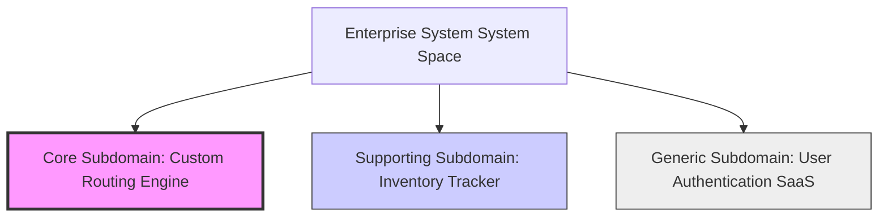

# Module 01: Strategic DDD Foundations — Ubiquitous Language & Subdomain Mapping

Welcome, class. Today we initiate our study of **Domain-Driven Design (DDD) (CS-519)**.

In software engineering, we often rush to write code, select frameworks, and configure database tables before fully understanding the problem we are solving. This developer-centric mindset results in the **Big Ball of Mud**—systems where business rules are scattered across controllers, SQL views, utility classes, and frontends, and where change in one area causes failures in unrelated parts of the system.

Strategic DDD addresses this. It is a set of principles used to map out business structures, define clean boundaries between systems, and establish a shared language before writing code. Today we will analyze **Subdomains**, build a **Ubiquitous Language**, and study how to isolate a core business subdomain in Java.

---

## 1. Academic Lecture: Strategic Modeling and Boundary Isolation

Strategic design is about understanding the problem space and organizing the solution space.

### 1. The Ubiquitous Language
The foundation of DDD is the **Ubiquitous Language**: a single, unified language shared by domain experts (product managers, business analysts) and software engineers.
*   **The Problem**: If domain experts use the term "Billing Statement," developers name the class `AccountInvoice`, and the database uses a table called `CUSTOMER_BILL`, translation errors are inevitable. 
*   **The Rule**: Every term in the Ubiquitous Language must map exactly to class names, method signatures, variables, and database tables in the code. If the business speaks of "Suspending an Account," the code must be `account.suspend()`, never `account.setStatus(AccountStatus.SUSPENDED)` or `account.setActive(false)`.

### 2. Subdomain Classifications
A large enterprise system contains multiple business concerns. We categorize these concerns into three types of **Subdomains**:

*   **Core Subdomain (The Differentiator)**: This is what makes the business unique and profitable. It requires high engineering quality and custom development.
    *   *Examples*: A proprietary routing algorithm for a logistics provider, a real-time trading engine for a stock brokerage, or a matching algorithm for a ride-sharing app.
*   **Supporting Subdomain (Necessary but not Unique)**: Necessary for business operations but does not provide a competitive edge. It can be built internally but does not receive primary resources.
    *   *Examples*: Product catalog indexing, inventory tracking, or coupon administration.
*   **Generic Subdomain (Standard Utility)**: Standard functionalities required by any enterprise. These should be fulfilled using off-the-shelf software or SaaS solutions.
    *   *Examples*: User Authentication (e.g., Auth0, Keycloak), billing processing (e.g., Stripe), or SMS/email delivery systems (e.g., Twilio, SendGrid).



---

## 2. Theory vs. Production Trade-offs

### Custom Monolithic Models vs. Subdomain Microservices
*   **Unified Monolithic Model (The Shared Database)**:
    *   *Pro*: Easy to query via SQL joins across all tables (orders, inventory, customer profiles).
    *   *Con*: High coupling. If the customer profile schema changes, the order checkout flow breaks.
*   **Subdomain Segregation (Decoupled Services)**:
    *   *Pro*: Each subdomain manages its own state and database. If the authentication system goes down, the routing engine can continue executing cached routes.
    *   *Con*: Requires eventual consistency patterns (like Domain Events over Kafka/RabbitMQ) and distributed queries, which increases operational complexity.

---

## 3. How to Use: Isolating the Core Domain in Java

Let us look at how strategic segregation translates to Java code. We will contrast a coupled "God Object" pattern with a clean, decoupled design.

### A. The Coupled "God Object" (Anti-Pattern)

This class mixes Core (checkout), Supporting (catalog lookup), and Generic (email sending, payment processing) concerns in a single class, violating strategic boundaries:

```java
package com.capstone.security.strategic.vulnerable;

import java.util.List;

public class MonolithicOrderProcessor {

    // DANGER: Core domain class directly coupled to Generic billing API (Stripe)
    private final StripeBillingClient billingClient = new StripeBillingClient();
    
    // DANGER: Coupled to Generic notification system
    private final EmailService emailService = new EmailService();

    public void processOrder(String userId, List<String> itemIds, double totalAmount) {
        // 1. Supporting domain concern: Catalog check
        for (String itemId : itemIds) {
            if (!CatalogDatabase.isAvailable(itemId)) {
                throw new IllegalStateException("Item " + itemId + " out of stock");
            }
        }

        // 2. Generic domain concern: Payment Gateway call
        boolean paymentSuccess = billingClient.charge(userId, totalAmount);
        if (!paymentSuccess) {
            throw new PaymentFailedException("Payment declined");
        }

        // 3. Core domain concern: Order creation and status tracking
        Order order = new Order(userId, itemIds, "CONFIRMED");
        OrderDatabase.save(order);

        // 4. Generic domain concern: Sending notifications
        emailService.sendEmail(userId, "Order Confirmed", "Your order ID is: " + order.getId());
    }
}
```

### B. The Decoupled Domain Architecture (DDD Pattern)

In a decoupled domain model, the Core domain class defines **Ports** (interfaces) for external actions (obtaining catalog availability, processing payments, sending emails). The core business logic operates purely on these interfaces, isolating it from external details.

First, define the core domain Interfaces:

```java
package com.capstone.security.strategic.secure.ports;

import java.util.List;

public interface CatalogService {
    boolean verifyAvailability(List<String> itemIds);
}
```

```java
package com.capstone.security.strategic.secure.ports;

public interface PaymentProcessor {
    boolean charge(String userId, double amount);
}
```

```java
package com.capstone.security.strategic.secure.ports;

public interface NotificationSender {
    void notifyOrderConfirmation(String userId, String orderId);
}
```

Now, implement the Core Domain Processor:

```java
package com.capstone.security.strategic.secure.domain;

import com.capstone.security.strategic.secure.ports.CatalogService;
import com.capstone.security.strategic.secure.ports.NotificationSender;
import com.capstone.security.strategic.secure.ports.PaymentProcessor;
import java.util.List;
import java.util.UUID;

/**
 * Hardened Core Subdomain class. Has zero direct dependencies on concrete external systems.
 */
public class OrderCheckoutUseCase {

    private final CatalogService catalogService;
    private final PaymentProcessor paymentProcessor;
    private final NotificationSender notificationSender;

    public OrderCheckoutUseCase(CatalogService catalogService, 
                                PaymentProcessor paymentProcessor, 
                                NotificationSender notificationSender) {
        this.catalogService = catalogService;
        this.paymentProcessor = paymentProcessor;
        this.notificationSender = notificationSender;
    }

    public Order execute(String userId, List<String> itemIds, double amount) {
        // 1. Core verification: Verify inventory availability via ports
        if (!catalogService.verifyAvailability(itemIds)) {
            throw new OutOfStockException("Requested items are not available.");
        }

        // 2. Core business action: Charge payment
        boolean paymentSuccess = paymentProcessor.charge(userId, amount);
        if (!paymentSuccess) {
            throw new PaymentDeclinedException("Failed to complete transaction.");
        }

        // 3. Core state creation: Construct order
        Order order = new Order(UUID.randomUUID().toString(), userId, itemIds, "COMPLETED");

        // 4. Decoupled notice emission: Emit confirmation
        notificationSender.notifyOrderConfirmation(userId, order.getOrderId());

        return order;
    }
}
```

---

## 4. Common Errors & Pitfalls

### Pitfall 1: Over-engineering the Generic Subdomains
Spending developer hours building custom OAuth2 login servers or dynamic HTML email templates instead of integrating third-party tools.
*   **Why it fails**: You divert your top software engineers away from the Core Subdomain (e.g., your unique booking system) to build utility code that does not help differentiate the business.
*   **Mitigation**: Use SaaS providers (like Okta, SendGrid) for generic capabilities, and focus development resources on the Core Subdomain.

---

## 5. Socratic Review Questions

### Question 1
Define the term "Anemic Domain Model". Why is it considered an architectural anti-pattern in DDD?

#### Answer
An Anemic Domain Model is a code structure where domain classes contain only data properties and getter/setter methods (e.g., POJOs), while the actual business logic is implemented in service layers (e.g., `OrderService`). 
This is an anti-pattern because it violates encapsulation: the service classes must manipulate the private states of data objects, leading to procedural code where invariants cannot be enforced. A rich domain model keeps business data and the operations that modify it in the same class.

### Question 2
What is the difference between a Problem Space and a Solution Space in strategic design?

#### Answer
*   **Problem Space**: The business domain itself: how the business operates, its challenges, and the various subdomains (Core, Supporting, Generic) that exist.
*   **Solution Space**: The software architecture we design to solve those challenges (e.g., Bounded Contexts, database schemas, API structures, and microservices).
The goal of Strategic DDD is to align the Solution Space with the Problem Space.

---

## 6. Hands-on Challenge: Subdomain Separation

### The Challenge
In this challenge, you will refactor a coupled monolithic system.

Your task is to take the provided `MonolithicDeliveryManager` class (which manages deliveries, routes, and notifications in one place) and refactor it. You must split the logic into two decoupled interfaces (`RouteCalculator` and `NotificationClient`) so that the core `DeliveryManager` class has no direct dependency on the email framework or GPS mapping libraries.

Complete the refactored code structure:

```java
package com.capstone.security.strategic.challenge;

import java.util.List;

// 1. TODO: Define RouteCalculator interface (Core concern)
interface RouteCalculator {
    List<String> calculateOptimalPath(String startingPoint, String destination);
}

// 2. TODO: Define NotificationClient interface (Generic concern)
interface NotificationClient {
    void sendDeliveryAlert(String userId, String deliveryId);
}

// 3. Implement the decoupled DeliveryManager
public class DeliveryManager {
    private final RouteCalculator routeCalculator;
    private final NotificationClient notificationClient;

    public DeliveryManager(RouteCalculator routeCalculator, NotificationClient notificationClient) {
        this.routeCalculator = routeCalculator;
        this.notificationClient = notificationClient;
    }

    public DeliveryTicket scheduleDelivery(String userId, String start, String end) {
        // TODO: Complete implementation:
        // 1. Calculate path using routeCalculator.
        // 2. Create DeliveryTicket with an ID and the path.
        // 3. Send alert using notificationClient.
        // 4. Return the ticket.
        return null;
    }
}
```

Write the decoupled interface declarations. Save your refactored classes and describe the architectural benefits of separating delivery routing from notification mechanics inside `modules/01-introduction-strategic-design.md`.
