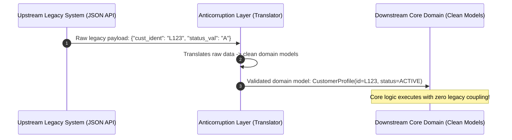

# Module 02: Bounded Contexts & Context Mapping — The Anticorruption Layer (ACL)

Welcome back, class. Today we discuss **Bounded Contexts** and **Context Mapping (CS-519)**.

In a large enterprise system, it is impossible to create a single, unified domain model that describes everything. If you attempt to define a single `Product` class for your entire company, you will find that the catalog team needs description strings, the shipping team needs physical dimensions, and the sales team needs discount codes. The class quickly becomes a bloated "God Object" that is highly coupled to every database table and API in the system.

Domain-Driven Design solves this using **Bounded Contexts**. We define explicit boundaries around different parts of the business. Within a Bounded Context, all terms in the Ubiquitous Language have a single, unambiguous meaning. Today, we will study Bounded Context relationships and learn how to implement an **Anticorruption Layer (ACL)** to isolate our clean domain from legacy external systems.

---

## 1. Academic Lecture: The Boundaries of Contexts

A Bounded Context is not a microservice; it is a conceptual boundary within which a domain model applies.

### 1. Semantic Divergence Across Boundaries
Let us trace the term `Account` across three contexts:
*   **Identity Context**: An `Account` represents login credentials, role groupings, and MFA configurations.
*   **Billing Context**: An `Account` represents payment methods, billing history, and invoices.
*   **Support Context**: An `Account` represents customer support tickets and contact details.
Rather than sharing a single `Account` class, we design three separate classes in three separate Bounded Contexts.

```
+-----------------------------------------------------------+
| Enterprise System                                         |
|                                                           |
|  +--------------------+             +------------------+  |
|  | Identity Context   |             | Billing Context  |  |
|  | [Account]          |             | [Account]        |  |
|  |  - username        |             |  - balance       |  |
|  |  - passwordHash    |             |  - creditCards   |  |
|  +--------------------+             +------------------+  |
|                                                           |
+-----------------------------------------------------------+
```

### 2. Context Mapping Patterns
When multiple Bounded Contexts interact, we map their relationships using standard patterns:

*   **Shared Kernel**: Two contexts share a common domain model or database schema. Changes require coordination from both teams.
*   **Customer-Supplier**: One context depends on another. The Upstream (Supplier) context must deliver data to the Downstream (Customer) context, but Downstream is dependent on Upstream's release schedule.
*   **Conformist**: The Downstream context conforms entirely to the Upstream model. Downstream accepts whatever data structures Upstream provides without translation.
*   **Open Host Service (OHS) / Published Language (PL)**: The Upstream context provides a public API (like OpenAPI) and standard payload formats (JSON/XML) that any client can consume.
*   **Anticorruption Layer (ACL)**: The Downstream context translates the Upstream model into its own native domain model. This is the cleanest pattern, as it isolates the Downstream context from changes in the Upstream system.



---

## 2. Theory vs. Production Trade-offs

### Direct Mapping (Conformist) vs. Translation Mapping (ACL)
*   **Conformist (Direct DTO consumption)**:
    *   *Pro*: Faster initial implementation. You compile client libraries generated directly from the upstream API.
    *   *Con*: High coupling. If the upstream legacy team changes a JSON field name, your database updates and business validation rules break.
*   **Anticorruption Layer (ACL)**:
    *   *Pro*: Full isolation. Your core domain uses clean names and models. If the legacy API changes, you only update the translator adapter in the ACL layer.
    *   *Con*: Requires writing and maintaining mapping classes and translating payloads at runtime, which adds minor performance overhead.

---

## 3. How to Use: Implementing an ACL Translator in Java

Let us look at how to build an Anticorruption Layer to translate a legacy JSON payload into a clean, modern domain representation.

### A. The Coupled Payload (Anti-Pattern)

Avoid using external DTO classes directly inside your core business logic:

```java
package com.capstone.security.context.vulnerable;

public class CoreBillingService {

    public void activateAccount(LegacyUserDto legacyUser) {
        // DANGER: Core logic is coupled to ugly legacy naming conventions
        if ("ACTIVE_STATUS".equals(legacyUser.getCust_status_code())) {
            // Process billing...
            System.out.println("Processing billing for: " + legacyUser.getUsr_fname_val());
        }
    }
}
```

### B. The Anticorruption Layer Architecture (DDD Pattern)

In this design, we define an internal domain representation (`CustomerProfile`) and construct an ACL adapter to parse, validate, and translate the legacy data.

First, define our Clean Domain Model:

```java
package com.capstone.security.context.secure.domain;

/**
 * Clean domain record. Immutable and free of external naming details.
 */
public record CustomerProfile(
    String customerId,
    String email,
    boolean isActive
) {
    public CustomerProfile {
        if (customerId == null || customerId.isBlank()) {
            throw new IllegalArgumentException("Customer ID cannot be blank.");
        }
        if (email == null || !email.contains("@")) {
            throw new IllegalArgumentException("Invalid email format.");
        }
    }
}
```

Next, define the Legacy Payload (DTO):

```java
package com.capstone.security.context.secure.dto;

/**
 * Upstream DTO class. Represents legacy naming conventions.
 */
public class LegacyUserDto {
    private String cust_ident;
    private String usr_email_addr;
    private String account_status_flag; // "A" for active, "I" for inactive

    // Getters and Setters
    public String getCust_ident() { return cust_ident; }
    public void setCust_ident(String id) { this.cust_ident = id; }
    
    public String getUsr_email_addr() { return usr_email_addr; }
    public void setUsr_email_addr(String email) { this.usr_email_addr = email; }
    
    public String getAccount_status_flag() { return account_status_flag; }
    public void setAccount_status_flag(String flag) { this.account_status_flag = flag; }
}
```

Now, implement the Anticorruption Layer:

```java
package com.capstone.security.context.secure.acl;

import com.capstone.security.context.secure.domain.CustomerProfile;
import com.capstone.security.context.secure.dto.LegacyUserDto;
import java.util.logging.Logger;

/**
 * Anticorruption Layer translator adapter.
 */
public class LegacyUserTranslator {
    private static final Logger LOGGER = Logger.getLogger(LegacyUserTranslator.class.getName());

    /**
     * Translates a legacy DTO into a clean, validated domain model.
     */
    public static CustomerProfile translate(LegacyUserDto legacyUser) {
        if (legacyUser == null) {
            throw new IllegalArgumentException("Legacy user data cannot be null.");
        }

        LOGGER.info("Translating legacy user: " + legacyUser.getCust_ident());

        // Resolve status flag to boolean
        boolean isActive = "A".equalsIgnoreCase(legacyUser.getAccount_status_flag());

        // Build and return the clean domain model
        return new CustomerProfile(
            legacyUser.getCust_ident(),
            legacyUser.getUsr_email_addr(),
            isActive
        );
    }
}
```

---

## 4. Common Errors & Pitfalls

### Pitfall 1: Leaking Legacy Database Exceptions to the Core Domain
If your ACL maps domain classes to a legacy database, SQL exceptions (like constraint violations or column mismatch errors) can leak into the domain layer.
*   **Why it fails**: The domain layer is forced to import database driver dependencies and handle vendor-specific exceptions, violating context boundaries.
*   **Mitigation**: Catch all database-specific exceptions inside the adapter implementation and map them to clean, technology-neutral domain exceptions (e.g. `DomainPersistenceException`).

---

## 5. Socratic Review Questions

### Question 1
Explain why a Bounded Context is not necessarily a microservice. Can a single monolithic application contain multiple Bounded Contexts?

#### Answer
A Bounded Context is a conceptual boundary within the domain model. A microservice is a physical deployment unit. 
A single monolithic application can (and should) contain multiple Bounded Contexts by isolating them inside separate packages (e.g., `com.company.catalog` vs. `com.company.billing`) and preventing direct imports of domain objects between these packages.

### Question 2
What is the primary purpose of an Anticorruption Layer (ACL)? When should you NOT implement one?

#### Answer
The purpose of an ACL is to protect your downstream domain model from changes and bad design decisions in upstream legacy systems. 
You should NOT implement an ACL if you are using the **Conformist** pattern (where your domain is simple and you intentionally choose to conform to the upstream API), or if the upstream system uses a stable **Published Language** that matches your domain design.

---

## 6. Hands-on Challenge: Implementing an ACL Mapping Adapter

### The Challenge
In this challenge, you will implement an Anticorruption Layer mapping adapter.

Your task is to write a mapping method in `LegacyOrderTranslator` to translate an upstream legacy payload (`LegacyOrderDto`) into a clean domain representation (`OrderAggregate`).

Complete the translator code below:

#### Clean Domain Target:
```java
package com.capstone.security.context.challenge;

public record OrderAggregate(
    String orderId,
    double totalCost,
    int retryAttempts
) {}
```

#### Legacy Source DTO:
```java
package com.capstone.security.context.challenge;

public class LegacyOrderDto {
    public String order_ref_code;
    public String cost_amt_str; // e.g., "120.50"
    public String system_retry_count; // e.g., "3"
}
```

#### Implement the Translator:
```java
package com.capstone.security.context.challenge;

public class LegacyOrderTranslator {

    /**
     * Translates the legacy order payload into a clean OrderAggregate.
     * Parses numeric values and handles parsing errors.
     * 
     * @param legacyOrder The legacy order DTO
     * @return The clean OrderAggregate model
     */
    public static OrderAggregate translate(LegacyOrderDto legacyOrder) {
        if (legacyOrder == null) {
            return null;
        }

        // TODO: Complete the translation.
        // 1. Map order_ref_code to orderId.
        // 2. Parse cost_amt_str to double (default to 0.0 on error).
        // 3. Parse system_retry_count to int (default to 0 on error).
        // 4. Return new OrderAggregate.
        
        return null;
    }
}
```

Write the parsing and error-handling code. Save your translator class and explain why mapping parsing errors inside the ACL is a critical safety strategy inside `modules/02-bounded-contexts-context-mapping.md`.
