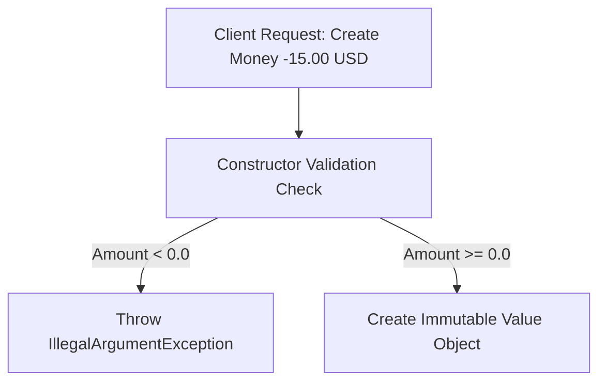

# Module 03: Value Objects — Immutability, Equality, and Java 21 Records

Welcome back, class. Today we analyze **Value Objects (CS-519)**.

In database-driven development, developers represent everything as tables with primary keys. This causes a major code smell: primitive obsession. We see parameters like `String email`, `double price`, `String zipCode` passed across services, controllers, and domain logic. If these values are not validated at creation, invalid values (e.g., negative prices, malformed emails) contaminate the database.

Domain-Driven Design solves this using **Value Objects**. Value Objects describe characteristics of the domain but have no unique identity. Today, we will study the properties of Value Objects and learn how to implement self-validating, immutable Value Objects using **Java 21 Records**.

---

## 1. Academic Lecture: The Properties of Value Objects

A Value Object is defined entirely by its attributes. Unlike an Entity, it does not have a lifecycle or an ID.

```
Entity vs. Value Object Comparison

    [ Customer Entity ]               [ Money Value Object ]
   +--------------------+             +--------------------+
   | ID: CUST-99281     |             | Amount: 100.00     |
   | Name: Alice        |             | Currency: USD      |
   +--------------------+             +--------------------+
 (Identity persists even if         (Has no ID. Equal to any
  Name changes to "Bob")             other 100.00 USD object)
```

### The Four Characteristics of Value Objects

1.  **No Identity**: Value Objects are anonymous. We do not track "which" `Money` object represents a payment; we only care about its value.
2.  **Immutability**: Once constructed, a Value Object cannot be altered. If you want to add $10$ to a `Money` object representing $50$, you do not change the amount field; you instantiate a new `Money` object representing $60$. This prevents multi-threaded race conditions and side effects.
3.  **Structural Equality**: Two Value Objects are equal if all their fields are equal. The expression `new Money(10, USD).equals(new Money(10, USD))` must evaluate to `true`.
4.  **Self-Validation**: A Value Object must be valid from the moment it is created. It must validate its own attributes inside its constructor and throw an exception if they are invalid, preventing the rest of the application from handling corrupt states.



---

## 2. Theory vs. Production Trade-offs

### High Allocation Rates vs. Performance
*   **Immutable Allocation**:
    *   *Trade-off*: Creating new objects for every state change (e.g., creating a new `Money` object on every addition) increases garbage collection overhead.
    *   *Production Rule*: In high-throughput, latency-critical environments (like high-frequency trading), allocation rates can impact performance. However, for 99% of business applications, modern JVM garbage collectors (like ZGC or G1) handle short-lived allocations efficiently. The safety of immutability far outweighs the performance cost.

---

## 3. How to Use: Value Objects in Java 21

Let us look at how Java 21 **records** simplify the creation of Value Objects by handling immutability, structural equality, and field generation automatically.

### A. The Mutable, Obsessed Primitive (Anti-Pattern)

Avoid this mutable design. It allows setting negative values and lacks validation:

```java
package com.capstone.security.valueobject.vulnerable;

public class MutablePrice {
    private double amount;
    private String currency;

    public MutablePrice(double amount, String currency) {
        this.amount = amount;
        this.currency = currency;
    }

    // DANGER: Allows setter modification, which can break database invariants
    public void setAmount(double amount) {
        this.amount = amount;
    }

    public double getAmount() { return amount; }
    public String getCurrency() { return currency; }
}
```

### B. The Hardened Value Object (DDD Pattern)

Here is a hardened Java 21 record implementing self-validation and custom math methods:

```java
package com.capstone.security.valueobject.secure;

import java.io.Serializable;
import java.util.Objects;

/**
 * Hardened Money Value Object. Uses a Java 21 record to enforce immutability
 * and structural equality.
 */
public record Money(
    double amount,
    String currency
) implements Serializable {

    /**
     * Compact Constructor. Enforces domain invariants during construction.
     */
    public Money {
        if (amount < 0.0) {
            throw new IllegalArgumentException("Money amount cannot be negative: " + amount);
        }
        if (currency == null || currency.isBlank()) {
            throw new IllegalArgumentException("Currency must be specified.");
        }
        // Normalize currency to uppercase
        currency = currency.trim().toUpperCase();
    }

    /**
     * Factory method for clean instantiation.
     */
    public static Money of(double amount, String currency) {
        return new Money(amount, currency);
    }

    /**
     * Business action. Returns a new Money object to maintain immutability.
     */
    public Money add(Money other) {
        Objects.requireNonNull(other, "Cannot add null money.");
        if (!this.currency.equals(other.currency())) {
            throw new IllegalArgumentException("Cannot add money with different currencies: " 
                + this.currency + " and " + other.currency());
        }
        return new Money(this.amount + other.amount(), this.currency);
    }
}
```

---

## 4. Common Errors & Pitfalls

### Pitfall 1: Modifying Value Objects inside Entity Logic
A common mistake is modifying a Value Object directly inside an Entity class:
```java
// DANGER: This fails if the object is shared between entities!
public void applyDiscount(Discount discount) {
    this.price.setAmount(this.price.getAmount() - discount.getVal()); 
}
```
*   **Mitigation**: Reassign the field to a new instance:
    ```java
    this.price = new Money(this.price.amount() - discount.amount(), this.price.currency());
    ```

---

## 5. Socratic Review Questions

### Question 1
Why are Java 21 `records` preferred over standard classes for implementing Value Objects? What boilerplate do they eliminate?

#### Answer
Java `records` are implicitly immutable (all fields are `private final` and the class is marked `final`). They automatically generate:
*   A canonical constructor.
*   Type-safe getter methods (without the `get` prefix, e.g., `amount()`).
*   `equals()` and `hashCode()` methods based on structural value equality.
*   A clean `toString()` output showing the fields.
This eliminates dozens of lines of boilerplate code and removes the need for Lombok annotations like `@Value` or `@EqualsAndHashCode`.

### Question 2
Under what circumstances can a Value Object contain other Value Objects? Give a concrete example.

#### Answer
A Value Object can contain other Value Objects if they describe a combined concept. For example, a `BillingAddress` Value Object can contain a `ZipCode` Value Object, a `StreetAddress` Value Object, and a `CountryCode` Value Object. None of these component objects have identities; they simply describe the parent value.

---

## 6. Hands-on Challenge: Building an Address Value Object

### The Challenge
In this challenge, you will implement an address Value Object using a Java 21 record.

Your task:
1.  Complete the compact constructor validation logic.
2.  Enforce that the zip code matches the `ZIP_REGEX` format, and the country code is exactly 2 characters long.
3.  Ensure the parameters are not null or blank.

Complete the record declaration below:

```java
package com.capstone.security.valueobject.challenge;

import java.util.regex.Pattern;

public record Address(
    String street,
    String city,
    String zipCode,
    String countryCode
) {
    private static final Pattern ZIP_PATTERN = Pattern.compile("^\\d{5}(-\\d{4})?$");

    /**
     * Enforces validation rules on initialization.
     */
    public Address {
        // TODO: Complete this constructor validation.
        // 1. Verify street, city, zipCode, and countryCode are not null or blank.
        // 2. Validate zipCode matches ZIP_PATTERN.
        // 3. Validate countryCode length is exactly 2 characters (e.g., "US", "VN").
        // 4. Throw IllegalArgumentException on any invalid checks.
    }
}
```

Write the validation logic. Save your record file and describe the benefits of self-validating fields in multi-service coordination inside `modules/03-value-objects.md`.
