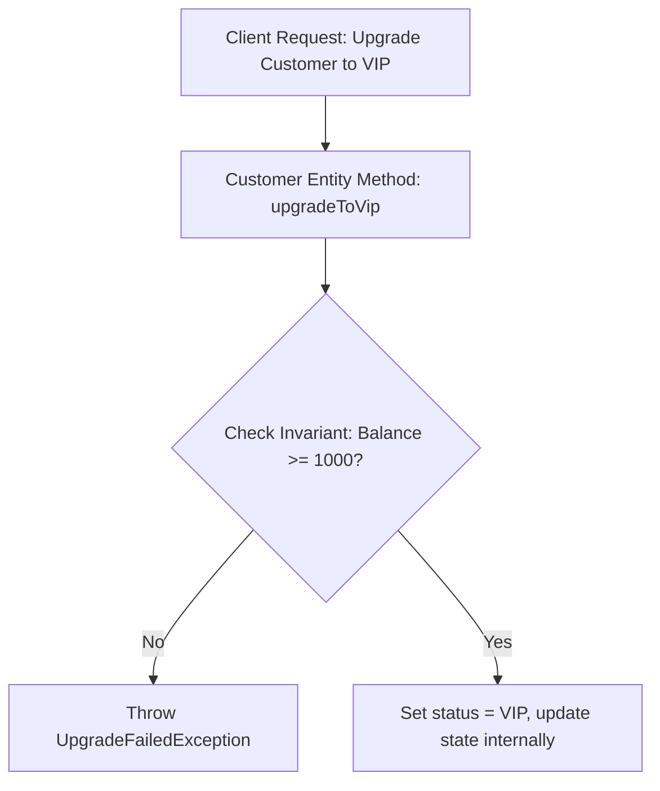

# Module 04: Entities & Identity — Rich Domain Models vs. Anemic Entities

Welcome back, class. Today we analyze **Entities and Identity Lifecycles (CS-519)**.

In basic web applications, developers use ORM frameworks (like Spring Data JPA) to generate entities. However, these database-backed classes often suffer from a severe architectural flaw: they are **Anemic**. They are filled with public getter and setter methods for every property, allowing any controller or service to bypass business rules and modify internal states directly.

In Domain-Driven Design, an Entity is a rich, self-contained object defined by its unique identity, not its attributes. Today, we will study **Rich Domain Models**, evaluate **Identity Generation** patterns, and implement encapsulating boundaries inside Java entities.

---

## 1. Academic Lecture: The Mechanics of Entities

An Entity represents a business concept that has a continuous thread of identity over time.

### 1. Identity vs. State
Consider a `User` entity in an application:
*   At creation, the user's name is "Alice" and their email is `alice@corp.com`.
*   A year later, they change their name to "Alice Smith" and update their email.
*   *The Rule*: Even though their attributes have changed, they are still the exact same user. Their identity is defined by a unique identifier (e.g., a `UserId`), not their state. In contrast, a `Money` Value Object representing $10$ has no identity; it cannot change state, it can only be replaced.

### 2. The Anemic Model Anti-Pattern
An anemic entity is a passive database mapping helper:
```java
// ANEMIC ANTI-PATTERN: Zero encapsulation, business invariants easily bypassed
Customer customer = new Customer();
customer.setBalance(-100.00); // Invalid balance allowed!
customer.setStatus("VIP"); // Invalid status transition allowed!
```
By exposing public setters for every field, the application distributes business validation rules across multiple service classes. If a new developer writes a service and forgets to check if a balance is negative, the database will be corrupted.

### 3. The Rich Domain Model Pattern
A rich domain entity protects its invariants. It has private fields and no generic setters. All state transitions occur through explicit, named business methods that validate inputs:
```java
// RICH DDD PATTERN: State modified only through valid business methods
Customer customer = new Customer(customerId, "Alice");
customer.upgradeToVip(minimumBalanceValidator); // Encapsulated check
```



---

## 2. Theory vs. Production Trade-offs

### Application-Generated Identity (UUID) vs. Database-Generated Identity (Sequence)
*   **Database-Generated (Postgres SERIAL / Sequence)**:
    *   *Pro*: Sequential, clean values; efficient indexing inside primary key b-trees.
    *   *Con*: You cannot instantiate a valid Entity in memory without saving it to the database first (the ID remains `null` until the insert completes). This breaks domain testing.
*   **Application-Generated (UUIDv4 or ULID)**:
    *   *Pro*: You can generate the identity immediately in memory, allowing you to run pure unit tests on aggregates and publish domain events containing the ID before database commit.
    *   *Production Rule*: For distributed enterprise systems, prefer **Application-Generated IDs (UUIDs or ULIDs)**. If indexing performance is a bottleneck, use sequential UUIDs (UUIDv7) to prevent index fragmentation.

---

## 3. How to Use: Building a Rich Domain Entity in Java

Let us look at how to build a rich domain entity in Java that protects its validation bounds.

### A. The Anemic Entity (Anti-Pattern)

Avoid this pattern. It exposes internal lists and fields to external corruption:

```java
package com.capstone.security.entity.vulnerable;

import java.util.List;

public class AnemicCart {
    private String cartId;
    private double totalPrice;
    private List<String> items;

    // DANGER: Allows external code to replace the entire items list directly
    public void setItems(List<String> items) {
        this.items = items;
    }

    public List<String> getItems() { return this.items; }
    
    public void setTotalPrice(double price) { this.totalPrice = price; }
    public double getTotalPrice() { return this.totalPrice; }
}
```

### B. The Hardened Rich Entity (DDD Pattern)

Here is a rich entity. All fields are private, structural collections are returned as unmodifiable lists, and modifications occur through explicit business methods.

```java
package com.capstone.security.entity.secure;

import java.util.ArrayList;
import java.util.Collections;
import java.util.List;
import java.util.UUID;

/**
 * Hardened Rich Domain Entity. Protects all state invariants and collections.
 */
public class RichCart {

    private final UUID cartId;
    private double totalPrice;
    private final List<CartItem> items;
    private boolean isClosed;

    public RichCart(UUID cartId) {
        this.cartId = java.util.Objects.requireNonNull(cartId, "Cart ID cannot be null.");
        this.items = new ArrayList<>();
        this.totalPrice = 0.0;
        this.isClosed = false;
    }

    /**
     * Business Operation: Adds an item to the cart. Enforces state validation.
     */
    public void addItem(CartItem item) {
        if (isClosed) {
            throw new IllegalStateException("Cannot add items to a closed cart.");
        }
        java.util.Objects.requireNonNull(item, "Cart item cannot be null.");

        this.items.add(item);
        recalculateTotalPrice();
    }

    /**
     * Business Operation: Closes the cart.
     */
    public void closeCart() {
        if (items.isEmpty()) {
            throw new IllegalStateException("Cannot close an empty cart.");
        }
        this.isClosed = true;
    }

    private void recalculateTotalPrice() {
        this.totalPrice = this.items.stream()
                .mapToDouble(CartItem::price)
                .sum();
    }

    // Read-only getters
    public UUID getCartId() { return cartId; }
    public double getTotalPrice() { return totalPrice; }
    public boolean isClosed() { return isClosed; }

    /**
     * SECURE: Returns an unmodifiable view of the list.
     * Prevents external callers from executing items.clear() or items.add().
     */
    public List<CartItem> getItems() {
        return Collections.unmodifiableList(items);
    }
}
```

---

## 4. Common Errors & Pitfalls

### Pitfall 1: Implementing JPA Annotations directly on the Domain Entity
Applying Hibernate mapping annotations (`@Entity`, `@Table`, `@Column`) directly to your core Domain entities.
*   **Why it fails**: Your domain layer becomes coupled to JPA rules (e.g., requiring default no-argument constructors, which violates self-validation rules).
*   **Mitigation**: Separate the **Domain Model** from the **Persistence Model**. Write a database entity class for Hibernate, and map it to your clean domain class. We will study this in Module 8.

---

## 5. Socratic Review Questions

### Question 1
Explain the danger of exposing collections (e.g. `List<T>`) via standard getters, even if the reference is marked final.

#### Answer
Even if a field is declared as `private final List<Item> items = new ArrayList<>();` and has no setter, a standard getter `public List<Item> getItems() { return this.items; }` returns a direct reference to the internal list. 
External client code can execute `cart.getItems().clear()` or `cart.getItems().add(invalidItem)`. This bypasses all of the entity's validation logic, corrupting the internal state of the entity without its knowledge.

### Question 2
Why should Entity equality (`equals` and `hashCode`) be based *only* on the identity ID, rather than all fields?

#### Answer
Entities are mutable and change state over their lifecycle. If equality checks compare all fields, an `Account` entity loaded before updates will not be equal to the same `Account` entity after updates, despite representing the same database record. 
By basing `equals` and `hashCode` only on the unique ID, we ensure the entity remains equal to itself throughout all state changes.

---

## 6. Hands-on Challenge: Building a Rich User Account Entity

### The Challenge
In this challenge, you will refactor an anemic user account class.

Your task is to build a rich `UserAccount` class:
1.  Prevent direct manipulation of login failure counts.
2.  Implement a business method `recordLoginFailure()`. If the failure count reaches `3`, change the status of the account to `LOCKED`.
3.  Implement a business method `resetFailures()` to clear the counter upon a successful login.

Complete the implementation below:

```java
package com.capstone.security.entity.challenge;

import java.util.UUID;

public class UserAccount {
    private final UUID accountId;
    private final String username;
    
    private int failedLogins;
    private AccountStatus status;

    public UserAccount(UUID accountId, String username) {
        this.accountId = java.util.Objects.requireNonNull(accountId);
        this.username = java.util.Objects.requireNonNull(username);
        this.failedLogins = 0;
        this.status = AccountStatus.ACTIVE;
    }

    // TODO: Implement the business rules.
    // 1. Write public void recordLoginFailure():
    //    - If status is already LOCKED, do nothing.
    //    - Increment failedLogins.
    //    - If failedLogins >= 3, change status to AccountStatus.LOCKED.
    // 2. Write public void resetFailures():
    //    - If status is ACTIVE, set failedLogins = 0.
    
    public UUID getAccountId() { return accountId; }
    public String getUsername() { return username; }
    public int getFailedLogins() { return failedLogins; }
    public AccountStatus getStatus() { return status; }
}
```

Write the methods and check for invariants. Save your file and describe the benefits of encapsulating state transitions inside the entity rather than the service layer inside `modules/04-entities-identity.md`.
