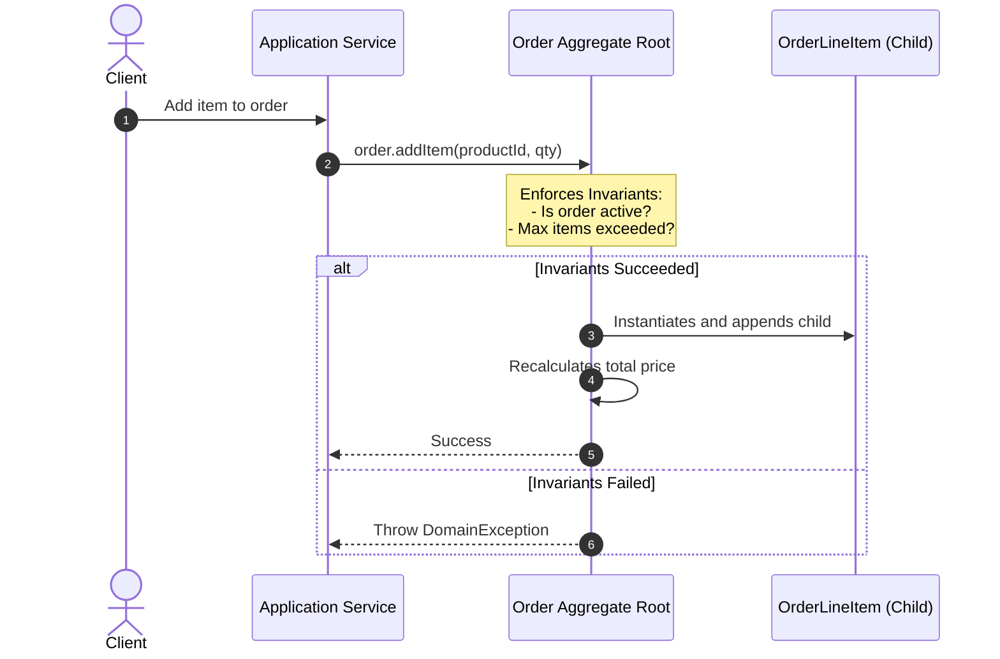

# Module 05: Aggregates & Aggregate Roots — Transactional Consistency Boundaries

Welcome back, class. Today we analyze **Aggregates and Aggregate Roots (CS-519)**.

In complex enterprise systems, domain entities are highly interconnected. If we allow any service to traverse this web of objects and modify nested child entities directly, we quickly run into consistency issues. Invariants—business rules that must remain true at all times—get violated, database locks lead to deadlocks, and transactions fail to roll back clean.

Domain-Driven Design solves this using the concept of **Aggregates**. An Aggregate is a cluster of associated Entities and Value Objects that form a transaction boundary. Today, we will study the rules of Aggregates and learn how to lock down our aggregate invariants in Java.

---

## 1. Academic Lecture: The Rules of Aggregates

An Aggregate represents a boundary within which data must remain consistent.

```
Aggregate Consistency Boundary

  +-------------------------------------------------+
  | Order Aggregate (Boundary)                      |
  |                                                 |
  |  +-------------------------+                    |
  |  | [Order]                 | <--- Aggregate Root|
  |  |  - orderId (ID)         |                    |
  |  |  - customerId (Ref ID)  |                    |
  |  +------------+------------+                    |
  |               |                                 |
  |               v                                 |
  |  +-------------------------+                    |
  |  | [OrderLineItem]         | <--- Child Entity  |
  |  |  - productId            |                    |
  |  |  - quantity             |                    |
  |  +-------------------------+                    |
  +-------------------------------------------------+
(External code can only call methods on Order. 
 Direct modification of OrderLineItem is blocked.)
```

### The Three Rules of Aggregates

1.  **Access Only Through the Root**: The Aggregate Root is a specific Entity that acts as the gateway to the aggregate. External systems can only reference the Aggregate Root. They cannot access or modify nested objects inside the aggregate boundary directly. If you want to modify a child `OrderLineItem`, you must call `order.updateQuantity(itemId, newQty)`.
2.  **Reference Other Aggregates by ID Only**: Aggregates must never hold direct Java references to other Aggregates. For example, an `Order` aggregate must not contain a reference to a `Customer` object. Instead, it must store a `CustomerId` Value Object. This decouples our database load actions, prevents memory graph bloat, and defines clean microservice boundaries.
3.  **One Aggregate per Transaction**: A single database transaction should update *exactly one* Aggregate instance. If an update to Aggregate A needs to change state in Aggregate B, we use eventual consistency via **Domain Events** (which we will study in Module 7).



---

## 2. Theory vs. Production Trade-offs

### Small Aggregates vs. Large Aggregates
*   **Large Aggregates (e.g., a User containing all past login activities and orders)**:
    *   *Pro*: Easy to enforce complex invariants across historical data.
    *   *Con*: High memory overhead. Every time we load the User, Hibernate fetches thousands of login records. This also increases write conflicts, as concurrent updates to a user's address and a login attempt will lock the same row.
*   **Small Aggregates (e.g., separating User, LoginActivity, and Order)**:
    *   *Pro*: High concurrency, fast database reads, and clear separation of concerns.
    *   *Production Rule*: Keep your Aggregates **as small as possible** while still maintaining business invariants. If a rule does not need to be updated instantly in a single transaction, split the objects into separate aggregates and coordinate them using events.

---

## 3. How to Use: Encapsulating Aggregates in Java

Let us look at how to build an `Order` Aggregate Root in Java that protects its internal entities and references another aggregate only by its ID.

### A. The Exposed Aggregate (Anti-Pattern)

Avoid this design. It references other aggregates directly and exposes internal child lists:

```java
package com.capstone.security.aggregate.vulnerable;

import java.util.List;

public class VulnerableOrder {
    private String orderId;
    
    // DANGER: Directly referencing the Customer aggregate root creates tight coupling
    private Customer customer;

    // DANGER: Exposing raw list allows direct external modification of child items
    private List<VulnerableLineItem> items;

    public List<VulnerableLineItem> getItems() {
        return this.items;
    }
}
```

### B. The Hardened Aggregate Root (DDD Pattern)

Here is a hardened Aggregate Root. It references the customer by `CustomerId`, wraps its child list, and enforces transactional business invariants.

First, define the Child Entity:

```java
package com.capstone.security.aggregate.secure;

import java.util.UUID;

/**
 * Child Entity inside the Aggregate. Accessible only via the Aggregate Root.
 */
public class OrderLineItem {
    private final UUID productId;
    private int quantity;
    private final double unitPrice;

    public OrderLineItem(UUID productId, int quantity, double unitPrice) {
        this.productId = java.util.Objects.requireNonNull(productId);
        setQuantity(quantity);
        this.unitPrice = unitPrice;
    }

    public void setQuantity(int quantity) {
        if (quantity <= 0) {
            throw new IllegalArgumentException("Quantity must be positive.");
        }
        this.quantity = quantity;
    }

    public UUID getProductId() { return productId; }
    public int getQuantity() { return quantity; }
    public double getUnitPrice() { return unitPrice; }
}
```

Now, implement the Aggregate Root:

```java
package com.capstone.security.aggregate.secure;

import java.util.ArrayList;
import java.util.Collections;
import java.util.List;
import java.util.UUID;

/**
 * Hardened Aggregate Root. Enforces consistency boundaries.
 */
public class SecureOrder {

    private final UUID orderId;
    
    // SECURE: Reference other Aggregate Roots by ID value object, not Java reference
    private final UUID customerId;

    private final List<OrderLineItem> items;
    private String status;

    public SecureOrder(UUID orderId, UUID customerId) {
        this.orderId = java.util.Objects.requireNonNull(orderId);
        this.customerId = java.util.Objects.requireNonNull(customerId);
        this.items = new ArrayList<>();
        this.status = "CREATED";
    }

    /**
     * Business Operation: Add item. Enforces aggregate-level invariants.
     */
    public void addProduct(UUID productId, int quantity, double unitPrice) {
        if (!"CREATED".equals(status)) {
            throw new IllegalStateException("Cannot add products to a processed order.");
        }
        
        // Invariant: Max limit of 50 total items per order
        int currentTotalItems = this.items.stream().mapToInt(OrderLineItem::getQuantity).sum();
        if (currentTotalItems + quantity > 50) {
            throw new IllegalArgumentException("Total order items cannot exceed 50.");
        }

        // Check if product already exists, increment quantity if it does
        this.items.stream()
                .filter(item -> item.getProductId().equals(productId))
                .findFirst()
                .ifPresentOrElse(
                        item -> item.setQuantity(item.getQuantity() + quantity),
                        () -> this.items.add(new OrderLineItem(productId, quantity, unitPrice))
                );
    }

    public UUID getOrderId() { return orderId; }
    public UUID getCustomerId() { return customerId; }
    public String getStatus() { return status; }

    /**
     * SECURE: Returns read-only view of child items list.
     */
    public List<OrderLineItem> getItems() {
        return Collections.unmodifiableList(items);
    }
}
```

---

## 4. Common Errors & Pitfalls

### Pitfall 1: Modifying Child Entities without Routing through the Root
A developer updates a child entity directly in a database query or JPA mapper:
```sql
UPDATE order_line_items SET quantity = 10 WHERE id = 123;
```
*   **Why it fails**: Bypassing the aggregate root means aggregate-level invariants (such as checking if the total quantity exceeds `50` or updating the order status) are not evaluated, leaving the system in an inconsistent state.
*   **Mitigation**: Always perform updates by loading the Aggregate Root and calling its methods, then saving the root entity.

---

## 5. Socratic Review Questions

### Question 1
Why does referencing other aggregates by ID rather than direct JPA object relationships help scale microservice architectures?

#### Answer
If aggregates hold direct object references, mapping frameworks (like Hibernate) may attempt to fetch those associated tables automatically, loading a large object graph into memory. 
By referencing aggregates only by ID, we define clean boundaries. The domain model can easily be split across different databases or microservices, as there are no direct object links to break.

### Question 2
Explain how the "One Aggregate per Transaction" rule protects systems from database deadlocks.

#### Answer
If a transaction updates multiple aggregates, it must acquire locks on multiple database tables and rows. If Transaction 1 locks Aggregate A and waits for a lock on Aggregate B, while Transaction 2 locks Aggregate B and waits for a lock on Aggregate A, a deadlock occurs.
By restricting each transaction to updating a single aggregate, we serialize database writes and reduce lock contention.

---

## 6. Hands-on Challenge: Building a Forum Thread Aggregate

### The Challenge
In this challenge, you will implement an Aggregate Root representing a forum thread.

Your task is to build the `ForumThread` aggregate:
1.  Prevent direct modifications to the post list.
2.  Implement the method `addPost(String author, String content)`.
3.  Enforce the following invariants:
    - You cannot add posts to a thread that is marked as `CLOSED`.
    - A thread cannot contain more than `100` posts.

Complete the implementation below:

```java
package com.capstone.security.aggregate.challenge;

import java.util.ArrayList;
import java.util.Collections;
import java.util.List;
import java.util.UUID;

public class ForumThread {
    private final UUID threadId;
    private final String title;
    
    private final List<ForumPost> posts;
    private boolean isClosed;

    public ForumThread(UUID threadId, String title) {
        this.threadId = java.util.Objects.requireNonNull(threadId);
        this.title = java.util.Objects.requireNonNull(title);
        this.posts = new ArrayList<>();
        this.isClosed = false;
    }

    // TODO: Implement aggregate methods.
    // 1. Write public void addPost(String author, String content):
    //    - Throw IllegalStateException if isClosed is true.
    //    - Throw IllegalArgumentException if posts size is >= 100.
    //    - Instantiate a new ForumPost entity and add it to the posts list.
    // 2. Write public void closeThread() to mark the thread as closed.
    
    public UUID getThreadId() { return threadId; }
    public String getTitle() { return title; }
    public boolean isClosed() { return isClosed; }

    public List<ForumPost> getPosts() {
        // TODO: Return secure unmodifiable view of posts
        return null;
    }
}
```

Write the methods and configure the secure collection return. Save your file and explain the role of aggregate Roots as entry points for transactional modifications inside `modules/05-aggregates-aggregate-roots.md`.
