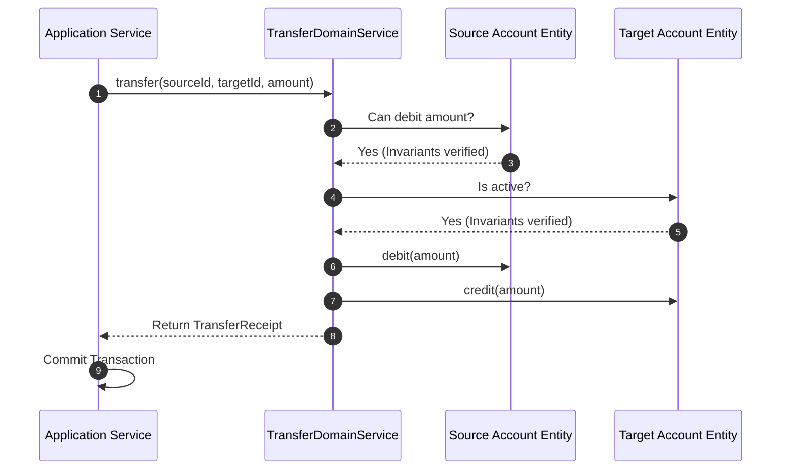

# Module 06: Domain Services — Stateless Logic Isolation

Welcome back, class. Today we analyze **Domain Services (CS-519)**.

A common mistake when refactoring anemic models is trying to force every piece of business logic into an Entity or a Value Object. For example, if you need to calculate a complex tax rate that depends on external tables or transfer funds between two bank accounts, where does that code belong? Placing it inside `Account` couples that class to other accounts and transaction logs. Placing it in an Application Service leaks business rules into the orchestration layer.

Domain-Driven Design solves this using **Domain Services**. A Domain Service is a stateless class that implements domain logic that does not naturally belong to a single Entity or Value Object. Today, we will study service segregation boundaries and write isolated Domain Services in Java.

---

## 1. Academic Lecture: Segregating the Service Layers

DDD defines three distinct types of services, each with its own responsibilities and dependencies:

### 1. The Three Service Layers
*   **Domain Service**:
    *   *Role*: Implements stateless business rules and calculations that span multiple aggregates.
    *   *Dependencies*: Depends only on Domain Entities, Value Objects, and Domain Ports (interfaces). It contains **zero** reference to Spring annotations (like `@Service` or `@Autowired`), databases, or HTTP details.
*   **Application Service**:
    *   *Role*: Orchestrates the execution of use cases. It loads aggregates from database repositories, initiates transactions, invokes Domain Services or Entities, and saves the updated states. It does not implement business logic.
    *   *Dependencies*: Depends on both the Domain layer and Outbound Ports (repository interfaces).
*   **Infrastructure Service**:
    *   *Role*: Implements technical operations.
    *   *Dependencies*: Implements outbound ports using concrete libraries (e.g., SMTP email clients, SMS clients, filesystems).

```
+-------------------------------------------------------------+
| Application Service (Orchestrator: Transactions, Security) |
+------------------------------+------------------------------+
                               |
                               v
+------------------------------+------------------------------+
| Domain Service (Stateless Invariant Rules & Calculations)   |
+------------------------------+------------------------------+
                               |
                               v
+------------------------------+------------------------------+
| Entities & Value Objects (Rich State Encapsulation)          |
+-------------------------------------------------------------+
```

### 2. Fund Transfer Case Study
To transfer money between two `Account` entities, we require a domain validation rule: the source account must have sufficient funds, and the destination account must be active. The transfer operation itself alters both entities.
*   We implement this logic in a stateless `TransferDomainService`.
*   The service verifies constraints on both objects and executes the transfer, keeping the entities decoupled.



---

## 2. Theory vs. Production Trade-offs

### Entities vs. Domain Services
*   **Forcing Logic Into Entities**:
    *   *Pro*: Keeps data and operations highly unified in a single class.
    *   *Con*: Leads to bloated entities that depend on multiple external models, breaking single-responsibility principles.
*   **Extracting Logic Into Domain Services**:
    *   *Pro*: Keeps domain entities clean, simple, and easy to unit test.
    *   *Con*: Overusing domain services can turn your entities back into anemic data holders, shifting all logic into procedural service files.
*   **Production Rule**: Always default to placing business logic inside **Entities** or **Value Objects**. Only move logic to a **Domain Service** when the operation is stateless and involves multiple distinct aggregates or external system checks.

---

## 3. How to Use: Isolating Domain Services in Java

Let us look at how to implement a stateless `TaxCalculationService` as a pure Domain Service.

### A. The Coupled Application Service (Anti-Pattern)

Avoid implementing complex calculations directly inside the Application Service layer:

```java
package com.capstone.security.service.vulnerable;

import org.springframework.stereotype.Service;
import org.springframework.transaction.annotation.Transactional;

@Service
public class OrderApplicationService {
    
    // DANGER: App orchestration layer directly executing business calculations
    @Transactional
    public void completeOrder(Order order, String stateCode) {
        double taxRate = 0.0;
        if ("CA".equals(stateCode)) {
            taxRate = 0.0825;
        } else if ("NY".equals(stateCode)) {
            taxRate = 0.08875;
        }
        
        double tax = order.getSubtotal() * taxRate;
        order.applyTax(tax);
        // save order...
    }
}
```

### B. The Isolated Domain Service Architecture (DDD Pattern)

We place the calculation logic in a pure, stateless Domain Service, which we call from the Application Service.

First, define the Domain Service class:

```java
package com.capstone.security.service.secure.domain;

import com.capstone.security.valueobject.secure.Money;

/**
 * Hardened Domain Service. Stateless, final, and free of Spring annotations.
 * Contains pure calculation business rules.
 */
public final class TaxCalculationService {

    /**
     * Business Calculation Rule.
     */
    public Money calculateTax(Money subtotal, String stateCode) {
        java.util.Objects.requireNonNull(subtotal, "Subtotal cannot be null.");
        java.util.Objects.requireNonNull(stateCode, "State code cannot be null.");

        double rate = getTaxRateForState(stateCode.trim().toUpperCase());
        double calculatedTaxAmount = subtotal.amount() * rate;

        return new Money(calculatedTaxAmount, subtotal.currency());
    }

    private double getTaxRateForState(String stateCode) {
        return switch (stateCode) {
            case "CA" -> 0.0825;
            case "NY" -> 0.08875;
            case "TX" -> 0.0625;
            default -> 0.0; // No tax
        };
    }
}
```

Next, call the Domain Service from the Application Service:

```java
package com.capstone.security.service.secure.application;

import com.capstone.security.service.secure.domain.TaxCalculationService;
import com.capstone.security.aggregate.secure.SecureOrder;
import com.capstone.security.valueobject.secure.Money;
import org.springframework.stereotype.Service;
import org.springframework.transaction.annotation.Transactional;

/**
 * Application Service orchestrating execution.
 */
@Service
public class HardenedOrderAppService {

    private final OrderRepository orderRepository;
    private final TaxCalculationService taxCalculationService;

    public HardenedOrderAppService(OrderRepository orderRepository) {
        this.orderRepository = orderRepository;
        // Instantiate domain service directly or configure via config factory beans
        this.taxCalculationService = new TaxCalculationService();
    }

    @Transactional
    public void applyTaxToOrder(String orderId, String stateCode) {
        // 1. Orchestration: Load aggregate root
        SecureOrder order = orderRepository.findById(orderId);

        // 2. Orchestration: Retrieve subtotal money
        Money subtotal = order.getSubtotal();

        // 3. Domain Logic delegation: Invoke stateless domain service
        Money tax = taxCalculationService.calculateTax(subtotal, stateCode);

        // 4. Invariant update: Apply to aggregate root
        order.applyTax(tax);

        // 5. Orchestration: Save updated aggregate root
        orderRepository.save(order);
    }
}
```

---

## 4. Common Errors & Pitfalls

### Pitfall 1: Making Domain Services Stateful
Adding class-level fields to store transaction results or cached variables inside a Domain Service.
*   **Why it fails**: Domain Services are shared utilities. Storing state inside a service makes it thread-unsafe, leading to concurrent race conditions in multi-threaded runtime environments.
*   **Mitigation**: Domain Services must remain strictly stateless. All input variables must be passed as method arguments, and all calculations must be returned as output objects.

---

## 5. Socratic Review Questions

### Question 1
Explain why a Domain Service should not use Spring dependency injections like `@Autowired` or `@Component` directly.

#### Answer
The `domain` layer must represent pure business rules and be isolated from the frameworks we use. If we add Spring annotations like `@Component` to our domain classes, the domain becomes coupled to the Spring framework. 
This makes it harder to run lightweight unit tests (which would require launching the Spring Context) and limits our ability to reuse the domain code in non-Spring runtimes.

### Question 2
How do you distinguish between an Application Service and a Domain Service?

#### Answer
*   **Application Service**: Contains **no business rules**. It only coordinates work (e.g., loading entities, initiating transactions, handling exceptions, and converting DTOs).
*   **Domain Service**: Contains **only business rules**. It does not access databases, handle transactions, or parse HTTP payloads.

---

## 6. Hands-on Challenge: Implementing a Discount Domain Service

### The Challenge
In this challenge, you will implement a stateless Domain Service that calculates order discount rules.

Your task is to write the class `DiscountDomainService`:
1.  Calculate a discount based on a coupon code.
2.  If the coupon is `SAVE10` and the order subtotal is greater than `$50.00`, return a discount of `10%` of the subtotal.
3.  If the coupon is `SAVE20` and the order subtotal is greater than `$100.00`, return a discount of `20%` of the subtotal.
4.  Otherwise, return a discount of `$0.00`.

Complete the service implementation below:

```java
package com.capstone.security.service.challenge;

import com.capstone.security.valueobject.secure.Money;

public final class DiscountDomainService {

    /**
     * Calculates the discount amount for a given order subtotal and coupon.
     * 
     * @param subtotal The order subtotal Money
     * @param couponCode The coupon code string
     * @return The discount amount Money
     */
    public Money calculateDiscount(Money subtotal, String couponCode) {
        java.util.Objects.requireNonNull(subtotal, "Subtotal cannot be null.");
        
        if (couponCode == null || couponCode.isBlank()) {
            return Money.of(0.0, subtotal.currency());
        }

        String code = couponCode.trim().toUpperCase();
        double discountAmount = 0.0;

        // TODO: Complete the logic.
        // 1. Check if code is "SAVE10" and subtotal.amount() > 50.00 -> calculate 10% discount.
        // 2. Check if code is "SAVE20" and subtotal.amount() > 100.00 -> calculate 20% discount.
        // 3. Return Money.of(discountAmount, subtotal.currency()).
        
        return Money.of(discountAmount, subtotal.currency());
    }
}
```

Write the calculations. Save the completed service and describe how this service prevents coupon rules from leaking into database repository layers inside `modules/06-domain-services.md`.
