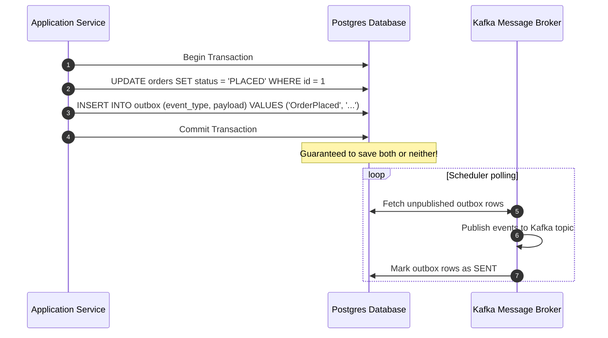

# Module 07: Domain Events — Decoupling and Eventual Consistency

Welcome back, class. Today we analyze **Domain Events (CS-519)**.

In enterprise architectures, business processes often cross Aggregate boundaries. For example, when an order is placed: the inventory must be reserved, the customer's credit limit must be adjusted, and a confirmation email must be sent. If you attempt to run all these database updates and external API calls within a single transaction, the request will be slow, lock database tables, and fail if the email service goes down.

Domain-Driven Design solves this using **Domain Events** to enforce **Eventual Consistency**. A Domain Event represents something significant that has occurred in the business domain. Today, we will study event-driven decoupling and learn how to implement the **Transactional Outbox Pattern** in Java.

---

## 1. Academic Lecture: Decoupling via Domain Events

A Domain Event is a record of an event that has already occurred. It is immutable and named in the past tense.

### 1. Eventual Consistency
Instead of updating multiple aggregates in a single database transaction, we write our systems to be eventually consistent:
1.  **Transaction 1**: The user places an order. We save the `Order` aggregate and publish an `OrderPlaced` event.
2.  **Asynchronous Process**: The message broker routes the `OrderPlaced` event to other services.
3.  **Transaction 2**: The inventory service receives the event and reserves the items.
4.  **Transaction 3**: The notification service receives the event and sends the email.

```
Synchronous (Coupled) vs. Asynchronous (Eventually Consistent)

  [Sync Transaction]
  User -> Order DB -> Inventory DB (Locked) -> Email API (Wait) -> 200 OK
  (If Email API fails, the entire order is rolled back)

  [Async Transaction]
  User -> Order DB + Event Published -> 200 OK
  
  [Asynchronous Consumers]
  Event -> Inventory DB (Updated)
  Event -> Email API (Sent)
```

### 2. The Transactional Outbox Pattern
When publishing events to external message brokers (like Kafka or RabbitMQ), we face the "Dual-Write Problem":
*   If we update the database first and then publish to Kafka, the JVM could crash before publishing. The event is lost.
*   If we publish to Kafka first, the database transaction could fail and roll back. We have published a phantom event.
*   **The Solution**: We write the events to an `outbox` table in the *same* database transaction as our aggregate update. Because it uses the same transaction, either both updates succeed or both fail. A background scheduler (or CDC tool like Debezium) then polls the `outbox` table and publishes the events, guaranteeing **At-Least-Once Delivery**.



---

## 2. Theory vs. Production Trade-offs

### Spring ApplicationEvents vs. Kafka/RabbitMQ Brokers
*   **Spring `ApplicationEventPublisher` (In-Memory)**:
    *   *Pro*: Lightweight; no external message brokers to configure or manage.
    *   *Con*: Volatile. If the JVM crashes, all unpublished in-memory events are lost.
*   **Production Rule**: Use Spring's in-memory events for simple decoupling within a single Bounded Context, but configure the **Transactional Outbox Pattern** with a message broker (Kafka/RabbitMQ) for communication across distinct Bounded Contexts or microservices.

---

## 3. How to Use: Secure Event Publishing in Spring Boot

Let us implement a secure domain event publishing flow in Spring Boot 3.x using `@TransactionalEventListener` and a database outbox table.

### A. The Coupled Synchronous Controller (Anti-Pattern)

Avoid this coupled approach. It executes external calls inside the primary write transaction:

```java
package com.capstone.security.event.vulnerable;

import org.springframework.stereotype.Service;
import org.springframework.transaction.annotation.Transactional;

@Service
public class CoupledOrderService {
    private final OrderRepository orderRepository;
    private final InventoryClient inventoryClient;
    private final EmailClient emailClient;

    @Transactional
    public void placeOrder(Order order) {
        orderRepository.save(order);
        
        // DANGER: If inventoryClient times out, the database transaction remains open, holding locks.
        inventoryClient.reserve(order.getItems());
        
        // DANGER: If emailClient fails, order is rolled back, causing data inconsistency.
        emailClient.sendConfirmationEmail(order.getCustomerId());
    }
}
```

### B. The Hardened Event-Driven Architecture (DDD Pattern)

In this design, we save the order and publish a Spring Application event. We use `@TransactionalEventListener(phase = TransactionPhase.AFTER_COMMIT)` to ensure we only publish to the external broker after the database transaction has committed.

First, define the Domain Event:

```java
package com.capstone.security.event.secure.domain;

import java.time.Instant;
import java.util.UUID;

/**
 * Immutable Domain Event. Named in the past tense.
 */
public record OrderPlacedEvent(
    UUID orderId,
    UUID customerId,
    double totalAmount,
    Instant occurredAt
) {
    public OrderPlacedEvent(UUID orderId, UUID customerId, double totalAmount) {
        this(orderId, customerId, totalAmount, Instant.now());
    }
}
```

Next, implement the Event-Driven Application Service:

```java
package com.capstone.security.event.secure.application;

import com.capstone.security.event.secure.domain.OrderPlacedEvent;
import com.capstone.security.aggregate.secure.SecureOrder;
import org.springframework.context.ApplicationEventPublisher;
import org.springframework.stereotype.Service;
import org.springframework.transaction.annotation.Transactional;

@Service
public class DecoupledOrderService {

    private final OrderRepository orderRepository;
    private final ApplicationEventPublisher eventPublisher;

    public DecoupledOrderService(OrderRepository orderRepository, ApplicationEventPublisher eventPublisher) {
        this.orderRepository = orderRepository;
        this.eventPublisher = eventPublisher;
    }

    @Transactional
    public void placeOrder(SecureOrder order) {
        // 1. Update domain state
        orderRepository.save(order);

        // 2. Instantiate and publish the domain event internally
        OrderPlacedEvent event = new OrderPlacedEvent(order.getOrderId(), order.getCustomerId(), order.getTotalPrice());
        eventPublisher.publishEvent(event);
    }
}
```

Now, write the Event Listener that implements the Outbox Pattern:

```java
package com.capstone.security.event.secure.infrastructure;

import com.capstone.security.event.secure.domain.OrderPlacedEvent;
import org.springframework.stereotype.Component;
import org.springframework.transaction.event.TransactionPhase;
import org.springframework.transaction.event.TransactionalEventListener;

import java.util.logging.Logger;

@Component
public class TransactionalOutboxListener {
    private static final Logger LOGGER = Logger.getLogger(TransactionalOutboxListener.class.getName());

    private final OutboxRepository outboxRepository;

    public TransactionalOutboxListener(OutboxRepository outboxRepository) {
        this.outboxRepository = outboxRepository;
    }

    /**
     * SECURE: Executes only AFTER the database transaction has committed.
     * Prevents publishing events for rolled-back database updates.
     */
    @TransactionalEventListener(phase = TransactionPhase.AFTER_COMMIT)
    public void handleOrderPlaced(OrderPlacedEvent event) {
        LOGGER.info("Order transaction committed successfully. Saving event to database outbox: " + event.orderId());

        // Map domain event to outbox table entity for background worker processing
        OutboxEntry entry = new OutboxEntry(
            event.orderId().toString(),
            "OrderPlaced",
            serializeEvent(event)
        );

        outboxRepository.save(entry);
    }

    private String serializeEvent(OrderPlacedEvent event) {
        // Return JSON representation of event payload
        return "{\"orderId\":\"" + event.orderId() + "\",\"amount\":" + event.totalAmount() + "}";
    }
}
```

---

## 4. Common Errors & Pitfalls

### Pitfall 1: Throwing exceptions inside AFTER_COMMIT listeners
Throwing runtime exceptions inside methods annotated with `@TransactionalEventListener(phase = TransactionPhase.AFTER_COMMIT)`.
*   **Why it fails**: Because the parent database transaction has committed, any exception thrown in the listener will not roll back the database change, leaving downstream systems out of sync.
*   **Mitigation**: Wrap listener code in try-catch blocks. If a failure occurs, write the failure state to a dead-letter log or database retry queue.

---

## 5. Socratic Review Questions

### Question 1
Why does Spring's standard `@EventListener` block the primary thread, and how does `@TransactionalEventListener` modify this behavior?

#### Answer
*   `@EventListener`: Executes synchronously within the caller's thread and transaction. If the listener fails, the parent transaction rolls back.
*   `@TransactionalEventListener`: Registers itself with the active transaction context. It delays execution until the transaction enters a specific phase (such as `AFTER_COMMIT`), decoupling the database write from the event delivery check.

### Question 2
What is idempotent consumer processing, and why is it required when using the Transactional Outbox pattern?

#### Answer
The Transactional Outbox pattern guarantees **At-Least-Once** event delivery (because network timeouts can occur after the message is sent but before the broker confirms receipt, causing the worker to resend). 
To prevent duplicate execution, downstream consumers must be **idempotent**: they must keep track of processed event IDs (e.g., in a `processed_events` table) and ignore any duplicate events they receive.

---

## 6. Hands-on Challenge: Outbox Event Publishing

### The Challenge
In this challenge, you will implement a transactional event handler.

Your task:
1.  Complete the listener method to capture `AccountCreatedEvent`.
2.  The listener must execute *only* after successful transaction commits.
3.  Simulate saving the event to an outbox repository.

Complete the implementation below:

```java
package com.capstone.security.event.challenge;

import org.springframework.stereotype.Component;
import org.springframework.transaction.event.TransactionPhase;
import org.springframework.transaction.event.TransactionalEventListener;

import java.util.UUID;

public record AccountCreatedEvent(UUID accountId, String email) {}

@Component
public class AccountOutboxHandler {

    private final OutboxMockRepository mockRepo = new OutboxMockRepository();

    // TODO: Annotate this handler method to execute AFTER_COMMIT
    public void processAccountCreated(AccountCreatedEvent event) {
        // TODO: Complete the logic:
        // 1. Verify event is not null.
        // 2. Call mockRepo.saveOutbox(event.accountId().toString(), "AccountCreated");
    }

    public static class OutboxMockRepository {
        public void saveOutbox(String id, String type) {
            System.out.println("Outbox record saved for entity: " + id + " [" + type + "]");
        }
    }
}
```

Write the handler and configuration annotation. Save your file and explain the role of outbox patterns in microservice reliability inside `modules/07-domain-events.md`.
