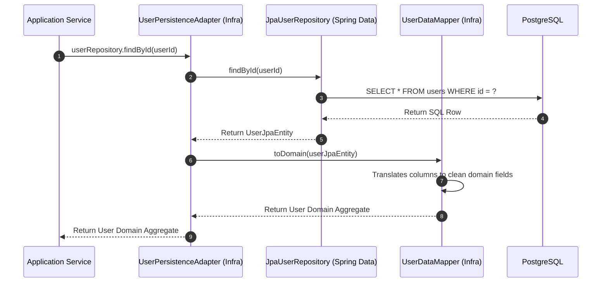

# Module 08: Repositories & Persistence Mapping — Decoupling Domain from Database

Welcome back, class. Today we analyze **Repositories and Persistence Mapping (CS-519)**.

In standard Spring Boot tutorials, developers annotate their core business classes with `@Entity`, `@Table`, and `@Column`. This is a major design flaw: it couples the business domain directly to database schemas. If you need to add an index, modify a column name, or split a table for performance, you are forced to change your core domain logic, violating the Single Responsibility Principle.

Domain-Driven Design solves this by separating the **Domain Model** (pure business logic) from the **Persistence Model** (database tables). We define a technology-neutral **Repository Interface** in the domain and implement it in the infrastructure layer using **Data Mappers**. Today, we will study database decoupling and learn how to write clean mapping adapters in Java.

---

## 1. Academic Lecture: Decoupling the Database

To protect our domain model, we must establish a clear boundary between JVM memory representations and database rows.

### 1. The Separation of Concerns
*   **Domain Model**: Designed for business operations and invariant checks. It uses encapsulation, rich constructor validations, and final fields. It contains **no** JPA annotations.
*   **Persistence Model (JPA Entity)**: Designed for ORM mapping and database indexing. It requires a default no-argument constructor (for Hibernate reflection), mutable fields, and database identifier mappings.
*   **Data Mapper**: A translator utility that maps the Domain Model to the Persistence Model and vice versa.

```
   Domain Layer                     Infrastructure Layer
  +------------------+             +----------------------+
  | [User]           |             | [UserJpaEntity]      |
  | (Pure class,     | <=========> | (JPA Annotations,    |
  |  No annotations) |  DataMapper |  Getters/Setters)    |
  +--------+---------+             +----------+-----------+
           |                                  |
           v (Interface Port)                 v (Adapter Impl)
  +--------+---------+             +----------+-----------+
  | UserRepository   | <-----------+ UserPersistenceImpl  |
  +------------------+             +----------------------+
```

### 2. The Persistence Translation Lifecycle
When loading an aggregate root:
1.  The application calls `userRepository.findById(id)`.
2.  The implementation adapter calls the Spring Data JPA repository.
3.  JPA queries the database and instantiates the `UserJpaEntity`.
4.  The `UserDataMapper` translates the `UserJpaEntity` into a clean, validated `User` domain aggregate.
5.  The domain logic operates purely on the `User` aggregate, with no knowledge of Hibernate or JDBC.



---

## 2. Theory vs. Production Trade-offs

### Coupled JPA Entities vs. Decoupled Mappers
*   **Coupled JPA Entities (Shared Model)**:
    *   *Pro*: Zero mapping boilerplate; fast initial development. Simply write one class and database migrations are handled automatically.
    *   *Con*: The domain must expose public setters or empty constructors to support Hibernate, which weakens encapsulation.
*   **Decoupled Mappers (Clean Architecture)**:
    *   *Pro*: Total safety. The domain model remains pure. You can change database technologies (e.g., swapping JPA/Postgres for MongoDB or Redis) without modifying the business logic.
    *   *Con*: Requires writing and maintaining data transfer objects (DTOs), JPA schemas, and translation mappers, doubling the number of classes.
*   **Production Rule**: For core business subdomains where logic is complex and changes frequently, always **decouple** the domain from JPA. For generic, simple CRUD systems, you can combine them to save development time.

---

## 3. How to Use: Hardening the Persistence Boundaries

Let us write a compile-grade Java 21 implementation showing how to decouple a `Customer` aggregate root from its JPA counterpart.

### A. The Coupled JPA Entity (Anti-Pattern)

Avoid placing Hibernate annotations directly on core business classes:

```java
package com.capstone.security.repository.vulnerable;

import jakarta.persistence.*;

@Entity
@Table(name = "customers")
public class CoupledCustomer {
    @Id
    private String customerId;

    // DANGER: Database schema modifications directly affect domain model fields
    @Column(name = "email_address", nullable = false)
    private String email;

    // DANGER: Hibernate requires a public or protected no-arg constructor, bypassing domain invariants
    protected CoupledCustomer() {}

    public String getEmail() { return email; }
    public void setEmail(String email) { this.email = email; }
}
```

### B. The Decoupled Architecture (DDD Pattern)

In this design, we separate the domain and infrastructure definitions:

First, define the Pure Domain Model:

```java
package com.capstone.security.repository.secure.domain;

import java.util.UUID;

/**
 * Hardened Domain Aggregate Root. Free of all database framework coupling.
 */
public class Customer {
    private final UUID customerId;
    private String email;

    public Customer(UUID customerId, String email) {
        this.customerId = java.util.Objects.requireNonNull(customerId);
        setEmail(email);
    }

    public void setEmail(String email) {
        if (email == null || !email.contains("@")) {
            throw new IllegalArgumentException("Invalid email format: " + email);
        }
        this.email = email;
    }

    public UUID getCustomerId() { return customerId; }
    public String getEmail() { return email; }
}
```

Next, define the JPA Entity class in the Infrastructure layer:

```java
package com.capstone.security.repository.secure.infrastructure;

import jakarta.persistence.Entity;
import jakarta.persistence.Id;
import jakarta.persistence.Table;

/**
 * JPA Entity representing the database schema.
 */
@Entity
@Table(name = "customers")
public class CustomerJpaEntity {
    @Id
    private String id;
    private String email;

    // Default constructor required by Hibernate reflection
    public CustomerJpaEntity() {}

    public String getId() { return id; }
    public void setId(String id) { this.id = id; }
    
    public String getEmail() { return email; }
    public void setEmail(String email) { this.email = email; }
}
```

Now, write the Data Mapper:

```java
package com.capstone.security.repository.secure.infrastructure;

import com.capstone.security.repository.secure.domain.Customer;
import java.util.UUID;

/**
 * Data Mapper. Maps between domain models and database entities.
 */
public final class CustomerDataMapper {

    public static Customer toDomain(CustomerJpaEntity jpaEntity) {
        if (jpaEntity == null) {
            return null;
        }
        return new Customer(
            UUID.fromString(jpaEntity.getId()),
            jpaEntity.getEmail()
        );
    }

    public static CustomerJpaEntity toJpa(Customer domain) {
        if (domain == null) {
            return null;
        }
        CustomerJpaEntity jpaEntity = new CustomerJpaEntity();
        jpaEntity.setId(domain.getCustomerId().toString());
        jpaEntity.setEmail(domain.getEmail());
        return jpaEntity;
    }
}
```

Finally, implement the Repository Adapter:

```java
package com.capstone.security.repository.secure.infrastructure;

import com.capstone.security.repository.secure.domain.Customer;
import com.capstone.security.repository.secure.domain.UserRepository; // Domain Port interface
import org.springframework.stereotype.Component;

import java.util.Optional;
import java.util.UUID;

@Component
public class UserPersistenceAdapter implements UserRepository {

    private final SpringDataCustomerRepository jpaRepo;

    public UserPersistenceAdapter(SpringDataCustomerRepository jpaRepo) {
        this.jpaRepo = jpaRepo;
    }

    @Override
    public Customer findById(UUID id) {
        Optional<CustomerJpaEntity> entity = jpaRepo.findById(id.toString());
        return entity.map(CustomerDataMapper::toDomain)
                .orElseThrow(() -> new IllegalArgumentException("Customer not found: " + id));
    }

    @Override
    public void save(Customer customer) {
        CustomerJpaEntity jpaEntity = CustomerDataMapper.toJpa(customer);
        jpaRepo.save(jpaEntity);
    }
}
```

---

## 4. Common Errors & Pitfalls

### Pitfall 1: Leaking ORM Lazy Initialization Exceptions
Exposing a Domain Model from the mapper that contains lazy-loaded JPA collections.
*   **Why it fails**: When domain logic accesses the collection outside the transaction, Hibernate throws a `LazyInitializationException` because the database connection has closed.
*   **Mitigation**: The mapper must fully resolve and map all necessary child collections inside the transactional adapter before returning the domain object.

---

## 5. Socratic Review Questions

### Question 1
Why does Hibernate require a no-argument constructor? How does this conflict with the self-validation principle of Value Objects and Entities?

#### Answer
Hibernate uses Java reflection to instantiate entities directly from SQL rows before populating their fields. To do this, it requires a no-argument constructor. 
This conflicts with the self-validation principle because a no-arg constructor instantiates the object in an empty, invalid state. If developers use JPA entities directly as domain models, they are forced to expose these empty constructors, enabling invalid objects to exist in JVM memory.

### Question 2
What is the difference between a Repository and a DAO (Data Access Object)?

#### Answer
*   **DAO**: A low-level abstraction that maps directly to database tables and executes SQL queries.
*   **Repository**: A domain-level abstraction that behaves like an in-memory collection of Aggregate Roots. It works with domain objects and hides the persistence mechanics (tables, queries, API calls) entirely.

---

## 6. Hands-on Challenge: Decoupled Product Mapping

### The Challenge
In this challenge, you will implement a database mapping translator.

Your task is to write the `ProductMapper` class to map between `ProductJpaEntity` and the domain model `Product`:
1.  Map the fields correctly.
2.  Handle UUID serialization and parsing safely.
3.  Ensure the domain invariants (price checks) are preserved during mapping.

Complete the mapper implementation below:

#### Domain Model:
```java
package com.capstone.security.repository.challenge;

import java.util.UUID;

public record Product(UUID productId, String name, double price) {
    public Product {
        if (price < 0.0) throw new IllegalArgumentException("Price cannot be negative.");
    }
}
```

#### JPA Entity:
```java
package com.capstone.security.repository.challenge;

public class ProductJpaEntity {
    public String id;
    public String name;
    public double price;
}
```

#### Implement the Mapper:
```java
package com.capstone.security.repository.challenge;

import java.util.UUID;

public class ProductMapper {

    public static Product toDomain(ProductJpaEntity jpaEntity) {
        if (jpaEntity == null) {
            return null;
        }

        // TODO: Complete this translation.
        // 1. Convert id String to UUID.
        // 2. Map name and price.
        // 3. Return a new Product record.
        
        return null;
    }

    public static ProductJpaEntity toJpa(Product domain) {
        if (domain == null) {
            return null;
        }

        // TODO: Complete this translation.
        // 1. Instantiate ProductJpaEntity.
        // 2. Set id string from domain.productId().toString().
        // 3. Set name and price.
        // 4. Return the entity.
        
        return null;
    }
}
```

Write the translation mapping code. Save your mapping class and explain the architectural safety benefits of separating JPA tables from aggregate models inside `modules/08-repositories-persistence-mapping.md`.
