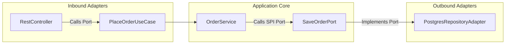

# Module 09: Hexagonal Architecture — Ports & Adapters Isolation

Welcome back, class. Today we analyze **Hexagonal Architecture (Ports and Adapters) (CS-519)**.

In traditional three-tier architectures (Presentation -> Business -> Data Access), dependencies flow downward. Your business logic layer imports the data access layer directly. This creates structural coupling: if you want to switch your database from PostgreSQL to MongoDB, or migrate from an on-premise mail server to a cloud-based webhook provider, you are forced to recompile and modify your core business code.

Hexagonal Architecture flips this. It places the **Domain** at the absolute center of the application, with **no** external dependencies. Any interaction with the outside world occurs through interfaces called **Ports**. The external systems (web controllers, database mappers, message queues) are **Adapters** that plug into these ports. Today, we will study Hexagonal boundaries and implement a decoupled order service.

---

## 1. Academic Lecture: The Dependency Inversion Principle

The core rule of Hexagonal Architecture is: **Dependencies flow inwards.**

```
          Hexagonal (Ports & Adapters) Layout
          
      +-------------------------------------------+
      | Infrastructure Adapters (Web, DB, CLI)    |
      |                                           |
      |   +-----------------------------------+   |
      |   | Ports (Inbound/Outbound)          |   |
      |   |                                   |   |
      |   |   +---------------------------+   |   |
      |   |   | Core Domain               |   |   |
      |   |   | (Entities, Value Objects) |   |   |
      |   |   +---------------------------+   |   |
      |   +-----------------------------------+   |
      +-------------------------------------------+
(Database and HTTP controllers depend on Ports. 
 The Core Domain has zero external dependencies.)
```

### 1. Ports vs. Adapters
*   **Inbound Ports (Driving Ports)**: Interfaces that define how external actors can interact with the application.
    *   *Examples*: Use cases like `CreateUserUseCase` or `CancelOrderUseCase`.
*   **Outbound Ports (Driven Ports)**: Interfaces that define what the application needs from the external world.
    *   *Examples*: Repositories like `SaveOrderPort` or clients like `SendNotificationPort`.
*   **Inbound Adapters (Drivers)**: Implementations that call Inbound Ports.
    *   *Examples*: Spring `@RestController` endpoints, command-line runners, or message listeners.
*   **Outbound Adapters (Driven)**: Implementations of Outbound Ports called by the application service.
    *   *Examples*: Spring Data JPA classes, Redis caches, or REST clients.



---

## 2. Theory vs. Production Trade-offs

### Clean Domain Isolation vs. Spring Autowiring Convenience
*   **Pure Domain Isolation (No Frameworks)**:
    *   *Pro*: Total safety. The domain code can compile on any JVM with zero dependencies, making upgrade paths (like migrating from Java 21 to Java 25 or Spring Boot 3 to 4) simple.
    *   *Con*: You cannot use Spring annotations like `@Component`, `@Service`, or `@Autowired` in the domain. All bean configurations must be written manually in configuration classes in the infrastructure layer.
*   **Production Rule**: Keep the `domain/` package strictly pure. Let the infrastructure layer handle Spring dependency injection configurations via factory beans.

---

## 3. How to Use: Hexagonal Project Layout in Java

Let us build an order fulfillment flow using Hexagonal Architecture package patterns.

### A. The Inbound Port (Use Case Interface)

Defined in the `ports/inbound/` directory. Accessible to controllers:

```java
package com.capstone.security.hex.ports.inbound;

import java.util.UUID;

public interface PlaceOrderUseCase {
    void placeOrder(UUID customerId, double amount);
}
```

### B. The Outbound Port (SPI Port Interface)

Defined in the `ports/outbound/` directory. Called by the application service:

```java
package com.capstone.security.hex.ports.outbound;

import com.capstone.security.aggregate.secure.SecureOrder;

public interface SaveOrderPort {
    void save(SecureOrder order);
}
```

### C. The Application Service (The Hexagon Core)

Implements the inbound port and calls the outbound port. Located in `application/`:

```java
package com.capstone.security.hex.application;

import com.capstone.security.hex.ports.inbound.PlaceOrderUseCase;
import com.capstone.security.hex.ports.outbound.SaveOrderPort;
import com.capstone.security.aggregate.secure.SecureOrder;
import java.util.UUID;

/**
 * Core application use-case implementation. Contains no Spring framework annotations.
 */
public class OrderApplicationService implements PlaceOrderUseCase {

    private final SaveOrderPort saveOrderPort;

    public OrderApplicationService(SaveOrderPort saveOrderPort) {
        this.saveOrderPort = saveOrderPort;
    }

    @Override
    public void placeOrder(UUID customerId, double amount) {
        // Instantiate aggregate root and enforce domain rules
        SecureOrder order = new SecureOrder(UUID.randomUUID(), customerId);
        order.addProduct(UUID.randomUUID(), 1, amount);

        // Delegate save action to outbound port
        saveOrderPort.save(order);
    }
}
```

### D. The Inbound Adapter (REST Web Layer)

Located in `infrastructure/adapters/inbound/`. Calls the inbound port:

```java
package com.capstone.security.hex.infrastructure.adapters.inbound;

import com.capstone.security.hex.ports.inbound.PlaceOrderUseCase;
import org.springframework.http.ResponseEntity;
import org.springframework.web.bind.annotation.*;

import java.util.UUID;

@RestController
@RequestMapping("/orders")
public class OrderRestController {

    // Depend on the Port interface, not the concrete service class
    private final PlaceOrderUseCase placeOrderUseCase;

    public OrderRestController(PlaceOrderUseCase placeOrderUseCase) {
        this.placeOrderUseCase = placeOrderUseCase;
    }

    @PostMapping
    public ResponseEntity<Void> createOrder(@RequestParam UUID customerId, @RequestParam double amount) {
        placeOrderUseCase.placeOrder(customerId, amount);
        return ResponseEntity.ok().build();
    }
}
```

### E. The Outbound Adapter (Database Layer)

Located in `infrastructure/adapters/outbound/`. Implements the outbound port:

```java
package com.capstone.security.hex.infrastructure.adapters.outbound;

import com.capstone.security.hex.ports.outbound.SaveOrderPort;
import com.capstone.security.aggregate.secure.SecureOrder;
import org.springframework.stereotype.Component;

import java.util.logging.Logger;

@Component
public class PostgresOrderAdapter implements SaveOrderPort {
    private static final Logger LOGGER = Logger.getLogger(PostgresOrderAdapter.class.getName());

    @Override
    public void save(SecureOrder order) {
        LOGGER.info("SQL Query: INSERT INTO orders (id, customer_id) VALUES (" 
            + order.getOrderId() + ", " + order.getCustomerId() + ")");
        // Call JPA repository mapper here...
    }
}
```

### F. Dependency Wiring (Infrastructure Configuration)

Wire the bean configuration in the infrastructure config class:

```java
package com.capstone.security.hex.infrastructure.config;

import com.capstone.security.hex.application.OrderApplicationService;
import com.capstone.security.hex.ports.inbound.PlaceOrderUseCase;
import com.capstone.security.hex.ports.outbound.SaveOrderPort;
import org.springframework.context.annotation.Bean;
import org.springframework.context.annotation.Configuration;

@Configuration
public class HexagonalWiringConfig {

    @Bean
    public PlaceOrderUseCase placeOrderUseCase(SaveOrderPort saveOrderPort) {
        // Instantiate the application service manually and inject adapters
        return new OrderApplicationService(saveOrderPort);
    }
}
```

---

## 4. Common Errors & Pitfalls

### Pitfall 1: Importing Infrastructure Classes inside the Domain Core
A developer imports a database entity (e.g. `OrderJpaEntity`) or a third-party billing model inside the domain model.
*   **Why it fails**: This breaks the dependency boundary. If the database schema changes, the domain model must be modified, defeating the purpose of the architecture.
*   **Mitigation**: Enforce package access restrictions. You can use tools like **ArchUnit** in your test suite to assert that classes in the `domain` package must have no imports from `infrastructure` packages.

---

## 5. Socratic Review Questions

### Question 1
Explain the difference between Inbound Ports and Outbound Ports in Hexagonal Architecture.

#### Answer
*   **Inbound Ports**: Define the interfaces that the application exposes to the outside world (e.g., Use Cases). They are *implemented* by the application services and *called* by inbound adapters (controllers).
*   **Outbound Ports**: Define the interfaces that the application core uses to communicate with external systems (e.g., Repositories, email senders). They are *called* by application services and *implemented* by outbound adapters (database/communication systems).

### Question 2
How does Hexagonal Architecture support testing?

#### Answer
Because the application core is isolated from external frameworks and database concerns by ports, we can write fast unit tests for our entire use case logic. We only need to mock the outbound port interfaces (e.g., `SaveOrderPort`) inside our tests, eliminating the need to spin up database containers or mock web servers.

---

## 6. Hands-on Challenge: Payment Isolation

### The Challenge
In this challenge, you will design the ports and adapters structure for a payment system.

Your task:
1.  Declare the Outbound Port interface `PaymentGatewayPort`.
2.  Implement the Application Service `ProcessPaymentUseCaseImpl` that depends on the port.
3.  Write an Outbound Adapter `StripePaymentAdapter` implementing `PaymentGatewayPort`.

Complete the declarations below:

```java
package com.capstone.security.hex.challenge;

import java.util.UUID;

// 1. TODO: Declare the Outbound Port interface
interface PaymentGatewayPort {
    boolean executePayment(UUID transactionId, double amount);
}

// 2. Implement the Use Case application service
public class ProcessPaymentUseCaseImpl {
    private final PaymentGatewayPort paymentGatewayPort;

    public ProcessPaymentUseCaseImpl(PaymentGatewayPort paymentGatewayPort) {
        this.paymentGatewayPort = paymentGatewayPort;
    }

    public boolean completeTransaction(UUID txId, double amount) {
        // TODO: Validate amount > 0, then delegate to paymentGatewayPort
        return false;
    }
}

// 3. TODO: Implement the Outbound Adapter StripePaymentAdapter
class StripePaymentAdapter implements PaymentGatewayPort {
    @Override
    public boolean executePayment(UUID transactionId, double amount) {
        // Simulate external Stripe SDK API charge call
        System.out.println("Charging amount via Stripe: " + amount);
        return true;
    }
}
```

Write the declarations and implementation details. Save your file and explain the role of Dependency Inversion in preventing database migrations from modifying use cases inside `modules/09-hexagonal-architecture.md`.
