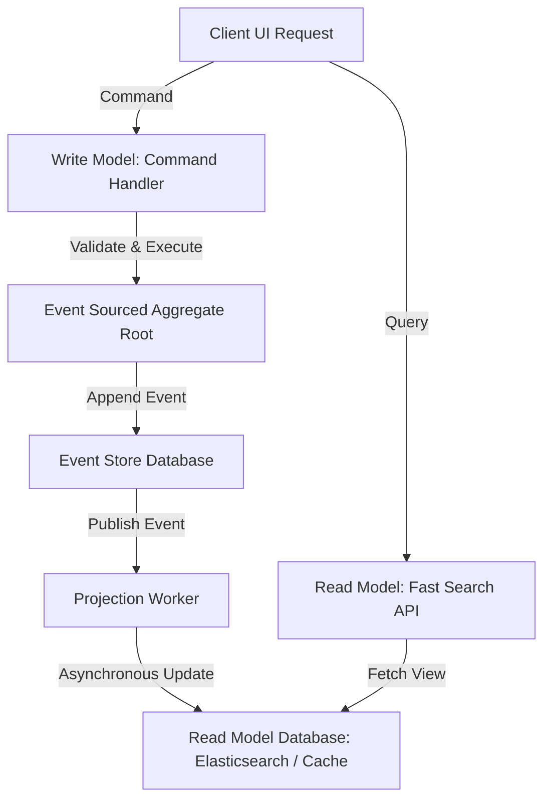

# Module 10: CQRS & Event Sourcing — High-Performance Read/Write Separation

Welcome back, class. Today we analyze **CQRS (Command Query Responsibility Segregation)** and **Event Sourcing (CS-519)**.

In standard database-centric applications, we use the same model (e.g., a JPA entity) to write data and read data. As the application grows, this creates a conflict: writing data requires highly normalized tables, foreign key constraints, and transactional locks to protect business invariants, while reading data requires denormalized views, complex joins, and fast text searching. 

Domain-Driven Design addresses this with two advanced patterns: **CQRS**, which separates command operations from query views, and **Event Sourcing**, which stores the history of state changes as a stream of immutable events rather than overwriting the current state. Today, we will study these patterns and implement a custom Event Store in Java.

---

## 1. Academic Lecture: Replaying History

To understand Event Sourcing, we must shift our mental model of database persistence.

### 1. State Storage vs. Event Sourcing
*   **State Storage (Traditional CRUD)**:
    *   If a bank account balance is `$100`, and the user withdraws `$20`, we execute `UPDATE accounts SET balance = 80 WHERE id = 1`.
    *   *The Problem*: We have destroyed the historical detail. We do not know *how* or *when* the balance became `$80` unless we parse audit logs.
*   **Event Sourcing**:
    *   We do not store the number `80` in a row. Instead, we append a stream of events:
        1.  `AccountOpenedEvent(id=1, initialBalance=100)`
        2.  `MoneyWithdrawnEvent(id=1, amount=20)`
    *   *Reconstruction*: To determine the current balance, we load all events for account `1` from the database and replay them from first to last.

```
State Storage Database Row:
  +------------+----------+
  | Account ID | Balance  |
  +------------+----------+
  | 1          | 80.00    |  <-- Overwritten state
  +------------+----------+

Event Sourced Database Stream:
  +-----+--------------+----------------------+---------------------+
  | Rev | Aggregate ID | Event Type           | Payload Data        |
  +-----+--------------+----------------------+---------------------+
  | 1   | 1            | AccountOpenedEvent   | initialAmount=100.0 |
  | 2   | 1            | MoneyWithdrawnEvent  | amount=20.0         |
  +-----+--------------+----------------------+---------------------+
(We rebuild current state by replaying events: 100.0 - 20.0 = 80.0)
```

### 2. CQRS: Commands and Queries
*   **Write Side (Commands)**: Handles actions that change state. Validates invariants against the write model (the Event Sourced aggregate).
*   **Read Side (Queries)**: Handles search and data retrieval. It reads from optimized, denormalized read models (projections) that are updated asynchronously when events are published.



---

## 2. Theory vs. Production Trade-offs

### Event Replay Overhead vs. Read Performance
*   **Replaying Large Event Streams**:
    *   *Pro*: Full audit history; the ability to reconstruct the state of the system at any specific point in time (temporal queries).
    *   *Con*: Replaying millions of events to load a single aggregate is too slow.
*   **Snapshotted Aggregates**:
    *   *Production Rule*: Use **Snapshots**. Every 100 events, save a snapshot of the current state (e.g., `AccountSnapshot(balance=500)`). To load the aggregate, load the latest snapshot and replay only the events that occurred after the snapshot sequence number.

---

## 3. How to Use: Event Sourcing in Java

Let us implement a basic event-sourced aggregate and projection system in Java.

### A. The Immutable Domain Events

```java
package com.capstone.security.es.domain;

import java.io.Serializable;
import java.util.UUID;

public interface DomainEvent extends Serializable {
    UUID aggregateId();
}

record AccountOpened(UUID aggregateId, String owner, double initialAmount) implements DomainEvent {}
record MoneyDeposited(UUID aggregateId, double amount) implements DomainEvent {}
record MoneyWithdrawn(UUID aggregateId, double amount) implements DomainEvent {}
```

### B. The Event Sourced Aggregate Root

This aggregate root reconstructs its state by replaying a stream of events.

```java
package com.capstone.security.es.domain;

import java.util.ArrayList;
import java.util.List;
import java.util.UUID;

public class EventSourcedAccount {
    private final UUID accountId;
    private double balance;
    private boolean isClosed;

    // Changes tracking: list of new events generated during the current command execution
    private final List<DomainEvent> uncommittedEvents = new ArrayList<>();

    public EventSourcedAccount(UUID accountId) {
        this.accountId = accountId;
    }

    /**
     * Rebuilds the aggregate state by replaying historical events.
     */
    public static EventSourcedAccount loadFromHistory(UUID accountId, List<DomainEvent> history) {
        EventSourcedAccount account = new EventSourcedAccount(accountId);
        for (DomainEvent event : history) {
            account.apply(event);
        }
        return account;
    }

    /**
     * Executes Command: Deposit money.
     */
    public void deposit(double amount) {
        if (isClosed) throw new IllegalStateException("Account is closed.");
        if (amount <= 0.0) throw new IllegalArgumentException("Amount must be positive.");

        // Generate and apply new event
        raiseEvent(new MoneyDeposited(accountId, amount));
    }

    /**
     * Handles event state mutations. Must contain zero validation logic.
     */
    private void apply(DomainEvent event) {
        if (event instanceof AccountOpened opened) {
            this.balance = opened.initialAmount();
            this.isClosed = false;
        } else if (event instanceof MoneyDeposited deposited) {
            this.balance += deposited.amount();
        } else if (event instanceof MoneyWithdrawn withdrawn) {
            this.balance -= withdrawn.amount();
        }
    }

    private void raiseEvent(DomainEvent event) {
        apply(event);
        uncommittedEvents.add(event); // Track changes to save to Event Store
    }

    public List<DomainEvent> getUncommittedEvents() {
        return List.copyOf(uncommittedEvents);
    }

    public double getBalance() { return balance; }
}
```

### C. The Read Model Projection Handler (CQRS)

Listens to events and updates a denormalized read-model database for fast querying:

```java
package com.capstone.security.es.infrastructure;

import com.capstone.security.es.domain.AccountOpened;
import com.capstone.security.es.domain.DomainEvent;
import com.capstone.security.es.domain.MoneyDeposited;
import com.capstone.security.es.domain.MoneyWithdrawn;
import org.springframework.stereotype.Component;

import java.util.Map;
import java.util.concurrent.ConcurrentHashMap;

@Component
public class AccountReadModelProjection {

    // Mock Read Model Database (Cache)
    private final Map<String, AccountSummaryView> cache = new ConcurrentHashMap<>();

    public void project(DomainEvent event) {
        if (event instanceof AccountOpened opened) {
            cache.put(opened.aggregateId().toString(), new AccountSummaryView(
                opened.owner(),
                opened.initialAmount()
            ));
        } else if (event instanceof MoneyDeposited deposited) {
            AccountSummaryView view = cache.get(deposited.aggregateId().toString());
            if (view != null) {
                view.updateBalance(view.balance() + deposited.amount());
            }
        } else if (event instanceof MoneyWithdrawn withdrawn) {
            AccountSummaryView view = cache.get(withdrawn.aggregateId().toString());
            if (view != null) {
                view.updateBalance(view.balance() - withdrawn.amount());
            }
        }
    }

    public AccountSummaryView getSummary(String id) {
        return cache.get(id);
    }
}
```

---

## 4. Common Errors & Pitfalls

### Pitfall 1: Performing validation inside Event Application methods
Placing business rules or parameter validation inside the `apply(...)` methods of the aggregate.
```java
// DANGER: If validations are executed during replay, and business rules change later, 
// replaying old events will fail, corrupting the aggregate recovery process.
private void apply(MoneyWithdrawn event) {
    if (this.balance < event.amount()) {
         throw new InsufficientFundsException(); // DANGER!
    }
    this.balance -= event.amount();
}
```
*   **Mitigation**: The `apply(...)` methods must only mutate state. All validations must be completed in the command execution methods (e.g., `withdraw()`) before generating the event.

---

## 5. Socratic Review Questions

### Question 1
Explain the difference between Commands and Queries in the context of database optimization.

#### Answer
*   **Commands**: Focus on writing data. They target highly normalized tables (e.g., executing updates on a single row) to maintain transactional boundaries.
*   **Queries**: Focus on reading data. They target denormalized tables or search indexes (e.g., executing complex joins or fuzzy text searches) to return data quickly.

### Question 2
What is the "Dual-Write Problem" in CQRS architectures, and how does asynchronous projection update handle it?

#### Answer
The Dual-Write Problem occurs when a command handler attempts to update both the write database and the read database in the same execution thread. If the write succeeds but the read update fails (e.g., due to network timeouts), the read database becomes permanently out of sync.
We mitigate this by updating the read model asynchronously using a message broker (or by reading database transaction logs, a pattern called Change Data Capture). The projection updates are decoupled from the command thread, ensuring eventual consistency.

---

## 6. Hands-on Challenge: Replaying Inventory Events

### The Challenge
In this challenge, you will implement an event replay method to reconstruct the state of an inventory item.

Your task is to write the `replay` method in `EventSourcedInventory`:
1.  Initialize the quantity to `0`.
2.  Iterate through the `InventoryEvent` list and apply the additions and subtractions.
3.  Ensure the quantity never drops below zero during calculation checks.

Complete the implementation below:

```java
package com.capstone.security.es.challenge;

import java.io.Serializable;
import java.util.List;
import java.util.UUID;

interface InventoryEvent extends Serializable {
    UUID itemId();
}

record InventoryInitialized(UUID itemId, int initialStock) implements InventoryEvent {}
record StockAdded(UUID itemId, int quantity) implements InventoryEvent {}
record StockRemoved(UUID itemId, int quantity) implements InventoryEvent {}

public class EventSourcedInventory {
    private final UUID itemId;
    private int currentStock;

    public EventSourcedInventory(UUID itemId) {
        this.itemId = itemId;
    }

    /**
     * Reconstructs the inventory quantity by replaying historical events.
     * 
     * @param history The list of inventory events
     * @throws IllegalStateException if stock calculation drops below 0.
     */
    public void replay(List<InventoryEvent> history) {
        // TODO: Complete this replay logic.
        // 1. Loop through history events.
        // 2. If InventoryInitialized, set currentStock = event.initialStock().
        // 3. If StockAdded, increment currentStock = currentStock + event.quantity().
        // 4. If StockRemoved, decrement currentStock = currentStock - event.quantity().
        // 5. If currentStock < 0, throw new IllegalStateException("Corrupt history: negative stock.");
    }

    public int getCurrentStock() { return currentStock; }
}
```

Write the event parsing loop. Save your file and describe how Event Sourcing provides a complete audit trail of state changes inside `modules/10-cqrs-event-sourcing.md`.
