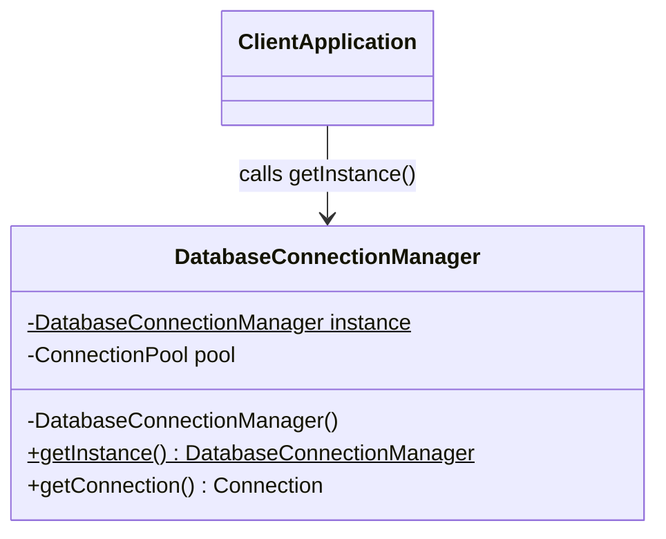
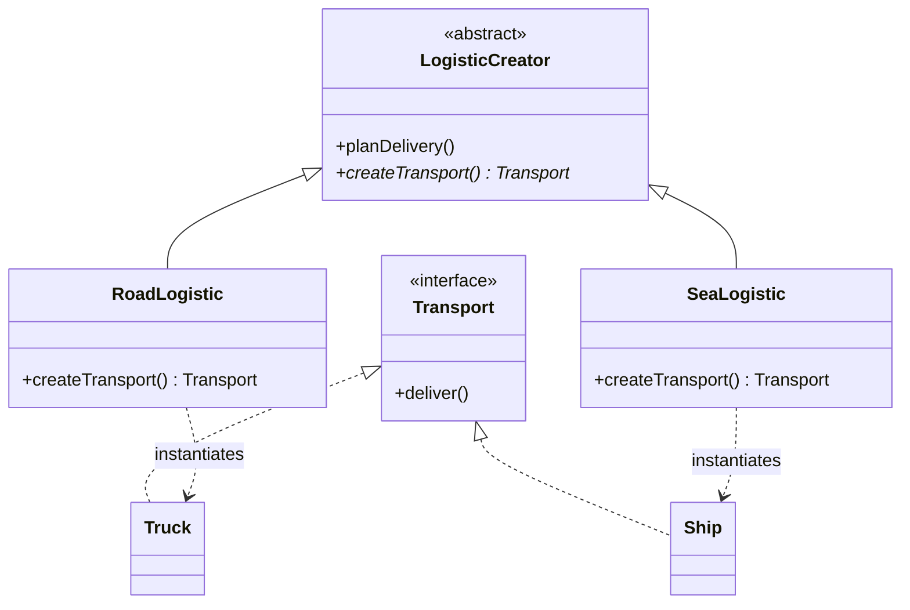
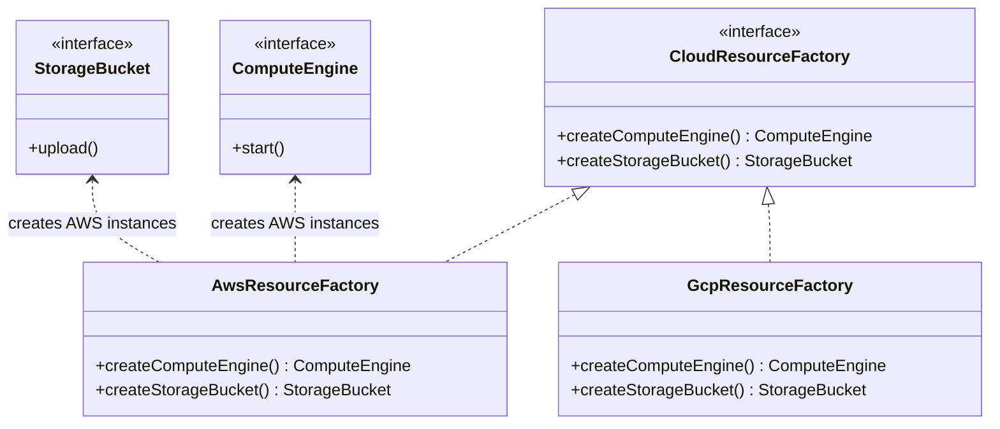
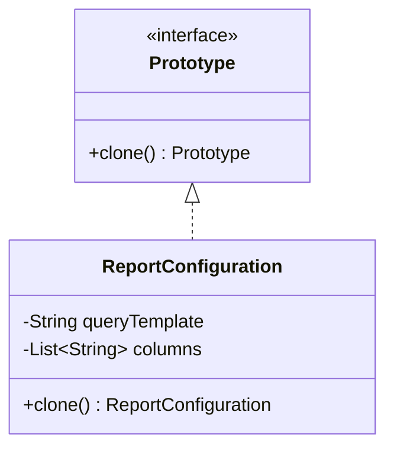

# Module 01: Creational Patterns

Creational design patterns address a fundamental question in software design: **How do we create objects without introducing tight coupling?**

Directly instantiating classes using the `new` operator hardcodes concrete implementations into your codebase, violating the Dependency Inversion Principle. This module explores how to abstract the instantiation process, control object creation lifecycles, and separate a system from how its objects are created.

---

## 1. Singleton Pattern

### Academic Context (Professor's Lecture)
In software engineering, some objects represent unique system components (e.g., database connection pools, configuration managers, hardware driver interfaces). 
Having multiple instances of these objects leads to configuration discrepancies, resource leaks, and inconsistent state.

The Singleton pattern solves this by **ensuring a class has only one instance and providing a global point of access to it**.

### Why Use
* **Resource Conservation**: Avoids the CPU and memory overhead of instantiating resource-heavy objects repeatedly.
* **State Synchronization**: Guarantees that all parts of the application read from the same state (e.g. configuration updates).

### How to Use (Java Demo Code)

#### Mermaid Class Diagram


#### Production-Grade Java 21 Implementation
This implementation uses **Double-Checked Locking** with the `volatile` keyword to ensure thread safety and prevent instruction reordering during initialization.

```java
package com.masterclass.designpatterns.creational.singleton;

import java.sql.Connection;
import java.util.logging.Logger;

/**
 * Thread-safe, lazily initialized Database Connection Manager.
 */
public final class DatabaseConnectionManager {

    private static final Logger LOGGER = Logger.getLogger(DatabaseConnectionManager.class.getName());
    
    // The volatile keyword prevents CPU instruction reordering during instantiation
    private static volatile DatabaseConnectionManager instance;

    // Simulate a connection pool resource
    private final String connectionString;

    // The constructor must be private to prevent direct instantiation
    private DatabaseConnectionManager() {
        // Prevent reflection-based instantiation bypass
        if (instance != null) {
            throw new IllegalStateException("Instance already initialized.");
        }
        
        // Simulate resource-heavy connection pool initialization
        this.connectionString = "jdbc:postgresql://localhost:5432/production_db";
        LOGGER.info("Connection pool successfully initialized for: " + connectionString);
    }

    /**
     * Retrieves the single instance of the class.
     * Uses double-checked locking to minimize synchronization overhead.
     */
    public static DatabaseConnectionManager getInstance() {
        DatabaseConnectionManager localRef = instance;
        if (localRef == null) { // First Check (No Lock)
            synchronized (DatabaseConnectionManager.class) {
                localRef = instance;
                if (localRef == null) { // Second Check (With Lock)
                    instance = localRef = new DatabaseConnectionManager();
                }
            }
        }
        return localRef;
    }

    public String getConnectionString() {
        return connectionString;
    }
}
```

### When to Use
* Managing shared resources like thread pools, cache managers, registry pools, or configuration settings.
* Wrapping stateless utilities that require stateful lifecycle management (like logging frameworks).

### Trade-offs & Design Pitfalls
* **Testing Obstacle**: Singletons introduce global state, making it difficult to write isolated unit tests. You cannot easily mock a singleton without using advanced reflection tricks.
* **Concurrency Bottleneck**: In high-contention environments, synchronization overhead during initialization or access can limit throughput.
* **Anti-pattern: The Class Loader Leak**: In Java, singletons are bound to the ClassLoader. In application servers (like Tomcat), failing to clear singleton instances during hot re-deployments causes memory leaks.

### Socratic Review Questions
1. **Why is the `volatile` keyword necessary in double-checked locking?**
   * *Professor's Explanation*: Without `volatile`, the Java virtual machine (JVM) can reorder instructions during object creation. Specifically, the JVM might allocate memory and assign the instance reference *before* invoking the constructor. A concurrent thread could then read a non-null reference to an uninitialized object, leading to runtime crashes. The `volatile` keyword establishes a memory barrier, ensuring the constructor runs before the reference is published.

---

## 2. Factory Method Pattern

### Academic Context (Professor's Lecture)
Imagine you are building a logistics application. At first, you only support truck transport, so your code directly instantiates `Truck` objects. 
Later, you need to support maritime shipping. If your application code is littered with `new Truck()` statements, adding `Ship` requires modifying existing code, violating the **Open/Closed Principle**.

The Factory Method pattern solves this by **defining an interface for creating an object, but letting subclasses decide which class to instantiate**.

### Why Use
* **Decoupling**: Decouples the client code from concrete product classes.
* **Extensibility**: Adding a new product type requires creating a new creator subclass, without modifying existing client code.

### How to Use (Java Demo Code)

#### Mermaid Class Diagram


#### Production-Grade Java 21 Implementation
This implementation uses Java **Sealed Interfaces** to restrict the inheritance hierarchy of products, providing compile-time type safety.

```java
package com.masterclass.designpatterns.creational.factorymethod;

// Sealed interface ensures only registered classes can implement Transport
public sealed interface Transport permits Truck, Ship {
    void deliver();
}
```

```java
package com.masterclass.designpatterns.creational.factorymethod;

public final class Truck implements Transport {
    @Override
    public void deliver() {
        System.out.println("Delivering cargo by road in a container truck.");
    }
}

public final class Ship implements Transport {
    @Override
    public void deliver() {
        System.out.println("Delivering cargo by sea via container ship.");
    }
}
```

```java
package com.masterclass.designpatterns.creational.factorymethod;

/**
 * Abstract Creator class. Client code interacts with this class instead of concrete classes.
 */
public abstract class LogisticsCreator {

    public void planDelivery() {
        // Delegate object creation to the abstract factory method
        Transport transport = createTransport();
        System.out.println("Planning delivery route...");
        transport.deliver();
    }

    // Factory Method to be implemented by subclasses
    protected abstract Transport createTransport();
}
```

```java
package com.masterclass.designpatterns.creational.factorymethod;

public final class RoadLogistics extends LogisticsCreator {
    @Override
    protected Transport createTransport() {
        return new Truck();
    }
}

public final class SeaLogistics extends LogisticsCreator {
    @Override
    protected Transport createTransport() {
        return new Ship();
    }
}
```

### When to Use
* The creator class cannot anticipate the concrete subclass types it needs to instantiate.
* You want to delegate responsibility for object creation to specialized helper subclasses.

### Trade-offs & Design Pitfalls
* **Class Explosion**: You must create a new creator subclass for every new product subclass, which increases the number of classes in the codebase.
* **Refactoring Overhead**: Changing the factory method interface signature requires updating all subclass implementations.

### Socratic Review Questions
1. **How does the Factory Method pattern differ from a simple Static Factory utility method?**
   * *Professor's Explanation*: A static factory is a single static method on a class that uses dynamic conditions (like `switch` blocks) to return a concrete instance. The Factory Method pattern relies on **polymorphism**. It defines an inheritance structure where subclasses override an abstract method, allowing the application to change instantiation behavior dynamically at runtime.

---

## 3. Abstract Factory Pattern

### Academic Context (Professor's Lecture)
When building systems that support multiple operating platforms or database engines, you must ensure that all instantiated components belong to the same family. 
For example, if you run on Linux, you cannot mix Linux windows with macOS scrollbars.

The Abstract Factory pattern solves this by **providing an interface for creating families of related or dependent objects without specifying their concrete classes**.

### Why Use
* **Consistency Enforcements**: Guarantees that all products created by a factory are compatible with each other.
* **Dependency Abstraction**: Client code interacts only with factory interfaces, decoupling it from concrete product families.

### How to Use (Java Demo Code)

#### Mermaid Class Diagram


#### Production-Grade Java 21 Implementation
```java
package com.masterclass.designpatterns.creational.abstractfactory;

public interface ComputeEngine {
    void startInstance();
}

public interface StorageBucket {
    void storeFile(String name);
}
```

```java
package com.masterclass.designpatterns.creational.abstractfactory;

// AWS concrete products
public final class Ec2ComputeEngine implements ComputeEngine {
    @Override
    public void startInstance() { System.out.println("Launching AWS EC2 instance."); }
}

public final class S3StorageBucket implements StorageBucket {
    @Override
    public void storeFile(String name) { System.out.println("Uploading " + name + " to AWS S3 bucket."); }
}

// GCP concrete products
public final class GceComputeEngine implements ComputeEngine {
    @Override
    public void startInstance() { System.out.println("Launching GCP Compute Engine instance."); }
}

public final class GcsStorageBucket implements StorageBucket {
    @Override
    public void storeFile(String name) { System.out.println("Uploading " + name + " to Google Cloud Storage bucket."); }
}
```

```java
package com.masterclass.designpatterns.creational.abstractfactory;

/**
 * Abstract Factory interface defining the family of cloud resource operations.
 */
public interface CloudResourceFactory {
    ComputeEngine createComputeEngine();
    StorageBucket createStorageBucket();
}
```

```java
package com.masterclass.designpatterns.creational.abstractfactory;

public final class AwsResourceFactory implements CloudResourceFactory {
    @Override
    public ComputeEngine createComputeEngine() { return new Ec2ComputeEngine(); }
    @Override
    public StorageBucket createStorageBucket() { return new S3StorageBucket(); }
}

public final class GcpResourceFactory implements CloudResourceFactory {
    @Override
    public ComputeEngine createComputeEngine() { return new GceComputeEngine(); }
    @Override
    public StorageBucket createStorageBucket() { return new GcsStorageBucket(); }
}
```

### When to Use
* The system needs to support multiple, interchangeable product families.
* You need to enforce product compatibility within a family (e.g. cloud provider resource bundles).

### Trade-offs & Design Pitfalls
* **Rigid Interfaces**: Adding a new product type to the family requires changing the `CloudResourceFactory` interface, which forces you to update all concrete factory subclasses.

---

## 4. Builder Pattern

### Academic Context (Professor's Lecture)
Some objects require multiple parameters during construction, many of which are optional. 
Using constructors for these objects leads to the **Telescoping Constructor** anti-pattern, where classes have multiple overloaded constructors with varying parameter counts. This makes code hard to read and write.

The Builder pattern solves this by **separating the construction of a complex object from its representation, allowing the same construction process to create different representations**.

### Why Use
* **Immutability**: Allows objects to be constructed step-by-step and returned as immutable instances (all fields set to `final`).
* **Readable Code**: Fluent method chaining makes object construction clear and self-documenting.

### How to Use (Java Demo Code)

#### Mermaid Class Diagram
```mermaid
classDiagram
    class HttpRequest {
        -String url
        -String method
        -String body
        -int timeout
        -HttpRequest(Builder builder)
    }
    class Builder {
        -String url
        -String method
        -String body
        -int timeout
        +url(String val) Builder
        +method(String val) Builder
        +body(String val) Builder
        +timeout(int val) Builder
        +build() HttpRequest
    }

    HttpRequest +-- Builder : static inner class
```

#### Production-Grade Java 21 Implementation
```java
package com.masterclass.designpatterns.creational.builder;

import java.util.Map;
import java.util.Collections;

/**
 * Immutable HTTP Request configuration.
 */
public final class HttpRequest {

    private final String url;
    private final String method;
    private final Map<String, String> headers;
    private final String body;
    private final int timeoutMs;

    // Private constructor restricts instantiation to the builder
    private HttpRequest(Builder builder) {
        this.url = builder.url;
        this.method = builder.method;
        this.headers = Collections.unmodifiableMap(builder.headers);
        this.body = builder.body;
        this.timeoutMs = builder.timeoutMs;
    }

    public String getUrl() { return url; }
    public String getMethod() { return method; }
    public Map<String, String> getHeaders() { return headers; }
    public String getBody() { return body; }
    public int getTimeoutMs() { return timeoutMs; }

    /**
     * Fluent Builder class.
     */
    public static class Builder {
        private final String url; // Required parameter
        private String method = "GET"; // Optional defaults
        private java.util.Map<String, String> headers = new java.util.HashMap<>();
        private String body = "";
        private int timeoutMs = 5000;

        public Builder(String url) {
            if (url == null || url.isBlank()) {
                throw new IllegalArgumentException("Target URL cannot be empty.");
            }
            this.url = url;
        }

        public Builder method(String method) {
            this.method = method;
            return this;
        }

        public Builder header(String key, String value) {
            this.headers.put(key, value);
            return this;
        }

        public Builder body(String body) {
            this.body = body;
            return this;
        }

        public Builder timeoutMs(int timeoutMs) {
            this.timeoutMs = timeoutMs;
            return this;
        }

        /**
         * Validates and returns the fully constructed HttpRequest object.
         */
        public HttpRequest build() {
            // Enforce schema checks during object construction
            if (method.equals("POST") && body.isBlank()) {
                throw new IllegalStateException("POST requests must include a payload body.");
            }
            return new HttpRequest(this);
        }
    }
}
```

### When to Use
* Constructing complex objects with many optional parameters.
* Creating immutable domain entities that must be validated before instantiation.

### Trade-offs & Design Pitfalls
* **Boilerplate Code**: You must write a duplicate builder class structure for every entity, increasing code volume.
* **Object Overhead**: Constructing a builder instance before the target object adds minor memory overhead.

---

## 5. Prototype Pattern

### Academic Context (Professor's Lecture)
In some applications, creating objects from scratch involves expensive operations (like loading configurations from a database or fetching file streams). 
If you need a new object that differs only slightly from an existing one, creating it from scratch is inefficient.

The Prototype pattern solves this by **specifying the kinds of objects to create using a prototypical instance, and creating new objects by copying this prototype**.

### Why Use
* **Performance Optimization**: Copying existing objects in memory is faster than instantiating them from scratch and querying databases for configuration.
* **Inheritance Abstraction**: Allows clients to clone dynamic object graphs without coupling to concrete class implementations.

### How to Use (Java Demo Code)

#### Mermaid Class Diagram


#### Production-Grade Java 21 Implementation
```java
package com.masterclass.designpatterns.creational.prototype;

import java.util.ArrayList;
import java.util.List;

public interface Prototype {
    Prototype cloneInstance();
}
```

```java
package com.masterclass.designpatterns.creational.prototype;

import java.util.ArrayList;
import java.util.List;

/**
 * Report Configuration holding complex query elements.
 */
public final class ReportConfiguration implements Prototype {

    private String queryTemplate;
    private List<String> columns;

    public ReportConfiguration(String queryTemplate, List<String> columns) {
        this.queryTemplate = queryTemplate;
        this.columns = columns;
    }

    public void setQueryTemplate(String queryTemplate) {
        this.queryTemplate = queryTemplate;
    }

    public List<String> getColumns() {
        return columns;
    }

    /**
     * Performs a Deep Copy clone of the object.
     */
    @Override
    public ReportConfiguration cloneInstance() {
        // Deep copy the list to prevent shared state side-effects
        List<String> clonedColumns = new ArrayList<>(this.columns);
        return new ReportConfiguration(this.queryTemplate, clonedColumns);
    }

    @Override
    public String toString() {
        return "ReportConfiguration{query='" + queryTemplate + "', columns=" + columns + "}";
    }
}
```

### When to Use
* Instantiating a class is resource-heavy or depends on external systems.
* You need to isolate objects from dynamic configurations during runtime execution.

### Trade-offs & Design Pitfalls
* **Circular Dependencies**: Cloning complex object graphs with circular references can lead to infinite recursion loops.
* **Deep Copy Overhead**: Writing deep copy logic for complex objects with nested collections is error-prone. If you perform a shallow copy instead of a deep copy, nested collections will share state, leading to bugs.

---

## 6. Hands-on Mini-Challenge: Thread-Safe Connection Registry

### Scenario
You are building the database connectivity layer for a financial trading system. The system uses multiple database instances (PostgreSQL for user accounts, Oracle for ledger records, and MongoDB for audit logs). 
You must build a thread-safe registry that:
1. Manages a single instance of each database factory using the **Singleton** pattern.
2. Creates database clients using the **Abstract Factory** pattern.
3. Configures connection parameters dynamically using the **Builder** pattern.
4. Generates secondary connections quickly using the **Prototype** pattern.

### Step 1: Implement the Connection Configurations (Builder)
```java
package com.masterclass.designpatterns.miniproject.model;

public final class DbConfig {
    private final String host;
    private final int port;
    private final String dbName;
    private final String user;

    private DbConfig(Builder builder) {
        this.host = builder.host;
        this.port = builder.port;
        this.dbName = builder.dbName;
        this.user = builder.user;
    }

    public String getHost() { return host; }
    public int getPort() { return port; }
    public String getDbName() { return dbName; }
    public String getUser() { return user; }

    public static class Builder {
        private final String host;
        private int port = 5432;
        private String dbName = "master_db";
        private String user = "admin";

        public Builder(String host) { this.host = host; }
        public Builder port(int port) { this.port = port; this.returnThis(); return this; }
        private Builder returnThis() { return this; } // Helper
        public Builder dbName(String dbName) { this.dbName = dbName; return this; }
        public Builder user(String user) { this.user = user; return this; }
        public DbConfig build() { return new DbConfig(this); }
    }
}
```

### Step 2: Implement Client Interfaces (Abstract Factory & Prototype)
```java
package com.masterclass.designpatterns.miniproject.client;

import com.masterclass.designpatterns.creational.prototype.Prototype;

public interface DbClient extends Prototype {
    void executeQuery(String query);
    @Override
    DbClient cloneInstance();
}
```

```java
package com.masterclass.designpatterns.miniproject.client;

public final class PostgresClient implements DbClient {
    private final String connectionUri;

    public PostgresClient(String host, int port, String db) {
        this.connectionUri = "postgresql://" + host + ":" + port + "/" + db;
    }

    @Override
    public void executeQuery(String query) {
        System.out.println("Postgres execution on: " + connectionUri + " Query: " + query);
    }

    @Override
    public DbClient cloneInstance() {
        return new PostgresClient(this.connectionUri, 5432, "");
    }
}
```

### Step 3: Implement connection factories
```java
package com.masterclass.designpatterns.miniproject.factory;

import com.masterclass.designpatterns.miniproject.client.DbClient;
import com.masterclass.designpatterns.miniproject.client.PostgresClient;
import com.masterclass.designpatterns.miniproject.model.DbConfig;

public interface ConnectionFactory {
    DbClient createConnection(DbConfig config);
}

public final class PostgresConnectionFactory implements ConnectionFactory {
    @Override
    public DbClient createConnection(DbConfig config) {
        return new PostgresClient(config.getHost(), config.getPort(), config.getDbName());
    }
}
```

### Step 4: Implement Central Registry (Singleton)
```java
package com.masterclass.designpatterns.miniproject.registry;

import com.masterclass.designpatterns.miniproject.factory.ConnectionFactory;
import com.masterclass.designpatterns.miniproject.factory.PostgresConnectionFactory;
import java.util.HashMap;
import java.util.Map;

public final class FactoryRegistry {

    private static volatile FactoryRegistry instance;
    private final Map<String, ConnectionFactory> factories = new HashMap<>();

    private FactoryRegistry() {
        // Register default factories
        factories.put("POSTGRES", new PostgresConnectionFactory());
    }

    public static FactoryRegistry getInstance() {
        FactoryRegistry localRef = instance;
        if (localRef == null) {
            synchronized (FactoryRegistry.class) {
                localRef = instance;
                if (localRef == null) {
                    instance = localRef = new FactoryRegistry();
                }
            }
        }
        return localRef;
    }

    public ConnectionFactory getFactory(String type) {
        ConnectionFactory factory = factories.get(type);
        if (factory == null) {
            throw new IllegalArgumentException("Unknown factory type: " + type);
        }
        return factory;
    }
}
```

### Step 5: Verify the Implementation
```java
package com.masterclass.designpatterns.miniproject;

import com.masterclass.designpatterns.miniproject.client.DbClient;
import com.masterclass.designpatterns.miniproject.factory.ConnectionFactory;
import com.masterclass.designpatterns.miniproject.model.DbConfig;
import com.masterclass.designpatterns.miniproject.registry.FactoryRegistry;

public class CreationalPatternsMain {
    public static void main(String[] args) {
        // Retrieve registry singleton
        FactoryRegistry registry = FactoryRegistry.getInstance();

        // Build connection parameters dynamically
        DbConfig config = new DbConfig.Builder("192.168.1.10")
                .port(5432)
                .dbName("accounting_ledger")
                .build();

        // Retrieve factory and create database client
        ConnectionFactory factory = registry.getFactory("POSTGRES");
        DbClient client = factory.createConnection(config);
        
        client.executeQuery("SELECT * FROM payments;");

        // Clone connection using the Prototype pattern
        DbClient backupClient = client.cloneInstance();
        System.out.println("Connection successfully cloned.");
    }
}
```
This challenge demonstrates how creational design patterns collaborate to manage resource allocation, configuration validation, and dynamic runtime instantiation.
