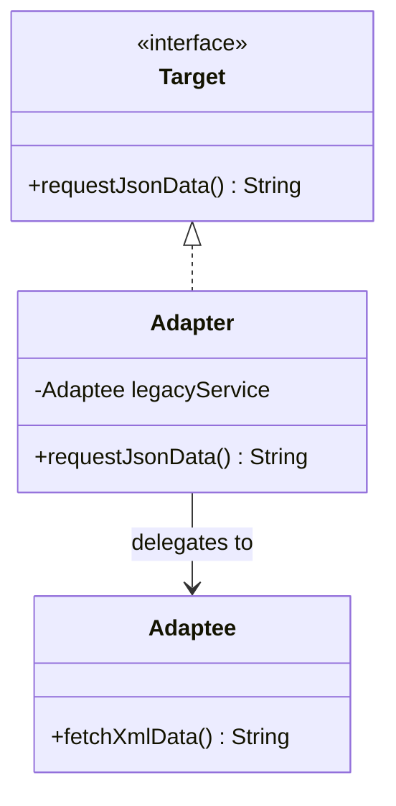
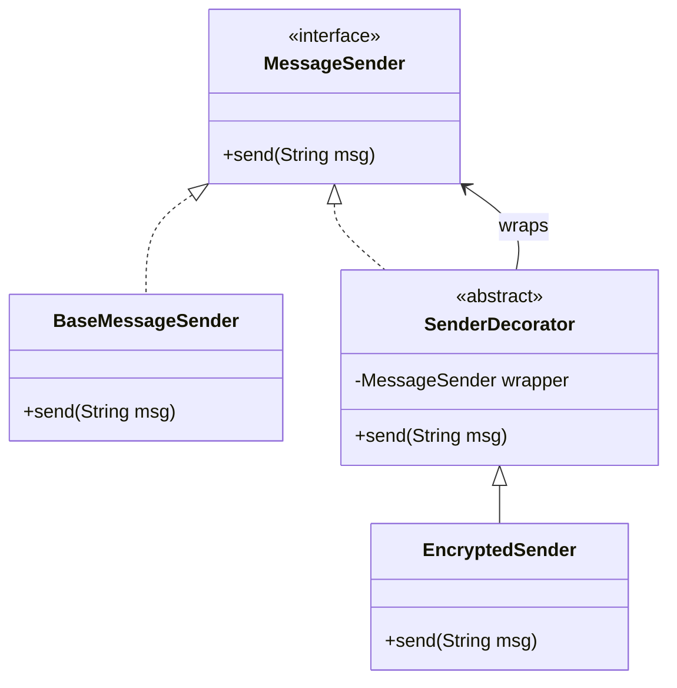
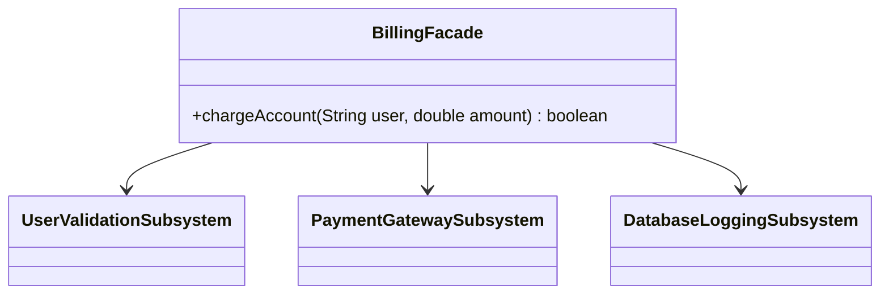
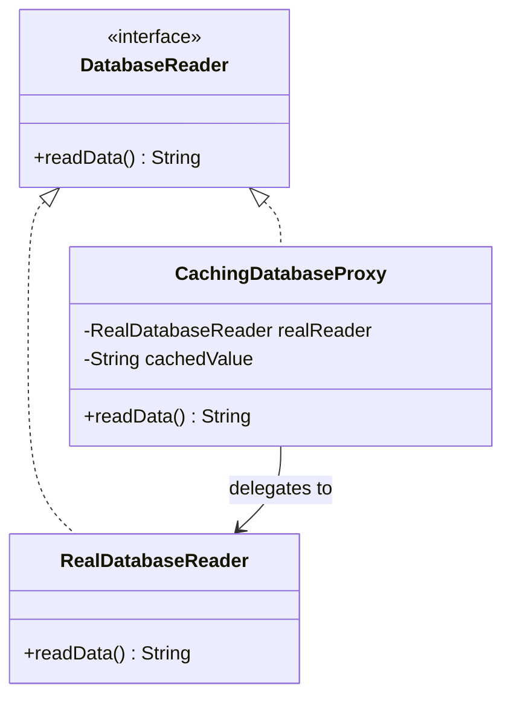

# Module 02: Structural Patterns (Part 1)

Structural design patterns address a critical challenge in software architecture: **How do we compose classes and objects to form larger, more flexible structures?**

These patterns help ensure that when system requirements change, you don't need to rebuild your class inheritance hierarchy. Instead, they focus on using object composition and interface delegation to combine components cleanly.

---

## 1. Adapter Pattern

### Academic Context (Professor's Lecture)
Imagine you are integrating a third-party payment gateway into your e-commerce application. Your application is designed to use an `OrderProcessor` interface. However, the third-party SDK uses a completely different set of method signatures. 
You cannot modify their code, and changing your application interfaces to match their SDK would break other integrations.

The Adapter pattern solves this by **converting the interface of a class into another interface that clients expect, allowing classes with incompatible interfaces to work together**.

### Why Use
* **Interoperability**: Connects incompatible legacy code or third-party libraries to your application.
* **Open/Closed Principle**: Integrates new APIs without modifying existing application logic.

### How to Use (Java Demo Code)

#### Mermaid Class Diagram


#### Production-Grade Java 21 Implementation
This example translates XML payload data from a legacy service into JSON format expected by modern client components.

```java
package com.masterclass.designpatterns.structural.adapter;

/**
 * Target interface expected by the application.
 */
public interface InvoiceTarget {
    String getInvoiceAsJson();
}
```

```java
package com.masterclass.designpatterns.structural.adapter;

/**
 * Adaptee class (Legacy or Third-Party SDK) with an incompatible interface.
 */
public final class LegacyXmlInvoiceService {
    public String getRawXmlInvoice() {
        return "<invoice><id>1001</id><amount>250.00</amount></invoice>";
    }
}
```

```java
package com.masterclass.designpatterns.structural.adapter;

/**
 * Adapter class translates the incompatible XML interface into JSON format.
 */
public final class InvoiceAdapter implements InvoiceTarget {

    private final LegacyXmlInvoiceService legacyService;

    public InvoiceAdapter(LegacyXmlInvoiceService legacyService) {
        this.legacyService = legacyService;
    }

    @Override
    public String getInvoiceAsJson() {
        String xml = legacyService.getRawXmlInvoice();
        // Convert XML to JSON (simplified string parsing for demo purposes)
        String id = xml.substring(xml.indexOf("<id>") + 4, xml.indexOf("</id>"));
        String amount = xml.substring(xml.indexOf("<amount>") + 8, xml.indexOf("</amount>"));
        
        return String.format("{\"invoiceId\": %s, \"chargeAmount\": %s}", id, amount);
    }
}
```

### When to Use
* Integrating a third-party library or legacy system whose interface does not match your application's design.
* Reusing multiple existing subclasses that lack common interface methods.

### Trade-offs & Design Pitfalls
* **Cognitive Load**: Adds complexity by introducing new adapter classes and interfaces.
* **Performance Cost**: Introduces minor execution latency due to data conversions and extra delegation layers.

### Socratic Review Questions
1. **What is the difference between Class Adapters and Object Adapters?**
   * *Professor's Explanation*: A **Class Adapter** uses multiple inheritance (or extending a class and implementing interfaces) to adapt interfaces. An **Object Adapter** uses **composition**, wrapping the incompatible object (Adaptee) inside the Adapter and delegating calls to it. In Java, because class-level multiple inheritance is forbidden, we use Object Adapters, which is also cleaner because it decouples the Adapter from the Adaptee's subclass hierarchy.

---

## 2. Decorator Pattern

### Academic Context (Professor's Lecture)
In object-oriented design, developers often use subclass inheritance to extend class behavior. 
However, inheritance is static and applies at compile-time. If you have a file streaming class and want to add compression, encryption, and caching, using inheritance forces you to create subclasses for every combination (e.g., `CompressedEncryptedFileStream`, `CachedEncryptedFileStream`), leading to class explosion.

The Decorator pattern solves this by **attaching additional responsibilities to an object dynamically at runtime, providing a flexible alternative to subclassing for extending functionality**.

### Why Use
* **Dynamic Extension**: Add or remove behaviors from individual objects at runtime without affecting other instances.
* **Single Responsibility Principle**: Break down complex classes into smaller, single-purpose decorator wrappers (e.g., separating compression logic from encryption).

### How to Use (Java Demo Code)

#### Mermaid Class Diagram


#### Production-Grade Java 21 Implementation
```java
package com.masterclass.designpatterns.structural.decorator;

public interface DataStream {
    void write(String data);
}
```

```java
package com.masterclass.designpatterns.structural.decorator;

public final class SimpleDataStream implements DataStream {
    @Override
    public void write(String data) {
        System.out.println("Writing plain data to disk: " + data);
    }
}
```

```java
package com.masterclass.designpatterns.structural.decorator;

/**
 * Base decorator class implementing the same component interface.
 */
public abstract class DataStreamDecorator implements DataStream {
    protected final DataStream wrappedStream;

    protected DataStreamDecorator(DataStream wrappedStream) {
        this.wrappedStream = wrappedStream;
    }

    @Override
    public void write(String data) {
        wrappedStream.write(data);
    }
}
```

```java
package com.masterclass.designpatterns.structural.decorator;

import java.util.Base64;

public final class EncryptionDecorator extends DataStreamDecorator {

    public EncryptionDecorator(DataStream wrappedStream) {
        super(wrappedStream);
    }

    @Override
    public void write(String data) {
        String encrypted = Base64.getEncoder().encodeToString(data.getBytes());
        System.out.println("Applying base64 encryption layer...");
        super.write(encrypted);
    }
}
```

### When to Use
* You need to add behaviors to objects dynamically at runtime without breaking existing code.
* Extending behavior via subclass inheritance is impossible (e.g. when working with `final` classes).

---

## 3. Facade Pattern

### Academic Context (Professor's Lecture)
As applications grow, they often accumulate complex subsystems (e.g. payment processors, validation checks, accounting ledger writers, security gates). 
If client code must interact with each subsystem class directly, the client becomes tightly coupled to those subsystems, making the code hard to maintain and update.

The Facade pattern solves this by **providing a unified, simplified interface to a set of interfaces in a subsystem, making the subsystem easier to use**.

### Why Use
* **Decoupling**: insulates clients from complex subsystem classes, allowing subsystems to evolve independently.
* **Ease of Use**: Exposes simple, high-level methods that handle complex orchestrations under the hood.

### How to Use (Java Demo Code)

#### Mermaid Class Diagram


#### Production-Grade Java 21 Implementation
```java
package com.masterclass.designpatterns.structural.facade;

// Subsystem classes
class UserValidator {
    public boolean isValidUser(String userId) { return true; }
}
class LedgerGateway {
    public void logTransaction(String userId, double val) {
        System.out.println("Logged $" + val + " debit event for user: " + userId);
    }
}
class BankAcquirer {
    public boolean processDebit(double val) { return true; }
}
```

```java
package com.masterclass.designpatterns.structural.facade;

/**
 * Facade class simplifying subsystem interactions for clients.
 */
public final class PaymentBillingFacade {
    private final UserValidator validator = new UserValidator();
    private final LedgerGateway ledger = new LedgerGateway();
    private final BankAcquirer acquirer = new BankAcquirer();

    /**
     * Exposes a simple, high-level method to charge an account.
     */
    public boolean processAccountCharge(String userId, double amount) {
        System.out.println("Facade initiating billing flow...");
        if (!validator.isValidUser(userId)) {
            System.err.println("Transaction aborted: Invalid user profile.");
            return false;
        }
        if (!acquirer.processDebit(amount)) {
            System.err.println("Transaction aborted: Bank debit rejected.");
            return false;
        }
        ledger.logTransaction(userId, amount);
        return true;
    }
}
```

### When to Use
* You want to provide a simple interface to a complex, multi-class subsystem.
* You need to decouple your client layers from concrete subsystem implementations.

---

## 4. Proxy Pattern

### Academic Context (Professor's Lecture)
Some operations are expensive to execute or require security checks (e.g. loading large images, checking user permissions, or making remote network calls). 
Instantiating these resources eagerly or executing them without access checks can overload your system.

The Proxy pattern solves this by **providing a placeholder or surrogate for another object to control access to it (e.g. lazily, securely, or via cache)**.

### Why Use
* **Resource Optimization (Virtual Proxy)**: Postpones instantiating resource-heavy objects until they are actually needed.
* **Security Control (Protection Proxy)**: Intercepts client calls to check permissions before delegating to the target object.
* **Caching Layer (Smart Reference)**: Serves cached results for duplicate requests, avoiding expensive database or network calls.

### How to Use (Java Demo Code)

#### Mermaid Class Diagram


#### Production-Grade Java 21 Implementation
This example implements a **Caching and Access Control Proxy** that intercept database reads to return cached results.

```java
package com.masterclass.designpatterns.structural.proxy;

public interface DatabaseQuery {
    String executeQuery(String sql);
}
```

```java
package com.masterclass.designpatterns.structural.proxy;

public final class RealDatabaseQuery implements DatabaseQuery {
    @Override
    public String executeQuery(String sql) {
        // Simulate an expensive database operation
        System.out.println("Connecting to database and running query: " + sql);
        return "RowData{payload='Active User Records'}";
    }
}
```

```java
package com.masterclass.designpatterns.structural.proxy;

import java.util.HashMap;
import java.util.Map;

/**
 * Caching Proxy controls access to the RealDatabaseQuery implementation.
 */
public final class SecureCachingDatabaseProxy implements DatabaseQuery {

    private final DatabaseQuery realService;
    private final Map<String, String> cache = new HashMap<>();
    private final String clientRole;

    public SecureCachingDatabaseProxy(DatabaseQuery realService, String clientRole) {
        this.realService = realService;
        this.clientRole = clientRole;
    }

    @Override
    public String executeQuery(String sql) {
        // Enforce access control checks (Protection Proxy)
        if (!"ADMIN".equalsIgnoreCase(clientRole)) {
            throw new SecurityException("Access Denied: Query execution requires ADMIN privileges.");
        }

        // Cache lookup (Virtual / Caching Proxy)
        if (cache.containsKey(sql)) {
            System.out.println("Returning cached results for query: " + sql);
            return cache.get(sql);
        }

        // Delegate to the real service
        String result = realService.executeQuery(sql);
        cache.put(sql, result);
        return result;
    }
}
```

### When to Use
* Lazily loading expensive objects (Virtual Proxy).
* Implementing authorization rules for service methods (Protection Proxy).
* Caching results of expensive network or database queries (Caching Proxy).

### Trade-offs & Design Pitfalls
* **Increased Latency**: Adding proxy checks can introduce minor latency to fast operations.
* **Obfuscation**: Proxies hide the true nature of underlying objects, which can make debugging stack traces difficult.

---

## 5. Hands-on Mini-Challenge: Secure Streaming Pipeline

### Scenario
You are building the video ingest pipeline for a streaming platform. The platform receives raw video frames. 
Before storing frames, the pipeline must:
1. Translate incoming raw video feeds from a legacy stream source using the **Adapter** pattern.
2. Inspect client access rights using the **Proxy** pattern.
3. Apply encryption and hashing layers dynamically using the **Decorator** pattern.
4. Orchestrate these tasks behind a single pipeline facade using the **Facade** pattern.

### Step 1: Implement Core Interfaces and Adapters
```java
package com.masterclass.designpatterns.miniproject.video;

public interface VideoStream {
    String readFrame();
}
```

```java
package com.masterclass.designpatterns.miniproject.video;

// Adaptee
public class LegacyRtpStream {
    public byte[] receiveRtpPackets() {
        return "FRAME_DATA_RAW".getBytes();
    }
}

// Adapter
public final class VideoStreamAdapter implements VideoStream {
    private final LegacyRtpStream legacyStream;

    public VideoStreamAdapter(LegacyRtpStream legacyStream) {
        this.legacyStream = legacyStream;
    }

    @Override
    public String readFrame() {
        byte[] data = legacyStream.receiveRtpPackets();
        return new String(data) + "_ADAPTED";
    }
}
```

### Step 2: Implement Stream Decorators
```java
package com.masterclass.designpatterns.miniproject.video;

public abstract class VideoDecorator implements VideoStream {
    protected final VideoStream wrappedStream;

    protected VideoDecorator(VideoStream wrappedStream) {
        this.wrappedStream = wrappedStream;
    }

    @Override
    public String readFrame() {
        return wrappedStream.readFrame();
    }
}

public final class EncryptedVideoDecorator extends VideoDecorator {
    public EncryptedVideoDecorator(VideoStream wrappedStream) {
        super(wrappedStream);
    }

    @Override
    public String readFrame() {
        String base = super.readFrame();
        return "ENCRYPTED(" + base + ")";
    }
}
```

### Step 3: Implement Security Proxy
```java
package com.masterclass.designpatterns.miniproject.video;

public final class SecureVideoProxy implements VideoStream {
    private final VideoStream realStream;
    private final String clientToken;

    public SecureVideoProxy(VideoStream realStream, String clientToken) {
        this.realStream = realStream;
        this.clientToken = clientToken;
    }

    @Override
    public String readFrame() {
        if (!"VALID_SECURE_TOKEN".equals(clientToken)) {
            throw new SecurityException("Access Denied: Invalid stream access token.");
        }
        return realStream.readFrame();
    }
}
```

### Step 4: Implement Orchestration Facade
```java
package com.masterclass.designpatterns.miniproject.video;

public final class VideoIngestFacade {

    public String processIngestPipeline(LegacyRtpStream rawStream, String token) {
        System.out.println("Initializing video ingest pipeline...");
        
        // 1. Adapt legacy stream
        VideoStream adapted = new VideoStreamAdapter(rawStream);
        
        // 2. Wrap with security proxy
        VideoStream secureStream = new SecureVideoProxy(adapted, token);
        
        // 3. Decorate with encryption
        VideoStream pipeline = new EncryptedVideoDecorator(secureStream);
        
        return pipeline.readFrame();
    }
}
```

### Step 5: Verify the Pipeline
```java
package com.masterclass.designpatterns.miniproject;

import com.masterclass.designpatterns.miniproject.video.LegacyRtpStream;
import com.masterclass.designpatterns.miniproject.video.VideoIngestFacade;

public class StructuralPatternsMain {
    public static void main(String[] args) {
        LegacyRtpStream legacyStream = new LegacyRtpStream();
        VideoIngestFacade facade = new VideoIngestFacade();

        // Run successful pipeline
        String result = facade.processIngestPipeline(legacyStream, "VALID_SECURE_TOKEN");
        System.out.println("Pipeline Result (Expected: ENCRYPTED(FRAME_DATA_RAW_ADAPTED)):");
        System.out.println(" >>> " + result);

        // Run failing pipeline to test security proxy checks
        try {
            facade.processIngestPipeline(legacyStream, "INVALID_TOKEN");
        } catch (SecurityException e) {
            System.out.println("Pipeline successfully blocked unauthorized request: " + e.getMessage());
        }
    }
}
```
This challenge demonstrates how structural design patterns collaborate to build a modular data processing pipeline.
