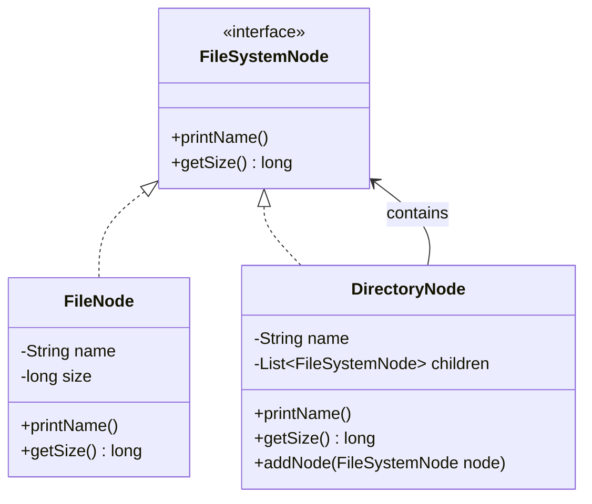
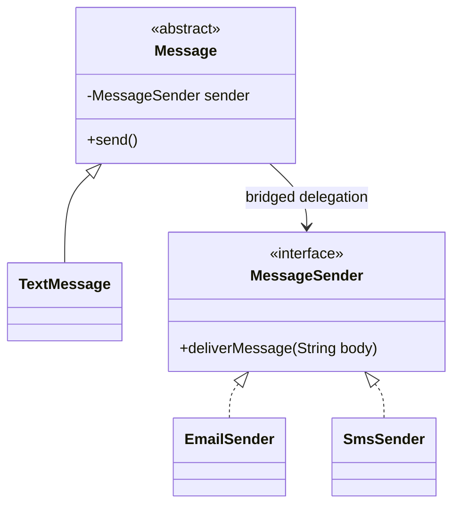
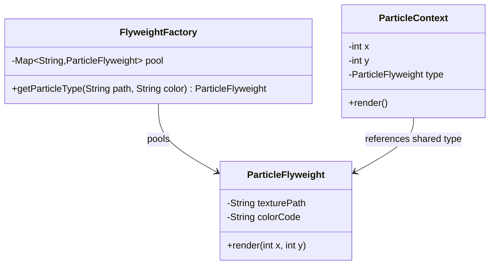

# Module 03: Structural Patterns (Part 2)

This module continues the analysis of structural composition patterns. It covers the Composite, Bridge, and Flyweight patterns, focusing on managing complex hierarchies, decoupling abstractions from platform implementations, and optimizing memory usage through object sharing.

---

## 1. Composite Pattern

### Academic Context (Professor's Lecture)
In software development, we often work with hierarchical tree structures (e.g. file directories, organizational structures, UI components). 
If client code must distinguish between a single item (a file) and a container of items (a directory) when traversing the tree, the code becomes littered with type checks and casts, making it rigid and hard to maintain.

The Composite pattern solves this by **allowing you to treat individual objects and compositions of objects uniformly**.

### Why Use
* **Uniform Interface**: Client code can treat single objects and composite groups of objects identically, reducing conditional branching.
* **Open/Closed Principle**: You can introduce new component types into the tree without breaking existing client traversal logic.

### How to Use (Java Demo Code)

#### Mermaid Class Diagram


#### Production-Grade Java 21 Implementation
This implementation models a file system where directories can contain both files and other subdirectories.

```java
package com.masterclass.designpatterns.structural.composite;

public interface FileSystemNode {
    String getName();
    long getSizeBytes();
    void render(String indentation);
}
```

```java
package com.masterclass.designpatterns.structural.composite;

/**
 * Leaf component: Represents an individual file.
 */
public final class FileNode implements FileSystemNode {
    private final String name;
    private final long sizeBytes;

    public FileNode(String name, long sizeBytes) {
        this.name = name;
        this.sizeBytes = sizeBytes;
    }

    @Override
    public String getName() { return name; }

    @Override
    public long getSizeBytes() { return sizeBytes; }

    @Override
    public void render(String indentation) {
        System.out.println(indentation + "- File: " + name + " (" + sizeBytes + " bytes)");
    }
}
```

```java
package com.masterclass.designpatterns.structural.composite;

import java.util.ArrayList;
import java.util.List;

/**
 * Composite component: Represents a directory containing files or subdirectories.
 */
public final class DirectoryNode implements FileSystemNode {
    private final String name;
    private final List<FileSystemNode> children = new ArrayList<>();

    public DirectoryNode(String name) {
        this.name = name;
    }

    public void addComponent(FileSystemNode node) {
        children.add(node);
    }

    @Override
    public String getName() { return name; }

    @Override
    public long getSizeBytes() {
        // Recursively sum sizes of all child nodes
        return children.stream()
                .mapToLong(FileSystemNode::getSizeBytes)
                .sum();
    }

    @Override
    public void render(String indentation) {
        System.out.println(indentation + "+ Directory: " + name + "/");
        for (FileSystemNode node : children) {
            node.render(indentation + "  ");
        }
    }
}
```

### When to Use
* Implementing tree structures like nested menus, file systems, or organizational charts.
* You want client code to ignore the difference between leaf and composite elements when traversing hierarchies.

### Trade-offs & Design Pitfalls
* **Over-Generalization**: To treat all nodes uniformly, you must define common methods (like `add()` or `remove()`) on the base interface. This can lead to interface pollution, forcing leaf nodes (which cannot have children) to implement empty methods or throw `UnsupportedOperationException` at runtime.

---

## 2. Bridge Pattern

### Academic Context (Professor's Lecture)
When an abstraction has multiple possible implementations, the standard approach is to use inheritance. 
However, inheritance binds the abstraction to its implementation. For example, if you have a `Notification` class that can send messages via `Email` or `SMS`, and you need to support new notification types (`UrgentNotification`, `SilentNotification`), using inheritance creates a combinatorial explosion of subclasses (e.g. `UrgentEmailNotification`, `UrgentSmsNotification`, `SilentEmailNotification`, etc.).

The Bridge pattern solves this by **decoupling an abstraction from its implementation so that the two can vary independently**.

### Why Use
* **Avoid Inheritance Explosion**: Replaces multi-level inheritance hierarchies with clean object composition.
* **Orthogonal Dimension Scaling**: Allows you to modify or extend abstractions and implementations independently.

### How to Use (Java Demo Code)

#### Mermaid Class Diagram


#### Production-Grade Java 21 Implementation
```java
package com.masterclass.designpatterns.structural.bridge;

/**
 * Implementation interface (the platform driver side).
 */
public interface MessageSender {
    void deliverMessage(String textPayload);
}
```

```java
package com.masterclass.designpatterns.structural.bridge;

public final class EmailSender implements MessageSender {
    @Override
    public void deliverMessage(String textPayload) {
        System.out.println("SMTP: Delivering email payload -> " + textPayload);
    }
}

public final class SmsSender implements MessageSender {
    @Override
    public void deliverMessage(String textPayload) {
        System.out.println("SMS: Delivering text payload -> " + textPayload);
    }
}
```

```java
package com.masterclass.designpatterns.structural.bridge;

/**
 * Abstraction class containing a reference to the bridge interface.
 */
public abstract class Message {
    protected final MessageSender sender;

    protected Message(MessageSender sender) {
        this.sender = sender;
    }

    public abstract void send(String content);
}
```

```java
package com.masterclass.designpatterns.structural.bridge;

public final class CriticalMessage extends Message {

    public CriticalMessage(MessageSender sender) {
        super(sender);
    }

    @Override
    public void send(String content) {
        String formatted = "[URGENT] " + content;
        sender.deliverMessage(formatted);
    }
}
```

### When to Use
* You need to share implementations across multiple independent classes.
* You want to avoid compile-time coupling between an abstraction and its concrete implementations.
* You have hierarchies that must be extended in multiple directions simultaneously.

---

## 3. Flyweight Pattern

### Academic Context (Professor's Lecture)
In high-throughput systems (like text editors or game engines), you may need to instantiate millions of similar objects (e.g. formatting characters on a page, or trees in a forest). 
If each object holds its own copy of heavy metadata (like font styles or textures), the JVM will quickly run out of memory.

The Flyweight pattern solves this by **supporting large numbers of fine-grained objects efficiently through sharing**. It splits object state into:
1. **Intrinsic State**: Immutable, shared metadata (e.g., character font, tree textures) stored once in a Flyweight instance.
2. **Extrinsic State**: Unique, variable data (e.g., document page coordinate, tree position coordinate) stored in the client context.

### Why Use
* **Memory Optimization**: Significantly reduces heap memory usage by sharing large, immutable metadata objects.
* **GC Pressure Reduction**: Reusing a small pool of flyweight objects reduces garbage collection frequency.

### How to Use (Java Demo Code)

#### Mermaid Class Diagram


#### Production-Grade Java 21 Implementation
```java
package com.masterclass.designpatterns.structural.flyweight;

/**
 * Flyweight class holding intrinsic state (heavy immutable metadata).
 */
public final class ParticleFlyweight {
    private final String texture;
    private final String colorHexCode;

    public ParticleFlyweight(String texture, String colorHexCode) {
        this.texture = texture;
        this.colorHexCode = colorHexCode;
    }

    public void drawParticle(int coordinateX, int coordinateY) {
        // Uses intrinsic state combined with passed extrinsic state
        System.out.println("Rendering texture '" + texture + "' [" + colorHexCode 
                + "] at coordinates (" + coordinateX + ", " + coordinateY + ")");
    }
}
```

```java
package com.masterclass.designpatterns.structural.flyweight;

import java.util.HashMap;
import java.util.Map;

/**
 * Flyweight Factory ensures Flyweights are pooled and shared.
 */
public final class ParticleFlyweightFactory {
    private static final Map<String, ParticleFlyweight> POOL = new HashMap<>();

    public static ParticleFlyweight getParticleType(String texture, String colorHexCode) {
        String key = texture + "_" + colorHexCode;
        ParticleFlyweight flyweight = POOL.get(key);
        if (flyweight == null) {
            flyweight = new ParticleFlyweight(texture, colorHexCode);
            POOL.put(key, flyweight);
            System.out.println("Creating new Flyweight instance for type: " + key);
        }
        return flyweight;
    }

    public static int getPoolSize() {
        return POOL.size();
    }
}
```

```java
package com.masterclass.designpatterns.structural.flyweight;

/**
 * Client context class containing unique extrinsic state.
 */
public final class ParticleContext {
    private final int x;
    private final int y;
    private final ParticleFlyweight sharedType; // Reference to the pooled flyweight

    public ParticleContext(int x, int y, ParticleFlyweight sharedType) {
        this.x = x;
        this.y = y;
        this.sharedType = sharedType;
    }

    public void render() {
        // Pass extrinsic state (x, y) to the flyweight method
        sharedType.drawParticle(x, y);
    }
}
```

### When to Use
* Instantiating millions of small objects that saturate the JVM heap.
* The objects share large amounts of duplicate, immutable state that can be extracted.

### Trade-offs & Design Pitfalls
* **Extrinsic State Complexity**: Client code must manage and pass extrinsic state to flyweight methods, increasing code complexity.
* **Lookup Overhead**: Querying the flyweight factory pool adds minor CPU overhead, which can impact performance if accessed in tight loops.

---

## 4. Hands-on Mini-Challenge: Document Rendering Engine

### Scenario
You are building a rich text document layout editor. 
A document contains a hierarchy of chapters, sections, paragraphs, and characters. 
To optimize the engine:
1. Model the document hierarchy using the **Composite** pattern, allowing uniform rendering of directories and paragraphs.
2. Separate the formatting logic (font styling, colors) from the character values.
3. Use the **Flyweight** pattern to share character formatting styles, preventing memory bloat when loading large documents.
4. Decouple output format renderers (HTML renderer vs. PDF renderer) using the **Bridge** pattern.

### Step 1: Implement Bridge Renderers
```java
package com.masterclass.designpatterns.miniproject.document;

public interface DocumentOutputRenderer {
    void renderCharacter(char c, String font, int size);
    void renderHeader(String text);
}

public final class HtmlRenderer implements DocumentOutputRenderer {
    @Override
    public void renderCharacter(char c, String font, int size) {
        System.out.println("<span style='font-family:" + font + ";font-size:" + size + "px;'>" + c + "</span>");
    }

    @Override
    public void renderHeader(String text) {
        System.out.println("<h1>" + text + "</h1>");
    }
}
```

### Step 2: Implement Character Formatting Flyweights
```java
package com.masterclass.designpatterns.miniproject.document;

import java.util.HashMap;
import java.util.Map;

// Intrinsic Flyweight State
public final class CharacterFormat {
    private final String font;
    private final int size;

    public CharacterFormat(String font, int size) {
        this.font = font;
        this.size = size;
    }

    public String getFont() { return font; }
    public int getSize() { return size; }
}

// Flyweight Factory
public final class FormatFactory {
    private static final Map<String, CharacterFormat> CACHE = new HashMap<>();

    public static CharacterFormat getFormat(String font, int size) {
        String key = font + "_" + size;
        return CACHE.computeIfAbsent(key, k -> new CharacterFormat(font, size));
    }

    public static int getCacheSize() { return CACHE.size(); }
}
```

### Step 3: Implement Composite Document Nodes
```java
package com.masterclass.designpatterns.miniproject.document;

import java.util.ArrayList;
import java.util.List;

public interface DocumentNode {
    void display(DocumentOutputRenderer renderer);
}

// Leaf Component using Flyweights
public final class CharacterNode implements DocumentNode {
    private final char value;
    private final CharacterFormat format; // Reference to pooled flyweight

    public CharacterNode(char value, CharacterFormat format) {
        this.value = value;
        this.format = format;
    }

    @Override
    public void display(DocumentOutputRenderer renderer) {
        renderer.renderCharacter(value, format.getFont(), format.getSize());
    }
}

// Composite Component
public final class ParagraphNode implements DocumentNode {
    private final String headerText;
    private final List<DocumentNode> children = new ArrayList<>();

    public ParagraphNode(String headerText) {
        this.headerText = headerText;
    }

    public void addNode(DocumentNode node) {
        children.add(node);
    }

    @Override
    public void display(DocumentOutputRenderer renderer) {
        renderer.renderHeader(headerText);
        for (DocumentNode node : children) {
            node.display(renderer);
        }
    }
}
```

### Step 4: Verify the Implementation
```java
package com.masterclass.designpatterns.miniproject;

import com.masterclass.designpatterns.miniproject.document.*;

public class StructuralPart2Main {
    public static void main(String[] args) {
        // Instantiate target output renderer (Bridge implementation)
        DocumentOutputRenderer renderer = new HtmlRenderer();

        // Create composite paragraph
        ParagraphNode paragraph = new ParagraphNode("Introduction to Structural Patterns");

        // Retrieve format flyweights
        CharacterFormat arial12 = FormatFactory.getFormat("Arial", 12);
        CharacterFormat arial12Duplicate = FormatFactory.getFormat("Arial", 12);

        // Add characters to paragraph (reusing flyweight formatting)
        paragraph.addNode(new CharacterNode('D', arial12));
        paragraph.addNode(new CharacterNode('e', arial12Duplicate));
        paragraph.addNode(new CharacterNode('s', arial12));
        paragraph.addNode(new CharacterNode('i', arial12));
        paragraph.addNode(new CharacterNode('g', arial12));
        paragraph.addNode(new CharacterNode('n', arial12));

        // Render document
        paragraph.display(renderer);

        // Verify Flyweight caching performance
        System.out.println("\nFlyweight Caching Verification:");
        System.out.println(" - Expected Cache Size: 1");
        System.out.println(" - Actual Cache Size: " + FormatFactory.getCacheSize());
    }
}
```
This challenge demonstrates how to combine structural patterns (Composite, Bridge, Flyweight) to build a memory-efficient, output-agnostic document rendering engine.
