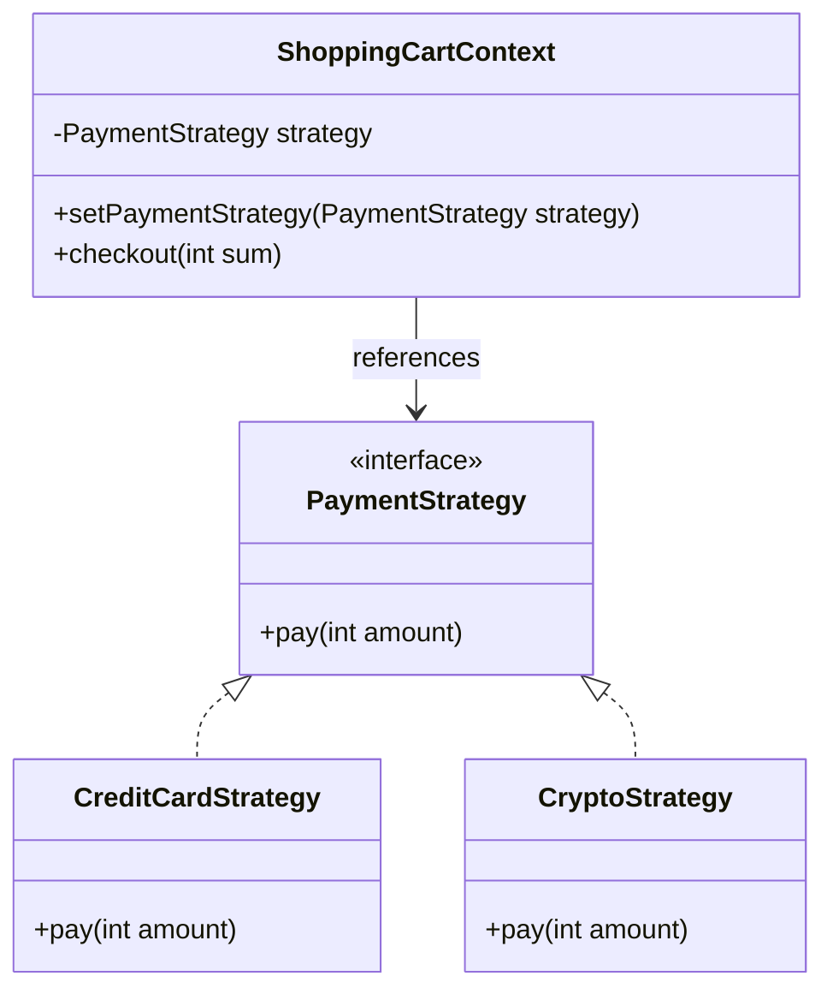
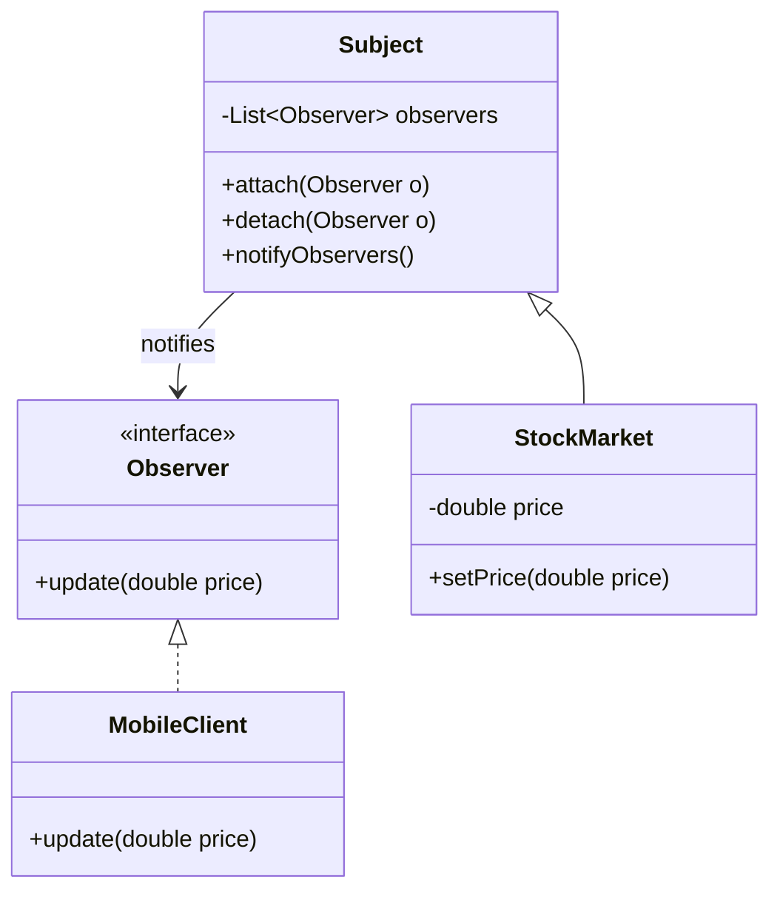
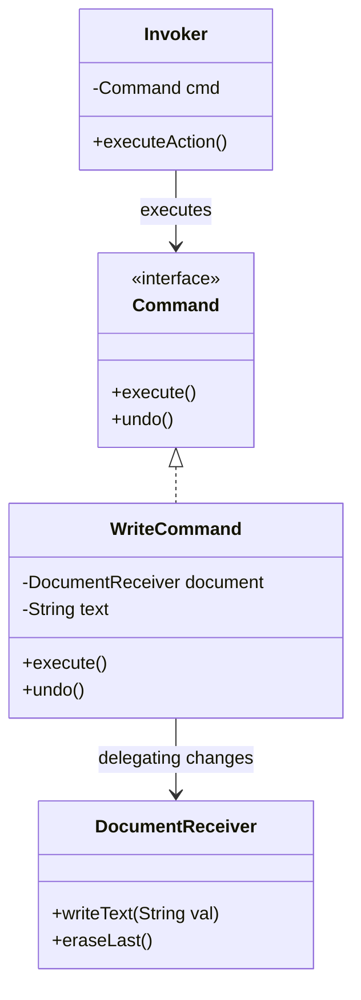
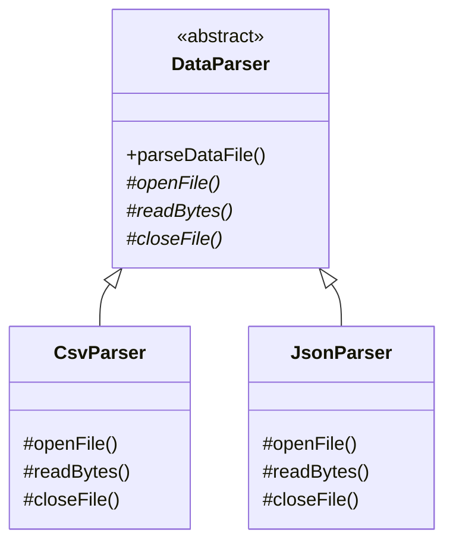

# Module 04: Behavioral Patterns (Part 1)

Behavioral design patterns address a critical challenge in software architecture: **How do we coordinate communication and assign responsibilities between objects?**

Rather than focusing on how objects are created or structured, behavioral patterns define the protocols through which objects interact, helping to reduce tight coupling and simplify complex execution flows.

---

## 1. Strategy Pattern

### Academic Context (Professor's Lecture)
Suppose you are building an e-commerce checkout system. The application needs to support multiple payment methods: Credit Card, PayPal, and Bitcoin. 
If you write the payment logic using conditional blocks (`if-else` or `switch`) inside your checkout class, adding a new payment method requires modifying the checkout class, violating the **Open/Closed Principle** and creating a maintenance hazard.

The Strategy pattern solves this by **defining a family of algorithms, encapsulating each one, and making them interchangeable, allowing the algorithm to vary independently from the clients that use it**.

### Why Use
* **Eliminate Conditional Complexity**: Replaces nested conditional statements with clean object composition.
* **Separation of Concerns**: Moves algorithm details out of the main client class and into dedicated strategy classes.

### How to Use (Java Demo Code)

#### Mermaid Class Diagram


#### Production-Grade Java 21 Implementation
This implementation uses Java **lambda expressions** and **functional interfaces** to implement the Strategy pattern cleanly, bypassing the need for separate strategy classes for simple algorithms.

```java
package com.masterclass.designpatterns.behavioral.strategy;

@FunctionalInterface
public interface PaymentStrategy {
    void processPayment(double amount);
}
```

```java
package com.masterclass.designpatterns.behavioral.strategy;

/**
 * Concrete Strategy: Credit Card payment.
 */
public final class CreditCardPayment implements PaymentStrategy {
    private final String cardName;

    public CreditCardPayment(String cardName) {
        this.cardName = cardName;
    }

    @Override
    public void processPayment(double amount) {
        System.out.println("Processing credit card charge of $" + amount + " for: " + cardName);
    }
}
```

```java
package com.masterclass.designpatterns.behavioral.strategy;

/**
 * Context class that delegates payment processing to the active strategy.
 */
public final class BillingContext {
    private PaymentStrategy strategy;

    public void setStrategy(PaymentStrategy strategy) {
        this.strategy = strategy;
    }

    public void executePayment(double amount) {
        if (strategy == null) {
            throw new IllegalStateException("Payment strategy has not been set.");
        }
        strategy.processPayment(amount);
    }
}
```

### When to Use
* An application needs to support multiple variations of an algorithm (e.g. different sorting, encryption, or billing methods).
* You want to isolate business logic details from concrete algorithm implementations.

---

## 2. Observer Pattern

### Academic Context (Professor's Lecture)
In event-driven architectures, we often need objects to react to state changes in another object. 
For example, when a stock price changes, update the dashboard, notify investors, and log the event. If the stock object calls these target classes directly, it becomes tightly coupled to them. Adding new subscribers requires modifying the stock class.

The Observer pattern solves this by **defining a one-to-many dependency between objects so that when one object changes state, all its dependents are notified and updated automatically**.

### Why Use
* **Loose Coupling**: The publisher object only knows that its subscribers implement a common interface; it does not couple to their concrete classes.
* **Dynamic Event Binding**: Subscribers can subscribe to or unsubscribe from updates dynamically at runtime.

### How to Use (Java Demo Code)

#### Mermaid Class Diagram


#### Production-Grade Java 21 Implementation
```java
package com.masterclass.designpatterns.behavioral.observer;

public interface NewsObserver {
    void onNewsPublish(String headline);
}
```

```java
package com.masterclass.designpatterns.behavioral.observer;

import java.util.ArrayList;
import java.util.List;

/**
 * Subject publisher managing subscriber lists.
 */
public final class NewsPublisher {
    private final List<NewsObserver> subscribers = new ArrayList<>();
    private String latestHeadline;

    public void subscribe(NewsObserver observer) {
        subscribers.add(observer);
    }

    public void unsubscribe(NewsObserver observer) {
        subscribers.remove(observer);
    }

    public void publishNews(String headline) {
        this.latestHeadline = headline;
        // Notify all registered subscribers
        for (NewsObserver observer : subscribers) {
            observer.onNewsPublish(latestHeadline);
        }
    }
}
```

```java
package com.masterclass.designpatterns.behavioral.observer;

public final class EmailSubscriber implements NewsObserver {
    private final String email;

    public EmailSubscriber(String email) {
        this.email = email;
    }

    @Override
    public void onNewsPublish(String headline) {
        System.out.println("Email sent to " + email + " with news headline: " + headline);
    }
}
```

### When to Use
* Changes to one object require updating other objects, and you don't know how many objects need updates.
* You need to build event-driven notifications or telemetry loggers.

### Trade-offs & Design Pitfalls
* **Memory Leaks (Lapsed Listener Problem)**: In Java, if a subscriber registers for updates but fails to unsubscribe when it is no longer needed, the publisher will retain a reference to it in memory, preventing garbage collection.
* **Random Update Order**: The pattern does not guarantee the order in which observers receive notifications. Relying on a specific notification order is an anti-pattern.

---

## 3. Command Pattern

### Academic Context (Professor's Lecture)
In complex desktop or server applications, user interface actions (clicking a button, typing a shortcut) must trigger backend operations. 
If UI components trigger operations directly, the UI layer becomes tightly coupled to the backend logic. This makes it difficult to support features like command queues, logging, or undo/redo histories.

The Command pattern solves this by **encapsulating a request as an object, thereby letting you parameterize clients with different requests, queue or log requests, and support undoable operations**.

### Why Use
* **Loose Coupling**: Decouples the invoker class (e.g. a UI button) from the receiver class (e.g., the engine executing the task).
* **Command Queueing & Replay**: Allows commands to be stored in history lists, queued for background processing, or replayed for disaster recovery.

### How to Use (Java Demo Code)

#### Mermaid Class Diagram


#### Production-Grade Java 21 Implementation
```java
package com.masterclass.designpatterns.behavioral.command;

public interface EditorCommand {
    void execute();
    void rollback();
}
```

```java
package com.masterclass.designpatterns.behavioral.command;

/**
 * Receiver: The actual document engine that performs text manipulations.
 */
public final class TextDocument {
    private final StringBuilder content = new StringBuilder();

    public void appendText(String text) {
        content.append(text);
        System.out.println("Document Content: " + content);
    }

    public void deleteLast(int count) {
        int length = content.length();
        if (length >= count) {
            content.delete(length - count, length);
        }
        System.out.println("Document Content: " + content);
    }
}
```

```java
package com.masterclass.designpatterns.behavioral.command;

/**
 * Concrete Command encapsulating a write operation.
 */
public final class AppendTextCommand implements EditorCommand {
    private final TextDocument document;
    private final String textToAppend;

    public AppendTextCommand(TextDocument document, String textToAppend) {
        this.document = document;
        this.textToAppend = textToAppend;
    }

    @Override
    public void execute() {
        document.appendText(textToAppend);
    }

    @Override
    public void rollback() {
        document.deleteLast(textToAppend.length());
    }
}
```

```java
package com.masterclass.designpatterns.behavioral.command;

import java.util.Stack;

/**
 * Invoker: Manages history of executed commands to support undo operations.
 */
public final class CommandManager {
    private final Stack<EditorCommand> history = new Stack<>();

    public void executeCommand(EditorCommand command) {
        command.execute();
        history.push(command);
    }

    public void undoLast() {
        if (!history.isEmpty()) {
            EditorCommand command = history.pop();
            command.rollback();
        } else {
            System.out.println("Undo history is empty.");
        }
    }
}
```

### When to Use
* Implementing undo/redo operations or query transaction histories.
* Queueing requests, logging actions, or designing system recovery flows.

---

## 4. Template Method Pattern

### Academic Context (Professor's Lecture)
Often, different algorithms follow the same overall sequence of steps. For example, to parse data files (CSV, PDF, JSON), the application must: open the file, extract raw content, parse fields, and close the file. 
If each parser class duplicates this sequence, you end up with redundant code.

The Template Method pattern solves this by **defining the skeleton of an algorithm in an operation, deferring some steps to subclasses, allowing subclasses to redefine steps of an algorithm without changing the algorithm's structure**.

### Why Use
* **Code Reuse**: Extracts common algorithm steps into a single base class, reducing duplication.
* **Control of Execution Order**: Ensures that the overall algorithm sequence remains fixed, preventing subclasses from executing steps out of order.

### How to Use (Java Demo Code)

#### Mermaid Class Diagram


#### Production-Grade Java 21 Implementation
```java
package com.masterclass.designpatterns.behavioral.templatemethod;

/**
 * Abstract Class defining the template method skeleton.
 */
public abstract class InvoiceProcessor {

    // Template Method (final prevents subclasses from overriding it)
    public final void processInvoice() {
        verifyCredentials();
        readInvoiceDetails();
        chargeTax();
        generateReport();
    }

    private void verifyCredentials() {
        System.out.println("Invoice System: Verifying API credentials.");
    }

    // Abstract methods to be implemented by subclasses
    protected abstract void readInvoiceDetails();
    protected abstract void chargeTax();

    // Hook method: Subclasses can optionally override this
    protected void generateReport() {
        System.out.println("Invoice System: Generating standard PDF invoice report.");
    }
}
```

```java
package com.masterclass.designpatterns.behavioral.templatemethod;

public final class DomesticInvoiceProcessor extends InvoiceProcessor {
    @Override
    protected void readInvoiceDetails() {
        System.out.println("Domestic: Parsing local business billing identifiers.");
    }

    @Override
    protected void chargeTax() {
        System.out.println("Domestic: Charging standard 10% VAT tax.");
    }
}

public final class InternationalInvoiceProcessor extends InvoiceProcessor {
    @Override
    protected void readInvoiceDetails() {
        System.out.println("International: Parsing global SWIFT codes and currency profiles.");
    }

    @Override
    protected void chargeTax() {
        System.out.println("International: Charging cross-border import tax.");
    }

    @Override
    protected void generateReport() {
        System.out.println("International: Generating multi-currency compliant compliance report.");
    }
}
```

### When to Use
* Subclasses implement variations of a common algorithmic workflow.
* You need to enforce a fixed execution sequence across all subclasses.

### Trade-offs & Design Pitfalls
* **Rigid Architectures**: Modifying the base template method interface breaks all subclass implementations.
* **Violating the Liskov Substitution Principle**: Subclasses must inherit the entire template method flow. If a subclass cannot implement one of the steps and throws an exception, it breaks Liskov substitution rules.

---

## 5. Hands-on Mini-Challenge: Real-time Stock Analytics Engine

### Scenario
You are building the core execution engine for a financial trading portal. 
The system must:
1. Parse incoming stock quote feeds (CSV feeds and JSON feeds) using the **Template Method** pattern.
2. Filter target stocks using a customizable sorting algorithm configured via the **Strategy** pattern.
3. Broadcast price updates to connected traders using the **Observer** pattern.
4. Log and queue user orders using the **Command** pattern, allowing users to cancel orders.

### Step 1: Implement Feed Parsers (Template Method)
```java
package com.masterclass.designpatterns.miniproject.analytics;

public abstract class FeedParser {
    public final void parseFeed() {
        openFeed();
        readQuotes();
        closeFeed();
    }
    protected abstract void openFeed();
    protected abstract void readQuotes();
    private void closeFeed() { System.out.println("Feed connection closed."); }
}

public final class CsvFeedParser extends FeedParser {
    @Override
    protected void openFeed() { System.out.println("Opening CSV feed file."); }
    @Override
    protected void readQuotes() { System.out.println("Extracting quote fields from CSV."); }
}
```

### Step 2: Implement Price Ticker & Subscriber Ticker (Observer)
```java
package com.masterclass.designpatterns.miniproject.analytics;

import java.util.ArrayList;
import java.util.List;

public interface TraderObserver {
    void onPriceUpdate(String stock, double price);
}

public final class StockTicker {
    private final List<TraderObserver> traders = new ArrayList<>();

    public void attach(TraderObserver trader) { traders.add(trader); }
    public void notifyTraders(String stock, double price) {
        for (TraderObserver trader : traders) {
            trader.onPriceUpdate(stock, price);
        }
    }
}
```

### Step 3: Implement Trading Order Operations (Command)
```java
package com.masterclass.designpatterns.miniproject.analytics;

public interface OrderCommand {
    void executeOrder();
    void cancelOrder();
}

public final class BuyStockOrder implements OrderCommand {
    private final String stock;
    private final int quantity;

    public BuyStockOrder(String stock, int quantity) {
        this.stock = stock;
        this.quantity = quantity;
    }

    @Override
    public void executeOrder() {
        System.out.println("Executed BUY order for " + quantity + " shares of " + stock);
    }

    @Override
    public void cancelOrder() {
        System.out.println("Cancelled BUY order for " + quantity + " shares of " + stock);
    }
}
```

### Step 4: Implement Sort Engine (Strategy)
```java
package com.masterclass.designpatterns.miniproject.analytics;

import java.util.List;

@FunctionalInterface
public interface SortStrategy {
    void sort(List<Double> prices);
}

public final class StockSorter {
    private SortStrategy strategy;

    public void setStrategy(SortStrategy strategy) { this.strategy = strategy; }
    public void sortPrices(List<Double> prices) { strategy.sort(prices); }
}
```

### Step 5: Verify the Trading Portal
```java
package com.masterclass.designpatterns.miniproject;

import com.masterclass.designpatterns.miniproject.analytics.*;
import java.util.ArrayList;
import java.util.List;

public class BehavioralPart1Main {
    public static void main(String[] args) {
        // 1. Parse Feed (Template Method)
        FeedParser parser = new CsvFeedParser();
        parser.parseFeed();

        // 2. Setup Price updates (Observer)
        StockTicker ticker = new StockTicker();
        ticker.attach((stock, price) -> System.out.println("Trader screen alert: " + stock + " is now $" + price));
        ticker.notifyTraders("AAPL", 175.50);

        // 3. Sort prices (Strategy)
        StockSorter sorter = new StockSorter();
        sorter.setStrategy(prices -> prices.sort(Double::compareTo)); // Java 21 Lambda style
        
        List<Double> prices = new ArrayList<>(List.of(150.0, 120.0, 180.0));
        sorter.sortPrices(prices);
        System.out.println("Sorted prices: " + prices);

        // 4. Execute trading command (Command)
        OrderCommand buyOrder = new BuyStockOrder("AAPL", 50);
        buyOrder.executeOrder();
        buyOrder.cancelOrder();
    }
}
```
This challenge demonstrates how to combine behavioral design patterns to coordinate execution flows, verify state changes, and implement flexible algorithms.
